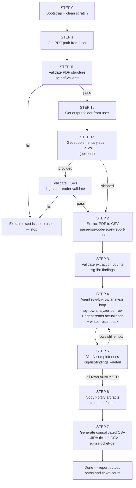

# ISG code scan results analyzer (`jp_isg_code_scan_results_analyzer_helper`)

## Triggers

User mentions **ISG**, **Fortify**, **Developer Workbook**, **security code scan report PDF**, **jp_isg_code_scan_results_analyzer_helper**, wants **RCA / fix plan** from a scan export, or asks to turn a PDF into CSV and analyze it.

---

## Hard constraints (MIDAS)

- **`ai_gateway/`** — read-only submodule; findings there require upstream coordination, not MIDAS edits.
- **Shared environments** — deploy via Jenkins only (`jenkins.mdc`); never `terraform apply` / `helm upgrade` from laptop.
- **VPC / region / IDs** — follow `solution_const.mdc`.

---

## Communication rules

| Situation | Response |
|---|---|
| Need user input | One clear question only; stop and wait. |
| Step succeeded | One line: what was done + key output (path, count). |
| Step failed | Error cause (one line) + exact fix step. |
| Detail requested | Expand only on request. |

---

## Canonical paths (all relative to repo root)

| Artifact | Path |
|---|---|
| Working CSV (scratch — never share this) | `.cursor/scratch/extracted_files/workbook_issues.csv` |
| Final report (markdown — scratch) | `.cursor/scratch/extracted_files/workbook_final_report.md` |
| Run log | `.cursor/scratch/extracted_files/_deep_analysis_run.log` |
| Per-row analysis logs | `.cursor/scratch/analysis_log/<uuid>.md` |
| **Final output CSV** | `<OUTPUT_FOLDER>/workbook_issues_analyzed.csv` — copied in STEP 6 |
| **Final output report** | `<OUTPUT_FOLDER>/workbook_final_report.md` — copied in STEP 6 |
| **Consolidated findings CSV** | `<OUTPUT_FOLDER>/all_findings_consolidated.csv` — written in STEP 7 |
| **JIRA tickets CSV** | `<OUTPUT_FOLDER>/jira_tickets.csv` — written in STEP 7 |
| Extractor uv project | `.cursor/tools/fortify_workbook_extract/` |
| Analyzer uv project | `.cursor/tools/isg_deep_analyzer/` |
| PDF validator uv project | `.cursor/tools/isg_pdf_validate/` |
| Row analyzer uv project | `.cursor/tools/isg_row_analyzer/` |
| Scan reader uv project | `.cursor/tools/isg_scan_reader/` |
| JIRA ticket generator uv project | `.cursor/tools/isg_jira_ticket_gen/` |

> **`<OUTPUT_FOLDER>`** is set by the user in STEP 1c. All analysis work uses the scratch CSV. Only STEP 6 and STEP 7 write to the output folder — after all rows are confirmed analyzed.

---

## Workflow



---

### STEP 0 — Bootstrap and clean scratch folders (always run first)

#### 0a — Ensure directories exist

```bash
mkdir -p \
  .cursor/scratch/analysis_log \
  .cursor/scratch/extracted_files \
  remediation/security_remediation/extracted_files
```

**Error:** If `.cursor/` does not exist the agent must create it along with the subdirectories. Never skip this step.

#### 0b — Check if scratch folders contain existing content

```bash
python3 - <<'PY'
from pathlib import Path
al = list(Path(".cursor/scratch/analysis_log").glob("*"))
ef = list(Path(".cursor/scratch/extracted_files").glob("*"))
total = len(al) + len(ef)
print(f"analysis_log={len(al)}  scratch/extracted={len(ef)}  total={total}")
PY
```

#### 0c — If `total > 0`: run the clean tool before proceeding

```bash
# Preview what will be deleted (safe, no changes)
uv run --project .cursor/tools/isg_scratch_clean isg-scratch-clean --dry-run

# Delete all files in both scratch folders
uv run --project .cursor/tools/isg_scratch_clean isg-scratch-clean
```

The tool lists every file it will delete, then deletes them. Directories are preserved. It is safe to re-run.

If the uv venv does not yet exist, sync first (once only):
```bash
uv sync --project .cursor/tools/isg_scratch_clean
```

**After the tool runs:** confirm output ends with `Deleted N file(s)` and no `[ERROR]` lines before continuing to Step 1.

**Error:** If the clean script exits non-zero, read stderr, fix the path issue, and retry. Do not proceed to Step 1 with stale data present.

---

### STEP 1 — Get the PDF path from the user

Ask **once**:

> Provide the path to the Fortify Developer Workbook PDF.

- Accept absolute or repo-relative paths.
- If the path does not end in `.pdf` or the file does not exist: tell the user and ask again.
- Do not proceed until a valid `.pdf` path is confirmed.

---

### STEP 1b — Validate PDF is a genuine Fortify Developer Workbook

Run before extraction. This catches wrong PDFs early with a clear diagnostic.

```bash
uv run --project .cursor/tools/isg_pdf_validate isg-pdf-validate "<PDF_PATH>"
```

For machine-parseable output:
```bash
uv run --project .cursor/tools/isg_pdf_validate isg-pdf-validate --json "<PDF_PATH>"
```

**On pass:** Tool prints `[PASS] Valid Fortify Developer Workbook — N page(s): <filename>`. Proceed to Step 2.

**On fail:** Tool prints one of these `[FAIL]` messages to stderr and exits 1:

| Failure | Message | Action |
|---|---|---|
| File not found | `File not found: <path>` | Ask user for correct path |
| Not a PDF | `Not a PDF file — expected .pdf extension and %PDF header` | User must provide a real PDF |
| PDF encrypted | `PDF is password-protected. Decrypt it before uploading.` | User decrypts first |
| No Results Outline | `This PDF is not a Fortify Developer Workbook. Expected a "Results Outline" section (not found).` | User must provide the Fortify-exported PDF |
| No Kingdom blocks | `PDF has a "Results Outline" section but contains no issue blocks ("Kingdom:" marker not found).` | The workbook may be empty; confirm with user |

**If validation fails:** Stop. Explain the exact error to the user in one sentence. Do not proceed to STEP 1c.

**First-time install:**
```bash
uv sync --project .cursor/tools/isg_pdf_validate
```

---

### STEP 1c — Get the output folder from the user

Ask **once**:

> Where should the final analyzed CSV and report be saved? Provide an absolute path or a path relative to the repo root.

Rules:
- Accept absolute or repo-relative paths.
- The folder does not need to exist yet — it will be created in STEP 6.
- Store this as `<OUTPUT_FOLDER>` for use in STEP 6.
- Do not write anything to `<OUTPUT_FOLDER>` until STEP 6 (after all rows are confirmed analyzed).
- If the user provides no path, default to `remediation/security_remediation/extracted_files` and confirm this with the user before proceeding.

> **Note:** All intermediate work (extraction, row analysis) uses the scratch CSV at `.cursor/scratch/extracted_files/workbook_issues.csv`. The output folder only receives the **finished** artifact at the end.

---

### STEP 1d — Accept supplementary ISG scan CSVs (optional)

Ask **once** after STEP 1c:

> Do you have supplementary ISG scan CSV files (container images, IaC, OSS packages)? If yes, provide the paths. Press Enter to skip and proceed with the Fortify workbook only.

Rules:
- All three file types are optional. The user may provide one, two, or all three.
- Accept absolute or repo-relative paths.
- Store the paths as `CONTAINER_CSV`, `IAC_CSV`, `OSS_CSV` for use in STEP 7.
- If none are provided, skip this step and proceed to STEP 2. STEP 7 will still run but will only use the Fortify workbook data.

**Validate each provided file immediately:**

```bash
# Validate one or more supplementary CSVs
uv run --project .cursor/tools/isg_scan_reader isg-scan-reader validate \
  --file <CONTAINER_CSV> \
  --file <IAC_CSV> \
  --file <OSS_CSV>
```

Repeat `--file <PATH>` for each file provided. Omit files the user did not supply.

**On pass:** Tool prints `[PASS] <filename> — <type>, N rows, schema valid.` for each file. Proceed to STEP 2.

**On fail:** Tool prints `[FAIL] <filename>: <reason>` to stderr and exits 1.
Stop. Explain the exact error in one sentence. Do not proceed to STEP 2 until the user supplies a corrected file.

**First-time install:**
```bash
uv sync --project .cursor/tools/isg_scan_reader
```

---

### STEP 2 — Extract PDF to CSV

Run from repo root. Quote paths that contain spaces.

```bash
uv run --project .cursor/tools/fortify_workbook_extract parse-isg-code-scan-report-tool \
  --pdf "<PDF_PATH>" \
  --output ".cursor/scratch/extracted_files/workbook_issues.csv" \
  --format csv \
  --final-report ".cursor/scratch/extracted_files/workbook_final_report.md"
```

**On success:** Report path + row count from stdout (one line).

**On failure:**
1. Read stderr for the first error line.
2. Common causes: uv not installed → `pip install uv`; wrong PDF path → re-check step 1; missing deps → `uv sync --project .cursor/tools/fortify_workbook_extract`.
3. Fix and retry once. If still failing, report the error to the user and stop.

**Non-uv fallback:**
```bash
python3 .cursor/tools/fortify_workbook_extract/parse_isg_code_scan_report_tool.py \
  --pdf "<PDF_PATH>" \
  --output ".cursor/scratch/extracted_files/workbook_issues.csv" \
  --format csv
```

---

### STEP 3 — Validate extraction

```bash
uv run --project .cursor/tools/isg_list_findings isg-list-findings \
  --csv .cursor/scratch/extracted_files/workbook_issues.csv
```

**Pass:** Summary table printed; `first_obv_id` is `OBV0001`; total rows > 0.
**Fail:** Report count mismatch to user; do not run Step 4 on a corrupt extract.

> **Note:** Expected counts for the standard MIDAS dev Jenkins workbook: 263 total (Critical 11, High 89, Medium 15, Low 148). Adjust if ISG changes the scan scope.

---

### STEP 4 — Agent-driven row-by-row analysis loop

This step replaces the batch `isg-deep-analyzer` run. The **Cursor agent** reads actual code for every row and produces grounded analysis — no boilerplate, no template strings.

#### 4a — Sync the row-analyzer tool (once)

```bash
uv sync --project .cursor/tools/isg_row_analyzer
```

#### 4b — Get the ordered list of unanalyzed rows

```bash
uv run --project .cursor/tools/isg_list_findings isg-list-findings \
  --csv .cursor/scratch/extracted_files/workbook_issues.csv \
  --state OPEN \
  --detail
```

This prints all rows with `issue_state != ANALYZED` in Critical → High → Medium → Low order.

#### 4c — Agent loop: for each row (no skipping)

For **every** row listed in 4b, run the two-phase sequence below. Process in order: Critical first, then High, Medium, Low.

**Resumable:** rows already in state `ANALYZED` with a non-empty `analysis_id` may be skipped. All others must be processed.

---

**Phase A — fetch context (agent reads this output)**

```bash
uv run --project .cursor/tools/isg_row_analyzer isg-row-analyzer \
  --csv .cursor/scratch/extracted_files/workbook_issues.csv \
  --obv-id <OBV_ID> \
  --repo .
```

The tool prints a JSON object to stdout containing:
- `category`, `fortify_priority`, `sink_file`, `sink_line`, `source_file`, `source_line`
- `snippet` — up to 80 lines of real code centred on the cited line
- `full_file_content` — full file if ≤ 500 lines
- `abstract`, `explanation`, `recommendation` — from the Fortify workbook
- `instructions` — what the agent must do next

**Agent action after Phase A:**

1. Read the `snippet` and `full_file_content` fields carefully.
2. If `file_found` is `false`, note it but still reason from category + abstract + explanation.
3. If `sink_file` is inside `ai_gateway/`, set `resolution_owner = H_REQ`, `complexity = MAX`, `owner = DevOps`.
4. Produce a grounded analysis object with these keys — **no template strings**:

| Key | Type | Constraint |
|---|---|---|
| `root_cause` | string | Must reference actual code lines, variable names, or resource attributes visible in the snippet |
| `remediation_plan` | string | Numbered steps; must name the actual file and line |
| `validation` | string | How to prove the fix works (test command, plan output, console check) |
| `acceptance_criteria` | string | 3–5 observable, testable conditions |
| `resolution_owner` | `AI_AGENT` or `H_REQ` | See [Constants → resolution_owner](#resolution_owner-values) |
| `owner` | `Software` or `DevOps` | See [Constants → owner](#owner-field--team-assignment-logic) |
| `complexity` | `LOW`, `MID`, `HIGH`, or `MAX` | See [Constants → complexity](#complexity-values) |
| `human_fix_hours` | integer string | Hours for human engineer alone |
| `cursor_fix_hours` | integer string | Hours for agent with human review |
| `hybrid_fix_hours` | integer string | Hours for agent + human gates |

---

**Phase B — write result back to CSV**

```bash
uv run --project .cursor/tools/isg_row_analyzer isg-row-analyzer \
  --csv .cursor/scratch/extracted_files/workbook_issues.csv \
  --obv-id <OBV_ID> \
  --repo . \
  --write-result '<JSON_BLOB>'
```

Where `<JSON_BLOB>` is the agent's analysis from Phase A as a single-line JSON string.

**On success:** Tool prints `{"status":"ok","obv_id":"...","analysis_id":"<uuid>","log_file":"..."}` and patches the CSV row atomically. Proceed to the next row.

**On failure:** If the tool exits non-zero, read stderr. Common causes:
- Missing required JSON field → check the JSON blob is complete
- `Row '<OBV_ID>' not found` → check obv_id spelling against the CSV
- CSV write error → check file permissions

---

#### 4d — Progress checkpoint every 10 rows

After every 10 rows, run:

```bash
uv run --project .cursor/tools/isg_list_findings isg-list-findings \
  --csv .cursor/scratch/extracted_files/workbook_issues.csv
```

Confirm the `Remaining` count is decreasing. If it is not, check for write errors.

---

### STEP 5 — Verify completeness

```bash
uv run --project .cursor/tools/isg_list_findings isg-list-findings \
  --csv .cursor/scratch/extracted_files/workbook_issues.csv \
  --detail
```

Then run the inline check:

```bash
python3 - <<'PY'
import csv
from collections import Counter
path = ".cursor/scratch/extracted_files/workbook_issues.csv"
fields = ["analysis_id","root_cause","remediation_plan","validation",
          "acceptance_criteria","resolution_owner","complexity","owner"]
with open(path, newline="", encoding="utf-8") as f:
    rows = list(csv.DictReader(f))
empty = {fd: sum(1 for r in rows if not (r.get(fd) or "").strip()) for fd in fields}
nonempty = {k: v for k, v in empty.items() if v}
owner_dist = Counter(r.get("owner","") for r in rows)
resowner_dist = Counter(r.get("resolution_owner","") for r in rows)
print("Empty placeholder counts:", nonempty or "NONE — all filled")
print("owner dist:", dict(owner_dist))
print("resolution_owner dist:", dict(resowner_dist))
PY
```

**Pass:** `Empty placeholder counts: NONE — all filled`. Proceed to STEP 6.
**Fail:** Note which rows and fields are empty; re-run the Phase A → Phase B loop for those `obv_id` values. Do NOT proceed to STEP 6 until the check passes.

---

### STEP 6 — Copy final artifacts to the output folder

Run only after STEP 5 confirms `Empty placeholder counts: NONE — all filled`.

```bash
python3 - <<'PY'
import shutil, sys
from pathlib import Path

output_folder = Path("<OUTPUT_FOLDER>").expanduser()
output_folder.mkdir(parents=True, exist_ok=True)

src_csv    = Path(".cursor/scratch/extracted_files/workbook_issues.csv")
src_report = Path(".cursor/scratch/extracted_files/workbook_final_report.md")

dst_csv    = output_folder / "workbook_issues_analyzed.csv"
dst_report = output_folder / "workbook_final_report.md"

if not src_csv.is_file():
    sys.exit(f"[ERROR] Working CSV not found: {src_csv}")

shutil.copy2(src_csv, dst_csv)
print(f"[OK] CSV    → {dst_csv}")

if src_report.is_file():
    shutil.copy2(src_report, dst_report)
    print(f"[OK] Report → {dst_report}")
else:
    print(f"[SKIP] No final report found at {src_report} — skipping")

print("Done. Share the contents of:", output_folder)
PY
```

Replace `<OUTPUT_FOLDER>` with the path collected in STEP 1c.

**On success:** Two lines printed confirming copy destinations. Tell the user:
> Analysis complete. Final CSV: `<OUTPUT_FOLDER>/workbook_issues_analyzed.csv`

**On failure:**
- `[ERROR] Working CSV not found` → STEP 2 or STEP 4 did not complete; check the scratch path.
- Permission error on output folder → ask the user to provide a writable path and retry.

**Do NOT run this step until STEP 5 passes.** The scratch CSV is the working copy; the output copy is the deliverable.

---

### STEP 7 — Generate consolidated findings CSV and JIRA ticket CSV

Run after STEP 6. Requires the Fortify workbook CSV (now in `<OUTPUT_FOLDER>/workbook_issues_analyzed.csv`). Supplementary CSVs from STEP 1d are optional but strongly recommended.

```bash
uv run --project .cursor/tools/isg_jira_ticket_gen isg-jira-ticket-gen \
  --fortify    ".cursor/scratch/extracted_files/workbook_issues.csv" \
  --container  "<CONTAINER_CSV>" \
  --iac        "<IAC_CSV>" \
  --oss        "<OSS_CSV>" \
  --output-dir "<OUTPUT_FOLDER>"
```

Omit `--container`, `--iac`, or `--oss` if the user did not supply those files in STEP 1d.

**On success:** Tool prints:
```
[OK] Consolidated findings → <OUTPUT_FOLDER>/all_findings_consolidated.csv (N rows)
[OK] JIRA tickets          → <OUTPUT_FOLDER>/jira_tickets.csv (M tickets: X grouped, Y residual)
```

Tell the user:
> JIRA tickets ready: `<OUTPUT_FOLDER>/jira_tickets.csv` (M tickets). Consolidated index: `<OUTPUT_FOLDER>/all_findings_consolidated.csv` (N rows).

**Output files:**

| File | Description |
|---|---|
| `all_findings_consolidated.csv` | One row per original finding across all sources. Includes `finding_id`, `source`, `severity`, `category_or_policy`, `file_or_resource`, `vulnerability_or_policy_id`, `description`, `fix_version_or_recommendation`, `bug_id`. |
| `jira_tickets.csv` | One row per JIRA Bug. Includes `ticket_id`, `parent_epic`, `parent_group`, `title`, `priority`, `owner_team`, `effort_estimate`, `complexity`, `root_cause`, `files_to_change`, `findings_cleared_count`, `findings_cleared_ids`, `risk`, `validation_steps`, `is_grouped`, `residual_file_line`, `labels`. |

**Grouping strategy:**
- Container CVEs — grouped by Dockerfile (one Bug per Dockerfile context).
- OSS CVEs — grouped by package name (one Bug per package).
- IaC findings — grouped by Checkov policy ID (one Bug per policy). Informational/pass rows (empty `Misconfigurations`) are excluded.
- Fortify findings — grouped by `category`. Per-site findings (command injection, hardcoded passwords, DOM XSS, unsafe deserialization, path manipulation) become individual `RESIDUAL` Bugs.

**Effort sizing:** S = ≤5 findings, LOW/MID complexity. M = 6–30 findings. L = 30+ findings or HIGH/MAX complexity.

**On failure:**
- `[ERROR] Fortify CSV not found` → STEP 2 or STEP 6 did not complete.
- `[ERROR] <supplementary CSV error>` → check file paths supplied in STEP 1d.

**First-time install:**
```bash
uv sync --project .cursor/tools/isg_jira_ticket_gen
```

---

## Constants & Enums reference

All literal values used by the skill workflow and the uv tools are defined here. Reference this section when producing `--write-result` JSON or filtering with `isg-list-findings`.

### Fortify priority values

| Value | Description |
|---|---|
| `Critical` | Highest severity; process first |
| `High` | Second priority |
| `Medium` | Third priority |
| `Low` | Lowest severity; process last |

Processing order in the agent loop: **Critical → High → Medium → Low**.

---

### `issue_state` lifecycle

| Value | Meaning |
|---|---|
| `OPEN` | Extracted from PDF; no analysis yet (default after extraction) |
| `NEW` | Synonym for `OPEN`; produced by some extractor versions |
| `ANALYZED` | Phase A + Phase B complete; `analysis_id` is non-empty |
| `RESOLVED` | Fix applied and verified; `resolved_date` is set |

The agent loop writes `ANALYZED`. The human sets `RESOLVED` after deploying and confirming.

---

### `resolution_owner` values

| Value | Meaning |
|---|---|
| `AI_AGENT` | Cursor / agent can drive the full fix; no mandatory human step for implementation; Jenkins pipeline still required for deploy |
| `H_REQ` | Human must be involved — secrets rotation, compliance sign-off, vendor/upstream change, `ai_gateway/` submodule, or production approval gate |

**Rule:** If `sink_file` or `source_file` is inside `ai_gateway/`, always set `resolution_owner = H_REQ`.

---

### `owner` field — team assignment logic

| Value | When assigned |
|---|---|
| `Software` | Finding is in application code (`.py`, `.js`, `.ts`, `.jsx`, `.tsx`, `.java`, `.go`, `.rb`, `.cs`); or category is XSS, injection, credential management, hardcoded password/API, insecure transport, path manipulation, CSRF, session, DOM |
| `DevOps` | Finding is in Terraform / Helm / Dockerfile / IaC (`deploy/`, `infra/`, `.tf`, `.tfvars`, `.yaml`, `.yml`); or category is encryption key, ECR, EKS, EC2, RDS, ELB, ElastiCache, CloudWatch, S3, KMS, IAM, VPC, logging, monitoring, backup, network, storage |

Path signals take precedence over category signals. When in doubt, default to `DevOps` for IaC paths and `Software` for `.py` / `.js` paths.

---

### `complexity` values

| Value | Meaning | Typical effort multiplier |
|---|---|---|
| `LOW` | Single attribute change; no architecture impact | ×1 |
| `MID` | Multi-step change; module or policy update | ×1 |
| `HIGH` | Architecture review required; cross-service impact | ×2 |
| `MAX` | Upstream/vendor dependency; ai_gateway submodule; compliance sign-off | ×4 |

---

### Hour estimate guidelines

| Column | Meaning |
|---|---|
| `human_fix_hours` | Hours a human engineer alone would spend (analysis + code + review + deploy) |
| `cursor_fix_hours` | Hours with Cursor agent driving the code change + human reviewing |
| `hybrid_fix_hours` | Hours when agent writes the fix but human approval gates are required |

Base hours by priority:

| Priority | Human | Cursor | Hybrid |
|---|---|---|---|
| Critical | 4 | 2 | 6 |
| High | 3 | 2 | 5 |
| Medium | 2 | 1 | 4 |
| Low | 1 | 1 | 2 |

Multiply by complexity factor (`LOW/MID` ×1, `HIGH` ×2, `MAX` ×4). Add 2 to `hybrid_fix_hours` when `resolution_owner = H_REQ`.

---

### PDF structure markers

| Constant | Value | Used by |
|---|---|---|
| `MARK_RESULTS_OUTLINE` | `"Results Outline"` | `isg-pdf-validate`, `FortifyStructureValidator` |
| `MARK_KINGDOM` | `"Kingdom:"` | `isg-pdf-validate`, `FortifyStructureValidator` |

Both must be present in the PDF text for the file to be a valid Fortify Developer Workbook.

---

### Scratch folder paths

| Path | Description |
|---|---|
| `.cursor/scratch/analysis_log/` | Active log dir for `isg-row-analyzer` writes (per-row markdown logs) |
| `.cursor/scratch/extracted_files/` | Working CSV, final report, run logs |
| `remediation/security_remediation/extracted_files/` | Permanent output folder — not auto-cleaned; receives final artifacts from STEP 6 and STEP 7 |

**`isg-scratch-clean` cleans two directories** (files only; directories preserved):
- `.cursor/scratch/analysis_log`
- `.cursor/scratch/extracted_files`

`remediation/security_remediation/extracted_files/` is a permanent output location and is **never** auto-cleaned.

---

## CSV column reference

### Fortify-sourced columns (from PDF extract; read-only)

`obv_id`, `category`, `category_issue_count`, `fortify_priority`, `package`, `reference_line`, `kingdom`, `scan_engine`, `source_kind`, `source_detail`, `source_file`, `source_line`, `sink_kind`, `sink_detail`, `sink_file`, `sink_line`, `taint_flags`, `abstract`, `explanation`, `recommendation`

### Analysis placeholder columns (empty on extract; filled by Step 4)

| Column | Values | Notes |
|---|---|---|
| `analysis_id` | UUID v4 | Unique per analysis run |
| `analysis_log_file` | `.cursor/scratch/analysis_log/<uuid>.md` | Repo-relative path |
| `resolution_owner` | `AI_AGENT` \| `H_REQ` | Who can drive the fix |
| `complexity` | `LOW` \| `MID` \| `HIGH` \| `MAX` | Engineering effort |
| `human_fix_hours` | integer string | Hours: human alone |
| `cursor_fix_hours` | integer string | Hours: agent with review |
| `hybrid_fix_hours` | integer string | Hours: agent + human gates |
| `issue_scope_summary` | plain text | What / where / type of work |
| `root_cause` | plain text | Code-grounded cause — must not be boilerplate |
| `remediation_plan` | numbered steps | Specific to actual repo paths and line numbers |
| `validation` | plain text | How to prove fix is correct |
| `acceptance_criteria` | 3–5 bullets | Testable, observable |
| `owner` | `Software` \| `DevOps` | Team responsible for the fix |
| `issue_resolve_progress` | plain text | Current state narrative |
| `resolved_date` | ISO date or empty | Set when verified closed |
| `working_log` | path | Same as `analysis_log_file` |
| `issue_state` | `OPEN` → `ANALYZED` → `RESOLVED` | Lifecycle state |

---

## uv tool reference

All tools follow the same pattern: `uv run --project .cursor/tools/<tool_dir> <cli-name> [flags]`. Each has its own isolated venv. Run all commands from the repo root.

### Tool inventory

| CLI command | uv project dir | Purpose |
|---|---|---|
| `parse-isg-code-scan-report-tool` | `.cursor/tools/fortify_workbook_extract` | PDF → CSV / JSON / YAML extraction |
| `isg-pdf-validate` | `.cursor/tools/isg_pdf_validate` | Pre-extraction PDF structure validator |
| `isg-row-analyzer` | `.cursor/tools/isg_row_analyzer` | Agent-driven per-row context fetch + write-result patch |
| `isg-scan-reader` | `.cursor/tools/isg_scan_reader` | **Validate + summarise supplementary ISG scan CSVs (container/IaC/OSS) using Pydantic** (NEW) |
| `isg-jira-ticket-gen` | `.cursor/tools/isg_jira_ticket_gen` | **Generate consolidated findings CSV + grouped JIRA ticket CSV from all four scan sources** (NEW) |
| `isg-deep-analyzer` | `.cursor/tools/isg_deep_analyzer` | Code-grounded batch analysis (all priorities); use as fast fallback |
| `isg-scratch-clean` | `.cursor/tools/isg_scratch_clean` | Wipe `.cursor/scratch/` folders before a fresh run |
| `isg-phase2-critical` | `.cursor/tools/isg_phase2_critical` | Fill Phase-2 placeholders for Critical rows only (lightweight fallback) |
| `isg-phase2-hml` | `.cursor/tools/isg_phase2_hml` | Fill Phase-2 placeholders for High / Medium / Low rows (lightweight fallback) |
| `isg-list-findings` | `.cursor/tools/isg_list_findings` | Read-only summary and filter of the workbook CSV |

### First-time install (creates venv automatically per tool)

```bash
uv sync --project .cursor/tools/isg_pdf_validate
uv sync --project .cursor/tools/isg_row_analyzer
uv sync --project .cursor/tools/isg_scan_reader
uv sync --project .cursor/tools/isg_jira_ticket_gen
uv sync --project .cursor/tools/isg_scratch_clean
uv sync --project .cursor/tools/isg_list_findings
uv sync --project .cursor/tools/isg_deep_analyzer
uv sync --project .cursor/tools/fortify_workbook_extract
uv sync --project .cursor/tools/isg_phase2_critical
uv sync --project .cursor/tools/isg_phase2_hml
```

---

### `isg-pdf-validate` — validate PDF is a genuine Fortify Workbook

```bash
# Human-readable output (exits 0 on pass, 1 on fail)
uv run --project .cursor/tools/isg_pdf_validate isg-pdf-validate "<PDF_PATH>"

# Machine-parseable JSON output
uv run --project .cursor/tools/isg_pdf_validate isg-pdf-validate --json "<PDF_PATH>"
```

**What it checks (in order):**
1. File exists and is a regular file
2. `.pdf` extension and `%PDF` magic bytes
3. Not password-encrypted
4. At least one page
5. PDF text contains `"Results Outline"` marker
6. PDF text contains at least one `"Kingdom:"` block

**Flags:** `--json`
**Use in workflow:** STEP 1b — always before extraction.

---

### `isg-row-analyzer` — per-row context fetch and write-result patch

```bash
# Phase A: get context (prints JSON to stdout)
uv run --project .cursor/tools/isg_row_analyzer isg-row-analyzer \
  --csv .cursor/scratch/extracted_files/workbook_issues.csv \
  --obv-id OBV0042 \
  --repo .

# Phase B: write agent result back to CSV + write analysis_log/<uuid>.md
uv run --project .cursor/tools/isg_row_analyzer isg-row-analyzer \
  --csv .cursor/scratch/extracted_files/workbook_issues.csv \
  --obv-id OBV0042 \
  --repo . \
  --write-result '{"root_cause":"...","remediation_plan":"...","validation":"...","acceptance_criteria":"...","resolution_owner":"AI_AGENT","owner":"DevOps","complexity":"MID","human_fix_hours":"3","cursor_fix_hours":"2","hybrid_fix_hours":"5"}'
```

**Flags:** `--csv PATH`, `--obv-id OBV_ID`, `--repo PATH`, `--write-result JSON`, `--log-dir PATH`

**Phase A output fields:**
- `obv_id`, `fortify_priority`, `category`, `sink_file`, `sink_line`, `source_file`, `source_line`
- `file_found` — whether the sink/source file was resolved in the repo
- `snippet` — up to 80 lines of real code centred on the cited line
- `full_file_content` — full file text if the file has ≤ 500 lines
- `abstract`, `explanation`, `recommendation` — from Fortify workbook
- `existing_analysis_id`, `existing_issue_state` — for resumability check
- `instructions` — tells the agent exactly what to produce

**Phase B required JSON keys:** `root_cause`, `remediation_plan`, `validation`, `acceptance_criteria`, `resolution_owner`, `owner`, `complexity`, `human_fix_hours`, `cursor_fix_hours`, `hybrid_fix_hours`

**Phase B output:** `{"status":"ok","obv_id":"...","analysis_id":"<uuid>","log_file":"..."}` + atomic CSV patch + `.cursor/scratch/analysis_log/<uuid>.md` written.

**Error cases (exits 1):**
- Row not found → check `obv_id` spelling
- Missing JSON field → ensure all 10 keys are present in `--write-result`
- CSV write error → check file permissions

**Use in workflow:** STEP 4 agent loop (Phase A then Phase B per row).

---

### `isg-scratch-clean` — wipe scratch folders

Cleans **two** directories:
- `.cursor/scratch/analysis_log`
- `.cursor/scratch/extracted_files`

```bash
# Dry-run: see what would be deleted without deleting
uv run --project .cursor/tools/isg_scratch_clean isg-scratch-clean --dry-run

# Delete all files in all scratch folders
uv run --project .cursor/tools/isg_scratch_clean isg-scratch-clean

# Target a custom repo root
uv run --project .cursor/tools/isg_scratch_clean isg-scratch-clean --repo /path/to/repo
```

**Flags:** `--dry-run`, `--repo PATH`
**Use in workflow:** STEP 0c. Always run before a fresh extraction to prevent stale data.

---

### `isg-list-findings` — read-only summary and filter

```bash
# Full summary table
uv run --project .cursor/tools/isg_list_findings isg-list-findings

# Filter by priority
uv run --project .cursor/tools/isg_list_findings isg-list-findings --priority Critical

# Filter by team owner
uv run --project .cursor/tools/isg_list_findings isg-list-findings --owner Software
uv run --project .cursor/tools/isg_list_findings isg-list-findings --owner DevOps

# Filter by resolution owner
uv run --project .cursor/tools/isg_list_findings isg-list-findings --resolution-owner AI_AGENT
uv run --project .cursor/tools/isg_list_findings isg-list-findings --resolution-owner H_REQ

# Filter by state (show only unanalyzed rows)
uv run --project .cursor/tools/isg_list_findings isg-list-findings --state OPEN

# Show per-row detail lines after summary
uv run --project .cursor/tools/isg_list_findings isg-list-findings --priority Critical --detail

# Combine filters
uv run --project .cursor/tools/isg_list_findings isg-list-findings \
  --priority High --owner DevOps --resolution-owner AI_AGENT --detail
```

**Flags:** `--csv PATH`, `--priority`, `--owner`, `--resolution-owner`, `--state`, `--detail`
**Output:** Markdown summary table + owner breakdown table; optional per-row detail. Does not write to CSV.
**Use in workflow:** STEP 3 (validate extraction), STEP 4d (progress checkpoint), STEP 5 (completeness).

---

### `isg-deep-analyzer` — code-grounded batch analysis (fast fallback)

Use when you want a quick first pass before agent-driven refinement, or when processing a large number of rows non-interactively.

```bash
# Full run — all priorities
uv run --project .cursor/tools/isg_deep_analyzer isg-deep-analyzer \
  --csv .cursor/scratch/extracted_files/workbook_issues.csv \
  --repo .

# One priority only
uv run --project .cursor/tools/isg_deep_analyzer isg-deep-analyzer \
  --csv .cursor/scratch/extracted_files/workbook_issues.csv \
  --repo . --priority Critical

# Re-analyze everything
uv run --project .cursor/tools/isg_deep_analyzer isg-deep-analyzer \
  --csv .cursor/scratch/extracted_files/workbook_issues.csv \
  --repo . --force
```

**Flags:** `--csv PATH`, `--repo PATH`, `--priority`, `--force`, `--batch-size N`, `--log-dir PATH`

> **Note:** `isg-deep-analyzer` uses category-routing logic with template strings. Prefer the agent loop (STEP 4) for code-grounded analysis. Use `isg-deep-analyzer` as a fast bootstrap, then refine critical rows with the agent loop.

---

### `isg-scan-reader` — validate and summarise supplementary ISG scan CSVs

```bash
# Validate one file (exits 0 on pass, 1 on fail)
uv run --project .cursor/tools/isg_scan_reader isg-scan-reader validate --file <PATH>

# Validate multiple files at once
uv run --project .cursor/tools/isg_scan_reader isg-scan-reader validate \
  --file <container_csv> --file <iac_csv> --file <oss_csv>

# Print severity breakdown table per file
uv run --project .cursor/tools/isg_scan_reader isg-scan-reader summary --file <PATH>

# Validate all three and emit combined JSON (for scripting)
uv run --project .cursor/tools/isg_scan_reader isg-scan-reader merge \
  --container <path> --iac <path> --oss <path>
```

**Supported schemas (auto-detected from CSV headers):**
- `CvePackageRow` — container_images.csv and oss_packages.csv (14 columns: Package, Version, Path, Line(s), Git Org, Git Repository, Vulnerability, Severity, Description, Licenses, Fix Version, Registry URL, Root Package, Root Version)
- `IacRow` — iac.csv (8 columns: Resource, Path, Git Org, Git Repository, Misconfigurations, Severity, Policy title, Guideline). Empty `Misconfigurations` rows are informational and are counted but flagged.

**On validation error:** prints `[FAIL] <filename>: <reason>` to stderr, exits 1. Human-readable Pydantic error messages.
**Use in workflow:** STEP 1d — validate each supplementary file before proceeding.

---

### `isg-jira-ticket-gen` — generate consolidated + JIRA ticket CSVs

```bash
uv run --project .cursor/tools/isg_jira_ticket_gen isg-jira-ticket-gen \
  --fortify    .cursor/scratch/extracted_files/workbook_issues.csv \
  --container  <CONTAINER_CSV> \
  --iac        <IAC_CSV> \
  --oss        <OSS_CSV> \
  --output-dir <OUTPUT_FOLDER>
```

Omit `--container`, `--iac`, or `--oss` when those files were not provided.

**Output files produced:**
- `<OUTPUT_FOLDER>/all_findings_consolidated.csv` — all findings normalised to a common schema with `bug_id` back-filled
- `<OUTPUT_FOLDER>/jira_tickets.csv` — one row per Bug ticket (grouped or residual)

**Flags:** `--fortify PATH` (required), `--container PATH`, `--iac PATH`, `--oss PATH`, `--output-dir DIR` (required)
**Use in workflow:** STEP 7 — after STEP 6 completes.

---

### `isg-phase2-critical` and `isg-phase2-hml` — lightweight fallbacks

```bash
# Critical rows only
uv run --project .cursor/tools/isg_phase2_critical isg-phase2-critical

# High / Medium / Low rows
uv run --project .cursor/tools/isg_phase2_hml isg-phase2-hml --priority High
```

**Use as:** Lightweight fallback when `isg-deep-analyzer` or agent loop is not available. Prefer the agent loop (STEP 4) for production quality.

---

### Recommended tool sequence for a complete fresh run

```bash
# 0 — bootstrap + clean
uv run --project .cursor/tools/isg_scratch_clean isg-scratch-clean

# 1 — validate PDF
uv run --project .cursor/tools/isg_pdf_validate isg-pdf-validate "<PDF_PATH>"

# 1c — ask user for output folder (stored as OUTPUT_FOLDER variable)
# e.g. OUTPUT_FOLDER="remediation/security_remediation/extracted_files"

# 2 — extract (always writes to scratch; never to OUTPUT_FOLDER)
uv run --project .cursor/tools/fortify_workbook_extract parse-isg-code-scan-report-tool \
  --pdf "<PDF_PATH>" \
  --output ".cursor/scratch/extracted_files/workbook_issues.csv" \
  --format csv \
  --final-report ".cursor/scratch/extracted_files/workbook_final_report.md"

# 3 — check what came out
uv run --project .cursor/tools/isg_list_findings isg-list-findings

# 4 — agent loop (per row — see STEP 4 above)
# For each obv_id returned by isg-list-findings --state OPEN:
uv run --project .cursor/tools/isg_row_analyzer isg-row-analyzer \
  --csv .cursor/scratch/extracted_files/workbook_issues.csv \
  --obv-id <OBV_ID> --repo .
# [agent reads output, produces JSON, then:]
uv run --project .cursor/tools/isg_row_analyzer isg-row-analyzer \
  --csv .cursor/scratch/extracted_files/workbook_issues.csv \
  --obv-id <OBV_ID> --repo . \
  --write-result '<JSON>'

# 5 — verify completeness (must pass before step 6)
uv run --project .cursor/tools/isg_list_findings isg-list-findings --detail

# 6 — copy finished artifacts to output folder (only after step 5 passes)
python3 - <<'PY'
import shutil, sys
from pathlib import Path
output_folder = Path("$OUTPUT_FOLDER").expanduser()
output_folder.mkdir(parents=True, exist_ok=True)
shutil.copy2(".cursor/scratch/extracted_files/workbook_issues.csv",
             output_folder / "workbook_issues_analyzed.csv")
shutil.copy2(".cursor/scratch/extracted_files/workbook_final_report.md",
             output_folder / "workbook_final_report.md")
print("Done →", output_folder)
PY

# 7 — generate consolidated findings + JIRA tickets (supply whichever supplementary CSVs are available)
uv run --project .cursor/tools/isg_jira_ticket_gen isg-jira-ticket-gen \
  --fortify    ".cursor/scratch/extracted_files/workbook_issues.csv" \
  --container  "<CONTAINER_CSV>" \
  --iac        "<IAC_CSV>" \
  --oss        "<OSS_CSV>" \
  --output-dir "$OUTPUT_FOLDER"
```

---

### `JIRA_EFFORT` — ticket effort sizing

| Value | When used |
|---|---|
| `S` | ≤5 findings, `LOW` or `MID` complexity, single file change |
| `M` | 6–30 findings, `MID` complexity, multi-file same module |
| `L` | 30+ findings, `HIGH` / `MAX` complexity, or cross-service impact |

---

### `SCAN_SOURCE` — finding origin label

| Value | Source |
|---|---|
| `fortify` | Fortify Developer Workbook (PDF extract) |
| `container` | ISG container image scan CSV |
| `iac` | ISG IaC / Checkov scan CSV |
| `oss` | ISG OSS packages scan CSV |

---

### `PARENT_GROUP` — JIRA ticket group type

| Value | Description |
|---|---|
| `CONTAINER_CVE` | CVE findings grouped by Dockerfile / base image |
| `OSS_CVE` | CVE findings grouped by OSS package name |
| `IAC_POLICY` | Checkov / Bridgecrew policy findings grouped by policy ID |
| `FORTIFY_CODE` | Fortify findings grouped by category |
| `RESIDUAL` | Per-site Fortify findings that cannot be grouped (one Bug per finding) |

---

## Error handling reference

| Error | Cause | Fix |
|---|---|---|
| `CSV not found` | Wrong path or Step 2 skipped | Verify path; re-run Step 2 |
| `uv: command not found` | uv not installed | `pip install uv` |
| `dependency sync failed` | Missing packages | `uv sync --project .cursor/tools/<project>` |
| `[FAIL] This PDF is not a Fortify Developer Workbook` | Wrong PDF provided | User provides the Fortify-exported PDF |
| `[FAIL] PDF is password-protected` | Encrypted PDF | User decrypts first |
| `Row '<OBV_ID>' not found` | Wrong obv_id in `--write-result` | Check obv_id spelling |
| `--write-result JSON missing required fields` | Incomplete analysis JSON | Ensure all 10 required fields are present |
| `rows_remaining > 0` after loop | Some rows not analyzed | Re-run Phase A → Phase B for remaining rows |
| `owner` column missing in CSV | Old CSV predates this version | Re-run Step 4 for those rows |
| `analysis_log/*.md` count < rows | Partial run | Resume from last incomplete row |
| `[ERROR] Working CSV not found` in STEP 6 | STEP 2 or STEP 4 incomplete | Verify scratch CSV exists; re-run missing steps |
| Permission error on output folder (STEP 6) | Folder not writable | Ask user for a writable path and retry STEP 6 |
| User asks to copy before STEP 5 passes | Workflow violation | Refuse; explain STEP 5 must pass first |
| `[FAIL] <filename>: Unrecognised CSV schema` in STEP 1d | Wrong file or wrong column order | User re-checks file; must match container/iac/oss schema |
| `[FAIL] <filename>: Unknown Severity value` in STEP 1d | Non-standard severity in CSV | Report exact row to user; file may be from a different scan tool version |
| `[ERROR] Fortify CSV not found` in STEP 7 | STEP 6 not complete or wrong path | Re-run STEP 6 first; check path |

---

## Related tooling (file paths)

| Artifact | Path |
|---|---|
| Extractor uv project | `.cursor/tools/fortify_workbook_extract/` |
| PDF validator uv project | `.cursor/tools/isg_pdf_validate/` |
| Row analyzer uv project | `.cursor/tools/isg_row_analyzer/` |
| Scan reader uv project | `.cursor/tools/isg_scan_reader/` |
| JIRA ticket generator uv project | `.cursor/tools/isg_jira_ticket_gen/` |
| Deep analyzer uv project | `.cursor/tools/isg_deep_analyzer/` |
| Scratch clean uv project | `.cursor/tools/isg_scratch_clean/` |
| Phase-2 Critical uv project | `.cursor/tools/isg_phase2_critical/` |
| Phase-2 HML uv project | `.cursor/tools/isg_phase2_hml/` |
| List findings uv project | `.cursor/tools/isg_list_findings/` |
| Companion skill (extract-only) | `.cursor/skills/fortify_workbook_extract/SKILL.md` |

---

## What this skill does NOT do

- Does not replace ISG sign-off or exempt findings.
- Does not approve production deploys — use Jenkins and team process.
- Does not modify `ai_gateway/` content; flags upstream follow-ups only.
- Does not produce boilerplate or template analysis — all `root_cause` and `remediation_plan` content must be grounded in actual code read from the repo.
