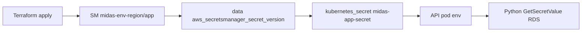

<div align="center">

<a id="title-page"></a>

# MIDAS AWS deployment

### Jenkins + Terraform

*Deploy pipeline reference: how Jenkins reaches your AWS account, and how to add Terraform modules under `deploy/ecs-app/modules/` and register them in the ecs-app root (**Option&nbsp;A**).*

[→ Index](#index)

</div>

---

<a id="index"></a>
## Index

- [Title page](#title-page)
- [Path convention (repository root)](#path-convention)
- [1. Which Jenkins job and file this describes](#section-1)
  - [1.1 Getting started](#subsection-1-getting-started)
- [2. How parameters map to AWS and Terraform state](#section-2)
  - [2.1 Customer mapping (authoritative per environment)](#subsection-21)
  - [2.2 AWS authentication (two steps)](#subsection-22)
  - [2.3 Terraform remote state (exact backend keys)](#subsection-23)
  - [2.4 Variables passed into `deploy/ecs-app` Terraform](#subsection-24)
  - [2.5 Human approval](#subsection-25)
  - [2.6 Protections for non-dev](#subsection-26)
  - [2.7 Testing the environment (`deploy/scripts/test/`)](#subsection-27-testing)
- [3. Where to create Terraform for a new S3 bucket (exact locations)](#section-3)
  - [Option A - Same state as the app stack](#option-a)
  - [Terraform modules layout (MIDAS)](#subsection-modules-midas)
  - [Where to register modules in the ecs-app root](#subsection-register-modules)
  - [Step-by-step guide: Option A](#option-a-steps)
  - [Option B - Separate Terraform root](#option-b)
- [4. How to “register” the S3 template so this pipeline deploys it](#section-4)
  - [4.1 Registration with the existing app Terraform (Option A)](#subsection-41)
  - [4.2 IAM: deployer role must allow S3 operations on your bucket ARNs](#subsection-42)
  - [4.3 Order of operations in the pipeline](#subsection-43)
  - [4.4 S3 buckets: private-by-default (corporate)](#subsection-44)
  - [4.5 EC2 SSM test instance (`ec2-ssm-test`)](#subsection-45)
- [5. Quick reference: paths used by `Jenkinsfile_Deploy_App`](#section-5)
- [6. Related jobs in this folder (not the same as Deploy App)](#section-6)
- [7. Reference: us-east-1 MIDAS VPC (snapshot)](#section-7)
- [8. PostgreSQL RDS (database connectivity)](#section-8)
  - [Testing RDS with `midas-rds-postgres-connect.py`](#subsection-8-rds-test) (see also [§2.7](#subsection-27-testing))
  - [Manual `psql` with verify-full TLS (`rds-psql-ssl-verify-full.sh`)](#subsection-8-psql-verify-full)
- [9. Developer reference: AWS services in `deploy/ecs-app/modules/`](#section-9)
- [10. Security group compliance checks (laptop & Jenkins → EKS)](#section-10-sg-checks)
- [11. Secrets architecture (Terraform, Secrets Manager, Kubernetes, Python)](#section-11-secrets)

---

This document describes **exactly** how the MIDAS deploy pipeline in this repository reaches your AWS account, and **where** to add Terraform for a new S3 bucket so that same pipeline can manage it.

<a id="path-convention"></a>
**Path convention:** Paths are **relative to the Git repository root** (the top-level checkout of this solution - the directory that contains **`deploy/`**, **`frontend/`**, **`backend/`**, and **`deploy/README.md`**). Examples: **`deploy/ecs-app/`** refers to that folder under the root; shell snippets use **`./deploy/...`** when you run commands **from the repository root** (same layout Jenkins uses with checkout directory **`bu-analytics-gen-ai-midas/`**).

---

<a id="section-1"></a>
## 1. Which Jenkins job and file this describes

The job parameters (**CUSTOMER**, **ENVIRONMENT**, **IMAGE_TAG**, **GIT_BRANCH**, and **`ENABLE_HELM_DEPLOY`**) match **`deploy/Jenkinsfile_Deploy_App`**. The build description and **Get customer mapping** log line **`ENABLE_HELM_DEPLOY (param)`** so you can see what Jenkins used for that run.

- **Repository cloned on the agent:** `https://ucgithub.exlservice.com/Unified-Cloud-DevOps/bu-analytics-gen-ai-midas.git`
- **Checkout directory name:** `bu-analytics-gen-ai-midas/`
- **Branch:** `GIT_BRANCH` (for example `init-deploy`)

If your Jenkins UI shows a name such as `bu-analytics-gen-ai-midas-deploy-eks`, that is only the **job display name** in Jenkins. In **this** repository, **`Jenkinsfile_Deploy_App`** runs Terraform for:

1. `deploy/deploy_role/` - `midas-deployer-role` and **ten** customer-managed policies **`midas-deployer-policy-001`** … **`midas-deployer-policy-010`** under **`deploy/deploy_role/iam-policy/`** (permissions spread across all ten; each file must stay ≤ **6,144** characters). Includes **ECR lifecycle + image push** for CI. See **`.cursor/rules/solution_policy.mdc`** when editing those files.
2. `deploy/ecs-app/` - ECS-related resources **and** registered modules under **`deploy/ecs-app/modules/`** (including **EKS** at **`deploy/ecs-app/modules/eks/`**, registered in **`deploy/ecs-app/eks.tf`**)

After **Terraform apply**, the pipeline **builds Docker images** from **`deploy/ecs-app/docker/build-registry/images.yaml`**, **pushes** them to **ECR** repositories defined in **`deploy/ecs-app/ecr.tf`**, and runs **Helm** against EKS when **`ENABLE_HELM_DEPLOY`** is enabled (**default: enabled** in the Jenkinsfile). That requires a **network path to the private Kubernetes API** from the Jenkins agent; if the agent cannot reach the API, **uncheck `ENABLE_HELM_DEPLOY`** for that build or run Helm from an in-VPC path such as the SSM jump box. **Important:** Jenkins **Rebuild** reuses the **previous build’s parameters** - if an older run had Helm disabled, **Rebuild** keeps it disabled until you use **Build with Parameters** and enable **`ENABLE_HELM_DEPLOY`**. To grant **`midas-deployer-role`** an EKS access entry for automated Helm (optional), set Terraform variable **`eks_ci_automation_principal_arn`** (see **`deploy/ecs-app/eks-ci-access.tf`**) in your environment **`tfvars`** or extend **`Jenkinsfile_Deploy_App`** to pass `-var` when needed.

- **Solution documentation index (all sub-README links):** **[`README.midas.md`](../README.midas.md)** (the long-form MIDAS overview; the repo root `README.md` is now the Atlas landing page)
- **Docker / build matrix:** [`deploy/ecs-app/docker/README.md`](ecs-app/docker/README.md) and [`deploy/ecs-app/docker/build-registry/README.md`](ecs-app/docker/build-registry/README.md)
- **Helm:** [`deploy/ecs-app/helm/README.md`](ecs-app/helm/README.md)

Other directories under `deploy/` (for example `deploy/ecr_ssm/`) are **not** invoked by `Jenkinsfile_Deploy_App` unless you add new pipeline stages. **ECR for MIDAS** is managed in **`deploy/ecs-app/modules/ecr/`** (registered in **`deploy/ecs-app/ecr.tf`** - legacy **`midas-{env}-app`** plus three application repositories). If you previously applied **`deploy/ecr_ssm/`**, do **not** create a second repository with the same name-**import** the existing repository into the **`ecs-app`** state or **retire** the old stack after migration.

<a id="subsection-1-getting-started"></a>
### 1.1 Getting started

1. **Skim this README** - [§1](#section-1) names the Jenkins job and Terraform roots; [§2](#section-2) explains how **`CUSTOMER`**, **`ENVIRONMENT`**, and customer mapping resolve to **`AWS_ACCOUNT_ID`**, state bucket, and roles. For **Secrets Manager, K8s `midas-app-secret`, and how the Python API loads RDS credentials**, read **[§11](#section-11-secrets)**.
2. **Validate AWS access** - When you have credentials for the workload account (SSO, assumed role, or approved local keys), use **[§2.7 Testing the environment](#subsection-27-testing)** to run **`./deploy/scripts/test/`** helpers (from the **[repository root](#path-convention)**) against **S3**, **Secrets Manager**, **ElastiCache**, and **RDS** (where network path allows). That section explains how to **paste the `export …` block** from AWS (for example CloudShell or IAM temporary credentials) when the scripts prompt for it.
3. **Change infrastructure** - Follow [§3](#section-3) and later sections to add modules under **`deploy/ecs-app/`** and register them in the root; keep **`us-east-1`** and corporate security defaults in mind (see **`.cursor/rules/solution_const.mdc`**).

---

<a id="section-2"></a>
## 2. How parameters map to AWS and Terraform state

<a id="subsection-21"></a>
### 2.1 Customer mapping (authoritative per environment)

For a given build, **`CUSTOMER`** selects a JSON file:

| Path |
|------|
| `deploy/resources/customer-mapping/<CUSTOMER>.json` |

Example for the default choice **`midas`**:

| Path |
|------|
| `deploy/resources/customer-mapping/midas.json` |

**`ENVIRONMENT`** must be a top-level key in that file (`dev`, `uat`, or `prod`). The pipeline reads (via `jq`) for the selected environment:

| Variable set in Jenkins | JSON field |
|-------------------------|------------|
| `TENANT_ENV` | `tenant_env` |
| `TENANT_ID` | `tenant_id` |
| `AWS_ACCOUNT_ID` | `aws_account_id` |
| `TERRAFORM_STATE_BUCKET` | `terraform_state_bucket` |

These values are echoed in the **Get customer mapping** stage and used in later stages.

<a id="subsection-22"></a>
### 2.2 AWS authentication (two steps)

1. **Jenkins OIDC / cross-account role** (from mapping):  
   `arn:aws:iam::<AWS_ACCOUNT_ID>:role/EXLJenkinsCrossAccountRole-BU`  
   Used for the **Create deploy role** stage (`withAWS(role: "${AWS_ROLE_ARN}", ...)`).

2. **Deployer role in the target account** (fixed in the Jenkinsfile for MIDAS):  
   `arn:aws:iam::<AWS_ACCOUNT_ID>:role/midas-deployer-role`  
   Used for **Terraform plan** and **Terraform apply** on the application stack (`withAWS(role: "${AWS_DEPLOY_ROLE_ARN}", ...)`).

So the pipeline targets **the account ID** stored in `deploy/resources/customer-mapping/<CUSTOMER>.json` for the chosen **`ENVIRONMENT`**.

<a id="subsection-23"></a>
### 2.3 Terraform remote state (exact backend keys)

**Deploy IAM role stack** (`deploy/deploy_role/`):

| Setting | Value used in pipeline |
|--------|-------------------------|
| S3 bucket | `TERRAFORM_STATE_BUCKET` from customer mapping |
| State key | `deploy-role-omf/terraform.tfstate` (literal; not tenant-specific) |
| Region | `us-east-1` (`AWS_REGION`) |

**Application stack** (`deploy/ecs-app/`):

| Setting | Value used in pipeline |
|--------|-------------------------|
| S3 bucket | `TERRAFORM_STATE_BUCKET` |
| State key | `app-deploy-omf-<TENANT_ENV>/<TENANT_ID>/terraform.tfstate` |
| Region | `us-east-1` |

Example for **midas** + **dev** (from `midas.json`):  
`app-deploy-omf-dev/midas-dev-001/terraform.tfstate`.

<a id="subsection-24"></a>
### 2.4 Variables passed into `deploy/ecs-app` Terraform

`Jenkinsfile_Deploy_App` runs `terraform plan` with:

- `-var "aws_account_id=${AWS_ACCOUNT_ID}"`
- `-var "environment=${TENANT_ENV}"`
- `-var "terraform_state_bucket=${TERRAFORM_STATE_BUCKET}"`
- `-var "aws_region=${AWS_REGION}"`

It does **not** pass `-var-file=...` in that job. Optional `deploy/ecs-app/tfvars/*.tfvars` files exist for **manual** runs but are not wired in this Jenkinsfile.

**EKS** is implemented as **`module "eks"`** in **`deploy/ecs-app/eks.tf`**. Placement (`vpc_id`, subnets) comes from root variables **`eks_vpc_id`**, **`eks_cluster_subnet_ids`**, and optional **`eks_node_subnet_ids`** (defaults match the MIDAS DEV VPC snapshot in **`deploy/ecs-app/variables.tf`**). Override per environment in **`deploy/ecs-app/tfvars/<env>.tfvars`** when the workload VPC differs. Authoritative networking notes: **`.cursor/config/eks-cluster-config.md`**.

The cluster uses **`authentication_mode = API_AND_CONFIG_MAP`** so both **`aws-auth`** (managed node groups) and **EKS access entries** work. **`deploy/ecs-app/eks-jumpbox-access.tf`** registers an **access entry** and **AmazonEKSClusterAdminPolicy** association for the **SSM jump box** IAM role (`midas-<env>-ec2-ssm-test-role`) so operators can run **`kubectl`** from that instance after **`aws eks update-kubeconfig`** (private API only; the instance must stay in the VPC). The jump box role also receives **`eks:DescribeCluster`** (and **`eks:ListClusters`**) via **`deploy/ecs-app/modules/ec2-ssm-test`**. Install **AWS CLI v2** and **`kubectl`** on the Ubuntu host (not provisioned by Terraform).

**Internal ALB (Ingress):** Terraform wires **`module "eks_alb_controller_iam"`** in **`deploy/ecs-app/eks-alb-controller.tf`**: an IAM OIDC provider for the cluster, an **IRSA** role for the [AWS Load Balancer Controller](https://kubernetes-sigs.github.io/aws-load-balancer-controller/), and the upstream controller **IAM policy** vendored at **`deploy/ecs-app/modules/eks-alb-controller-iam/files/iam_policy.json`**. **MIDAS posture:** only **internal** ALBs (`scheme = internal`) - **no internet-facing** load balancers from this integration. **Helm** installs the controller (not run by **`Jenkinsfile_Deploy_App`** unless you add a stage); see **`deploy/k8s/aws-load-balancer-controller/README.md`**. Optional subnet tagging for internal ELBs: set **`eks_internal_alb_subnet_tag_enabled = true`** (and optionally **`eks_internal_alb_subnet_ids`**) after coordinating with network owners if subnets are shared.

<a id="subsection-25"></a>
### 2.5 Human approval

After **Terraform plan (ECS task definition + service)**, the pipeline pauses on **Approve deploy?** before **Terraform apply**.

<a id="subsection-26"></a>
### 2.6 Protections for non-dev

For **`ENVIRONMENT` ≠ `dev`**, the pipeline runs **`deploy/scripts/dev/env-protection.sh`** before deploy (approval workflow).

<a id="subsection-27-testing"></a>
### 2.7 Testing the environment (`deploy/scripts/test/`)

These **Python 3** scripts validate that **your current AWS identity** can reach MIDAS resources created by **`deploy/ecs-app/`** modules. Run them from the **repository root** (see **[Path convention](#path-convention)**); invocations below use **`./deploy/scripts/test/`**. They use **`boto3`**; install **`pip install boto3`** globally or in a venv. The RDS script additionally needs **`pip install "psycopg[binary]" boto3`**; optional **`redis`** for ElastiCache **`--redis-ping`**.

| Script | What it checks |
|--------|----------------|
| **`midas-s3-test-bucket-access.py`** | Resolves the Terraform test bucket (prefix **`midas-<environment>-<region>-test-`**) or **`S3_BUCKET`**, then **`HeadBucket`** and **`ListObjectsV2`**. |
| **`midas-secretsmanager-get-secret.py`** | **`GetSecretValue`** for a named secret (override via **`SECRET_ID`** / **`--secret-id`**). |
| **`midas-elasticache-redis-test-access.py`** | **`DescribeReplicationGroups`** for **`midas-<environment>-redis`**; optional TLS **PING** with **`--redis-ping`** and **`ELASTICACHE_REDIS_AUTH_SECRET_ARN`**. |
| **`midas-rds-postgres-connect.py`** | Finds the MIDAS RDS instance by prefix, loads the **master user** secret, runs a test **`SELECT`**. Requires **network path to port 5432** (often from the **SSM jump box** or a pod, not from a random corporate laptop). |

For an **interactive `psql`** session that uses **`sslmode=verify-full`** (certificate checked against the RDS DNS name while the TCP connection uses a **private IP**), use **`./deploy/scripts/util/rds-psql-ssl-verify-full.sh`** - see **[§8 - Manual `psql` with verify-full TLS](#subsection-8-psql-verify-full)**.

For a **`redis-cli --tls`** smoke test ( **`PING`** by default; optional **`REDIS_IP`** + **`--sni`** against the endpoint hostname), use **`./deploy/scripts/util/elasticache-redis-cli-tls-ping.sh`** - see **[§9.4](#subsection-94-elasticache)**.

**Example RDS / Redis hostnames, private IPs, and SG-check CIDRs** (including script defaults such as **`RDS_IP=10.72.134.166`**) are tabulated in **[`deploy/scripts/README.md` § Example hostnames / IPs](scripts/README.md#example-hostnames-private-ips-and-cidrs-us-east-1)** - refresh from AWS before relying on them.

For **security-group rule presence** (read-only, **AWS CLI**, traffic-light markdown) without opening the AWS console, use **[§10](#section-10-sg-checks)** - laptop/jump CIDRs for **RDS** / **Redis**, and **Jenkins CIDR → EKS :443**.

**EKS (`kubectl`) from the SSM jump box**

On the **`ec2-ssm-test`** instance (**`aws ssm start-session`** - see **[§4.5](#subsection-45)**), the instance profile can use **`aws eks update-kubeconfig`** against the private API (**`deploy/ecs-app/eks-jumpbox-access.tf`**). **DEV** example below; replace **`midas-eks-dev`** and the **node** name for **uat** / **prod**, and pick **`spec.nodeName`** from **`kubectl get nodes -o wide`** in your cluster.

```bash
export AWS_DEFAULT_REGION=us-east-1
aws eks update-kubeconfig --name midas-eks-dev --region us-east-1
kubectl config current-context
kubectl get pods -A -o wide --field-selector spec.nodeName=ip-10-72-134-19.ec2.internal
```

If **`kubectl`** errors with **`localhost:8080`** / **connection refused**, there is no active kubeconfig context-often because **`HOME`** is empty while **`aws`** wrote **`/root/.kube/config`**. As **`root`**, run **`export HOME=/root`** and **`export KUBECONFIG=/root/.kube/config`**, then **`aws eks update-kubeconfig`** again (interactive **Session Manager** shells usually have **`HOME`** set already).

**Credentials - paste the `export` block from AWS**

If **`AWS_ACCESS_KEY_ID`** and **`AWS_SECRET_ACCESS_KEY`** are **not** set, and you are **not** using **`AWS_PROFILE`**, instance role, or web identity, each script **prompts** (on a TTY): paste lines in the usual form:

```bash
export AWS_ACCESS_KEY_ID="AKIA..."
export AWS_SECRET_ACCESS_KEY="..."
export AWS_SESSION_TOKEN="..."   # when using temporary credentials
export AWS_REGION="us-east-1"
```

End the paste with an **empty line** (Enter). The scripts parse **`export KEY=value`** (and optional **`set KEY=value`**) and apply **`AWS_*`**, **`MIDAS_ENVIRONMENT`**, **`ENVIRONMENT`**, and service-specific variables (**`S3_BUCKET`**, **`SECRET_ID`**, **`ELASTICACHE_*`**) only where your shell does not already set them.

**Where the block comes from** depends on your org: **AWS IAM Identity Center (SSO)** session exports, **AWS CloudShell** “copy credentials”, **STS assume-role** output, or **`aws configure export-credentials`** (CLI v2). Do **not** commit credential lines to git or tickets.

**Non-interactive use:** Pipe the same text on stdin, for example **`./deploy/scripts/test/midas-secretsmanager-get-secret.py < creds.txt`**, or run **`eval "$(aws configure export-credentials --profile my-profile --format env)"`** (or **`aws sso login`**) then invoke the script without a paste.

**Examples** (after credentials are available):

```bash
TRAFFIC_LIGHT=1 ./deploy/scripts/test/midas-s3-test-bucket-access.py --environment dev
./deploy/scripts/test/midas-secretsmanager-get-secret.py -v
TRAFFIC_LIGHT=1 ./deploy/scripts/test/midas-elasticache-redis-test-access.py --environment dev
./deploy/scripts/test/midas-rds-postgres-connect.py --environment dev --region us-east-1 -v
```

Use **`--help`** on each script for flags. For more on the RDS helper, see [§8 - Testing RDS](#subsection-8-rds-test). For **`redis-cli`** TLS checks from **`deploy/scripts/util/`**, see [§9.4](#subsection-94-elasticache).

---

<a id="section-3"></a>
## 3. Where to create Terraform for a new S3 bucket (exact locations)

You have two patterns; only the first is deployed by **`Jenkinsfile_Deploy_App`** today without code changes outside Terraform.

<a id="option-a"></a>
### Option A - Same state as the app stack (recommended for “deploy with this pipeline”)

**Root module the pipeline runs:** `deploy/ecs-app/`

Put new S3 resources in that root in one of these ways:

| What you add | Exact location |
|--------------|----------------|
| New `.tf` file with resources at the root | `deploy/ecs-app/<any-name>.tf` (for example inline `aws_s3_bucket` resources) |
| Reusable Terraform module (required convention for MIDAS) | **`deploy/ecs-app/modules/<purpose>/`** - one folder per concern, lowercase (for example **`deploy/ecs-app/modules/s3/`** for S3 buckets and related resources) |

**MIDAS convention:** All Terraform **modules** that define infrastructure for the MIDAS application AWS account(s) and are deployed through **`Jenkinsfile_Deploy_App`** live as **subfolders of** **`deploy/ecs-app/modules/`**. Add `main.tf`, `variables.tf`, `outputs.tf`, and (if needed) `versions.tf` inside each module folder.

Terraform loads all `*.tf` in **`deploy/ecs-app/`** automatically; modules are **not** deployed until you **register** them with a `module` block in the root (see below).

<a id="subsection-modules-midas"></a>
### Terraform modules layout (MIDAS)

| Item | Location |
|------|----------|
| Module folder for S3 (example) | **`deploy/ecs-app/modules/s3/`** |
| Module folder for SSM test EC2 (example) | **`deploy/ecs-app/modules/ec2-ssm-test/`** - private Ubuntu instance, SSM Session Manager, no SSH |
| Module folder for EKS | **`deploy/ecs-app/modules/eks/`** - private API, managed node group (registered in **`deploy/ecs-app/eks.tf`**) |
| Module folder for EKS ALB controller IAM | **`deploy/ecs-app/modules/eks-alb-controller-iam/`** - OIDC + IRSA for AWS Load Balancer Controller (registered in **`deploy/ecs-app/eks-alb-controller.tf`**) |
| Module folder for PostgreSQL RDS | **`deploy/ecs-app/modules/rds/`** - private PostgreSQL for development-style workloads; same VPC/subnets as EKS nodes (registered in **`deploy/ecs-app/rds.tf`**) |
| Module folder for ElastiCache Redis | **`deploy/ecs-app/modules/elasticache/`** - private Redis replication group (TLS + at-rest encryption); same VPC/subnets as EKS nodes; ingress from the EKS cluster security group only (registered in **`deploy/ecs-app/elasticache.tf`**, optional via `elasticache_redis_enabled`) |
| Module folder for Secrets Manager | **`deploy/ecs-app/modules/secretsmanager/`** - application configuration secret (registered in **`deploy/ecs-app/secretsmanager.tf`**) |
| Module folder for Amazon ECR | **`deploy/ecs-app/modules/ecr/`** - private container image repository (`midas-{environment}-app` by default; registered in **`deploy/ecs-app/ecr.tf`**) |
| Other purposes | **`deploy/ecs-app/modules/<purpose>/`** (for example `kms`, `sqs`) - create a new subfolder per reusable stack |

Keep module interfaces aligned with root variables the pipeline already passes (`aws_account_id`, `environment`, `terraform_state_bucket`, `aws_region`) so Jenkins does not need changes.

<a id="subsection-register-modules"></a>
### Where to register modules in the ecs-app root

**Registration** means adding a `module "..." { source = "./modules/<purpose>" ... }` block to a **`*.tf` file in `deploy/ecs-app/`**. There is no separate registry file.

| Registration (recommended) | Purpose |
|------------------------------|---------|
| **`deploy/ecs-app/s3.tf`** | **Preferred** place for `module` blocks that wire in **`./modules/s3`** (and comments showing how to enable the module). Keeps S3-related wiring easy to find. |
| **`deploy/ecs-app/ec2-ssm-test.tf`** | Registration for **`./modules/ec2-ssm-test`** (Ubuntu test instance + SSM). |
| **`deploy/ecs-app/eks.tf`** | Registration for **`./modules/eks`** (EKS cluster + managed node group). |
| **`deploy/ecs-app/eks-alb-controller.tf`** | IAM for **AWS Load Balancer Controller** (OIDC provider + IRSA role + controller policy); optional **`aws_ec2_tag`** for `kubernetes.io/role/internal-elb` on subnets. |
| **`deploy/ecs-app/eks-jumpbox-access.tf`** | EKS **access entry** + policy association for the SSM jump box role (so **`kubectl`** works from the **`ec2-ssm-test`** instance in the VPC). |
| **`deploy/ecs-app/rds.tf`** | Registration for **`./modules/rds`** (PostgreSQL RDS; optional via `rds_postgres_enabled`). |
| **`deploy/ecs-app/elasticache.tf`** | Registration for **`./modules/elasticache`** (ElastiCache Redis; optional via `elasticache_redis_enabled`; requires EKS for cluster security group). |
| **`deploy/ecs-app/secretsmanager.tf`** | Registration for **`./modules/secretsmanager`** (application Secrets Manager secret; optional seeded value—see **[§11](#section-11-secrets)**). |
| **`deploy/ecs-app/ecr.tf`** | Registration for **`./modules/ecr`** (Amazon ECR repository for MIDAS container images). |
| **`deploy/ecs-app/main.tf`** | Also valid - any `*.tf` in the root is merged into one configuration. |

**Example (S3 module):** implement resources under **`deploy/ecs-app/modules/s3/`**, then in **`deploy/ecs-app/s3.tf`** add:

```hcl
module "s3" {
  source = "./modules/s3"

  aws_account_id = var.aws_account_id
  environment    = var.environment
  aws_region     = var.aws_region
}
```

Uncomment or add this block when the module is ready to manage real resources. Until a `module` block exists in the root, Terraform under **`modules/s3/`** is not part of the deployed plan.

**Backend:** Do not configure a second backend. The bucket continues to use the same S3 backend as the rest of `ecs-app` (see §2.3).

<a id="option-a-steps"></a>
### Step-by-step guide: Option A - add and deploy new Terraform in `deploy/ecs-app`

Follow these steps in order. They assume you are adding infrastructure (for example an S3 bucket) that should be created and managed by **`Jenkinsfile_Deploy_App`**.

1. **Pick the target environment and account**  
   Open `deploy/resources/customer-mapping/<CUSTOMER>.json` and confirm the **`ENVIRONMENT`** you will use (`dev`, `uat`, or `prod`) lists the correct `aws_account_id`, `tenant_id`, `tenant_env`, and `terraform_state_bucket`. The pipeline uses these values at runtime; no change to this file is required unless you are onboarding a new customer or environment.

2. **Allow the deployer role to manage your resources (IAM)**  
   Terraform runs as **`midas-deployer-role`**. Permissions live in **ten** files **`midas-deployer-policy-001`** … **`010`** (see `deploy/deploy_role/main.tf`); **each** file is **one** customer-managed policy, and the role uses **all ten** attachment slots (AWS default limit).  
   - Add or adjust statements in whichever of the ten files has space, and **rebalance** across files so no single file approaches the **6,144-character** document limit. **Do not** add an eleventh policy file without an AWS quota increase.  
   - Commit and push IAM changes **before** or **together with** the Terraform that uses them; the pipeline always applies **`deploy/deploy_role/`** first in the **Create deploy role** stage, so updated IAM is in place before **`ecs-app`** runs. Agents editing IAM should follow **`.cursor/rules/solution_policy.mdc`**.

3. **Add Terraform under the `ecs-app` root**  
   - **Option A1 - single file:** Create a new file such as `deploy/ecs-app/s3-<purpose>.tf` and define `resource` blocks (e.g. `aws_s3_bucket`, encryption, policies) there.  
   - **Option A2 - module (MIDAS standard):** Create **`deploy/ecs-app/modules/<purpose>/`** (for S3, use **`deploy/ecs-app/modules/s3/`**), add `main.tf`, `variables.tf`, `outputs.tf` as needed, then **register** the module with a `module` block in **`deploy/ecs-app/s3.tf`** (recommended) or **`deploy/ecs-app/main.tf`**.  
   Use existing input variables where possible (`var.aws_account_id`, `var.environment`, `var.aws_region`, `var.terraform_state_bucket`) so you do not need Jenkins changes. Build bucket names from those variables so each environment gets a distinct bucket.

4. **Variables and Jenkins**  
   - Prefer **defaults** for any new `variable` blocks, or reuse existing variables already passed by the pipeline (see §2.4).  
   - Only if you **must** require new required variables with no default, update **`deploy/Jenkinsfile_Deploy_App`** to add matching `-var` or `-var-file` arguments to the `terraform plan` and ensure the same apply uses the saved plan.

5. **Validate locally (recommended)**  
   From `deploy/ecs-app/`, run `terraform init` with the same **backend** settings the pipeline uses (`bucket` = `terraform_state_bucket` from mapping, `key` = `app-deploy-omf-<tenant_env>/<tenant_id>/terraform.tfstate`, `region` = `us-east-1`), then `terraform validate` and `terraform fmt -check` or `terraform fmt`. Use credentials that can assume the deployer role or a role with equivalent permissions.

6. **Commit and push to a branch**  
   Push your branch to the remote; note the branch name - **`GIT_BRANCH`** in Jenkins must match.

7. **Run the Jenkins job**  
   Open the MIDAS deploy job that uses **`Jenkinsfile_Deploy_App`**. Set **CUSTOMER**, **ENVIRONMENT**, **GIT_BRANCH** (your branch), and **IMAGE_TAG** as required. Start the build.

8. **Let the pipeline complete**  
   - **Create deploy role** applies IAM from `deploy/deploy_role/` (including any policy changes from step 2).  
   - **Terraform plan (ECS task definition + service)** runs `terraform plan` in **`deploy/ecs-app/`**; your new resources appear in the plan.  
   - Approve **Approve deploy?** when prompted.  
   - **Terraform apply** applies the saved plan.

9. **Verify**  
   Confirm resources in the AWS console for the account in customer mapping, or inspect the state object in the S3 backend at the key from §2.3.

<a id="option-b"></a>
### Option B - Separate Terraform root (new folder under `deploy/`)

You may create a **new** directory, for example:

| Example path |
|--------------|
| `deploy/s3-my-feature/` |

with its own `main.tf`, `variables.tf`, `versions.tf`, and `backend "s3"` block using **new** state key(s) under the same `TERRAFORM_STATE_BUCKET` (or another bucket you control).

**Important:** `Jenkinsfile_Deploy_App` does **not** `cd` into that directory. Nothing under a new root runs until you **add Jenkins stages** (and typically the same `terraform init` / `plan` / `apply` pattern with `withAWS(role: "${AWS_DEPLOY_ROLE_ARN}", ...)`) or run Terraform manually/elsewhere.

---

<a id="section-4"></a>
## 4. How to “register” the S3 template so this pipeline deploys it

“Register” here means: **the resources are part of the Terraform configuration that Jenkins already applies.**

<a id="subsection-41"></a>
### 4.1 Registration with the existing app Terraform (Option A)

Use the **step-by-step guide** under §3 (Option A) for the full procedure. In short:

1. Add the bucket (or `module` call) under **`deploy/ecs-app/`** as described there.
2. Ensure any new variables you introduce have defaults or are passed via the Jenkinsfile `-var` arguments (or extend `Jenkinsfile_Deploy_App` to pass additional `-var` / `-var-file` if you require them).

**Composition root:** The root module is the **`deploy/ecs-app/`** directory. There is no separate “registry” YAML. Linking is done by **Terraform**:
- resources live in `*.tf` in `deploy/ecs-app/`, and/or  
- `module "..." { source = "./modules/..." }` in those files (for MIDAS modules, folders live under **`deploy/ecs-app/modules/<purpose>/`**; register in **`s3.tf`** or **`main.tf`** - see §3).

<a id="subsection-42"></a>
### 4.2 IAM: deployer role must allow S3 operations on your bucket ARNs

The pipeline applies Terraform using **`midas-deployer-role`**. That role’s permissions come from **`deploy/deploy_role/`**: every JSON file under:

| Path |
|------|
| `deploy/deploy_role/iam-policy/` |

is loaded and attached to the role as **one customer-managed policy per file** (see `deploy/deploy_role/main.tf`). Files are **`midas-deployer-policy-001`** through **`midas-deployer-policy-010`**; statements are **spread across all ten**. Each document must stay under AWS’s **6,144-character** limit.

**Quota:** AWS allows **10 managed policies per IAM role** by default - this repo **uses all ten** for `midas-deployer-role`. There is **no** spare attachment slot unless you merge policies or request a quota increase.

**Validate (repo + optional AWS):** From the repository root, run **`python3 deploy/scripts/util/validate-deploy-role-iam.py`** to confirm the ten policy files exist, JSON is valid, each document is ≤ **6,144** characters, and **`Sid`** values are unique. With valid credentials and **`iam:ListAttachedRolePolicies`**, run **`python3 deploy/scripts/util/validate-deploy-role-iam.py --aws --role-name midas-deployer-role --account-id <workload-account-id>`** to confirm the live role has exactly the ten managed policies named **`midas-deployer-role-midas-deployer-policy-001`** … **`010`** (and no unexpected legacy attachments).

If your bucket names do not match an allowed ARN pattern (for example **`bti-omf-*`** data buckets or **`midas-*`** tenant buckets), **edit the appropriate `midas-deployer-policy-NNN`** (search by `Sid` across the ten files), then run the **Create deploy role** stage (or apply `deploy_role` manually) **before** the new S3 Terraform will succeed.

<a id="subsection-43"></a>
### 4.3 Order of operations in the pipeline

1. **Create deploy role** → updates IAM for `midas-deployer-role` from `deploy/deploy_role/`.
2. **Plan / Apply ecs-app** → applies whatever is in **`deploy/ecs-app/`** (including your new S3 resources once added there).

<a id="subsection-44"></a>
### 4.4 S3 buckets: private-by-default (corporate)

The **`deploy/ecs-app/modules/s3`** module is configured so buckets are **not public** unless you deliberately change that later:

| Control | Purpose |
|--------|---------|
| **Object Ownership `BucketOwnerEnforced`** | Disables ACLs so objects cannot be made world-readable via `public-read` / similar ACLs. |
| **Default encryption (SSE-S3)** | Server-side encryption at rest; `bucket_key_enabled` where supported. |
| **Bucket policy** | Denies **non-TLS** access (`aws:SecureTransport` = false) and denies **public ACL** grant headers (`public-read`, `public-read-write`, `authenticated-read`). |
| **`aws_s3_bucket_public_access_block`** | **Off by default** (`enable_bucket_public_access_block = false`). Many corporate AWS Organizations **explicitly deny** `s3:PutBucketPublicAccessBlock` via **SCP**; in that case Terraform cannot set per-bucket Block Public Access. Rely on **account- or org-level S3 Block Public Access** plus the controls above. |

To opt into Terraform-managed per-bucket Block Public Access (only if your org **allows** that API), pass `enable_bucket_public_access_block = true` into the `module "s3"` block in **`deploy/ecs-app/s3.tf`**.

<a id="subsection-45"></a>
### 4.5 EC2 SSM test instance (`ec2-ssm-test`)

The **`deploy/ecs-app/modules/ec2-ssm-test`** module provisions a **private** Ubuntu 22.04 LTS instance for testing: **1 vCPU** by default (`t2.micro`), **IMDSv2 required**, **encrypted gp3** root volume, **no inbound** security group rules (access via **SSM Session Manager** only). The instance profile attaches **`AmazonSSMManagedInstanceCore`**. When wired to the EKS module (see **`deploy/ecs-app/ec2-ssm-test.tf`**), Terraform also attaches an inline policy allowing **`eks:DescribeCluster`** and **`eks:ListClusters`** so **`aws eks update-kubeconfig`** and **`aws eks get-token`** work on the instance. **Kubernetes API access** for that IAM principal is granted by **`deploy/ecs-app/eks-jumpbox-access.tf`** (EKS access entry + **AmazonEKSClusterAdminPolicy**). On the instance, install **`kubectl`** and ensure **AWS CLI v2** is available; then: `aws eks update-kubeconfig --name <cluster> --region us-east-1` and `kubectl get nodes` (reachable only from networks that resolve the **private** EKS endpoint-this instance’s VPC is sufficient).

- **VPC:** pass **`ec2_ssm_test_vpc_id`** from the ecs-app root (default matches the MIDAS DEV **us-east-1** VPC snapshot in §7; override in **`tfvars/`** if your environment uses another VPC).
- **Subnet:** unless you set an explicit subnet in the module, Terraform picks **`exl:uc:SubnetGroup=1`**, then **`2`**, then any subnet in the VPC (sorted for stability), aligned with the larger tiers in the VPC snapshot.
- **Networking:** SSM from a private subnet typically requires **corporate VPC endpoints** for SSM / EC2 Messages / SSM Messages (and routes) or equivalent egress; the security group allows **egress TCP 80/443** for HTTPS APIs and common package mirrors.

S3 (**`midas-*`**, **`bti-omf-*`**), **EC2 SSM test**, **PassRole**, security groups, and related statements are split across **`midas-deployer-policy-001`** … **`010`** - search by **`Sid`** (e.g. **`MidasTenantBucketsDeploy`**, **`Ec2SsmTestInstanceLifecycle`**, **`IamInstanceProfilesForEc2SsmTest`**) under **`deploy/deploy_role/iam-policy/`**.

<a id="subsection-46"></a>
### 4.6 Amazon ECR (container images)

The **`deploy/ecs-app/modules/ecr`** module creates a **private** ECR repository (default name **`midas-{environment}-app`**), **scan on push**, **AES256** encryption at rest, and a **lifecycle policy** (retain the last *N* images). Register it via **`deploy/ecs-app/ecr.tf`**; root outputs include **`ecr_repository_url`**, **`ecr_repository_arn`**, and **`ecr_repository_name`**.

- **Deployer IAM:** the ten **`midas-deployer-policy-00N`** files under **`deploy/deploy_role/iam-policy/`** allow Terraform to manage ECR repositories matching **`arn:aws:ecr:us-east-1:*:repository/midas-*`**, **`ecr:GetAuthorizationToken`**, and **image push** APIs for CI (**`us-east-1`** only; see **`EcrMidasRepositoriesManage`** / **`EcrPushMidasImages`** `Sid`s - search across all ten files).
- **EKS:** Worker nodes use the managed policy **`AmazonEC2ContainerRegistryReadOnly`** on the node IAM role (**`deploy/ecs-app/modules/eks`**) to pull images from **this account**; no extra EKS Terraform is required for standard **`image:`** references. In a **private** VPC, ensure **network path** (often **interface endpoints** for **`ecr.api`** / **`ecr.dkr`** and **S3** for image layers) - see §7 and **`docs/workorder-vpc-endpoints-list.md`**.
- **Legacy:** **`deploy/ecr_ssm/`** is a **separate** Terraform root (not run by **`Jenkinsfile_Deploy_App`**). If it already created a repository, align names and state so you do **not** duplicate the same repository in AWS.

---

<a id="section-5"></a>
## 5. Quick reference: paths used by `Jenkinsfile_Deploy_App`

| Purpose | Path in repo (after clone) |
|--------|----------------------------|
| Customer/env mapping | `bu-analytics-gen-ai-midas/deploy/resources/customer-mapping/${CUSTOMER}.json` |
| Env protection script | `bu-analytics-gen-ai-midas/deploy/scripts/dev/env-protection.sh` |
| Local `ecs-app` fmt + init (no remote backend) + validate | `bu-analytics-gen-ai-midas/deploy/scripts/dev/terraform-validate-ecs-app.sh` (requires valid AWS credentials for `terraform init`) |
| Deploy IAM role Terraform | `bu-analytics-gen-ai-midas/deploy/deploy_role/` |
| App Terraform root (ECS + registered modules) | `bu-analytics-gen-ai-midas/deploy/ecs-app/` |
| MIDAS Terraform modules (e.g. S3, EKS, ECR) | `bu-analytics-gen-ai-midas/deploy/ecs-app/modules/<purpose>/` |
| Example: register S3 module | `bu-analytics-gen-ai-midas/deploy/ecs-app/s3.tf` |
| Example: register ECR module | `bu-analytics-gen-ai-midas/deploy/ecs-app/ecr.tf` |
| Example: SSM test EC2 module | `bu-analytics-gen-ai-midas/deploy/ecs-app/ec2-ssm-test.tf` |
| Example: EKS module | `bu-analytics-gen-ai-midas/deploy/ecs-app/eks.tf` |
| Jenkins pipeline definition | `deploy/Jenkinsfile_Deploy_App` |

---

<a id="section-6"></a>
## 6. Related jobs in this folder (not the same as Deploy App)

| File | Purpose |
|------|---------|
| `Jenkinsfile_Build` | Clones **`bu-exlerate-bti-omf`** (different repo); build/push image - not MIDAS. |
| `Jenkinsfile_Deploy_Task_Definition` | Clones **`bu-exlerate-bti-omf`**; ECS task definition focused - not MIDAS. |

For MIDAS image build/deploy, use the jobs whose Jenkinsfile points at **`bu-analytics-gen-ai-midas.git`** (this repo) and **`Jenkinsfile_Deploy_App`** for the Terraform flow described above.

---

<a id="section-7"></a>
## 7. Reference: us-east-1 MIDAS VPC (snapshot)

This section records an **AWS CLI snapshot** of the **MIDAS DEV** VPC in **`us-east-1`** so operators and Terraform authors can align **subnet choice, private connectivity, and expectations** with the live network. **Subnet IDs and routes can change** - re-verify with EC2 APIs before baking IDs into long-lived configuration.

**Captured:** 2026-04-05 (API queries against account `811391286931`; VPC resources show owner `074056539357` - shared / centrally managed VPC pattern).

### Accounts

| Role | Account ID |
|------|------------|
| MIDAS workload / Terraform state (customer mapping `aws_account_id` for dev) | `811391286931` |
| VPC, subnet, route table, NACL owner (network account) | `074056539357` |

Some EC2 APIs invoked from the workload account **do not return** Transit Gateway or gateway-endpoint objects referenced in routes that are owned elsewhere. Treat routing as **authoritative in the network account** when planning TGW or endpoint changes.

### VPC summary

| Attribute | Value |
|-----------|--------|
| VPC ID | `vpc-0c4d673f3e95a93eb` |
| IPv4 CIDR | `10.72.134.0/23` |
| Name tag | `aws03-811391286931-ins-ai-MIDAS-DEV-DEV-vpc` |
| DNS support / DNS hostnames | Enabled |

### Egress and routing (observed)

- **No Internet Gateway** and **no NAT gateways** on this VPC in the snapshot.
- **Default route** `0.0.0.0/0` → **Transit Gateway** `tgw-0ec391fa73943d562` (route table `rtb-0011ea90ee82f8645`). Outbound traffic follows **corporate TGW** paths, not a VPC-attached IGW.
- **Prefix list** `pl-63a5400a` routed to a **gateway endpoint** ID in the route table (S3-style pattern); do not duplicate endpoints without checking existing shared endpoints.
- **Blackhole** route for `10.2.230.1/32` present (traffic intentionally dropped).

### Subnets (all private - `MapPublicIpOnLaunch` false)

Two AZs: **`us-east-1a`** (tag “az1”) and **`us-east-1c`** (tag “az2”). Tags include `exl:uc:SubnetGroup` (tier) and `exl:uc:CidrAddress`.

| SubnetGroup | Typical use | us-east-1a (CIDR / subnet ID) | us-east-1c (CIDR / subnet ID) |
|-------------|-------------|-------------------------------|-------------------------------|
| 1 | Larger capacity (`/25`) | `10.72.134.0/25` - `subnet-05c4fce53e16da9bc` | `10.72.134.128/25` - `subnet-04d9f5b09b2dc9425` |
| 2 | Medium (`/26`) | `10.72.135.0/26` - `subnet-0bc74e29f773eb7a4` | `10.72.135.64/26` - `subnet-04f6c506a5098aa40` |
| 3 | Small (`/28`) | `10.72.135.128/28` - `subnet-0636beaf9f48cc482` | `10.72.135.144/28` - `subnet-031582c139ff6d856` |
| 4 | Small (`/28`) | `10.72.135.160/28` - `subnet-0ccf59f981ef4a1fb` | `10.72.135.176/28` - `subnet-0a0033f297fb483a5` |
| 5 | Small (`/28`) | `10.72.135.192/28` - `subnet-0ff03c3d23aa03318` | `10.72.135.208/28` - `subnet-0b79259b9522539b9` |

**Terraform placement:** Prefer **SubnetGroup 1 or 2** for **ECS services, load balancers, or anything that needs many ENIs**; `/28` tiers have few free IPs for scaling. Pass subnet IDs via **variables** or **data sources** rather than hardcoding across modules.

### Network ACL

Default NACL `acl-0d3b652347356d98e` with standard allow-all IPv4 rules (no custom per-subnet NACL in the snapshot).

### Coordination before changing network in Terraform

Do **not** introduce **Internet Gateways**, **NAT gateways**, or **public subnets** for MIDAS in `deploy/ecs-app/` without architecture review and an explicit README note. VPC-level objects may require **network-team IAM** and runbooks outside **`midas-deployer-role`**.

---

<a id="section-8"></a>
## 8. PostgreSQL RDS (database connectivity)

This is the **database (RDS PostgreSQL)** section for MIDAS: how applications connect with **Python**, how to **smoke-test** from the repo, and how to open a **manual `psql`** session with **strict TLS** when you need to confirm path and hostname verification.

### Scope

This section applies to the optional **PostgreSQL RDS** module (**`deploy/ecs-app/modules/rds/`**, registered in **`deploy/ecs-app/rds.tf`**) when **`rds_postgres_enabled`** is **true**.

The database is **private** (not internet-facing). The RDS security group allows **TCP 5432** from the **EKS cluster** security group and, when set in Terraform, from **`rds_additional_ingress_cidrs_tcp_5432`** (PostgreSQL **only** - e.g. workload VPC CIDR so in-VPC VMs and typical pod addresses can connect). **`rds_additional_ingress_cidrs_all_traffic`** is separate: it adds **all-protocol** ingress for approved jump / cross-network CIDRs (see **`deploy/ecs-app/tfvars/midas-cross-network-db-access.tfvars`**). Run client code from a path that matches those rules; **database authentication** is still required.

---

### AWS Secrets Manager and how it fits with RDS

**[AWS Secrets Manager](https://docs.aws.amazon.com/secretsmanager/)** is the managed service used to **store and retrieve sensitive values** (passwords, tokens, connection details) **without embedding them in code or Terraform state as plaintext**. Secrets are encrypted at rest (typically with **AWS KMS**). Access is **IAM-controlled** (`secretsmanager:GetSecretValue`, `DescribeSecret`, etc.), and API calls are **auditable** (for example via **AWS CloudTrail**).

For this RDS module, Terraform sets **`manage_master_user_password = true`** on the DB instance (**`deploy/ecs-app/modules/rds/main.tf`**). That tells **RDS** to **generate the master password**, **store it in Secrets Manager**, and **keep the secret associated with the instance**. Terraform does **not** set the password in `.tf` files; instead it outputs **`rds_postgres_master_user_secret_arn`**, which is the **ARN of that secret**.

**End-to-end flow:**

| Step | What happens |
|------|----------------|
| 1 | Your job or pod has IAM permission to call **`secretsmanager:GetSecretValue`** on the secret ARN (and to reach the **Secrets Manager** endpoint in **`us-east-1`** - often via **VPC interface endpoints** in locked-down networks). |
| 2 | You fetch the secret string (JSON) and parse it. |
| 3 | You pass **`host`**, **`port`**, **`dbname`**, **`username`**, **`password`** (and TLS settings) to **psycopg**, which opens a **TCP connection to the RDS endpoint** on port **5432** (subject to security groups and routing). |

The JSON shape for RDS-managed master-user secrets typically includes **`username`**, **`password`**, **`host`**, **`port`**, **`dbname`**, plus metadata such as **`engine`**. **Always** treat the payload as **the source of truth** for the live password and endpoint fields RDS recorded when the secret was created or rotated.

**MIDAS API on EKS:** The backend reads **`AWS_RDS_POSTGRES_SECRET_ID`** (master secret ARN or name) from **`midas-{environment}-us-east-1/app`** (synced to Kubernetes **`midas-app-secret`**). It calls **`GetSecretValue`** for **username, password, host, port** only from that secret. For the full secrets pipeline (Terraform seed, Helm sync, IAM), see **[§11](#section-11-secrets)**. If **`dbname`** is missing from the RDS-managed JSON, the app merges **`AWS_RDS_POSTGRES_DB_NAME`** from **Helm** ([`deploy/ecs-app/helm/midas-api-backend-svc/values.yaml`](ecs-app/helm/midas-api-backend-svc/values.yaml) **`rdsPostgresDbName`**, default **`midas_dev`**) so parsing matches Terraform **`rds_postgres_db_name`**. In CI you can override with **`helm upgrade --set rdsPostgresDbName=$(terraform output -raw rds_postgres_db_name)`** when the chart default does not match the applied RDS instance. Do not put the DB password in Helm. Optional **`rdsPostgresSslmode`** / **`AWS_RDS_POSTGRES_SSLMODE`** (e.g. **`require`**) appends **`sslmode=`** to **`DATABASE_URL`**, which the API sets from the bundle when **`DATABASE_URL`** is not already set (e.g. local compose). SQLite-backed message/user stores are unchanged until migrated separately.

**Operational note:** Prefer passing **`RDS_SECRET_ARN`** (or the ARN from SSM Parameter Store) into the application, not the raw password. If you cache the secret in memory, follow your org’s guidance on **rotation** (RDS can integrate secret rotation with Secrets Manager).

---

### IAM and networking checklist

- **Secrets Manager:** Principal (task role, instance profile, or user) needs **`secretsmanager:GetSecretValue`** on **`rds_postgres_master_user_secret_arn`** (or `Resource` / `kms` decrypt conditions as required by your secret’s KMS key policy).
- **RDS:** The client must sit in a network path allowed by the **RDS security group** (by default: sources using the **EKS cluster** security group).
- **TLS:** Use **`sslmode=require`** (or stricter) when connecting to **Amazon RDS for PostgreSQL**.

---

### Library: psycopg 3

Use **[psycopg](https://www.psycopg.org/)** version **3** (`psycopg` on PyPI) - the maintained PostgreSQL adapter for Python. Install **binary** wheels so you do not need a separate PostgreSQL client library on the host:

```bash
pip install "psycopg[binary]" boto3
```

For long-running services, consider **[connection pooling](https://www.psycopg.org/psycopg3/docs/advanced/pool.html)** (`psycopg_pool`) or your web framework’s pool. Short scripts can use **`with psycopg.connect(...)`** as below.

---

### Example 1 - Fetch secret from Secrets Manager and open a connection

Set **`RDS_SECRET_ARN`** to **`rds_postgres_master_user_secret_arn`** from Terraform output (or copy the ARN from the AWS console: **RDS → your instance → Configuration → Master credentials ARN**). Run from a host that can **resolve and reach** the RDS endpoint on **5432** and call **Secrets Manager** in **`us-east-1`**.

```python
import json
import os

import boto3
import psycopg

SECRET_REGION = "us-east-1"


def load_rds_master_secret(secret_arn: str) -> dict:
    """Return the RDS master-user JSON document from Secrets Manager."""
    client = boto3.client("secretsmanager", region_name=SECRET_REGION)
    response = client.get_secret_value(SecretId=secret_arn)
    return json.loads(response["SecretString"])


def connection_info_from_secret(secret: dict) -> str:
    """Build a libpq keyword connection string (TLS required for RDS)."""
    return (
        f"host={secret['host']} "
        f"port={secret['port']} "
        f"dbname={secret['dbname']} "
        f"user={secret['username']} "
        f"password={secret['password']} "
        f"sslmode=require"
    )


def main() -> None:
    secret_arn = os.environ["RDS_SECRET_ARN"]
    secret = load_rds_master_secret(secret_arn)
    conninfo = connection_info_from_secret(secret)

    with psycopg.connect(conninfo) as conn:
        with conn.cursor() as cur:
            cur.execute("SELECT current_database(), current_user")
            print(cur.fetchone())


if __name__ == "__main__":
    main()
```

---

### Example 2 - Parameterized query (avoid SQL injection)

Use **`%s`** placeholders and pass values as a second argument to **`execute`**:

```python
import json
import os

import boto3
import psycopg

def connect_from_secret_arn(secret_arn: str, region: str = "us-east-1"):
    sm = boto3.client("secretsmanager", region_name=region)
    secret = json.loads(sm.get_secret_value(SecretId=secret_arn)["SecretString"])
    conninfo = (
        f"host={secret['host']} port={secret['port']} dbname={secret['dbname']} "
        f"user={secret['username']} password={secret['password']} sslmode=require"
    )
    return psycopg.connect(conninfo)


def main() -> None:
    with connect_from_secret_arn(os.environ["RDS_SECRET_ARN"]) as conn:
        with conn.cursor() as cur:
            cur.execute(
                "SELECT tablename FROM pg_tables WHERE schemaname = %s LIMIT %s",
                ("public", 5),
            )
            for row in cur:
                print(row[0])


if __name__ == "__main__":
    main()
```

---

<a id="subsection-8-rds-test"></a>
### Testing RDS with `deploy/scripts/test/midas-rds-postgres-connect.py`

**`deploy/scripts/test/midas-rds-postgres-connect.py`** is a small helper that:

1. Finds the MIDAS RDS instance created by **`deploy/ecs-app/modules/rds`** (identifier prefix **`midas-<environment>-<region>-pg-`**), reads **`MasterUserSecret.SecretArn`** from the **RDS API**, then fetches the secret (aligned with Terraform output **`rds_postgres_master_user_secret_arn`**).
2. Normalizes **`host`**, **`port`**, and **`dbname`** when the JSON omits them (it may call **`rds:DescribeDBInstances`**).
3. Opens a **PostgreSQL** connection with **`psycopg`** using **`sslmode=require`** by default, then runs a test **`SELECT`** (default: current database, user, and server **`version()`**).

**Requirements:** Python 3 with **`pip install "psycopg[binary]" boto3`**, **AWS credentials** that allow **`secretsmanager:GetSecretValue`** and **`rds:DescribeDBInstances`**, and a **network path** to the RDS endpoint on **5432** (see **Scope** above - typically from the VPC **SSM jump box** or an **EKS** workload, not from an arbitrary off-VPC host).

**Flags:** **`-v`** prints connection metadata to **stderr** (never the password). **`--verify-ssl`** turns **on** TLS verification for the **Secrets Manager** and **RDS** HTTPS clients; default is **off** (common when **corporate SSL inspection** breaks certificate validation). PostgreSQL still uses **`sslmode=require`** unless you override **`--sslmode`**.

The script does **not** accept **`--secret-id`**; it resolves the master secret via the RDS API. Set **`MIDAS_ENVIRONMENT`** or **`--environment`** to match Terraform’s **`environment`** (for example **`dev`**).

From the **repository root**:

```bash
./deploy/scripts/test/midas-rds-postgres-connect.py --environment dev --region us-east-1 -v
```

For **credential setup** (including pasting **`export AWS_…`** lines when prompted), see **[§2.7](#subsection-27-testing)**.

---

<a id="subsection-8-psql-verify-full"></a>
### Manual `psql` with verify-full TLS (`deploy/scripts/util/rds-psql-ssl-verify-full.sh`)

**What it is for:** When you already have **network reachability** to the database (for example from the **SSM jump box**, a VPN-attached laptop, or another in-VPC host), this script helps you **prove end-to-end PostgreSQL + TLS** in the same way many operators test by hand: it downloads the **[Amazon RDS CA bundle](https://docs.aws.amazon.com/AmazonRDS/latest/UserGuide/UsingWithRDS.SSL.html)**, then starts **`psql`** with **`sslmode=verify-full`**. The connection uses libpq **`host`** (the RDS DNS name, for **certificate and SNI checks**) plus **`hostaddr`** **`RDS_IP`** so the **TCP socket** hits the private IP without relying on **`sslhost`** (that keyword exists only in **libpq 15+**, which older macOS/Homebrew **`psql`** builds often lack). That pattern is useful after failovers, when validating **DNS vs IP**, or when debugging **SG / routing** separately from **TLS trust**.

**What it is not:** It does **not** fetch the master password from Secrets Manager (unlike **`midas-rds-postgres-connect.py`**). You supply database credentials yourself (**`PGPASSWORD`** or **`~/.pgpass`**). It does **not** replace **[§10](#section-10-sg-checks)** for “is the security group rule present?” checks.

**Prerequisites:** **`curl`**, **`psql`** (PostgreSQL client / libpq) on **`PATH`**, a route to **`RDS_IP:5432`**, and a valid password for **`RDS_USER`**. MIDAS defaults in the script target **`us-east-1`** examples; override with environment variables for other instances.

**How to use** (from the **repository root**; see **[Path convention](#path-convention)**):

```bash
export PGPASSWORD='your-database-password'
# Optional - override defaults (hostname for cert check, IP for TCP):
# export RDS_NAME=midas.xxxxx.us-east-1.rds.amazonaws.com
# export RDS_IP=10.x.x.x
# export RDS_DB=postgres
# export RDS_USER=midaspostgres
# export MIDAS_RDS_SSLROOTCERT=/tmp/my-global-bundle.pem

./deploy/scripts/util/rds-psql-ssl-verify-full.sh
```

The script refreshes the CA PEM (default path: **`${TMPDIR:-/tmp}/midas-rds-global-bundle.pem`** unless **`MIDAS_RDS_SSLROOTCERT`** is set), disables GSSAPI noise (**`PGGSSENCMODE`** / **`gssencmode=disable`**), then **`exec`s `psql`** so you get an interactive shell on success. Run **`./deploy/scripts/util/rds-psql-ssl-verify-full.sh --help`** for a short usage summary.

More **`util/`** helpers are listed in **`deploy/scripts/README.md`**.

---

### Terraform outputs (reference)

| Output | Purpose |
|--------|---------|
| `rds_postgres_endpoint` | DNS hostname of the instance (also in the secret JSON as **`host`**) |
| `rds_postgres_port` | TCP port (usually **5432**) |
| `rds_postgres_db_name` | Initial database name (**`db_name`** in **`deploy/ecs-app/modules/rds`**, default **`midas_dev`**) |
| `rds_postgres_master_user_secret_arn` | **Secrets Manager ARN** - pass this to **`GetSecretValue`** |

The **master username** Terraform uses defaults to **`midas_pg`** (**`deploy/ecs-app/modules/rds/variables.tf`**); the live value is still present in the Secrets Manager JSON alongside the password.

---

<a id="section-9"></a>
## 9. Developer reference: AWS services in `deploy/ecs-app/modules/`

This section introduces each **AWS service** behind a folder under **`deploy/ecs-app/modules/`**: what it is, when to use it, how it fits MIDAS Terraform, and a **Python** example using **`boto3`** (and service-appropriate libraries such as **`redis`** or **`psycopg`** where HTTP APIs alone are not enough). **Region** for MIDAS deploys is **`us-east-1`** unless your team states otherwise.

| Module folder | Primary AWS service(s) |
|---------------|-------------------------|
| **`modules/s3/`** | Amazon S3 |
| **`modules/ecr/`** | Amazon ECR |
| **`modules/rds/`** | Amazon RDS (PostgreSQL) |
| **`modules/elasticache/`** | Amazon ElastiCache (Redis) + Secrets Manager (AUTH token) |
| **`modules/secretsmanager/`** | AWS Secrets Manager |
| **`modules/ec2-ssm-test/`** | Amazon EC2, AWS Systems Manager (Session Manager) |
| **`modules/eks/`** | Amazon EKS |
| **`modules/eks-alb-controller-iam/`** | IAM (OIDC, IRSA) for AWS Load Balancer Controller; Elastic Load Balancing (ALB) created by Kubernetes |

---

<a id="subsection-91-s3"></a>
### 9.1 Amazon S3 - `deploy/ecs-app/modules/s3/`

**What it is:** [Amazon S3](https://docs.aws.amazon.com/s3/) is object storage for files (logs, exports, assets, Terraform state backends). Objects live in **buckets**; access is via IAM, bucket policies, and optional encryption.

**When to use it:** Durable, low-cost storage for **large or numerous blobs**; static content; application uploads; integration with analytics or other AWS services. Prefer **private buckets** and TLS (corporate baseline - see §4.4).

**How MIDAS uses it:** The **`s3`** module provisions a **private-by-default** test bucket (outputs **`test_bucket_id`**, **`test_bucket_arn`**). Call **`s3.tf`** registration from §3.

**Python (`boto3`):** Use the **`s3`** client for **`put_object`**, **`get_object`**, **`list_objects_v2`**. Resolve the bucket name from Terraform output or an environment variable.

```python
import os

import boto3

BUCKET = os.environ["MIDAS_S3_BUCKET"]  # e.g. Terraform output test_bucket_id
KEY = "examples/hello.txt"
REGION = "us-east-1"

s3 = boto3.client("s3", region_name=REGION)

s3.put_object(Bucket=BUCKET, Key=KEY, Body=b"hello from boto3", ServerSideEncryption="AES256")

obj = s3.get_object(Bucket=BUCKET, Key=KEY)
print(obj["Body"].read().decode())
```

---

<a id="subsection-92-ecr"></a>
### 9.2 Amazon ECR - `deploy/ecs-app/modules/ecr/`

**What it is:** [Amazon Elastic Container Registry (ECR)](https://docs.aws.amazon.com/ecr/) is a **private Docker/OCI registry** in your AWS account. Kubernetes (`image:`) and CI jobs push and pull images by **repository URL**.

**When to use it:** Store **container images** built in CI/CD; same-account EKS nodes pull via **`AmazonEC2ContainerRegistryReadOnly`** (see §4.6). In private VPCs, ensure **ECR and S3** endpoint connectivity (§7, **`docs/workorder-vpc-endpoints-list.md`**).

**How MIDAS uses it:** Repository name pattern **`midas-{environment}-app`** by default; outputs include **`ecr_repository_url`**, **`ecr_repository_arn`**, **`ecr_repository_name`**.

**Python (`boto3`):** **`ecr.get_authorization_token`** returns a temporary password for **`docker login`**. For automation you can shell out to Docker or use a library that speaks the registry API; the snippet below only retrieves credentials (typical first step before push/pull).

```python
import base64
import os
import subprocess

import boto3

REGION = "us-east-1"
REPO_URI = os.environ["ECR_REPOSITORY_URI"]  # e.g. 123456789012.dkr.ecr.us-east-1.amazonaws.com/midas-dev-app

ecr = boto3.client("ecr", region_name=REGION)
resp = ecr.get_authorization_token()
auth_data = resp["authorizationData"][0]
token = base64.b64decode(auth_data["authorizationToken"]).decode()
user, password = token.split(":", 1)
registry = auth_data["proxyEndpoint"]

subprocess.run(
    ["docker", "login", "--username", user, "--password-stdin", registry],
    input=password.encode(),
    check=True,
)
print("Logged in; e.g. docker push", f"{REPO_URI}:tag")
```

---

<a id="subsection-93-rds"></a>
### 9.3 Amazon RDS for PostgreSQL - `deploy/ecs-app/modules/rds/`

**What it is:** [Amazon RDS](https://docs.aws.amazon.com/rds/) is a managed relational database. This repo’s module targets **PostgreSQL**, with storage encryption, private subnets, and access **from the EKS cluster security group** by default.

**When to use it:** **Transactional** data that fits SQL, backups, and multi-AZ patterns RDS provides. Not a substitute for S3 (objects) or Redis (in-memory cache).

**How MIDAS uses it:** Optional via **`rds_postgres_enabled`**. The master password is **managed by RDS** and stored in **Secrets Manager**; Terraform outputs **`rds_postgres_master_user_secret_arn`**. **Full connection examples** (Secrets Manager + **`psycopg`**) are in **[§8](#section-8)** - prefer that section for application code.

**Python:** Use **`boto3`** **`secretsmanager.get_secret_value`** to read the ARN, then **`psycopg`** (not raw RDS “data API” for this module). Minimal **`boto3`**-only check:

```python
import json
import os

import boto3

def rds_secret_exists(secret_arn: str, region: str = "us-east-1") -> dict:
    sm = boto3.client("secretsmanager", region_name=region)
    return json.loads(sm.get_secret_value(SecretId=secret_arn)["SecretString"])


# os.environ["RDS_SECRET_ARN"] from Terraform output rds_postgres_master_user_secret_arn
if __name__ == "__main__":
    doc = rds_secret_exists(os.environ["RDS_SECRET_ARN"])
    print("host=", doc.get("host"), "dbname=", doc.get("dbname"))
```

---

<a id="subsection-94-elasticache"></a>
### 9.4 Amazon ElastiCache for Redis - `deploy/ecs-app/modules/elasticache/`

**What it is:** [Amazon ElastiCache](https://docs.aws.amazon.com/elasticache/) hosts **Redis** (or Memcached) with replication and failover options. This module provisions a **Redis replication group** with **TLS** and an **AUTH** token stored in **Secrets Manager** (**`redis_auth_secret_arn`** output).

**When to use it:** **Low-latency caching**, rate limiting, session stores, pub/sub - **not** your system of record (use RDS for durable relational data).

**How MIDAS uses it:** Optional via **`elasticache_redis_enabled`**. Outputs include **`primary_endpoint_address`**, **`reader_endpoint_address`**, **`port`**, **`redis_auth_secret_arn`**. Security group allows Redis **only from the EKS cluster** SG.

**Python:** Use **`boto3`** to fetch the AUTH string from Secrets Manager, then **`redis`** ([redis-py](https://redis.readthedocs.io/)) with **`ssl=True`**. Install: **`pip install redis boto3`**.

```python
import os

import boto3
from redis import Redis

REGION = "us-east-1"


def redis_client_from_secret(
    host: str,
    port: int,
    secret_arn: str,
) -> Redis:
    sm = boto3.client("secretsmanager", region_name=REGION)
    raw = sm.get_secret_value(SecretId=secret_arn)["SecretString"]
    # MIDAS module stores the AUTH token as a plaintext string (see elasticache/main.tf).
    password = raw.strip()
    return Redis(
        host=host,
        port=port,
        password=password,
        ssl=True,
        ssl_cert_reqs="required",
        decode_responses=True,
    )


if __name__ == "__main__":
    r = redis_client_from_secret(
        host=os.environ["REDIS_HOST"],
        port=int(os.environ.get("REDIS_PORT", "6379")),
        secret_arn=os.environ["REDIS_AUTH_SECRET_ARN"],
    )
    r.set("midas:ping", "pong")
    print(r.get("midas:ping"))
```

**Shell (`redis-cli`):** From a **VPC-reachable** host with **`redis-cli`** built for TLS (**`brew install redis`** on macOS is usually enough), **`./deploy/scripts/util/elasticache-redis-cli-tls-ping.sh`** downloads a **CA bundle** (same default PEM URL as the RDS util; override with **`MIDAS_REDIS_CACERT`** / **`REDIS_CA_URL`**), sets **`REDISCLI_AUTH`** from **`REDIS_AUTH`** when you export it, and runs **`redis-cli --tls --cacert …`** against **`REDIS_NAME`** (required: primary or configuration endpoint from the console or Terraform **`primary_endpoint_address`**). Set **`REDIS_IP`** to the node’s **private IP** if you want the TCP hop to hit that address while **`--sni`** still matches the **\*.cache.amazonaws.com** certificate (**redis-cli** 6.2+). Default command is **`PING`**; pass extra arguments for other commands (for example **`INFO server`**). Full flags: **`--help`** on the script; index row in **`deploy/scripts/README.md`**.

---

<a id="subsection-95-secretsmanager"></a>
### 9.5 AWS Secrets Manager - `deploy/ecs-app/modules/secretsmanager/`

**What it is:** [AWS Secrets Manager](https://docs.aws.amazon.com/secretsmanager/) stores **secrets** (API keys, tokens, connection strings) with **encryption**, **IAM access**, rotation hooks, and **CloudTrail** auditing.

**When to use it:** **Any secret** that must not live in git. RDS and ElastiCache modules create their **own** Secrets Manager resources; the **`secretsmanager`** module adds the **application** secret **`midas-{environment}-us-east-1/app`**. By default Terraform can also **seed** an initial `SecretString` (RDS wiring and region keys); see **[§11](#section-11-secrets)** for the full flow, **`populate-secrets.sh`**, and merge behaviour.

**How MIDAS uses it:** **`deploy/ecs-app/secretsmanager.tf`** plus optional **`deploy/ecs-app/secretsmanager-app-secret-version.tf`**. For IAM (node role vs deployer vs pod), see **[§11.4](#subsection-114-iam)**.

**Python (`boto3`):**

```python
import json
import os

import boto3

REGION = "us-east-1"


def read_app_config(secret_id: str) -> dict:
    sm = boto3.client("secretsmanager", region_name=REGION)
    resp = sm.get_secret_value(SecretId=secret_id)
    return json.loads(resp["SecretString"])


def write_app_config(secret_id: str, payload: dict) -> None:
    sm = boto3.client("secretsmanager", region_name=REGION)
    sm.put_secret_value(SecretId=secret_id, SecretString=json.dumps(payload))


if __name__ == "__main__":
    sid = os.environ["MIDAS_APP_SECRET_ID"]  # name or ARN from Terraform output
    write_app_config(sid, {"api_key": "set-in-ci", "feature": True})
    print(read_app_config(sid))
```

---

<a id="subsection-96-ec2-ssm"></a>
### 9.6 Amazon EC2 and AWS Systems Manager - `deploy/ecs-app/modules/ec2-ssm-test/`

**What it is:** [Amazon EC2](https://docs.aws.amazon.com/ec2/) provides **virtual machines**. [AWS Systems Manager](https://docs.aws.amazon.com/systems-manager/), especially **Session Manager**, gives you **shell access without SSH** on private instances with the **SSM Agent** and IAM instance profile.

**When to use it:** **Jump boxes**, debugging from the VPC, **`kubectl`** against a **private EKS API** (see **`eks-jumpbox-access.tf`**). Not a replacement for auto scaling application tiers unless that is your design.

**How MIDAS uses it:** **`ec2-ssm-test`** is a **private Ubuntu** instance; **`AmazonSSMManagedInstanceCore`**. Outputs include instance id (see module **`outputs.tf`**). Operators often use the **AWS CLI** `aws ssm start-session` for an interactive shell.

**Python (`boto3`):** Use **`ec2`** to describe instances; use **`ssm.send_command`** for **non-interactive** remote commands (Session Manager **interactive** sessions are usually CLI).

```python
import os

import boto3

REGION = "us-east-1"


def instance_private_ip(instance_id: str) -> str:
    ec2 = boto3.client("ec2", region_name=REGION)
    r = ec2.describe_instances(InstanceIds=[instance_id])
    return r["Reservations"][0]["Instances"][0]["PrivateIpAddress"]


def run_shell_script(instance_id: str, commands: list[str]) -> str:
    ssm = boto3.client("ssm", region_name=REGION)
    resp = ssm.send_command(
        InstanceIds=[instance_id],
        DocumentName="AWS-RunShellScript",
        Parameters={"commands": commands},
    )
    cid = resp["Command"]["CommandId"]
    # In production: poll until Status is Success before reading output.
    inv = ssm.get_command_invocation(CommandId=cid, InstanceId=instance_id)
    return inv.get("StandardOutputContent", "")


if __name__ == "__main__":
    iid = os.environ["SSM_TEST_INSTANCE_ID"]
    print("private_ip", instance_private_ip(iid))
    print(run_shell_script(iid, ["uname -a"]))
```

---

<a id="subsection-97-eks"></a>
### 9.7 Amazon EKS - `deploy/ecs-app/modules/eks/`

**What it is:** [Amazon Elastic Kubernetes Service (EKS)](https://docs.aws.amazon.com/eks/) runs **Kubernetes** control plane and integrates worker nodes, IAM, load balancers, and add-ons.

**When to use it:** **Container orchestration** at scale, **Ingress**, service mesh, Helm charts - when your team standardizes on Kubernetes.

**How MIDAS uses it:** Private API endpoint, managed node group; cluster name **`{prefix}-{environment}`**. Subnets and VPC from root variables (**`eks.tf`**). Workloads use **IAM roles for service accounts (IRSA)** for AWS API access.

**Python:** Application code usually uses the **Kubernetes Python client** or **`kubectl`**; **`boto3`** is useful for **cluster metadata** and **`eks:DescribeCluster`**.

```python
import os

import boto3

REGION = "us-east-1"


def cluster_endpoint_and_version(name: str) -> tuple[str, str]:
    eks = boto3.client("eks", region_name=REGION)
    r = eks.describe_cluster(name=name)
    c = r["cluster"]
    return c["endpoint"], c["version"]


if __name__ == "__main__":
    name = os.environ["EKS_CLUSTER_NAME"]
    endpoint, version = cluster_endpoint_and_version(name)
    print(endpoint, version)
```

Use **`aws eks update-kubeconfig`** (or equivalent) from a host that reaches the **private** API (for example the **`ec2-ssm-test`** instance in the same VPC).

---

<a id="subsection-98-alb-controller-iam"></a>
### 9.8 IAM OIDC and AWS Load Balancer Controller - `deploy/ecs-app/modules/eks-alb-controller-iam/`

**What it is:** This module wires **IAM** for the [AWS Load Balancer Controller](https://kubernetes-sigs.github.io/aws-load-balancer-controller/): an **OIDC provider** for the cluster, an **IRSA** role, and the controller’s **IAM policy** so Kubernetes **Ingress** resources can create **Application Load Balancers** (in MIDAS, **internal** ALBs only - see §2.4).

**When to use it:** When exposing HTTP/gRPC services **inside the VPC** via **Ingress** on EKS. You do **not** call these IAM APIs from application business logic; you install the controller (Helm) and apply **`Ingress`** YAML.

**How MIDAS uses it:** **`deploy/ecs-app/eks-alb-controller.tf`**. Helm install is documented under **`deploy/k8s/aws-load-balancer-controller/`**.

**Python (`boto3`):** To **inspect** load balancers created for the cluster, use **`elbv2`** (ELBv2 / ALB). Filter by tag or name pattern your team uses.

```python
import boto3

REGION = "us-east-1"


def list_internal_albs() -> list[dict]:
    elbv2 = boto3.client("elbv2", region_name=REGION)
    arns = elbv2.describe_load_balancers()["LoadBalancers"]
    return [lb for lb in arns if lb.get("Scheme") == "internal"]


if __name__ == "__main__":
    for lb in list_internal_albs():
        print(lb["LoadBalancerName"], lb["DNSName"])
```

**Note:** Creating Ingress and routing is **Kubernetes** configuration; **`boto3`** is for **observability** and **automation** around AWS resources, not for replacing **`Ingress`** manifests.

---

<a id="section-11-secrets"></a>
## 11. Secrets architecture (Terraform, Secrets Manager, Kubernetes, Python)

This section explains **how MIDAS secrets are supposed to work** for a new developer: which **AWS Secrets Manager** objects exist, what **Terraform** creates versus what you push from **`backend/.env`**, how values reach **EKS** and the **Python** API, and which **IAM** principals can read or write what.

For **PostgreSQL connection details and TLS**, also read **[§8](#section-8)** (RDS connectivity). This section focuses on **configuration and credential discovery**, not SQL tuning.

### 11.1 Two different Secrets Manager secrets (mental model)

| Secret | AWS name (pattern) | Who creates the **secret resource** | Who owns the **secret value** (payload) | What the API uses it for |
|--------|--------------------|--------------------------------------|-------------------------------------------|---------------------------|
| **Application config** | **`midas-{environment}-us-east-1/app`** | Terraform **`deploy/ecs-app/modules/secretsmanager`** (`secretsmanager.tf`) | **Terraform** seeds an initial JSON (optional but **default on** via variable **`secretsmanager_app_secret_seed_from_rds`** in `deploy/ecs-app/variables.tf` + `secretsmanager-app-secret-version.tf`). You add API keys and other keys with **`deploy/scripts/ci/populate-secrets.sh`** (merges by default). | Flat **string key → string value** JSON. **`midas-app-secret`** in **`midas-apps`** is created either by **Terraform** (`kubernetes_secret_v1` when **`terraform_sync_app_secret_to_kubernetes`** is **true**) or by **`helm-deploy-releases.sh`** (SM **`GetSecretValue`** → **`kubectl`**) when that flag is **false** or you run Helm without the Jenkins-generated skip. |
| **RDS master credentials** | **`rds!db-…`** or ARN shown in RDS console | **Amazon RDS** (because **`manage_master_user_password = true`** in `deploy/ecs-app/modules/rds`) | **AWS / RDS** (password rotation and JSON shape are RDS-defined) | The Python app reads **`AWS_RDS_POSTGRES_SECRET_ID`** from the **app** secret (or env), then calls **`secretsmanager:GetSecretValue`** again on this **second** secret to obtain **`username`**, **`password`**, **`host`**, **`port`**, and usually **`dbname`**. |

You need **both** in the normal EKS design: the **app** secret holds **pointers and non-RDS config** (including **`AWS_RDS_POSTGRES_SECRET_ID`**); the **RDS** secret holds the **actual database password** JSON.

### 11.2 End-to-end call chain (Terraform → pod → Python)

**RDS wiring (pointer + db name in the app secret) can be fully driven by Terraform and the live SM JSON** so the API pod receives **`AWS_RDS_POSTGRES_SECRET_ID`** / **`AWS_RDS_POSTGRES_DB_NAME`** without a separate Helm SM→K8s step—**provided** the host running **`terraform apply`** can reach the **private EKS Kubernetes API** and **`aws eks get-token`** succeeds for the same principal configured in **`eks_ci_automation_principal_arn`** (`deploy/ecs-app/eks-ci-access.tf`). **LLM / Azure and other non-RDS keys** are still out of that path: add them with **`populate-secrets.sh`** (or another approved process); Terraform does not inject those values into state.



1. **Terraform (`deploy/ecs-app/`)**  
   - Creates **`aws_secretsmanager_secret`** for **`midas-{environment}-us-east-1/app`**.  
   - When **`rds_postgres_enabled`** is **true** and **`secretsmanager_app_secret_seed_from_rds`** is **true** (default), **`aws_secretsmanager_secret_version.app_seed`** writes a **JSON string** whose keys include at least: **`AWS_RDS_POSTGRES_SECRET_ID`** (RDS master secret **ARN**), **`AWS_RDS_POSTGRES_DB_NAME`** (matches RDS **`db_name`**), **`AWS_RDS_POSTGRES_HOST`** (RDS endpoint hostname from `module.rds_postgres.db_instance_endpoint`), **`AWS_RDS_POSTGRES_PORT`** (`"5432"`), **`AWS_SECRETS_MANAGER_REGION`**, **`AWS_REGION`**, **`AWS_DEFAULT_REGION`**, **`AWS_SECRETS_MANAGER_VERIFY_SSL`**. The host and port keys are critical: after AWS rotates the RDS-managed secret the resulting JSON typically contains only **`username`** and **`password`**; the Python loader (`loader.py`) merges **`AWS_RDS_POSTGRES_HOST`** / **`AWS_RDS_POSTGRES_PORT`** from `Settings` (populated from `midas-app-secret`) into the resolved payload so the RDS connection can still be opened.  
   - **`lifecycle.ignore_changes`** on that version’s **`secret_string`** means later Terraform applies **do not overwrite** a richer JSON after you run **`populate-secrets.sh`** (see **§11.6**). If the RDS master ARN ever changes, update the app secret manually or temporarily adjust lifecycle and coordinate with your team.  
   - When **`terraform_sync_app_secret_to_kubernetes`** is **true** (default), Terraform also reads the **current** app secret with **`data.aws_secretsmanager_secret_version.app_current`** and applies **`kubernetes_secret_v1`** **`midas-app-secret`** in namespace **`midas-apps`** (see **`kubernetes-midas-app-secret.tf`**). The **`midas-apps`** **Namespace** is **not** Terraform-managed. **`deploy/Jenkinsfile_Deploy_App`** runs **`terraform init`**, then (when **`kubectl`** is available) idempotent **`kubectl create namespace midas-apps`** and, if **`midas-app-secret`** already exists in the cluster but **`terraform state show 'kubernetes_secret_v1.midas_app[0]'`** indicates it is **not** in state (**`state show`** is address-only; do not pass **`-var` / `-var-file`** to it), **`terraform import`** with the **same `-var-file` / `-var` arguments as `terraform plan`** (required inputs such as **`aws_account_id`**, **`environment`**, **`terraform_state_bucket`**, **`aws_region`**) plus **`kubernetes_secret_v1.midas_app[0] midas-apps/midas-app-secret`**, so apply does not fail with **already exists**. The **`hashicorp/kubernetes`** provider uses the **EKS cluster endpoint** and **`exec`** **`aws eks get-token`**. If **`kubernetes_namespace_v1.midas_apps`** was ever in state, **`terraform state rm 'kubernetes_namespace_v1.midas_apps[0]'`** before upgrading. For **local** **`terraform import`**, pass the same **`-var-file`** / **`-var`** you use for **`terraform plan`**. Set **`terraform_sync_app_secret_to_kubernetes=false`** when the apply host has **no** network path to the cluster API; then rely on Helm sync only.

2. **RDS module**  
   - Creates the PostgreSQL instance and the **RDS-managed** master secret in Secrets Manager. Terraform outputs **`rds_postgres_master_user_secret_arn`** for operators and for the seed above.

3. **CI / Helm (`deploy/scripts/ci/helm-deploy-releases.sh`)**  
   - **`deploy/Jenkinsfile_Deploy_App`** appends **`export SKIP_K8S_APP_SECRET_SYNC=$(terraform output -raw midas_app_secret_kubernetes_managed_by_terraform)`** to **`deploy/.ci/terraform-env.sh`** (same value as **`terraform_sync_app_secret_to_kubernetes`**). The Helm stage **sources** that file before calling the script.  
   - When **`SKIP_K8S_APP_SECRET_SYNC`** is **true** (Terraform already applied **`midas-app-secret`**), the script **skips** the SM→**`kubectl`** sync but still ensures the **`midas-apps`** namespace exists.  
   - Otherwise it runs **`aws secretsmanager get-secret-value`** on **`midas-{environment}-us-east-1/app`** (default **`APP_SECRET_NAME`**), parses JSON, and **`kubectl apply`** **`midas-app-secret`**.  
   - Helm charts (for example **`deploy/ecs-app/helm/midas-api-backend-svc`**) use **`envFrom.secretRef`** pointing at **`midas-app-secret`**, plus explicit **`env:`** entries such as **`AWS_RDS_POSTGRES_DB_NAME`**, **`AWS_RDS_POSTGRES_HOST`** (`rdsPostgresHost` value, empty = no override), and **`AWS_RDS_POSTGRES_PORT`** (`rdsPostgresPort` value, empty = no override) from chart values. These explicit `env:` values take precedence over the same keys in `envFrom`, providing an additional safety layer in case the SM app secret is temporarily missing host/port.
   - **`APP_SECRET_NAME`** defaults to **`midas-{ENVIRONMENT}-{REGION}/app`** (derived from the `ENVIRONMENT` env var, default `dev`) so non-dev environments work without an explicit override.

4. **Python (`backend/`)**  
   - **`app.core.config.Settings`** reads **environment variables** at import time (including keys injected from **`midas-app-secret`**).  
   - **`load_application_secrets_bundle`** (`app/core/secrets/loader.py`) walks **`SECRET_SLOTS`** (`slot_definitions.py`). For RDS it calls **`load_secret_slot`**: if **`AWS_RDS_POSTGRES_SECRET_JSON`** is set, that inline JSON is parsed directly (emergency bypass, no SM call); otherwise **`AwsSecretsManagerReader.get_secret_json`** calls **`GetSecretValue`** on **`AWS_RDS_POSTGRES_SECRET_ID`**. After fetching, the loader merges **`AWS_RDS_POSTGRES_HOST`** / **`AWS_RDS_POSTGRES_PORT`** / **`AWS_RDS_POSTGRES_DB_NAME`** from `Settings` into the payload when those fields are absent—handling the common post-rotation case where the RDS-managed secret JSON contains only `username` and `password`.  
   - **`RDSPostgresSecrets.from_mapping`** (`models.py`) requires **username, password, host**, and a database name field (**`dbname` / `database` / `db` / `DB_NAME`**). A `ValueError` at pod startup means host, port, or dbname is missing from both the fetched secret and the `Settings` fallbacks—check that `AWS_RDS_POSTGRES_HOST`, `AWS_RDS_POSTGRES_PORT`, and `AWS_RDS_POSTGRES_DB_NAME` are present in `midas-app-secret`.  
   - **`main.py`** startup can set **`DATABASE_URL`** from the resolved RDS bundle when unset (see **`AWS_RDS_POSTGRES_SSLMODE`** for optional **`sslmode=`** on the URL).

### 11.3 Terraform parameters (what to set)

| Variable | Default (as shipped) | Role |
|----------|----------------------|------|
| **`secretsmanager_app_secret_seed_from_rds`** | **`true`** | When **true** and **`rds_postgres_enabled`** is **true**, write the **initial** app `SecretString` with RDS wiring keys. Must be **`false`** if **`rds_postgres_enabled`** is **false** (variable validation enforces this). |
| **`terraform_sync_app_secret_to_kubernetes`** | **`true`** | When **true**, Terraform applies **`kubernetes_secret_v1`** **`midas-app-secret`** from the live app SM JSON (requires EKS API reachability from the apply host and valid **`get-token`** for **`eks_ci_automation_principal_arn`**). Jenkins sets **`SKIP_K8S_APP_SECRET_SYNC`** from output **`midas_app_secret_kubernetes_managed_by_terraform`** so Helm does not duplicate the sync. |
| **`rds_postgres_enabled`** | **`true`** | Creates RDS and the RDS-managed master secret; required for the default seed. |
| **`environment`**, **`aws_region`** | Per stack / tfvars | Used in secret **names** and in seeded **`AWS_*_REGION`** keys. |

Other slots (**S3**, **Bedrock**, **ElastiCache** application slot) still expect **IDs or inline JSON** in the app secret if you use those integrations; add them via **`populate-secrets.sh`** or your secure process unless you extend Terraform to seed more keys.

<a id="subsection-114-iam"></a>
### 11.4 IAM: who can call `GetSecretValue` / `PutSecretValue`

| Principal | Typical use | App secret **`midas-*/app`** | RDS master secret |
|-----------|-------------|------------------------------|-------------------|
| **`midas-deployer-role`** (Jenkins / Terraform apply) | Terraform, **`populate-secrets.sh`**, **`helm-deploy-releases.sh`** sync | **Yes** — policies under **`deploy/deploy_role/iam-policy/`** include **`secretsmanager:*`** on **`midas-*`** patterns (see **`PutSecretValue`**, **`GetSecretValue`**). | **Yes** for Terraform and for jobs that read outputs; CI may not need RDS **GetSecretValue** unless a script reads it. |
| **EKS worker node IAM role** | In-cluster pods using the **instance profile** credential chain | **Not required** for normal API startup: the pod reads **Kubernetes** `midas-app-secret`, not the app SM API, for keys already synced. | **Yes** — **`deploy/ecs-app/eks-node-secretsmanager-read.tf`** grants **`GetSecretValue`** / **`DescribeSecret`** on **`rds_postgres_master_user_secret_arn`** (and ElastiCache auth ARN when enabled) so the **API pod** can open the RDS secret. |

If you later move to **IRSA** (per-service account role), narrow **`eks-node-secretsmanager-read`** accordingly and attach **`GetSecretValue`** on the RDS (and other) ARNs to the **pod role** instead.

### 11.5 Expected JSON shape for `midas-{environment}-us-east-1/app`

- **Format:** A single JSON **object** whose values are all **strings** (Helm sync flattens to `--from-literal`).  
- **RDS-related keys** the Python stack expects (when using Secrets Manager for RDS, not inline JSON): **`AWS_RDS_POSTGRES_SECRET_ID`** (ARN or compatible id for **`GetSecretValue`**).  
- **RDS connection fallbacks** (host and port): **`AWS_RDS_POSTGRES_HOST`** and **`AWS_RDS_POSTGRES_PORT`** are seeded by Terraform (`secretsmanager-app-secret-version.tf`) and also set by the Helm chart's explicit **`env:`** (from `rdsPostgresHost` / `rdsPostgresPort` values). The Python loader merges these from `Settings` into the RDS secret payload when `host` / `port` fields are absent—this is the normal state after AWS rotates the RDS-managed secret (post-rotation JSON typically contains only `username` and `password`). Always ensure these two keys are present in the SM app secret; omitting them causes a `ValueError` on pod startup.  
- **Database logical name:** **`AWS_RDS_POSTGRES_DB_NAME`** is seeded by Terraform and may also appear again from Helm **`env:`** (explicit **`env`** overrides **`envFrom`** for the same key in Kubernetes).  
- **Region / clients:** **`AWS_SECRETS_MANAGER_REGION`**, **`AWS_REGION`**, **`AWS_DEFAULT_REGION`** help **`boto3`** resolve the Secrets Manager client used by **`AwsSecretsManagerReader`**. They must be **literal** region names (e.g. **`us-east-1`**), not base64 or other encodings—otherwise the API fails at startup with invalid **`secretsmanager.*.amazonaws.com`** hostnames. The **`midas-api-backend-svc`** Helm chart sets these three again in **`env:`** (after **`envFrom`**) from **`awsRegion`** in **[`values.yaml`](ecs-app/helm/midas-api-backend-svc/values.yaml)** so a bad value in **`midas-app-secret`** cannot break the SM client.  
- **Other keys:** Provider API keys, **`AWS_S3_SECRET_ID`**, **`AWS_ELASTICACHE_SECRET_ID`**, etc., are **your** responsibility to add via **`populate-secrets.sh`** (or another approved channel). Do not commit **`backend/.env`** to git.

### 11.6 `populate-secrets.sh` and merge behaviour

**Script:** **`deploy/scripts/ci/populate-secrets.sh`**

- **Push mode** reads **`backend/.env`** (or **`ENV_FILE`**) and **`PutSecretValue`** on **`midas-{environment}-us-east-1/app`**.  
- By default **`MERGE_SM_APP_SECRET=true`**: the script **`GetSecretValue`** on the existing app secret (if any), merges **`{ …existing, …from .env }`** so **`.env` wins on duplicate keys**, preserving Terraform-seeded keys you did not duplicate in `.env`.  
- Set **`MERGE_SM_APP_SECRET=false`** to **replace** the entire secret with only the keys built from `.env` (destructive if you omit RDS wiring keys).  
- **`SKIP_PUSH=true`** skips the push (used when the secret is already correct and you only need a K8s sync elsewhere).
- After merge, the script **normalizes** **`AWS_REGION`**, **`AWS_DEFAULT_REGION`**, and **`AWS_SECRETS_MANAGER_REGION`** in the built JSON: values must match a normal AWS region pattern (e.g. **`us-east-1`**); otherwise they are reset to the script’s **`REGION`** argument (default **`us-east-1`**). That reduces the risk of a bad line in **`backend/.env`** overwriting Terraform-seeded region keys with garbage (including accidental base64).
- One-shot repair of the app secret in AWS only (no **`backend/.env`**): **`./deploy/scripts/ci/fix-sm-app-aws-region-keys.sh <env>`** sets those three keys to **`TARGET_AWS_REGION`** (default: same as **`AWS_REGION`** / **`us-east-1`**). Then re-sync **`midas-app-secret`** via **`helm-deploy-releases.sh`** or Terraform and rollout the API deployment.

### 11.7 How application code should access secrets (do’s and don’ts)

**Do**

- Read **non-secret configuration** and **secret identifiers** from **`os.environ` / `Settings`** (populated from **`midas-app-secret`** and Helm).  
- Use **`load_application_secrets_bundle`** and **`ApplicationSecretsBundle`** for typed access to **RDS / S3 / ElastiCache / Bedrock** payloads fetched from Secrets Manager via **`AwsSecretsManagerReader`**.  
- Use **`AWS_SECRETS_MANAGER_REGION`** (or **`AWS_REGION`**) consistently with where secrets live (**`us-east-1`** for MIDAS in this repo). **`build_secrets_reader`** in **[`factory.py`](../backend/app/core/secrets/factory.py)** coerces invalid region strings (including accidental base64) before constructing the boto3 Secrets Manager client.

**Don’t**

- Hard-code ARNs, passwords, or API keys in source control.  
- Assume the **ElastiCache AUTH** secret (plaintext string from the ElastiCache module) can be parsed by **`get_secret_json`** for the **application** ElastiCache **slot** (that path expects **JSON**); session Redis resolution has a separate code path—see **`redis_url_resolution.py`** and **[§9.4](#subsection-94-elasticache)**.  
- Log **`SecretString`** contents.

### 11.8 Quick checklist for a new developer

1. Confirm **`terraform output`** (or AWS console) shows **`rds_postgres_master_user_secret_arn`** and the app secret name **`midas-<env>-us-east-1/app`**.  
2. Run **`./deploy/scripts/ci/populate-secrets.sh <env>`** from a machine with **`backend/.env`** so API keys exist in the app secret (merge preserves Terraform keys).  
3. After **`terraform apply`**, if **`terraform_sync_app_secret_to_kubernetes`** is **true**, **`midas-app-secret`** should already match SM (re-apply after **`populate-secrets.sh`** if you need new keys in K8s). If that variable is **false** or you run Helm outside Jenkins, run **`helm-deploy-releases.sh`** so **`midas-app-secret`** in **`midas-apps`** matches Secrets Manager.  
4. Confirm the API pod can **`GetSecretValue`** on the RDS secret (node role policy in **`eks-node-secretsmanager-read.tf`**).  
5. For local work without EKS, use **`backend/.env`** only; **`docker-compose`** patterns may set **`AWS_RDS_POSTGRES_SECRET_ID`** directly—see repo **`docker-compose.aws.yml`** if present.

### 11.9 Terraform vs Helm Kubernetes ownership (inventory)

- **`deploy/ecs-app/`** root module defines only **`kubernetes_secret_v1.midas_app`** ([`kubernetes-midas-app-secret.tf`](ecs-app/kubernetes-midas-app-secret.tf)); there are **no** other **`resource "kubernetes_*"`** blocks in root `*.tf`.  
- **Helm** [`releases.yaml`](ecs-app/helm/releases.yaml) uses namespace **`midas-apps`**. Charts reference **`midas-app-secret`** via **`appSecret.secretName`** with **`appSecret.create: false`** by default ([`midas-api-backend-svc/values.yaml`](ecs-app/helm/midas-api-backend-svc/values.yaml), [`midas-graph-svc/values.yaml`](ecs-app/helm/midas-graph-svc/values.yaml)) so charts do **not** render a second Secret with the same name unless you opt into **`create: true`**.  
- **Jenkins** [`Jenkinsfile_Deploy_App`](Jenkinsfile_Deploy_App) runs **`terraform state show 'kubernetes_secret_v1.midas_app[0]'`** (address only; no **`-var` / `-var-file`**), then **`terraform import`** with the **same `-var-file` / `-var` as `terraform plan`**, when the Secret already exists in-cluster but is missing from state, so Terraform **adopts** it instead of failing **Create** (already exists).  
- **RDS (no interactive input for pointer keys):** [`secretsmanager-app-secret-version.tf`](ecs-app/secretsmanager-app-secret-version.tf) seeds **`AWS_RDS_POSTGRES_SECRET_ID`**, **`AWS_RDS_POSTGRES_DB_NAME`**, **`AWS_RDS_POSTGRES_HOST`**, and **`AWS_RDS_POSTGRES_PORT`** from the RDS module when defaults apply; pods read them via **`envFrom`** ([`midas-api-backend-svc` deployment template](ecs-app/helm/midas-api-backend-svc/templates/deployment.yaml)); Python **`loader.py`** merges host/port into the RDS secret payload when absent (required after RDS password rotation). Non-RDS keys (e.g. Azure) still use **`populate-secrets.sh`** as documented in **§11.6**.

---

<a id="section-10-sg-checks"></a>
## 10. Security group compliance checks (laptop & Jenkins → EKS)

These **read-only** helpers confirm that **expected ingress CIDRs** exist on the right **security groups** for **RDS**, **ElastiCache (Redis)**, and the **EKS cluster security group** (Kubernetes API). They use the **AWS CLI** only (subprocess from **`deploy/scripts/util/aws-sg-traffic-checks.py`** - no **`boto3`**). They are **not** a substitute for end-to-end connectivity tests in **[§2.7](#subsection-27-testing)**; they answer: “**Is the SG rule there?**”

### 10.1 Credentials (required first step)

Use the same profile/region pattern as the rest of this document:

1. From the repository root, run **`./deploy/scripts/util/aws-credentials-setup.sh`** (or **`--block`**) to write **`~/.aws/credentials`**. If you switch from **temporary** keys to **long-lived** keys for a profile, **remove** any stale **`aws_session_token`** line under that profile (see the script’s closing hints).
2. Export **`AWS_PROFILE`** and **`AWS_REGION=us-east-1`** (MIDAS default) in the shell where you run the checks.

### 10.2 Laptop / jump-host → RDS & Redis (traffic-light table)

**Purpose:** For every **RDS PostgreSQL** instance and **ElastiCache Redis** cluster in the region, verify that the **union** of attached security groups allows **TCP 5432** / **TCP 6379** (or **all traffic**, **`IpProtocol -1`**) from each **required source CIDR**. **Ingress rules that only reference another security group** are listed in the AWS model but **do not** count as satisfying a **laptop CIDR** requirement (jump hosts are identified by **CIDR**, not by ENI SG membership in this check).

**Run (repository root):**

```bash
export AWS_PROFILE=default
export AWS_REGION=us-east-1
# Optional - comma-separated CIDRs (defaults shown if unset):
export MIDAS_SG_LAPTOP_CIDRS="10.54.74.117/32,10.54.67.114/32"

./deploy/scripts/util/aws-sg-check-laptop-access.sh
# or:
python3 deploy/scripts/util/aws-sg-traffic-checks.py laptop --cidrs "10.54.74.117/32,10.54.67.114/32"
```

**Output:** Markdown table with **🟢** / **🔴** per resource × CIDR, plus an **Overall** line. **Exit codes:** **`0`** = all 🟢; **`1`** = any 🔴; **`2`** = AWS CLI missing or **`aws`** error.

**Cursor skill:** **`kt_aws_check_security_group_allows_access_for_laptop`** (runs the same script and summarizes results).

### 10.3 Jenkins / Helm → EKS private API (TCP 443, traffic-light table)

**Purpose:** Confirm the **EKS cluster security group** (**`describe-cluster` → `resourcesVpcConfig.clusterSecurityGroupId`**) allows **TCP 443** from the **Jenkins agent / Helm runner** CIDR (corporate build agents must reach the **private** Kubernetes API when **`ENABLE_HELM_DEPLOY`** is on).

**Run (repository root):**

```bash
export AWS_PROFILE=default
export AWS_REGION=us-east-1
export MIDAS_EKS_CLUSTER_NAME=midas-eks-dev          # optional default in script
export MIDAS_JENKINS_HELM_CIDR=10.90.12.0/22        # optional

./deploy/scripts/util/aws-sg-check-jenkins-helm-to-eks.sh
# or:
python3 deploy/scripts/util/aws-sg-traffic-checks.py jenkins-eks --jenkins-cidr 10.90.12.0/22
```

**Output:** Short markdown table (one logical check) and **Overall** 🟢/🔴. **Exit codes:** **`0`** = 🟢; **`1`** = 🔴 or missing cluster SG; **`2`** = CLI / **`aws`** error.

**Cursor skill:** **`kt_aws_check_security_group_access_allows_from_jenkins_helm_to_eks`**.

### 10.4 Where the scripts live

| Path | Role |
|------|------|
| **`deploy/scripts/util/aws-sg-check-laptop-access.sh`** | Shell wrapper → **`aws-sg-traffic-checks.py laptop`** |
| **`deploy/scripts/util/aws-sg-check-jenkins-helm-to-eks.sh`** | Shell wrapper → **`aws-sg-traffic-checks.py jenkins-eks`** |
| **`deploy/scripts/util/aws-sg-traffic-checks.py`** | Shared implementation (`laptop` / `jenkins-eks` subcommands) |

See **`deploy/scripts/README.md`** for the full **`util/`** index.
