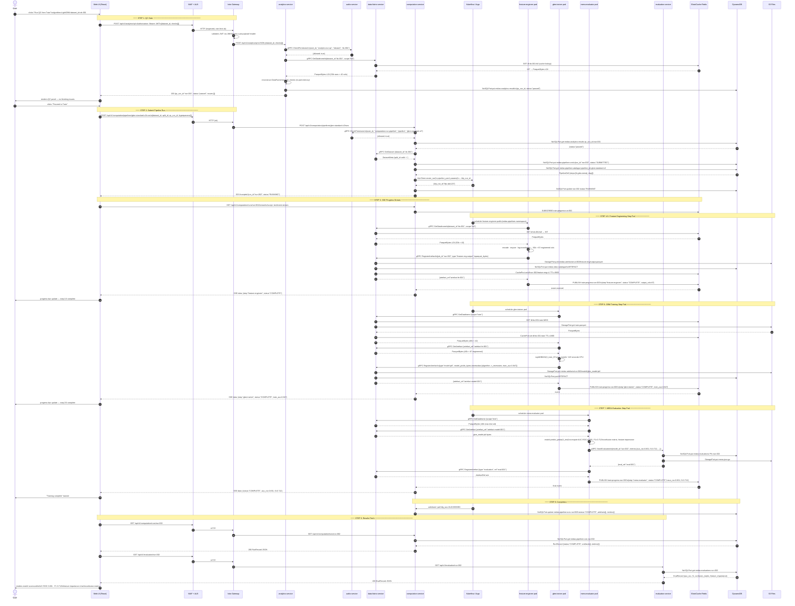
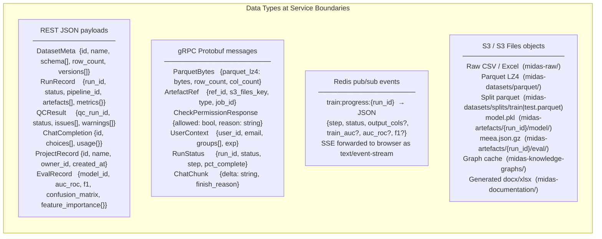

# MIDAS — Future State Architecture Diagram

**Audience:** Software developers  
**Purpose:** Visual reference for microservice boundaries, software components per service, REST/gRPC endpoints, data types, and layer responsibilities  
**Companion doc:** [`future-state-architecture-backend.md`](./future-state-architecture-backend.md)

---

## How to read this diagram

- **Layers** run top-to-bottom: browser → ingress → platform mesh → business services → data fabric → managed data stores
- **Boxes inside each service** show the actual source files a developer writes
- **Arrows** are labelled with the call type (`REST`, `gRPC`), the endpoint/RPC name, and the data type carried
- **Cross-cutting layers** (service mesh, portability abstractions, secrets, observability) are shown as horizontal bands — every service uses them but they are not individual pods

---

## Diagram 1 — Full System Layer View

```mermaid
%%{init: {"theme": "base", "themeVariables": {"fontSize": "13px"}}}%%
graph TB

    %% ─── ACTOR ───────────────────────────────────────────────────────────────
    subgraph ACTOR["👤  Client Layer"]
        direction LR
        BROWSER["Web Browser\n(React SPA)"]
        DEVAPI["Developer / CLI\n(curl / SDK)"]
    end

    %% ─── INGRESS ─────────────────────────────────────────────────────────────
    subgraph INGRESS["🛡️  Ingress Layer  (AWS VPC — no public IPs)"]
        direction LR
        WAF["AWS WAF\nOWASP rules\nrate-limit\nheader inspect"]
        ALB["AWS ALB\nTLS termination\n:443 → :80\nsticky sessions"]
        IGW["Istio Ingress Gateway\nJWT validation\nVirtualService routing\nHTTP/1.1 → cluster"]
    end

    %% ─── SERVICE MESH LAYER ─────────────────────────────────────────────────
    subgraph MESH["🕸️  Service Mesh Layer  (Istio — applies to ALL pods below)"]
        direction LR
        MTLS["mTLS between all pods\nPeerAuthentication: STRICT"]
        RETRY["Retry / Circuit-breaker\nVirtualService + DestinationRule"]
        AUTHPOL["AuthorizationPolicy\nservice-to-service allow-list"]
    end

    %% ─── IDENTITY & AUTHZ TIER ───────────────────────────────────────────────
    subgraph IDTIER["🔑  Identity & Authorisation Services  (namespace: midas-services)"]
        direction LR

        subgraph IDSVC["identity-service  :8080 REST  :50051 gRPC"]
            ID_API["api/\nlogin_routes.py\nsession_routes.py\njwks_routes.py"]
            ID_GRPC["grpc/\nidentity_servicer.py\nVerifyToken · GetUser"]
            ID_SVC["services/\ncognito_service.py\nsession_service.py\nuser_service.py"]
        end

        subgraph AUTHZSVC["authz-service  :8080 REST  :50051 gRPC"]
            AZ_API["api/\nroles_routes.py"]
            AZ_GRPC["grpc/\nauthz_servicer.py\nCheckPermission\nGetUserPermissions"]
            AZ_SVC["services/\nrbac_service.py\ncache_service.py"]
        end
    end

    %% ─── BUSINESS SERVICES TIER ─────────────────────────────────────────────
    subgraph BIZTIER["⚙️  Business Services  (namespace: midas-services)"]
        direction TB

        subgraph PROJSVC["project-service  :8080 :50051"]
            P_API["api/project_routes.py\nGET/POST /projects\nGET/PUT/DELETE /projects/{id}"]
            P_GRPC["grpc/\nGetProject\nListProjectsForUser"]
        end

        subgraph ANASVC["analytics-service  :8080 :50051"]
            A_API["api/analytics_routes.py\nPOST /analytics/qc\nPOST /analytics/dqs\nPOST /analytics/correlations\nPOST /analytics/vif\nPOST /analytics/bivariate"]
            A_GRPC["grpc/analytics_servicer.py\nRunQC · GetResult"]
            A_SVC["services/\nqc_service.py\ndqs_service.py\nvariable_review_service.py"]
        end

        subgraph LLMSVC["llm-service  :8080 :50051"]
            L_API["api/chat_routes.py\nPOST /chat/completions\nPOST /chat/agent\nPOST /chat/execute-code\nGET  /chat/models"]
            L_GRPC["grpc/llm_servicer.py\nChat(stream ChatChunk)\n→ used by doc-service"]
            L_SVC["services/\nllm_routing.py\nllm_registry.py\nagentic_system.py"]
        end

        subgraph DOCSVC["documentation-service  :8080"]
            D_API["api/documentation_routes.py\nPOST /documentation/generate\nGET  /documentation/{id}/status\nGET  /documentation/{id}/download"]
            D_SVC["services/doc_generator.py\n(calls llm-service gRPC)"]
        end

        subgraph EVALSVC["evaluation-service  :8080 :50051"]
            E_API["api/evaluation_routes.py\nPOST /evaluation\nGET  /evaluation/{model_id}\nGET  /evaluation/{model_id}/compare"]
            E_GRPC["grpc/evaluation_servicer.py\nStoreEvaluation\n→ called by pipeline pods"]
            E_SVC["services/\nmeea_service.py\nmodel_evaluation_service.py"]
        end

        subgraph GRGSVC["graphrag-service  :8080 :50051"]
            G_API["api/graphrag_routes.py\nPOST /graphrag/build\nPOST /graphrag/query\nPOST /vector/search\nPOST /vector/index"]
            G_GRPC["grpc/graphrag_servicer.py\nQuery · VectorSearch\n→ called by llm-service"]
            G_SVC["services/\ngraphrag_service.py\nvector_store.py → OpenSearch"]
        end
    end

    %% ─── DATA FABRIC TIER ───────────────────────────────────────────────────
    subgraph DFTIER["🗄️  Data Fabric  (namespace: midas-services)"]

        subgraph DFSVC["data-fabric-service  :8080 REST  :50051 gRPC"]
            DF_API["api/data_routes.py\nPOST /data/upload\nGET  /data/datasets\nGET  /data/datasets/{id}\nPOST /data/datasets/{id}/split\nGET  /data/datasets/{id}/preview\nDELETE /data/datasets/{id}"]
            DF_GRPC["grpc/data_fabric_servicer.py\nGetDataset · GetDataframe\nListDatasets · GetRawFile\nRegisterArtefact · GetArtefact"]
            DF_SVC["services/\nupload_service.py\nsplit_service.py\ncatalogue_service.py"]
        end
    end

    %% ─── COMPUTATION TIER ───────────────────────────────────────────────────
    subgraph COMPTIER["🤖  Computation Platform  (namespaces: midas-services + midas-pipelines)"]
        direction TB

        subgraph COMPSVC["computation-service  :8080 :50051"]
            C_API["api/\npipeline_routes.py  GET/POST /computation/pipelines\ncomponent_routes.py GET/POST /computation/components\nrun_routes.py       POST /computation/pipelines/{id}/runs\n                    GET  /computation/runs/{id}\n                    GET  /computation/runs/{id}/stream  (SSE)"]
            C_GRPC["grpc/computation_servicer.py\nSubmitRun · GetRunStatus"]
            C_SVC["services/\nkubeflow_service.py  ← kfp.Client SDK\npipeline_service.py\nrun_service.py  ← SSE + Redis pub/sub"]
        end

        subgraph KFPNS["Kubeflow Pipelines  (namespace: kubeflow + midas-pipelines)"]
            direction LR
            KFP["Kubeflow API Server\nArgo Workflows Controller"]
            FE_POD["feature-engineer pod\ncomponent.py\n@kfp.component"]
            GBM_POD["gbm-trainer pod\ncomponent.py\n(LightGBM/CatBoost/XGBoost)"]
            RFE_POD["rfe-selector pod\ncomponent.py"]
            AUTO_POD["auto-trainer pod\ncomponent.py  (FLAML/TPOT)"]
            MEEA_POD["meea-evaluator pod\ncomponent.py"]
        end
    end

    %% ─── PORTABILITY ABSTRACTION LAYER ──────────────────────────────────────
    subgraph PORTLAYER["🔌  midas-common  — Portability Abstraction Layer  (pip package, every service imports this)"]
        direction LR
        PORTS["ports/\nStoragePort\nCachePort\nNoSQLPort\nSecretsPort\nQueuePort"]
        ADAPTERS["adapters/aws/\nS3StorageAdapter\nS3FilesAdapter\nDynamoDBAdapter\nRedisAdapter\nSecretsManagerAdapter"]
        CLIENTS["clients/\nAuthzClient  ← gRPC\nDataFabricClient ← gRPC\nComputationClient ← gRPC\nEvaluationClient ← gRPC"]
        PROTO["proto/\n*.proto + generated stubs\nauthz.proto\ndata_fabric.proto\ncomputation.proto\nevaluation.proto\nidentity.proto"]
        MW["middleware/\nJWT extraction\nRequest-ID\nRate-limit"]
    end

    %% ─── MANAGED DATA STORES ─────────────────────────────────────────────────
    subgraph DATASTORES["☁️  Managed Data Stores  (AWS — PrivateLink only)"]
        direction LR
        DDB["DynamoDB\nmidas-users\nmidas-roles\nmidas-permissions\nmidas-user-roles\nmidas-projects\nmidas-data-catalogue\nmidas-analytics-results\nmidas-messages\nmidas-pipeline-catalogue\nmidas-pipeline-runs\nmidas-evaluations\nmidas-graphrag-meta\nmidas-doc-jobs"]
        REDIS["ElastiCache Redis\nsession:{jti}\nauthz:{uid}:{resource}\ndf:{dataset_id}:{scope}\nllm-sel:{session_id}\ntrain:progress:{run_id}\nrate:{ip}"]
        S3RAW["AWS S3\nmidas-raw/\n(CSV/Excel uploads)"]
        S3FILES["AWS S3 Files\nmidas-datasets/parquet/\nmidas-datasets/splits/\nmidas-artefacts/\nmidas-knowledge-graphs/\nmidas-documentation/"]
        SECRETS["Secrets Manager\n/midas/*/\ncognito creds\njwt-signing-key\ndb creds"]
        OPENSEARCH["OpenSearch Serverless\nvector index\n(replaces FAISS)"]
        COGNITO["Cognito User Pool\n(PrivateLink)\nPKCE auth code flow"]
        AIGATEWAY["AI Gateway\nLiteLLM proxy\nOpenAI-compatible\nREST inside VPC"]
    end

    %% ─── FLOW EDGES ──────────────────────────────────────────────────────────

    %% Ingress chain
    BROWSER -->|"HTTPS :443"| WAF
    DEVAPI  -->|"HTTPS :443"| WAF
    WAF     -->|"HTTP :80 (inspected)"| ALB
    ALB     -->|"HTTP to NodePort"| IGW

    %% Ingress → services (REST)
    IGW -->|"REST  /api/v1/identity/*\nJSON"| IDSVC
    IGW -->|"REST  /api/v1/authz/*\nJSON"| AUTHZSVC
    IGW -->|"REST  /api/v1/projects/*\nJSON"| PROJSVC
    IGW -->|"REST  /api/v1/data/*\nmultipart / JSON"| DFSVC
    IGW -->|"REST  /api/v1/analytics/*\nJSON"| ANASVC
    IGW -->|"REST  /api/v1/chat/*\nJSON / SSE"| LLMSVC
    IGW -->|"REST  /api/v1/computation/*\nJSON / SSE"| COMPSVC
    IGW -->|"REST  /api/v1/evaluation/*\nJSON"| EVALSVC
    IGW -->|"REST  /api/v1/graphrag/*\nJSON"| GRGSVC
    IGW -->|"REST  /api/v1/documentation/*\nJSON"| DOCSVC

    %% identity → cognito
    IDSVC -->|"OAuth2 PKCE code exchange\nHTTPS"| COGNITO
    IDSVC -->|"SecretsPort.get()\njwt-signing-key"| SECRETS
    IDSVC -->|"CachePort  session:{jti}\nTTL=3600s"| REDIS
    IDSVC -->|"NoSQLPort  midas-users"| DDB

    %% authz
    AUTHZSVC -->|"CachePort  authz:{uid}:{res}\nTTL=300s"| REDIS
    AUTHZSVC -->|"NoSQLPort  midas-roles\nmidas-permissions\nmidas-user-roles"| DDB

    %% Every business service → authz (gRPC on every protected call)
    ANASVC  -->|"gRPC  CheckPermission\n{user_id,action,resource}"| AUTHZSVC
    DFSVC   -->|"gRPC  CheckPermission"| AUTHZSVC
    COMPSVC -->|"gRPC  CheckPermission"| AUTHZSVC
    PROJSVC -->|"gRPC  CheckPermission"| AUTHZSVC
    LLMSVC  -->|"gRPC  CheckPermission"| AUTHZSVC
    EVALSVC -->|"gRPC  CheckPermission"| AUTHZSVC
    GRGSVC  -->|"gRPC  CheckPermission"| AUTHZSVC
    DOCSVC  -->|"gRPC  CheckPermission"| AUTHZSVC

    %% analytics → data-fabric
    ANASVC  -->|"gRPC  GetDataframe(dataset_id,scope)\n→ ParquetBytes LZ4"| DFSVC
    ANASVC  -->|"NoSQLPort  midas-analytics-results"| DDB

    %% computation → data-fabric + analytics
    COMPSVC -->|"gRPC  GetDataset · ListDatasets"| DFSVC
    COMPSVC -->|"gRPC  RunQC (gate check)"| ANASVC
    COMPSVC -->|"kfp.Client SDK\nsubmit_pipeline_run(yaml, params)"| KFP
    COMPSVC -->|"NoSQLPort  midas-pipeline-runs\nmidas-pipeline-catalogue"| DDB
    COMPSVC -->|"CachePort pub/sub\ntrain:progress:{run_id}"| REDIS

    %% Kubeflow step pods → data-fabric (gRPC)
    FE_POD   -->|"gRPC  GetDataframe → ParquetBytes\nRegisterArtefact → ArtefactRef"| DFSVC
    GBM_POD  -->|"gRPC  GetDataframe (train split)\nGetArtefact (feature-eng output)\nRegisterArtefact (model.pkl)"| DFSVC
    RFE_POD  -->|"gRPC  GetDataframe\nRegisterArtefact"| DFSVC
    AUTO_POD -->|"gRPC  GetDataframe\nRegisterArtefact"| DFSVC
    MEEA_POD -->|"gRPC  GetDataframe (test split)\nGetArtefact (model.pkl)"| DFSVC
    MEEA_POD -->|"gRPC  StoreEvaluation\n{model_id, metrics JSON}"| EVALSVC

    %% Kubeflow step pods → Redis (progress events)
    FE_POD   -->|"CachePort pub  train:progress:{run_id}\n{step, status, output_cols}"| REDIS
    GBM_POD  -->|"CachePort pub  train_auc, elapsed_s"| REDIS
    MEEA_POD -->|"CachePort pub  auc_roc, f1"| REDIS

    %% data-fabric → storage
    DFSVC -->|"StoragePort  raw CSV/Excel\nmidas-raw/{dataset_id}"| S3RAW
    DFSVC -->|"StoragePort (S3 Files)\nparquet / splits / artefacts"| S3FILES
    DFSVC -->|"NoSQLPort  midas-data-catalogue\nPK: DATASET#{id}"| DDB
    DFSVC -->|"CachePort  df:{dataset_id}:{scope}\nLZ4 parquet bytes  TTL=1800s"| REDIS

    %% llm-service
    LLMSVC -->|"REST  OpenAI-compatible\nPOST /v1/chat/completions"| AIGATEWAY
    LLMSVC -->|"NoSQLPort  midas-messages\nconversation history"| DDB
    LLMSVC -->|"CachePort  llm-sel:{session_id}\nmodel override  TTL=session"| REDIS
    LLMSVC -->|"gRPC  Query · VectorSearch\n→ for RAG context"| GRGSVC

    %% documentation-service
    DOCSVC -->|"gRPC  Chat(stream ChatChunk)"| LLMSVC
    DOCSVC -->|"StoragePort  generated docx/xlsx\nmidas-documentation/"| S3FILES
    DOCSVC -->|"NoSQLPort  midas-doc-jobs"| DDB

    %% evaluation-service
    EVALSVC -->|"NoSQLPort  midas-evaluations"| DDB
    EVALSVC -->|"StoragePort  meea.json.gz\nmidas-artefacts/{run_id}/eval/"| S3FILES

    %% graphrag-service
    GRGSVC -->|"StoragePort  graph cache\nmidas-knowledge-graphs/"| S3FILES
    GRGSVC -->|"NoSQLPort  midas-graphrag-meta"| DDB
    GRGSVC -->|"Vector index  k-NN search\ndocuments embeddings"| OPENSEARCH

    %% project-service
    PROJSVC -->|"NoSQLPort  midas-projects"| DDB

    %% Portability layer used by all services
    DFSVC   -. "imports StoragePort\nNoSQLPort  CachePort" .-> PORTLAYER
    ANASVC  -. "imports NoSQLPort\nCachePort" .-> PORTLAYER
    COMPSVC -. "imports NoSQLPort\nCachePort" .-> PORTLAYER
    LLMSVC  -. "imports NoSQLPort\nCachePort" .-> PORTLAYER
    EVALSVC -. "imports NoSQLPort\nStoragePort" .-> PORTLAYER
    GRGSVC  -. "imports StoragePort\nNoSQLPort" .-> PORTLAYER
    IDSVC   -. "imports SecretsPort\nCachePort  NoSQLPort" .-> PORTLAYER
    AUTHZSVC -. "imports NoSQLPort\nCachePort" .-> PORTLAYER
    DOCSVC  -. "imports StoragePort\nNoSQLPort" .-> PORTLAYER

    %% Adapters → actual AWS services
    ADAPTERS -->|"boto3 S3 / S3 Files API"| S3RAW
    ADAPTERS -->|"boto3 S3 Files API"| S3FILES
    ADAPTERS -->|"boto3 DynamoDB"| DDB
    ADAPTERS -->|"redis-py"| REDIS
    ADAPTERS -->|"boto3 secretsmanager"| SECRETS

    %% Style
    classDef layer fill:#f0f4ff,stroke:#6680cc,stroke-width:1.5px,color:#000
    classDef svc   fill:#dff0d8,stroke:#3c763d,stroke-width:2px,color:#000
    classDef store fill:#fcf8e3,stroke:#8a6d3b,stroke-width:1.5px,color:#000
    classDef pod   fill:#d9edf7,stroke:#31708f,stroke-width:1.5px,color:#000
    classDef mesh  fill:#f5f0ff,stroke:#8053cc,stroke-width:1.5px,color:#000
    classDef port  fill:#fff3cd,stroke:#856404,stroke-width:1.5px,color:#000
    classDef actor fill:#fce4ec,stroke:#c62828,stroke-width:1.5px,color:#000

    class IDSVC,AUTHZSVC,PROJSVC,ANASVC,LLMSVC,COMPSVC,DFSVC,EVALSVC,GRGSVC,DOCSVC svc
    class DDB,REDIS,S3RAW,S3FILES,SECRETS,OPENSEARCH,COGNITO,AIGATEWAY store
    class FE_POD,GBM_POD,RFE_POD,AUTO_POD,MEEA_POD pod
    class MESH,MTLS,RETRY,AUTHPOL mesh
    class PORTLAYER,PORTS,ADAPTERS,CLIENTS,PROTO,MW port
    class BROWSER,DEVAPI actor
```

---

## Diagram 2 — Service Components Detail (per-service code map)

This diagram focuses on **what code lives inside each service** — the `api/`, `grpc/`, and `services/` modules. Use this when deciding which Python file to edit or create.

```mermaid
%%{init: {"theme": "base"}}%%
graph LR

    subgraph COMMON["midas-common  (shared pip package)"]
        direction TB
        MC1["ports/\nStoragePort · CachePort\nNoSQLPort · SecretsPort\nQueuePort"]
        MC2["adapters/aws/\nS3StorageAdapter\nS3FilesAdapter\nDynamoDBAdapter\nRedisAdapter\nSecretsManagerAdapter"]
        MC3["clients/\nAuthzClient\nDataFabricClient\nComputationClient\nEvaluationClient"]
        MC4["proto/  *.proto\n+ generated _pb2 stubs\nauthz · data_fabric\ncomputation · evaluation\nidentity"]
        MC5["middleware/\njwt_extractor.py\nrequest_id.py\nrate_limit.py"]
    end

    subgraph IS["identity-service"]
        IS1["api/\nlogin_routes.py\n  GET  /identity/login-url\n  GET  /identity/callback\nsession_routes.py\n  POST /identity/refresh\n  POST /identity/logout\n  GET  /identity/me\njwks_routes.py\n  GET  /identity/jwks"]
        IS2["grpc/identity_servicer.py\n  VerifyToken(token)\n    → UserContext\n  GetUser(user_id)\n    → UserRecord"]
        IS3["services/\ncognito_service.py\nsession_service.py\nuser_service.py"]
    end

    subgraph AZ["authz-service"]
        AZ1["api/roles_routes.py\n  GET  /authz/roles\n  POST /authz/roles\n  PUT  /authz/users/{id}/roles\n  GET  /authz/users/{id}/permissions"]
        AZ2["grpc/authz_servicer.py\n  CheckPermission(\n    user_id, action,\n    resource_type, resource_id)\n    → {allowed, reason}\n  GetUserPermissions(user_id)\n    → PermissionList"]
        AZ3["services/\nrbac_service.py\ncache_service.py"]
    end

    subgraph PS["project-service"]
        PS1["api/project_routes.py\n  GET/POST /projects\n  GET/PUT/DELETE /projects/{id}"]
        PS2["grpc/project_servicer.py\n  GetProject(project_id)\n    → ProjectRecord\n  ListProjectsForUser(user_id)\n    → ProjectList"]
        PS3["services/project_service.py"]
    end

    subgraph DF["data-fabric-service"]
        DF1["api/data_routes.py\n  POST /data/upload\n    body: multipart/form-data\n    → {dataset_id}\n  GET  /data/datasets\n    → DatasetList JSON\n  GET  /data/datasets/{id}\n    → DatasetMeta JSON\n  POST /data/datasets/{id}/split\n    body: {train_pct, stratify}\n    → {split_id}\n  GET  /data/datasets/{id}/preview\n    → {rows[], schema}\n  DELETE /data/datasets/{id}"]
        DF2["grpc/data_fabric_servicer.py\n  GetDataset(dataset_id)\n    → DatasetMeta\n  GetDataframe(dataset_id, scope)\n    → ParquetBytes  (LZ4)\n  ListDatasets(project_id)\n    → DatasetList\n  GetRawFile(dataset_id, filename)\n    → FileBytes\n  RegisterArtefact(job_id, key, type)\n    → ArtefactRef\n  GetArtefact(artefact_ref)\n    → FileBytes"]
        DF3["services/\nupload_service.py\nsplit_service.py\ncatalogue_service.py"]
    end

    subgraph AN["analytics-service"]
        AN1["api/analytics_routes.py\n  POST /analytics/qc\n    body: {dataset_id, checks[]}\n    → {qc_run_id, status, issues[]}\n  POST /analytics/dqs\n    → {score, profile{}}\n  POST /analytics/correlations\n    → {matrix[][]}\n  POST /analytics/vif\n    → {vif_scores{}}\n  POST /analytics/bivariate\n    → {charts[]}"]
        AN2["grpc/analytics_servicer.py\n  RunQC(dataset_id, config)\n    → job_id\n  GetResult(job_id)\n    → AnalyticsResult"]
        AN3["services/\nqc_service.py\ndqs_service.py\nvariable_review_service.py\ndata_quality_detector.py"]
    end

    subgraph CS["computation-service"]
        CS1["api/\npipeline_routes.py\n  GET  /computation/pipelines\n  POST /computation/pipelines\n  GET  /computation/pipelines/{id}\n  PUT  /computation/pipelines/{id}\n  DELETE /computation/pipelines/{id}\ncomponent_routes.py\n  GET  /computation/components\n  POST /computation/components\n  GET  /computation/components/{id}\n  DELETE /computation/components/{id}\nrun_routes.py\n  POST /computation/pipelines/{id}/runs\n    body: {dataset_id, hyperparams{}}\n    → 202 {run_id, status}\n  GET  /computation/runs/{id}\n    → {status, artefacts[], metrics{}}\n  GET  /computation/runs/{id}/stream\n    Accept: text/event-stream\n    → SSE {step, status, metrics}"]
        CS2["grpc/computation_servicer.py\n  SubmitRun(pipeline_id, params)\n    → run_id\n  GetRunStatus(run_id)\n    → RunStatus"]
        CS3["services/\nkubeflow_service.py\n  kfp.Client.create_run()\npipeline_service.py\nrun_service.py\n  Redis pub/sub → SSE"]
    end

    subgraph KFP["pipeline-components  (Kubeflow step pods)"]
        KFP1["feature_engineer/component.py\n  @kfp.component\n  in:  dataset_id  scope=full\n  gRPC: GetDataframe → df\n  runs: encode · impute · transform\n  gRPC: RegisterArtefact(feature-eng)"]
        KFP2["gbm_trainer/component.py\n  @kfp.component\n  in:  dataset_id  artefact_ref(fe)\n  gRPC: GetDataframe(scope=train)\n  gRPC: GetArtefact(fe-output)\n  runs: LightGBM / CatBoost / XGBoost\n  gRPC: RegisterArtefact(model.pkl)"]
        KFP3["rfe_selector/component.py\n  Recursive Feature Elimination\n  gRPC: GetDataframe · RegisterArtefact"]
        KFP4["auto_trainer/component.py\n  FLAML / TPOT auto-ML\n  gRPC: GetDataframe · RegisterArtefact"]
        KFP5["meea_evaluator/component.py\n  in:  artefact_ref(model)\n  gRPC: GetDataframe(scope=test)\n  gRPC: GetArtefact(model.pkl)\n  runs: AUC-ROC · F1 · confusion matrix\n       feature importance\n  gRPC: StoreEvaluation → eval-service\n  gRPC: RegisterArtefact(meea.json.gz)"]
    end

    subgraph LS["llm-service"]
        LS1["api/chat_routes.py\n  POST /chat/completions\n    body: {messages[], model?}\n    → ChatCompletion JSON / SSE\n  POST /chat/agent\n    body: {session_id, task}\n    → {response, tool_calls[]}\n  POST /chat/execute-code\n    body: {code, context}\n    → {output, error?}\n  GET  /chat/models\n    → ModelList[]"]
        LS2["grpc/llm_servicer.py\n  Chat(session_id, messages)\n    → stream ChatChunk\n  (consumed by doc-service)"]
        LS3["services/\nllm_routing.py\nllm_registry.py\nagentic_system.py"]
    end

    subgraph DS["documentation-service"]
        DS1["api/documentation_routes.py\n  POST /documentation/generate\n    body: {dataset_id, doc_type}\n    → 202 {job_id}\n  GET  /documentation/{id}/status\n    → {status, progress_pct}\n  GET  /documentation/{id}/download\n    → redirect to S3 presigned URL"]
        DS2["services/doc_generator.py\n  gRPC: Chat() → llm-service\n  StoragePort: put() → S3 Files"]
    end

    subgraph ES["evaluation-service"]
        ES1["api/evaluation_routes.py\n  POST /evaluation\n  GET  /evaluation/{model_id}\n  GET  /evaluation/{model_id}/compare"]
        ES2["grpc/evaluation_servicer.py\n  StoreEvaluation(\n    model_id, eval_type, metrics)\n    → EvalRef"]
        ES3["services/\nmeea_service.py\nmodel_evaluation_service.py"]
    end

    subgraph GS["graphrag-service"]
        GS1["api/graphrag_routes.py\n  POST /graphrag/build\n  POST /graphrag/query\n  POST /vector/search\n  POST /vector/index\n  GET  /graphrag/health"]
        GS2["grpc/graphrag_servicer.py\n  Query(dataset_id, query_text)\n    → KGQueryResult\n  VectorSearch(embedding, top_k)\n    → SearchResults\n  (consumed by llm-service for RAG)"]
        GS3["services/\ngraphrag_service.py\nvector_store.py → OpenSearch"]
    end

    %% Connections from common to services
    COMMON -->|"imported by all services"| IS
    COMMON -->|"imported by all services"| AZ
    COMMON -->|"imported by all services"| DF
    COMMON -->|"imported by all services"| AN
    COMMON -->|"imported by all services"| CS
    COMMON -->|"imported by all services"| LS
    COMMON -->|"imported by all services"| KFP

    %% Key inter-service gRPC calls labelled with data type
    AN  -->|"gRPC GetDataframe\n→ ParquetBytes"| DF
    CS  -->|"gRPC GetDataset\n→ DatasetMeta"| DF
    CS  -->|"gRPC RunQC → job_id\n(QC gate before training)"| AN
    KFP -->|"gRPC GetDataframe · RegisterArtefact\n→ ParquetBytes / ArtefactRef"| DF
    KFP -->|"gRPC StoreEvaluation\n→ EvalRef"| ES
    LS  -->|"gRPC VectorSearch\n→ SearchResults  (RAG)"| GS
    DS  -->|"gRPC Chat → stream ChatChunk"| LS

    classDef svc  fill:#dff0d8,stroke:#3c763d,stroke-width:2px,color:#000
    classDef pod  fill:#d9edf7,stroke:#31708f,stroke-width:1.5px,color:#000
    classDef comm fill:#fff3cd,stroke:#856404,stroke-width:2px,color:#000

    class IS,AZ,PS,DF,AN,CS,LS,DS,ES,GS svc
    class KFP pod
    class COMMON comm
```

---

## Diagram 3 — GBM Training Transaction Flow (Sequence)

End-to-end trace of a single GBM training run. Every actor, call, and data handoff in order.

---

## Diagram 4 — Data Handoff Types Reference

Quick-reference for every data type crossing a service boundary.

