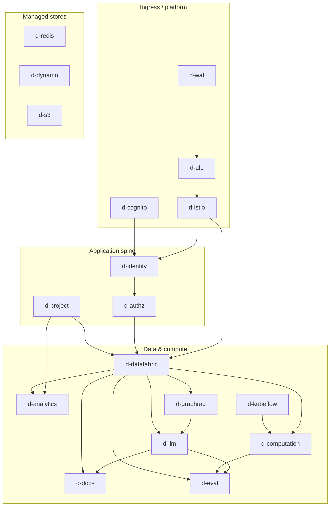

# MIDAS — Future-State Migration Phases (Diagram + Requirements)

**Audience:** Engineering leads, architects, delivery planning  
**Status:** Planning baseline — revise per sprint outcomes  
**Date:** 2026-04-29  
**Scope:** Path from **current monolith** (`backend/` FastAPI) to the **simplified future-state** captured in the Developer Architecture Diagram and `MIDAS_REQUIREMENTS` (`docs/html_diagram/future/requirements/requirements-data.js`).

---

## 1. What this plan targets

| Source | Role |
|--------|------|
| **Developer diagram** (`docs/html_diagram/future/developer/index.html`) | Component names, bands (Ingress · Istio, Data Fabric, Platform), and **no AI Agent Fabric / Bedrock AgentCore** (naming may differ in older snapshots) |
| **Requirements register** | REQ-FS-001 … REQ-FS-043 — REST/mTLS, Cognito PKCE, data-fabric ownership of S3, Kubeflow for pipelines, etc. |
| **ADRs** (`decisions-data.js`) | ADR-FS-001 REST (not gRPC for this track), ADR-FS-002 no agent platform, ADR-FS-003 FastAPI, ADR-FS-004 diagram/requirements alignment |
| **Monolith map** | `docs/future-state-architecture-backend.md` §4.1 — which `backend/app/` modules move to which service |

> **Note:** The long-form backend architecture document still contains older themes (e.g. AI Agent Fabric, gRPC). **This phased plan follows the simplified future state**: REST for mesh and edge, FastAPI services, domain-owned capabilities per REQ-FS-006 / ADR-FS-002. Where the PDF-style doc disagrees, **requirements + developer diagram win**.

---

## 2. Phase model (what is in / out of scope)

| Phase | Meaning |
|-------|---------|
| **Phase 0** | Historical / pre-consolidation — **out of scope** for this document |
| **Phase 1** | **Current production baseline**: single FastAPI monolith (`backend/main.py`, large `routes.py`), mixed stores, in-memory singletons, existing ingress — **out of scope** for detailed execution here; assumed starting point |
| **Phase 2 – 6** | **In scope**: sequenced migration work toward the future-state diagram, respecting dependencies and a **mid-skilled team** (pairing, spikes, limited parallel epic streams, explicit hardening gates) |

Phases **2–6** are **five delivery phases** (not eleven). No separate “phase 7” unless you later split a phase for release train reasons.

---

## 3. Team topology — DevOps vs developers

This roadmap assumes **several application developers** and **two DevOps engineers**. Diagram boxes already tag a **primary discipline** (`MIDAS_NODE_OWNER` in `requirements-data.js`): **DevOps** for `d-waf`, `d-alb`, `d-istio`, `d-cognito`, `d-redis`, `d-s3`, `d-dynamo`, `d-kubeflow`; **Developer** for microservices and the SPA contract (`d-browser`).

| Role | Typical ownership |
|------|-------------------|
| **DevOps (×2)** | AWS ingress (WAF/ALB), Istio gateway policies and mesh TLS, Cognito User Pool / app clients / IdP wiring, VPC endpoints & PrivateLink touchpoints, Secrets Manager & IAM for workloads, ElastiCache / DynamoDB / S3 platform patterns, EKS namespaces & quotas, Kubeflow/Argo/ECR, observability and pipeline run visibility (REQ-FS-040-style), Jenkins/terraform deliverables per MIDAS pipeline rules |
| **Developers (×N)** | FastAPI services, extracting code from `backend/app/`, `midas-common` HTTP contracts, domain logic, tests, strangler routing behaviour, calling AWS **only through** approved adapters—paired with DevOps for IAM and resource shape |

**How to avoid bottlenecks with two DevOps engineers**

1. **Tag every story** as DevOps-heavy vs dev-heavy; limit concurrent DevOps epics to **one primary + one follow** per sprint where possible.  
2. **Developer streams** can run in parallel (e.g. service A + service B) when they do not share the same DevOps change window.  
3. **Long-lead DevOps** (Kubeflow) starts in **Phase 5** as a dedicated track so Phase 6 is not a single giant ops cliff.  
4. **Joint ceremonies**: short sync when JWT issuer URLs, Cognito callbacks, or mesh VirtualServices change—both sides must agree on the contract.

Section **7** breaks each phase into **DevOps work** and **Developer work** explicitly.

---

## 4. Component inventory (diagram nodes)

Logical building blocks from the diagram and registers (`MIDAS_NODE_LABELS` / owners):

| Node ID | Component | Diagram band | Owner |
|---------|-----------|--------------|--------|
| `d-browser` | Web browser (React SPA) | Clients | Developer |
| `d-waf` | AWS WAF | Ingress · Istio | DevOps |
| `d-alb` | AWS ALB | Ingress · Istio | DevOps |
| `d-istio` | Istio Ingress Gateway | Ingress · Istio | DevOps |
| `d-identity` | identity-service | Identity & Authz | Developer |
| `d-authz` | authz-service | Identity & Authz | Developer |
| `d-project` | project-service | Identity & Authz | Developer |
| `d-datafabric` | data-fabric-service | Data / Compute fabrics | Developer |
| `d-computation` | computation-service | Data / Compute fabrics | Developer |
| `d-analytics` | analytics-service | Business | Developer |
| `d-llm` | llm-service | Business | Developer |
| `d-docs` | documentation-service | Business | Developer |
| `d-eval` | evaluation-service | Business | Developer |
| `d-graphrag` | graphrag-service | Business | Developer |
| `d-cognito` | AWS Cognito | Platform | DevOps |
| `d-dynamo` | DynamoDB | Platform | DevOps |
| `d-redis` | ElastiCache Redis | Data Fabric (AWS) | DevOps |
| `d-s3` | S3 + S3 Files | Data Fabric (AWS) | DevOps |
| `d-kubeflow` | Kubeflow / Argo | Platform | DevOps |

---

## 5. Dependency analysis ( why order matters )

The following is the **minimum partial order** for extracting services from the monolith without breaking critical paths. Arrows mean **“should be substantially in place before”** (not necessarily 100% finished).

**Narrative:**

1. **Ingress (`d-waf`, `d-alb`, `d-istio`)** — Already largely present in MIDAS-style deployments; Phase 2 focuses on **JWT / routing contracts** aligned with identity (REQ-FS-008, 009, 041, 042), not greenfield networking.

2. **`d-cognito` → `d-identity`** — Cognito PKCE and session issuance are prerequisites for a clean split of login/session code from the monolith (REQ-FS-010).

3. **`d-identity` → `d-authz`** — Tokens and user records must be stable before **authz-service** can enforce RBAC consistently (REQ-FS-011, 012).

4. **`d-project` → `d-datafabric`** — Project scoping for datasets and artefacts is a gate for data-fabric APIs (REQ-FS-013, 014).

5. **`d-datafabric` → `d-analytics`, `d-llm`, `d-docs`, `d-graphrag`, `d-eval`** — Domain services must consume datasets and storage **through** data-fabric, not direct S3 (REQ-FS-014, 015).

6. **`d-kubeflow` → `d-computation`** — Platform must exist before the computation façade is real (REQ-FS-017). Long-lead: **stand up / harden Kubeflow early** as a DevOps track that overlaps Phases 3–4.

7. **`d-computation` + `d-datafabric` → `d-eval` (full)** — Evaluation ingesting pipeline outputs needs pipelines **and** stable data handoff (REQ-FS-027). Partial evaluation storage can land earlier (REQ-FS-026).

8. **`d-llm` ↔ `d-graphrag`** — Chat/RAG without a separate agent service (REQ-FS-022); GraphRAG can follow initial llm extraction but OpenSearch migration is a large refactor (**effort L** on diagram).

**Stores (`d-redis`, `d-dynamo`, `d-s3`)** — Continuously refined; **no single phase “owns” them**. Conventions (REQ-FS-032, 033) tighten as services split.

---

## 6. Mid-skilled team — planning rules

These assumptions shaped phase sizing:

| Rule | Rationale |
|------|-----------|
| **One primary vertical per phase** | Reduces integration risk; avoids five half-finished services |
| **DevOps pairing for `d-istio`, `d-cognito`, `d-kubeflow`** | Mesh and pipeline platforms are common skill gaps — explicit pairing or vendor/runbook support |
| **Strangler routing** | Keep monolith serving unmigrated routes until a slice is tested behind Istio |
| **Time-boxed spikes** (e.g. Cognito PKCE, OpenSearch, KFP SDK) | Prevents endless discovery inside a “delivery” sprint |
| **Phase exit criteria** | Regression suite + documented rollback for routed paths |

---

## 7. Phased roadmap (Phase 2 – 6)

Each phase lists **DevOps** work first (capacity: **2 people** — keep the list sequenced and negotiable), then **Developer** work (**several people** — can split into parallel streams where noted).

### Phase 2 — Ingress alignment, Cognito, identity extraction

**Theme:** Solid **authentication spine** and edge contracts so later services trust tokens and session semantics.

| Focus | Diagram / REQ highlights |
|-------|----------------------------|
| `d-istio` | REQ-FS-009, 041 — RequestAuthentication / routing for `/api/v1/*`; mesh REST (REQ-FS-003, 004) |
| `d-cognito` | REQ-FS-010 — PKCE; tokens not forwarded downstream |
| `d-identity` | REFACTOR — extract `auth_routes`, `cognito_routes`, session/user paths per §4.1 monolith map |
| `d-waf` / `d-alb` | REQ-FS-007, 008, 042 — behaviour unchanged in principle; validate with identity rollout |
| Shared code | Secrets via Secrets Manager (REQ-FS-038); begin Redis session patterns (REQ-FS-033) |

#### DevOps (2)

- **WAF / ALB / Istio:** Confirm listener → target group → Istio ingress path for pilot routes; tune WAF rules if login/callback paths change (REQ-FS-007, 042).  
- **Istio:** `RequestAuthentication` / JWT issuer alignment with Cognito JWKS; `VirtualService` for `/api/v1/*` pilot routes; mesh TLS assumptions unchanged (REQ-FS-009, 041). Coordinate issuer URLs and audience claims with developers.  
- **Cognito (`d-cognito`):** User Pool, hosted UI or app client settings, PKCE, callback/logout URLs for dev/UAT; PrivateLink / VPC endpoint posture per MIDAS networking (REQ-FS-001, 010).  
- **Secrets & IAM:** Secrets Manager entries for Cognito client secrets and identity-service; IAM roles for service accounts reading secrets (REQ-FS-038).  
- **Redis (`d-redis`):** Namespace/key conventions for sessions (REQ-FS-033) — sizing/review only; app owns call patterns.

#### Developers (several — suggest 2 streams)

- **Stream A — identity-service (`d-identity`):** Extract monolith auth/Cognito/session/user modules; implement PKCE callback handling and session APIs; wire Redis + Dynamo user/session data per design (REQ-FS-010, 012).  
- **Stream B — SPA / contract:** Align React app with new callback URLs and bearer behaviour (REQ-FS-034); support SSE endpoints unchanged where applicable.  
- **Shared:** Strangler route list for which paths hit monolith vs new service; integration tests with Cognito dev pool.

**Exit:** External login/session flow works through Cognito + identity boundaries; Istio validates JWTs for pilot routes; team comfortable with strangler routing.

**Risk:** Cognito + Istio misconfiguration — **mitigate** with dedicated test environment and checklist.

---

### Phase 3 — Authorization + project anchor

**Theme:** **Central RBAC** and **project scoping** before enforcing storage rules everywhere.

| Focus | Diagram / REQ highlights |
|-------|----------------------------|
| `d-authz` | NEW — REQ-FS-011, 012 — CheckPermission; Dynamo RBAC + Redis cache |
| `d-project` | REFACTOR — REQ-FS-013 — project anchor for downstream resources |
| Mesh consumers | Internal REST calls from monolith or first extracted clients to authz (ADR-FS-001 REST) |

#### DevOps (2)

- **DynamoDB (`d-dynamo`):** Tables/indexes for RBAC and projects (REQ-FS-032); backup and access patterns; least-privilege IAM per eventual service account.  
- **Redis (`d-redis`):** Authz permission cache — cluster/replication review if traffic spikes; key prefix convention sign-off (REQ-FS-033).  
- **Mesh:** Service entries / routing for `authz-service` and `project-service` hostnames; optional namespace isolation for new workloads.  
- **IAM:** Roles for authz/project pods to Dynamo + Redis only as required.

#### Developers (several — suggest 2 streams)

- **Stream A — authz-service (`d-authz`):** NEW — CheckPermission, GetUserPermissions, admin role APIs; Dynamo + Redis integration (REQ-FS-011).  
- **Stream B — project-service (`d-project`):** REFACTOR from monolith `project_routes` / project DB access; enforce project scoping hooks (REQ-FS-013).  
- **Shared:** Client libraries or internal REST calls from monolith strangler to authz; contract tests for RBAC matrix.

**Exit:** Mutating paths can call authz consistently; projects are authoritative for scoped operations in pilot domains.

**Risk:** RBAC model drift vs monolith assumptions — **mitigate** with parallel permission audit spreadsheet.

---

### Phase 4 — Data fabric + analytics on fabric

**Theme:** **Single owner of S3 / S3 Files** (REQ-FS-014) — largest application refactor; unlocks QC/analytics on shared datasets.

| Focus | Diagram / REQ highlights |
|-------|----------------------------|
| `d-datafabric` | NEW — REQ-FS-014, 015, 016 — REST `/api/v1/data/*`; dataframe cache with Redis |
| `d-analytics` | REFACTOR — REQ-FS-019, 020 — QC/DQS uses data-fabric for datasets |
| `d-s3` / `d-dynamo` | Enforced via adapters only through data-fabric for domain data |

#### DevOps (2)

- **S3 (`d-s3`):** Bucket policies and prefixes so **only** data-fabric service accounts have direct object-level patterns for domain data; block or alert on other principals (REQ-FS-014).  
- **DynamoDB:** Data-catalogue / metadata tables for fabric (REQ-FS-032).  
- **Redis:** Dataframe cache capacity and eviction policy review for hot scopes (REQ-FS-016).  
- **IAM / networking:** Ensure data-fabric workloads reach S3/Dynamo/Redis over approved private paths (REQ-FS-001).

#### Developers (several — suggest 2–3 streams)

- **Stream A — data-fabric-service (`d-datafabric`):** NEW — uploads, catalogue, lineage, internal REST for dataframe/artefacts; StoragePort implementation (REQ-FS-014, 015, 037).  
- **Stream B — analytics-service (`d-analytics`):** REFACTOR — route QC/DQS to retrieve datasets via data-fabric client (REQ-FS-019, 020).  
- **Stream C (optional):** Monolith strangler: redirect dataset/upload pilot routes to fabric.

**Exit:** Pilot domains: uploads and analytical reads go through data-fabric; monolith no longer touches S3 for those paths.

**Risk:** Data migration / double-write windows — **mitigate** with feature flags and read-only validation period.

---

### Phase 5 — LLM, GraphRAG, documentation, evaluation (application plane)

**Theme:** User-visible AI and doc flows on top of fabric; **OpenSearch** and **AI Gateway** paths without a separate agent service.

| Focus | Diagram / REQ highlights |
|-------|----------------------------|
| `d-llm` | REFACTOR — REQ-FS-021–023, 035 — AI Gateway PrivateLink; chat in Dynamo/Redis |
| `d-graphrag` | REFACTOR — REQ-FS-028–030 — OpenSearch Serverless; retire prod FAISS-on-disk |
| `d-docs` | REFACTOR — REQ-FS-024, 025 — async jobs; calls llm-service |
| `d-eval` | REFACTOR — REQ-FS-026 — persistence; **full** pipeline ingestion may wait Phase 6 (REQ-FS-027) |

#### DevOps (2)

- **PrivateLink / VPC:** AI Gateway (or equivalent) endpoint reachability from mesh for `llm-service` (REQ-FS-021); security groups and endpoint policies.  
- **OpenSearch Serverless:** Network policy, encryption, IAM data-plane access for `graphrag-service` (REQ-FS-030); optional VPC endpoint posture.  
- **Observability:** Dashboards/alerts for LLM and GraphRAG dependency failures (latency, 5xx).  
- **Kubeflow prep (parallel, long-lead):** Namespace quotas, base Argo/KFP install smoke test so Phase 6 is not cold start — **both DevOps** may split: one on OpenSearch/PrivateLink, one on Kubeflow bootstrap.

#### Developers (several — suggest 3–4 streams)

- **Stream A — llm-service (`d-llm`):** Chat, routing, Dynamo messages, Redis selection; AI Gateway client (REQ-FS-021–023, 035).  
- **Stream B — graphrag-service (`d-graphrag`):** OpenSearch integration; retire FAISS in prod paths (REQ-FS-028–030).  
- **Stream C — documentation-service (`d-docs`):** Async jobs, llm calls, S3/Dynamo job records (REQ-FS-024, 025).  
- **Stream D — evaluation-service (`d-eval`):** MEEA persistence (REQ-FS-026); stub or partial pipeline hooks pending Phase 6 (REQ-FS-027).

**Exit:** Chat, RAG, doc generation, and evaluation storage meet REQ for REST + persistence; GraphRAG API surface stable.

**Risk:** OpenSearch + embedding pipelines — **mitigate** with Phase 5a spike and limited corpus pilot.

**Parallel note:** **Kubeflow land prep** continues as a **DevOps sub-track** so Phase 6 is not blocked.

---

### Phase 6 — Computation + Kubeflow + pipeline-led evaluation

**Theme:** Replace **BackgroundJobManager** / thread training with **Kubeflow/Argo**; wire **evaluation** to pipeline outputs.

| Focus | Diagram / REQ highlights |
|-------|----------------------------|
| `d-kubeflow` | NEW — REQ-FS-017, 018, 031, 040 — pipelines, step pods, ECR images, observability |
| `d-computation` | NEW — facade over KFP; REQ-FS-039 async orchestration |
| `d-eval` | Complete REQ-FS-027 — consume pipeline outputs via approved paths + data-fabric |
| Cutover | Retire monolith training routes; final strangler decommission plan |

#### DevOps (2) — **highest load phase for ops**

- **Kubeflow / Argo (`d-kubeflow`):** Production-ready namespace, pipeline runner SA, **ECR** repos for step images (REQ-FS-031), resource quotas, logging/metrics for runs (REQ-FS-040).  
- **IRSA / IAM:** Pipeline pods reading S3 artefacts and calling internal services per least privilege.  
- **Mesh:** Routes from `computation-service` to KFP API if exposed inside cluster.  
- **Cutover support:** Blue/green or canary for training routes; rollback playbook.

#### Developers (several — suggest 2–3 streams)

- **Stream A — computation-service (`d-computation`):** SubmitRun, status, SSE; Kubeflow SDK integration (REQ-FS-017, 018, 039).  
- **Stream B — pipeline components:** Dockerfiles in ECR; training/QC steps as pods (REQ-FS-018).  
- **Stream C — evaluation-service:** Complete pipeline output ingestion with data-fabric (REQ-FS-027).  
- **Shared:** Decommission monolith training/auto-train threads; final strangler table updates.

**Exit:** Training and heavy ML run as pods with observable runs; evaluation tied to pipeline artefacts per requirements.

**Risk:** Kubeflow operational complexity — **mitigate** with staged namespace, minimal pipeline catalogue first, then expand.

---

### DevOps load by phase (planning aid)

| Phase | DevOps intensity | Notes |
|-------|------------------|--------|
| 2 | **High** | Cognito + Istio JWT alignment — few moving parts but high blast radius |
| 3 | **Medium** | Mostly Dynamo/IAM/mesh plumbing for new services |
| 4 | **Medium–high** | S3 policy tightening and fabric IAM — careful staged rollout |
| 5 | **High** | OpenSearch + PrivateLink + optional Kubeflow prep in parallel |
| 6 | **Very high** | Kubeflow/ECR/IRSA — consider **reducing parallel developer streams** this phase so DevOps can pair with dev on integration |

---

## 8. Summary matrix — phase × components

| Component | Phase (primary) |
|-----------|------------------|
| `d-waf`, `d-alb`, `d-istio` | **2** (hardening / JWT alignment) |
| `d-cognito`, `d-identity` | **2** |
| `d-authz`, `d-project` | **3** |
| `d-datafabric`, `d-analytics` | **4** |
| `d-llm`, `d-graphrag`, `d-docs`, `d-eval` (core) | **5** |
| `d-kubeflow`, `d-computation`, `d-eval` (pipeline integration) | **6** |
| `d-redis`, `d-dynamo`, `d-s3` | **Continuous** (conventions tighten each phase) |
| `d-browser` | **Continuous** (SPA assumes REST + SSE per REQ-FS-034–036) |

---

## 9. Requirement clusters by phase (high level)

| Phase | Representative REQ-FS IDs |
|-------|----------------------------|
| 2 | 003, 004, 008, 009, 010, 012, 034, 038, 041, 042 |
| 3 | 011, 013, 032 (partial), 033 (partial) |
| 4 | 014, 015, 016, 019, 020, 037 (ports), 043 (optional) |
| 5 | 006, 021, 022, 024–026, 028–030, 035 |
| 6 | 017, 018, 027, 031, 039, 040 |

Cross-cutting (all phases): **001, 002** (VPC / region), **032** (Dynamo ownership per service), **038** (secrets).

---

## 10. Open planning actions

1. Map each Phase **exit** to a **release milestone** in Jenkins / env promotion policy (pipeline-first per MIDAS rules).
2. Maintain a **living strangler route table** (`/api/v1/...` → monolith vs service).
3. Revisit **effort S/M/L** from `MIDAS_NODE_COMPLEXITY` when estimating sprints — large items (`d-datafabric`, `d-graphrag`, `d-computation`) already flagged as **L** where applicable.
4. If timeline pressure rises: **do not** skip Phase 3 — RBAC + projects before fabric-wide enforcement avoids rework.
5. In sprint planning, tag backlog items **DevOps** vs **Developer** and reserve **both DevOps** capacity explicitly for Phases **5–6** weeks (OpenSearch/Kubeflow overlap).

---

## 11. Related documents

- `docs/html_diagram/future/requirements/requirements-data.js` — full REQ register  
- `docs/html_diagram/future/developer/index.html` — Developer Architecture Diagram  
- `docs/html_diagram/future/decisions/decisions-data.js` — ADR-FS-*  
- `docs/future-state-architecture-backend.md` — monolith file → service map (§4.1); cross-check against simplified decisions above  

---

*This document is planning guidance only; it does not replace ADRs, security review, or infrastructure change management.*
