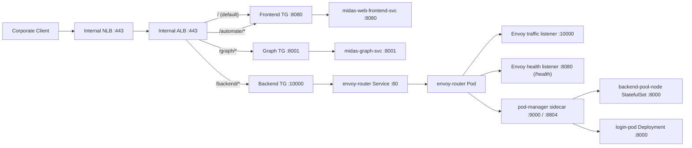

<!--
  EXLdecision — infrastructure and platform overview
  Follow .cursor/rules/doc.mdc when editing this file.
-->

# EXLdecision — infrastructure and platform overview

This document is the **single entry point for AWS platform context**: accounts, networking, deployment mechanics, and how the solution maps to the **AWS Well-Architected Framework**. Detailed runbooks, work orders, and naming standards live in linked files so this page stays navigable.

| Field | Value |
|---|---|
| **Document** | Infrastructure and platform overview |
| **Version** | `1.0.0` |
| **Status** | Active |
| **Date** | 2026-04-18 |
| **Author** | BU Analytics / Gen-AI EXLdecision team |
| **Contact** | `keith.tobin@exlservice.com` |
| **Repository** | `bu-analytics-gen-ai-midas` |
| **Business unit** | BU Analytics · EXL Service |

---

## Table of contents

1. [Purpose and scope](#1-purpose-and-scope)
2. [Canonical references](#2-canonical-references)
3. [Environment inventory](#3-environment-inventory)
4. [Logical architecture (solution layers)](#4-logical-architecture-solution-layers)
5. [Network architecture](#5-network-architecture)
6. [CI/CD and change management](#6-cicd-and-change-management)
7. [AWS Well-Architected Framework](#7-aws-well-architected-framework)
8. [IaC, images, and runtime conventions](#8-iac-images-and-runtime-conventions)
9. [Related documentation](#9-related-documentation)

---

## 1. Purpose and scope

**In scope here:** region and account identifiers, VPC and egress pattern, high-level component layers, Jenkins pipeline roles, private-network posture, and pointers to operational artefacts (VPC endpoints, connectivity work orders, naming standards).

**Out of scope:** application feature design, API contracts, and step-by-step incident response (add dedicated runbooks when available).

**MISSION — gap:** Formal service-level objectives (availability/latency targets) for production are not yet published in `docs/`. When they exist, add a subsection under [§7.3 Reliability](#73-reliability) and link from the master [README](README.md).

---

## 2. Canonical references

| Resource | Location |
|---|---|
| **Architecture diagram (Miro)** | [EXLdecision Architecture — Miro board](https://miro.com/app/board/uXjVGnrWh1o=/) |
| **Design principles (agent rules)** | [`.cursor/rules/architecture.mdc`](../.cursor/rules/architecture.mdc) |
| **Authoritative identifiers (VPC, region, TGW, jumpbox)** | [`.cursor/rules/solution_const.mdc`](../.cursor/rules/solution_const.mdc) |
| **Deploy mechanics, Terraform roots, IAM** | [`deploy/README.md`](../deploy/README.md) |

Treat the Miro board and `architecture.mdc` as the contract for boundaries between presentation, orchestration, AI/ML, data, and platform layers.

---

## 3. Environment inventory

Values below match **`.cursor/rules/solution_const.mdc`** and the current solution documentation for the primary development workload.

| Attribute | Value | Notes |
|---|---|---|
| **Region** | `us-east-1` | Fixed; no other regions without an ADR. |
| **Workload account (DEV)** | `811391286931` | Used for Terraform examples and local `plan`. |
| **VPC** | `vpc-0c4d673f3e95a93eb` | EXLdecision DEV — CIDR `10.72.134.0/23`. |
| **Network owner account** | `074056539357` | Centrally managed; not modified by this application pipeline. |
| **Egress** | Transit Gateway `tgw-0ec391fa73943d562` | No internet gateway or NAT gateway on the workload path described here. |
| **Jumpbox (bastion)** | EC2 `i-04231b2a8a4d98b63` | In-VPC access for SSM session-based debugging (see `.cursor/rules/debug.mdc`). |

**MISSION — gap:** If `uat` and `prod` use **different** account IDs, VPC IDs, or TGW attachments than DEV, document them in this table after they are approved for inclusion (avoid guessing from incomplete sources).

---

## 4. Logical architecture (solution layers)

| Layer | Responsibility | Key components |
|---|---|---|
| **Presentation / API** | Corporate-internal access surface | Internal ALB, REST/GraphQL APIs, EKS-hosted services |
| **Orchestration** | Workflow, request routing, agent logic | LangChain / LangGraph, Step Functions, EKS workloads |
| **AI / ML** | Model inference, embeddings, RAG retrieval | Amazon Bedrock, vector stores, SageMaker endpoints |
| **Data** | Structured and unstructured storage | S3, RDS/Aurora, ElastiCache, OpenSearch |
| **Platform / Infra** | Compute, networking, secrets, observability | EKS, ECS, VPC, KMS, Secrets Manager, CloudWatch |
| **CI/CD** | Build, test, promote | Jenkins, ECR, Terraform, Helm |

---

## 5. Network architecture

All workloads run in **private subnets only**. Connectivity to AWS APIs is delivered through **VPC interface endpoints (PrivateLink)** with **Private DNS** enabled. No resource in this solution should have a public IP or an internet-facing endpoint unless explicitly approved and recorded as an architecture exception.

### 5.1 Current ingress and service traffic flow

The following diagram reflects the current infrastructure-as-code wiring for ingress and backend routing decisions:

**Routing behavior summary**
- `/` uses the ALB default action and goes directly to frontend (`midas-web-frontend-svc`) to serve the SPA.
- `/automate/*` remains direct to frontend service (`midas-web-frontend-svc`).
- `/graph/*` remains direct to graph service (`midas-graph-svc`).
- `/backend/*` is sent to `envoy-router`; Envoy delegates placement to pod-manager, which selects backend/login pools.

**Deep dives (do not duplicate here):**

| Topic | Document |
|---|---|
| VPC endpoint hostnames and coverage | [`workorder-vpc-endpoints-list.md`](workorder-vpc-endpoints-list.md) |
| P0/P1/P2 connectivity and acceptance criteria | [`core-infrastructure-workorder-private-aws-services.md`](core-infrastructure-workorder-private-aws-services.md) |
| Shared NLB / security-group enablement context | [`network-connectivity-shared-request-2026-04-16.md`](network-connectivity-shared-request-2026-04-16.md) |
| EKS private endpoint checks | [`eks-private-endpoint-check-results.md`](eks-private-endpoint-check-results.md) |
| EKS node attach endpoint procedure | [`kt-check-endpoint-for-eks-node-attach.md`](kt-check-endpoint-for-eks-node-attach.md) |

**MISSION — gap:** A single **network diagram** (subnets, endpoints, TGW, data-plane vs control-plane) is not stored under `docs/` yet. When available, link it from this section and from [README §6.3](README.md#63-reference-links) if still appropriate.

---

## 6. CI/CD and change management

| Pipeline | Role |
|---|---|
| `deploy/Jenkinsfile_Deploy_App` | Main deploy: deploy-role Terraform → `ecs-app` Terraform → Docker/ECR matrix → Helm |
| `deploy/Jenkinsfile_Build` | Image build and ECR push |
| `deploy/Jenkinsfile_Deploy_Task_Definition` | ECS task definition updates |

**Rule:** All infrastructure changes that affect shared environments **`dev` / `uat` / `prod`** must go through the Jenkins pipeline. Local `terraform apply` or `helm upgrade` against those environments is not the supported path and bypasses audit and approval controls. Local **`terraform plan`**, **`helm template`**, linting, and read-only checks are encouraged.

Operator entry point: [`deploy/README.md`](../deploy/README.md).

**MISSION — gap:** If your organisation publishes a **change window / CAB** policy specific to this workload, link it here.

---

## 7. AWS Well-Architected Framework

This section maps published project rules and docs to the six pillars. Where information is not yet captured in-repo, a **MISSION** placeholder states what to add.

### 7.1 Operational excellence

- Pipeline-first delivery and Jenkins as the release path ([§6](#6-cicd-and-change-management), [`deploy/README.md`](../deploy/README.md)).
- Cursor automation for Jenkins is documented under [`.cursor/scripts/README.md`](../.cursor/scripts/README.md) (helpers only; not a substitute for the pipeline).

**MISSION — gap:** On-call roster, escalation path, and **operational dashboards** (CloudWatch home links) are not centralised in `docs/` yet.

### 7.2 Security

- Private-by-default VPC design and layer boundaries (`.cursor/rules/architecture.mdc`).
- No long-lived credentials in source; use Secrets Manager / SSM SecureString ([§8.4](#84-iam-and-secrets)).
- **MISSION — gap:** Formal **data classification** handling per data store, and a **key management / rotation** summary page, are not yet in `docs/`.

### 7.3 Reliability

- Stateless compute, managed state stores (see `architecture.mdc`).
- **MISSION — gap:** Documented **RTO/RPO**, backup/restore drill results, and multi-AZ posture per service should be added when available.

### 7.4 Performance efficiency

- Right-sizing and autoscaling patterns should be documented per workload in application or platform runbooks.

**MISSION — gap:** No consolidated **performance test results** or **capacity model** is linked from `docs/` yet.

### 7.5 Cost optimization

- Resource naming and tagging standards support cost allocation: [`aws-resource-naming-conventions.md`](aws-resource-naming-conventions.md).

**MISSION — gap:** **Cost dashboards**, chargeback tags, and **FinOps review cadence** are not described in this repository yet.

### 7.6 Sustainability

**MISSION — gap:** Add a short note on **graviton / ARM adoption**, **idle resource review**, or other org sustainability commitments when policy allows publication here.

---

## 8. IaC, images, and runtime conventions

### 8.1 Terraform

- All reusable modules live under `deploy/ecs-app/modules/<purpose>/`.
- Root module: `deploy/ecs-app/` only — single state backend; do not introduce second backends inside modules.
- Region is `us-east-1`; encode `environment` in resource names to prevent `dev` / `uat` / `prod` collisions.
- IAM permissions for new resources go into `deploy/deploy_role/iam-policy/midas-deployer-policy-001` … `010` (≤6,144 characters serialized per file; max ten policy attachments).
- Run `terraform fmt -recursive` and `terraform validate` before raising a PR.

### 8.2 Docker and ECR

- Image definitions: `deploy/ecs-app/docker/build-registry/images.yaml`.
- ECR naming and build stages: [`deploy/ecs-app/docker/README.md`](../deploy/ecs-app/docker/README.md).
- Builds run in `Jenkinsfile_Build`; do not push images to shared ECR from a laptop.

### 8.3 Helm and EKS

- Charts: `deploy/ecs-app/helm/`.
- Release configuration: `releases.yaml` — see [`deploy/ecs-app/helm/README.md`](../deploy/ecs-app/helm/README.md).
- EKS API endpoint access is private (`eks.us-east-1.amazonaws.com` via VPC endpoint).

### 8.4 IAM and secrets

- Never hard-code credentials or secrets in Terraform, Helm values, or application source.
- Use AWS Secrets Manager or SSM Parameter Store (SecureString) for runtime secrets.
- IAM: least privilege; narrow `Action` and `Resource`; avoid `*` on `Resource` unless justified and documented.

### 8.5 Documentation hygiene

- First-class READMEs must remain indexed from [README §2](README.md#2-document-index).
- Style expectations: [`.cursor/rules/doc.mdc`](../.cursor/rules/doc.mdc).

---

## 9. Related documentation

| Path | Purpose |
|---|---|
| [README.md](README.md) | Master documentation index and onboarding |
| [`deploy/README.md`](../deploy/README.md) | Jenkins, Terraform state, deployer role |
| [`aws-resource-naming-conventions.md`](aws-resource-naming-conventions.md) | Mandatory AWS naming and tagging patterns |
| [`.cursor/README.md`](../.cursor/README.md) | Cursor workspace layout for contributors |

---

  
    EXLdecision · Infrastructure overview · Document version 1.0.0 · 2026-04-18 
    AWS <code>us-east-1</code> · Private VPC · Pipeline-first delivery
  

