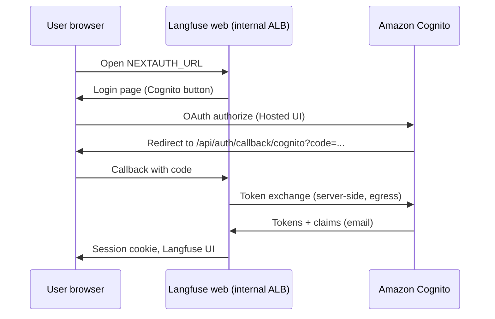

# End-to-end flow — From nothing to Cognito sign-in on Langfuse v3

Narrative checklist for **self-hosted Langfuse v3** (**image 3.163** in MIDAS) with **Amazon Cognito** using Langfuse’s documented **`AUTH_COGNITO_*`** integration ([Authentication and SSO — v3](https://langfuse.com/self-hosting/security/authentication-and-sso)).

---

## Phase 0 — Baseline

1. Langfuse is deployed (MIDAS: ORD1 → ORD4 Jenkins pipeline, Helm release `langfuse` in namespace `langfuse`).
2. You can open the UI at `NEXTAUTH_URL` over HTTPS from a corporate client (internal ALB path).
3. Health check: `GET /api/public/health` returns 200 (used by ALB; see overlay annotations).

If any step fails, fix deployment **before** SSO.

---

## Phase 1 — Choose and record URLs

1. Record **`LANGFUSE_ORIGIN`**: `https://<host>` — exact user-facing origin (scheme + host, no path).
2. Set **`NEXTAUTH_URL`** in Helm (`langfuse.nextauth.url`) to that same origin ([configuration docs](https://langfuse.com/self-hosting/configuration)).
3. Compute **`CALLBACK_URL`**: `{LANGFUSE_ORIGIN}/api/auth/callback/cognito` (literal path segment **`cognito`**).

**MIDAS example (dev):** `langfuse.nextauth.url` in `deploy/ai_gateway/helm/langfuse/values-midas-dev.yaml` is the source to align; ingress host can differ — what matters is **one canonical browser URL** matching Cognito and NextAuth.

---

## Phase 2 — Cognito User Pool + domain

1. Create or select User Pool in **`us-east-1`**.
2. Attach a Cognito **domain** (prefix or custom). Note **User Pool ID**.
3. (Optional) Configure federated IdPs on the pool — Langfuse still uses the Cognito OAuth client.

---

## Phase 3 — Cognito app client for Langfuse

1. Create app client with **client secret** and **authorization code** grant.
2. Set **callback URL** to `CALLBACK_URL` from Phase 1.
3. Enable scopes **`openid`** and **`email`**.
4. Copy **Client ID** and **Client Secret**.
5. Record **Issuer**: `https://cognito-idp.us-east-1.amazonaws.com/<USER_POOL_ID>`.

**Verification:** In AWS Console → App client → Hosted UI / OAuth settings, the callback list matches **exactly** (no typo, correct `https`, correct path `/api/auth/callback/cognito`).

**MIDAS-specific:** If you use Terraform, ensure `aws_cognito_user_pool_client.langfuse_observability_client` (or a replacement client) matches the above. Today’s module pins `/api/auth/callback/custom` and a different hostname — **fix before relying on stored Secrets Manager values**.

---

## Phase 4 — Wire secrets into Kubernetes / Helm

1. Ensure cluster Secrets contain client id and secret (MIDAS ORD1 pattern: `langfuse-cognito-client-id`, `langfuse-cognito-client-secret` in namespace `langfuse`).
2. Add `AUTH_COGNITO_CLIENT_ID`, `AUTH_COGNITO_CLIENT_SECRET`, `AUTH_COGNITO_ISSUER` to Langfuse **web** deployment env (`langfuse.additionalEnv` in `values-midas-*.yaml`).
3. Redeploy via **Jenkins** (`Jenkinsfile_ORD4_langfuse`), not ad hoc laptop Helm against shared environments ([jenkins.mdc](../../.cursor/rules/jkenkins/jenkins.mdc)).

---

## Phase 5 — Optional hardening

1. **`AUTH_DISABLE_USERNAME_PASSWORD=true`** — only after successful Cognito login tests, if policy requires SSO-only.
2. **`AUTH_COGNITO_ALLOW_ACCOUNT_LINKING=true`** — only if migrating existing local users with verified-email discipline.
3. **`AUTH_DISABLE_SIGNUP=true`** — if invitations/admin provisioning only.

---

## Phase 6 — User login test (verification)

1. Open `LANGFUSE_ORIGIN` in a fresh browser profile (or incognito).
2. Click Cognito / SSO sign-in (label depends on Langfuse UI for provider `COGNITO`).
3. Complete Hosted UI login (Cognito directory or federated IdP).
4. Expect redirect to **`CALLBACK_URL`** then Langfuse session established.

**Failure patterns:**

| Symptom | Likely cause |
| ------- | ------------- |
| Redirect error from Cognito “redirect_mismatch” | Callback URL in app client ≠ `{ORIGIN}/api/auth/callback/cognito` |
| 500 after callback | Wrong client secret, wrong issuer, or clock skew (rare) |
| Langfuse error about provider mismatch | Previously created user with different provider — use account linking flag or clean user row per Langfuse troubleshooting ([Authentication and SSO](https://langfuse.com/self-hosting/security/authentication-and-sso)) |
| Blank / HTTP loop | `NEXTAUTH_URL` does not match browser URL or TLS termination headers (`AUTH_TRUST_HOST` already true in MIDAS dev) |

---

## Phase 7 — IdP-initiated SSO (optional)

Langfuse documents IdP-initiated flows for providers at  
`https://<YOUR_LANGFUSE_URL>/auth/sso-initiate?provider=<PROVIDER>`  
with provider names like `COGNITO` ([same doc](https://langfuse.com/self-hosting/security/authentication-and-sso)). Requires Langfuse **≥ v3.126.0** for the feature in general; **3.163** qualifies.

---

## Diagram (logical)

---

## Done criteria

- [ ] Cognito callback uses **`/api/auth/callback/cognito`** on the **live** Langfuse hostname.
- [ ] `NEXTAUTH_URL` matches that hostname’s origin.
- [ ] `AUTH_COGNITO_CLIENT_ID`, `AUTH_COGNITO_CLIENT_SECRET`, `AUTH_COGNITO_ISSUER` set on web pods.
- [ ] Successful login in incognito + repeat login works.
- [ ] (If enforced) username/password disabled only after SSO validated.
