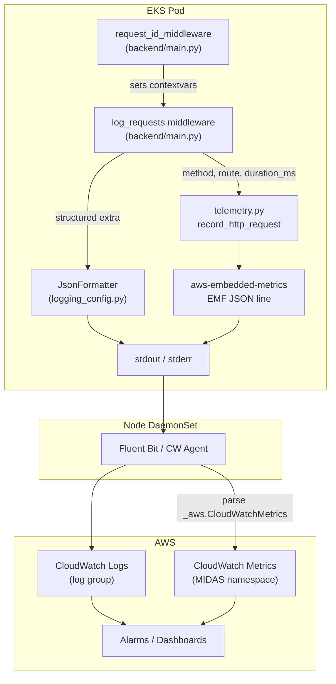

# Observability Configuration

This document describes how the MIDAS backend emits **logs** and **metrics**
to Amazon CloudWatch via OpenTelemetry primitives and the AWS Embedded
Metric Format (EMF). It is the single reference for every env var, Helm
value, and code path involved in observability.

> **TL;DR:** Set `observability.enabled: true` and
> `observability.metricsEnabled: true` in a per-environment Helm values
> file, fill in `observability.logGroupName`, and redeploy. Logs flow to
> CloudWatch Logs; metrics flow to the `MIDAS` CloudWatch Metrics
> namespace. No pod IAM changes are needed.

---

## 1. Architecture



- **Logs**: Plain stdout JSON lines — `JsonFormatter` already produces
  CloudWatch-friendly JSON. Fluent Bit ships them to CloudWatch Logs.
- **Metrics**: EMF is a *log line* with a special `_aws.CloudWatchMetrics`
  block. The CloudWatch Agent / Fluent Bit DaemonSet (already deployed)
  parses these lines and publishes them as native CloudWatch Metrics. No
  separate network endpoint, no extra IAM on the pod.

---

## 2. Configuration Reference

All values are **environment variables read directly by `telemetry.py` and
`logging_config.py`** — they are intentionally *not* fields on the `Settings`
class so that the OTel library lifecycle stays decoupled from application
settings.  The Helm chart at
[`deploy/ecs-app/helm/midas-api-backend-svc`](../bu-analytics-gen-ai-midas/deploy/ecs-app/helm/midas-api-backend-svc)
exposes them as a single `observability:` stanza in `values.yaml` and injects
them as pod environment variables via `templates/deployment.yaml`.

### 2.1 Observability env vars

| Env Var                             | Default          | Description                                                                                       | Helm key                             |
| ----------------------------------- | ---------------- | ------------------------------------------------------------------------------------------------- | ------------------------------------ |
| `OTEL_ENABLED`                      | `false`          | Master switch. When false, `telemetry.setup_telemetry()` no-ops.                                  | `observability.enabled`              |
| `OTEL_METRICS_ENABLED`              | `false`          | Emit CloudWatch Metrics via EMF. Requires `OTEL_ENABLED=true`.                                    | `observability.metricsEnabled`       |
| `OTEL_METRICS_NAMESPACE`            | `MIDAS`          | CloudWatch custom-metric namespace.                                                               | `observability.metricsNamespace`     |
| `OTEL_SERVICE_NAME`                 | `midas-backend`  | `Service` dimension on every metric.                                                              | `observability.serviceName`          |
| `OTEL_ENVIRONMENT`                  | from `APP_ENV`   | `Environment` dimension on every metric; also sets `AWS_EMF_ENVIRONMENT`.                         | `observability.environment`          |
| `LOG_CLOUDWATCH_LOG_GROUP`          | *(unset)*        | When set, `JsonFormatter` adds `@logGroupName` to every JSON log line.                            | `observability.logGroupName`         |
| `OTEL_EXPORTER_OTLP_ENDPOINT`       | *(unset)*        | **(Phase B)** gRPC endpoint of the in-cluster OTel Collector. Enables OTLP exporter → AMP.       | `observability.otlpEndpoint`         |
| `OTEL_RESOURCE_ATTRIBUTES`          | *(unset)*        | **(Phase B)** Comma-separated OTel resource attributes (e.g. `service.name=midas-backend`).      | `observability.resourceAttributes`   |

### 2.2 Existing logging env vars (unchanged, kept here for reference)

| Env Var                | Default          | Description                                                                            |
| ---------------------- | ---------------- | -------------------------------------------------------------------------------------- |
| `LOG_LEVEL`            | `INFO`           | Stdlib logging level.                                                                  |
| `LOG_FORMAT`           | `text`           | `json` for production / CloudWatch Logs; `text` (colored) for local dev.               |
| `LOG_FILE`             | `logs/midas.log` | File log destination. Set to empty string to disable.                                  |
| `ENABLE_CONSOLE_LOGGING` | `true`         | Emit logs to stdout (must be `true` in containers so Fluent Bit can read them).        |
| `LOG_SERVICE_NAME`     | `midas`          | `service` field in JSON logs.                                                          |
| `LOG_ENVIRONMENT`      | from `ENVIRONMENT` | `environment` field in JSON logs.                                                    |
| `LOG_CLIENT_IP`        | `false`          | Include hashed client IP in `http_request` log lines.                                  |
| `LOG_JSON_STACK_TRACE` | `false`          | Include `error.stackTrace` field in JSON logs for exceptions.                          |

---

## 3. Activating per environment

In a per-env values file, e.g. `values-midas-dev.yaml`:

```yaml
observability:
  enabled: true
  metricsEnabled: true
  metricsNamespace: "MIDAS"
  serviceName: "midas-backend"
  environment: "dev"
  logGroupName: "/midas/dev/backend"
```

For local development, override on the command line or in `backend/.env`:

```bash
OTEL_ENABLED=true
OTEL_METRICS_ENABLED=true
OTEL_METRICS_NAMESPACE=MIDAS
LOG_CLOUDWATCH_LOG_GROUP=/midas/dev/backend
LOG_FORMAT=json
```

(Locally there's no Fluent Bit; the EMF lines just appear in stdout
alongside regular JSON logs, which is helpful for inspection.)

---

## 4. The first metric: `HttpRequestDuration`

Recorded by `record_http_request()` in
[`backend/app/core/telemetry.py`](../bu-analytics-gen-ai-midas/backend/app/core/telemetry.py),
called from the `log_requests` middleware in
[`backend/main.py`](../bu-analytics-gen-ai-midas/backend/main.py).

| Aspect      | Value                                                              |
| ----------- | ------------------------------------------------------------------ |
| Namespace   | `OTEL_METRICS_NAMESPACE` (default `MIDAS`)                         |
| Metric      | `HttpRequestDuration` (Milliseconds), `HttpRequestCount` (Count)   |
| Dimensions  | `Service`, `Environment`, `Method`, `Route`, `Outcome`             |
| Properties  | `StatusCode` (high-cardinality, not a dimension)                   |

`Outcome` is one of `success` / `redirect` / `client_error` /
`server_error` / `unknown`, derived from the status code by
`_http_outcome` in `main.py`.

---

## 5. Adding a new metric (recipe)

The codebase keeps all metric recorders in a single module so adding new
ones stays cheap.

1. **Edit `backend/app/core/telemetry.py`.** Add a new function alongside
   `record_http_request`:

   ```python
   def record_llm_call(
       *,
       model: str,
       outcome: str,
       duration_ms: float,
       prompt_tokens: int,
       completion_tokens: int,
   ) -> None:
       if not _METRICS_ENABLED:
           return
       try:
           coro = _emit_llm_call(
               model=model, outcome=outcome,
               duration_ms=duration_ms,
               prompt_tokens=prompt_tokens,
               completion_tokens=completion_tokens,
           )
           try:
               loop = asyncio.get_running_loop()
           except RuntimeError:
               asyncio.run(coro)
           else:
               loop.create_task(coro)
       except Exception as exc:
           _logger.debug("record_llm_call suppressed error: %s", exc)


   async def _emit_llm_call(*, model, outcome, duration_ms, prompt_tokens, completion_tokens):
       metrics = get_metric_logger()
       metrics.set_dimensions({
           "Service": _SERVICE_NAME,
           "Environment": _ENVIRONMENT,
           "Model": model,
           "Outcome": outcome,
       })
       metrics.put_metric("LlmCallDuration", duration_ms, "Milliseconds")
       metrics.put_metric("LlmPromptTokens", prompt_tokens, "Count")
       metrics.put_metric("LlmCompletionTokens", completion_tokens, "Count")
       await metrics.flush()
   ```

2. **Call it from the relevant code path**, e.g. an LLM client wrapper:

   ```python
   from app.core import telemetry
   telemetry.record_llm_call(
       model=model_name, outcome="success",
       duration_ms=elapsed_ms,
       prompt_tokens=usage.prompt_tokens,
       completion_tokens=usage.completion_tokens,
   )
   ```

3. **Document the new metric** in this file (Section 4 style table).

That's it — no Helm or config changes are needed. The metric inherits the
namespace, service, and environment from the bootstrap.

---

## 6. Adding a new structured log event

Logs do **not** go through `telemetry.py`. They use the existing
`midas` stdlib logger hierarchy. To add a new event:

```python
from app.core.logging_config import get_logger

logger = get_logger(__name__)
logger.info(
    "dataset_uploaded",
    extra={
        "event": "dataset_uploaded",
        "log_category": "dataset",
        "dataset_id": dataset_id,
        "row_count": row_count,
        "size_bytes": size_bytes,
    },
)
```

The `JsonFormatter` will:

- Promote `event` to a top-level field (queryable as `fields.event` in
  CloudWatch Logs Insights).
- Inject correlation fields (`request_id`, `trace_id`, `user_id`,
  `tenant_id`) from the request contextvars automatically.
- Add `@logGroupName` if `LOG_CLOUDWATCH_LOG_GROUP` is set.

---

## 7. CloudWatch Logs Insights query examples

```sql
-- All HTTP 5xx in the last hour
fields @timestamp, method, route, status_code, duration_ms, request_id
| filter event = "http_request" and outcome = "server_error"
| sort @timestamp desc

-- Slowest 50 requests for a route template
fields @timestamp, route, duration_ms, request_id
| filter event = "http_request" and route = "/api/v1/datasets/{dataset_id}/upload"
| sort duration_ms desc
| limit 50

-- Trace one request end-to-end across all loggers
fields @timestamp, logger, level, event, message
| filter request_id = "<paste-request-id>"
| sort @timestamp asc
```

---

## 8. IAM and networking

- **Pod IAM**: no change. EMF writes to stdout; the pod never calls
  CloudWatch directly.
- **Node IAM**: the Fluent Bit / CloudWatch Agent DaemonSet uses its node
  role to call `logs:PutLogEvents` and `cloudwatch:PutMetricData`. This
  is part of the cluster baseline, not application-owned.
- **VPC endpoints**: the cluster already has private VPC endpoints for
  CloudWatch Logs and CloudWatch Monitoring (see
  [`docs/workorder-vpc-endpoints-list.md`](workorder-vpc-endpoints-list.md)),
  so all telemetry traffic stays on the AWS private network.

---

## 9. Files involved

- [`backend/app/core/telemetry.py`](../bu-analytics-gen-ai-midas/backend/app/core/telemetry.py) — bootstrap + metric recorders (env-only, no Settings coupling)
- [`backend/app/core/logging_config.py`](../bu-analytics-gen-ai-midas/backend/app/core/logging_config.py) — `JsonFormatter` (emits `@logGroupName` when set)
- [`backend/app/core/config.py`](../bu-analytics-gen-ai-midas/backend/app/core/config.py) — `Settings` (observability vars intentionally removed; comment explains why)
- [`backend/main.py`](../bu-analytics-gen-ai-midas/backend/main.py) — startup hook (`setup_telemetry()`) + `log_requests` middleware
- [`backend/requirements.txt`](../bu-analytics-gen-ai-midas/backend/requirements.txt) — pinned packages
- [`deploy/ecs-app/helm/midas-api-backend-svc/values.yaml`](../bu-analytics-gen-ai-midas/deploy/ecs-app/helm/midas-api-backend-svc/values.yaml) — Helm `observability:` stanza
- [`deploy/ecs-app/helm/midas-api-backend-svc/templates/deployment.yaml`](../bu-analytics-gen-ai-midas/deploy/ecs-app/helm/midas-api-backend-svc/templates/deployment.yaml) — env-var wiring into pod
- [`docs/observability-metric-catalog.md`](observability-metric-catalog.md) — full metric catalog (Phase B)
- [`deploy/observability/otel-collector/values.yaml`](../bu-analytics-gen-ai-midas/deploy/observability/otel-collector/values.yaml) — ADOT Collector Helm values (Phase B)
- [`deploy/ecs-app/modules/observability-amp/`](../bu-analytics-gen-ai-midas/deploy/ecs-app/modules/observability-amp/) — AMP + AMG Terraform module (Phase B)
- [`deploy/ecs-app/modules/observability-opensearch/`](../bu-analytics-gen-ai-midas/deploy/ecs-app/modules/observability-opensearch/) — OpenSearch Terraform module (Phase C)
- [`deploy/observability/fluentbit/fluentbit-opensearch-values.yaml`](../bu-analytics-gen-ai-midas/deploy/observability/fluentbit/fluentbit-opensearch-values.yaml) — Fluent Bit dual-write values (Phase C)
