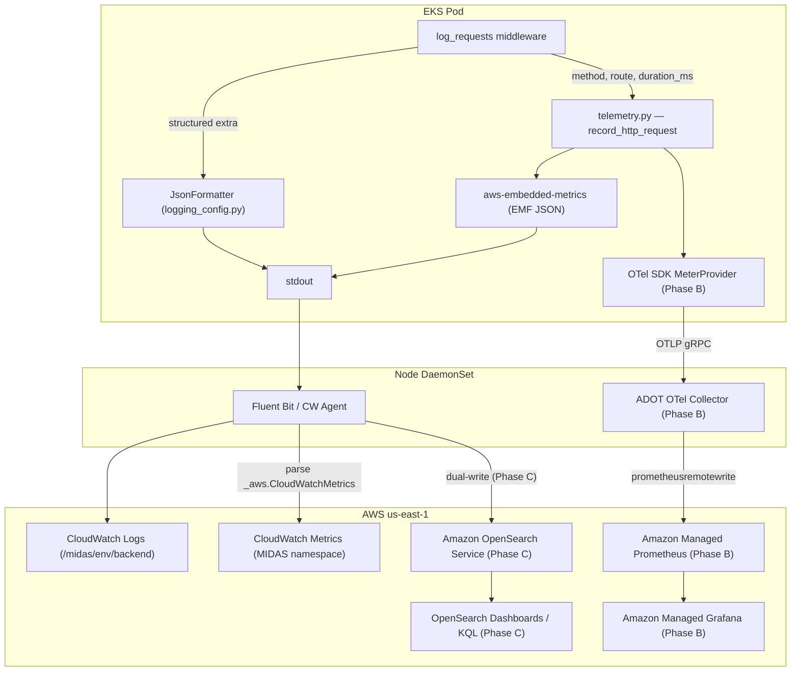

# OpenTelemetry Observability for MIDAS Backend

> **Status: Phase A implemented.** Phases B (AMP/Grafana) and C (OpenSearch/KQL)
> are infrastructure-ready — Terraform modules and Helm values exist; activate by
> deploying `observability.tf` and setting the Phase B/C Helm keys.

---

## Phase A — CloudWatch (Logs + Metrics via EMF) ✅

All items below are **implemented** in the codebase.

| Item | File | Status |
|---|---|---|
| `telemetry.py` env-only bootstrap (no Settings coupling) | `backend/app/core/telemetry.py` | ✅ |
| `record_http_request()` EMF + OTLP dual-emit | `backend/app/core/telemetry.py` | ✅ |
| `AWS_EMF_ENVIRONMENT` uses deployment env (not hardcoded `"Local"`) | `backend/app/core/telemetry.py` | ✅ |
| `main.py` — `setup_telemetry()` no-arg startup call | `backend/main.py` | ✅ |
| `main.py` — `is_metrics_enabled()` guard in middleware | `backend/main.py` | ✅ |
| `OTEL_*` removed from `Settings` (comment explains why) | `backend/app/core/config.py` | ✅ |
| `LOG_FORMAT=json` auto-injected when `observability.enabled` | `deploy/ecs-app/helm/midas-api-backend-svc/templates/deployment.yaml` | ✅ |
| Phase B OTLP env vars wired in `deployment.yaml` | `deploy/ecs-app/helm/midas-api-backend-svc/templates/deployment.yaml` | ✅ |
| `observability.otlpEndpoint` + `resourceAttributes` in `values.yaml` | `deploy/ecs-app/helm/midas-api-backend-svc/values.yaml` | ✅ |
| CloudWatch Log Group TF module `/midas/<env>/backend` | `deploy/ecs-app/modules/observability-app-logs/` | ✅ |
| `backend_application_log_group_name` TF output | `deploy/ecs-app/outputs.tf` | ✅ |
| `helm-deploy-releases.sh` injects `observability.logGroupName` from TF output | `deploy/scripts/ci/helm-deploy-releases.sh` | ✅ |
| Full config reference + Phase B/C table | `docs/observability-configuration.md` | ✅ |

### Activating Phase A (operator runbook)

1. Run `terraform apply` in `deploy/ecs-app/` — creates `/midas/<env>/backend` log group and exports `backend_application_log_group_name`.
2. Jenkins exports TF outputs to `deploy/.ci/terraform-env.sh`; `helm-deploy-releases.sh` picks up `BACKEND_APPLICATION_LOG_GROUP_NAME` automatically.
3. In your per-env Helm values file add:

```yaml
observability:
  enabled: true
  metricsEnabled: true
```

4. Redeploy via the Jenkins pipeline. Logs appear in CloudWatch Logs → `/midas/<env>/backend`. Metrics appear in CloudWatch Metrics → `MIDAS` namespace.

---

## Phase B — Amazon Managed Prometheus (AMP) + Grafana ⏳

Infrastructure modules in place; needs `terraform apply` + Jenkins pipeline trigger.

| Item | File | Status |
|---|---|---|
| AMP + AMG Terraform module | `deploy/ecs-app/modules/observability-amp/` | ⏳ create TF |
| ADOT OTel Collector Helm values (OTLP→AMP) | `deploy/observability/otel-collector/values.yaml` | ⏳ deploy |
| ADR `docs/adr/0001-midas-amp-amg-observability.md` | | ⏳ write |
| Metric catalog | `docs/observability-metric-catalog.md` | ⏳ write |
| Grafana dashboard JSON | `deploy/observability/grafana/dashboards/midas-backend-overview.json` | ⏳ create |

### Phase B activation steps (brief)

1. Deploy `observability-amp` Terraform module → get AMP workspace ARN and Collector endpoint.
2. Deploy ADOT Collector DaemonSet (Helm) with `prometheusremotewrite` exporter → AMP.
3. Set in per-env Helm values:

```yaml
observability:
  enabled: true
  metricsEnabled: true
  otlpEndpoint: "http://adot-collector.adot.svc.cluster.local:4317"
  resourceAttributes: "service.name=midas-backend,deployment.environment=dev"
```

4. Import Grafana dashboard JSON; set AMP as the data source.

---

## Phase C — Amazon OpenSearch Service (KQL/DQL log search) ⏳

| Item | File | Status |
|---|---|---|
| ADR `docs/adr/0002-midas-kql-log-search.md` | | ⏳ write |
| OpenSearch Terraform module | `deploy/ecs-app/modules/observability-opensearch/` | ⏳ create TF |
| Fluent Bit dual-write values | `deploy/observability/fluentbit/fluentbit-opensearch-values.yaml` | ⏳ create |
| KQL/DQL cookbook | `docs/observability-kql-cookbook.md` | ⏳ write |

---

## Architecture Overview



---

## Related docs

- [observability-configuration.md](./observability-configuration.md) — full env var + Helm reference
- [cloudwatch-infrastructure-metrics-mapping.md](./cloudwatch-infrastructure-metrics-mapping.md) — infra-level CW namespaces/dimensions
