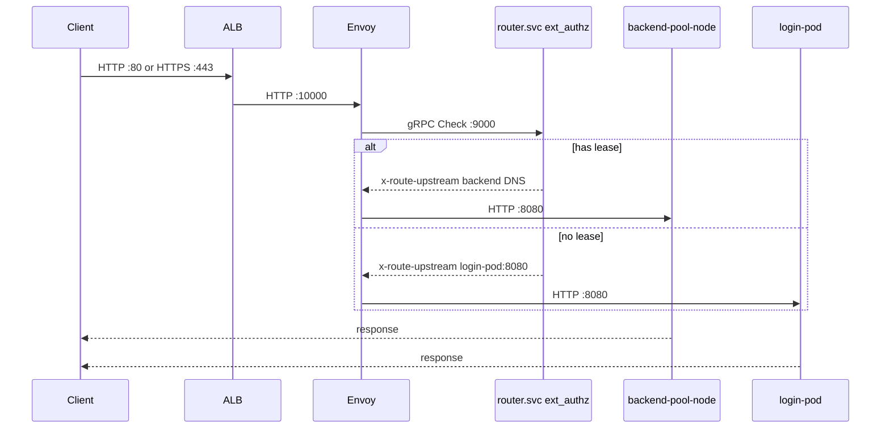

# Endpoints reference

All network endpoints for the pod_manager routing tier — **local** and **AWS**.

## Summary table

| Endpoint | Port | Protocol | Exposed via | Local URL | AWS URL |
|----------|------|----------|-------------|-----------|---------|
| Envoy traffic | 10000 | HTTP | Host / ALB :80 (or :443) | `http://localhost:10000` | `http://<alb-dns>/` |
| Envoy health | 8080 | HTTP | Host / ALB health check | `http://localhost:8080/healthz` | internal only |
| ext_authz | 9000 | gRPC | Cluster only | — | — |
| PodManager gRPC | 8804 | gRPC | Host / NLB | `localhost:8804` | `<nlb-dns>:8804` |
| Backend pool node | 8080 | HTTP | Via Envoy DFP | `http://localhost:18080` (node-0) | via ALB |
| Login pod | 8080 | HTTP | Via Envoy DFP | `http://localhost:18082` | via ALB |
| Postgres | 5432 | PostgreSQL | Host (local) / RDS (AWS) | `localhost:5432` | `<rds-endpoint>:5432` |
| Next.js test UI | 3000 | HTTP | Local dev | `http://localhost:3000` | — |

## ALB listeners (AWS)

| Listener | Default | Config |
|----------|---------|--------|
| HTTP :80 | **Enabled** | `ingress.listeners.http.enabled: true` |
| HTTPS :443 | Disabled | `ingress.listeners.https.enabled: false` + `certificateArn` when enabled |

Envoy and router.svc work identically whether clients use `http://` or `https://` — TLS terminates at the ALB.

## Request flow



## Control plane (lease RPCs)

Not routed through Envoy. Clients call **PodManagerService** directly:

| RPC | Local | AWS |
|-----|-------|-----|
| `AcquireLease` | `localhost:8804` | `<nlb-dns>:8804` |
| `GetLease` | same | same |
| `ReleaseLease` | same | same |
| `GetPoolStatus` | same | same |

Configure via [`config/deploy/local.env`](../config/deploy/local.env) or [`config/deploy/aws.env`](../config/deploy/aws.env).

## HTTP routes via Envoy

| Path | Auth | Backend when leased | Backend when unleased |
|------|------|---------------------|------------------------|
| `GET /` | `x-test-sub` or cookie | backend pool HTML | login pod |
| `POST /login` | dev header | login pod | login pod |
| `GET /api/v1/me` | dev header | backend JSON 200 | login pod 403 `no_backend_lease` |
| `GET /healthz` | none | Envoy health listener :8080 | same |

## Discovering AWS endpoints after deploy

```bash
# After helm upgrade --install
./infra/scripts/write-aws-profile.sh
source config/deploy/aws.env
uv run dev-test health --target aws
```
