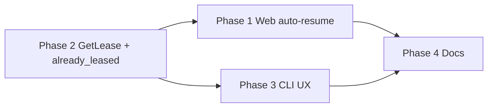

# Plan — lease resume across disconnect / new device

**Goal:** When a user signs in again with the same email (`sub`) after closing the browser, disconnecting, or switching machines, traffic must route to their **existing** backend pod if a lease is still held. A new pod must **not** be claimed.

**Related requirements:** FR-1, FR-6, CP-1 (multi-device policy), HC-3 (reconnect re-resolves assignment).

---

## Current state (already correct)

| Layer | Behavior today | Evidence |
|-------|----------------|----------|
| **Postgres** | Source of truth for `sub → pod` | `pm_user_assignments` table |
| **`AcquireLease`** | **Idempotent** — existing assignment returns same `pod_id` / `pod_dns` / `assignment_epoch`; no second claim | `pool_handler._acquire_backend_lease` L104–110; `test_acquire_lease_idempotent` |
| **ext_authz** | Routes by stored assignment for verified `sub` | `ExtAuthzCheckHandler._check_inner` |
| **Logout (web)** | Clears session cookie only; **does not** `ReleaseLease` | `test_client_nextjs` `/api/auth/logout` |
| **CLI `claim`** | Calls `AcquireLease` — already idempotent | `pod_manager_cli/main.py` |
| **Local stack** | Reaper disabled — leases persist until explicit release | `docker-compose.local.yml` `POD_MANAGER_REAPER_ENABLED=false` |

**Gap:** UX and observability — users must manually visit `/lease` and click **Acquire lease** after every login; nothing surfaces “resumed existing lease” vs “new lease”. No read-only **`GetLease`** RPC (optional).

---

## Required changes

### Phase 1 — Web test client (primary)

| # | Change | Files | Acceptance |
|---|--------|-------|------------|
| 1.1 | **Auto-resume after login** — on successful login, call `POST /api/lease/acquire` (idempotent). If OK → `/home`; if `no_capacity` → `/wait`; only stay on `/lease` on unexpected error | `page_container_login.tsx` | Login as user with existing lease → lands on `/home` without extra click |
| 1.2 | **Lease page copy** — button text **“Acquire lease”** when no lease; **“Resume session”** when acquire returns existing pod (optional: pass `resumed` flag from API — see Phase 2) | `page_container_lease.tsx` | Manual visit to `/lease` shows correct label |
| 1.3 | **`GET /api/lease/status`** (optional but recommended) — returns `{ hasLease, lease? }` via gRPC lookup without side effects if Phase 2 `GetLease` exists; **or** document that acquire is safe to call for status | `src/app/api/lease/status/route.ts`, `src/lib/pod-manager.ts` | `/lease` can show current pod before user clicks |
| 1.4 | **Home guard** — `/home` calls acquire or status on load; redirect to `/lease` only when no assignment | `page_container_home.tsx` or server layout | Direct `/home` URL after login on new machine works |
| 1.5 | **Reconnect user flow doc** | `docs/local-testing/web-test-client.md` | New “Flow F — Reconnect same user” |

**Note:** Phase 1 can ship using **idempotent `AcquireLease` only** (no proto change). `GET /api/lease/status` can internally call `AcquireLease` only if product accepts “get-or-create on status” — prefer Phase 2 `GetLease` for a true read path.

---

### Phase 2 — Control plane API (recommended)

| # | Change | Files | Acceptance |
|---|--------|-------|------------|
| 2.1 | Add **`GetLease(GetLeaseRequest) → GetLeaseResponse`** | `pool.proto`, regenerate stubs | Returns assignment or `NOT_FOUND`; never mutates pool |
| 2.2 | Handler **`get_lease(sub)`** — `get_assignment_by_sub` only | `pool_handler.py`, `pool_servicer.py` | Unit test: no assignment → NOT_FOUND; existing → same fields as acquire |
| 2.3 | Extend **`AcquireLeaseResponse`** with **`bool already_leased = 4`** (optional) — set `true` when returning existing row, `false` on new transact claim | `pool.proto`, `pool_handler.py` | Clients can distinguish resume vs new claim |
| 2.4 | **`client_py`** — `get_lease(sub)`, update `acquire_lease` to expose `already_leased` if field added | `pod_manager_client/client.py` | |
| 2.5 | **`client_ts`** — `getLease(sub)`, same for `acquireLease` | `pod-manager-client.ts` | |
| 2.6 | Server tests | `tests/test_pool_handler.py` | `test_get_lease_*`, extend idempotent acquire test for `already_leased` |

**Alternative (minimal):** Skip 2.1–2.3; document that **`AcquireLease` is the supported get-or-create** and only add `already_leased` to the response (2.3 only).

---

### Phase 3 — CLI operator UX

| # | Change | Files | Acceptance |
|---|--------|-------|------------|
| 3.1 | **`pod-manager claim`** — print `resumed existing lease` vs `acquired new lease` when `already_leased` available; else compare pool before/after or document idempotent behavior | `pod_manager_cli/main.py` | `claim` for user with lease shows same pod_id, clear message |
| 3.2 | Add **`pod-manager lease --sub EMAIL`** (read-only) if `GetLease` exists | `pod_manager_cli/main.py` | Shows pod or “no lease” |
| 3.3 | CLI docs | `docs/local-testing/cli-operator.md` | Reconnect / idempotent claim section |

---

### Phase 4 — Documentation

| # | Change | Files |
|---|--------|-------|
| 4.1 | **Architecture flow** — reconnect sequence (login → same pod via Postgres) | `docs/local-testing/architecture-and-flows.md` |
| 4.2 | **APIs reference** — idempotent `AcquireLease`, optional `GetLease`, `already_leased` | `docs/local-testing/apis-and-clients.md` |
| 4.3 | **Troubleshooting** — “logged in on new machine but old pod” / stale lease | `docs/local-testing/troubleshooting.md` |
| 4.4 | **Glossary** — “lease resume” vs “new lease” | `.cursor/rules/glossary.mdc` (if term used elsewhere) |

---

## Out of scope (this plan)

| Item | Why |
|------|-----|
| **Release on browser close** | Conflicts with resume; use explicit logout+release or reaper idle TTL |
| **Multi-tab / multi-device policy (CP-1)** | Product decision — one lease per `sub` is current behavior; concurrent devices share one pod |
| **Production SPA** | Lives outside this repo; test client + clients are the integration pattern |
| **Backend owner/epoch backstop** | Out of scope per solution rules (SR-3/SR-4) |
| **Heartbeat from web UI** | Optional follow-up — extends lease idle window when reaper enabled in prod |

---

## Production disconnect policy (document, don’t block Phase 1)

| Setting | Local | Production (default `app_config.toml`) |
|---------|-------|----------------------------------------|
| Reaper | Off | On, `idle_ttl_sec=900` |
| Effect | Lease survives browser close indefinitely | Lease released after ~15 min without heartbeat |

**Follow-up (optional Phase 5):** Web or production SPA sends periodic **`Heartbeat`** while `/home` is active so idle disconnect does not drop the lease prematurely.

---

## Implementation order



1. **Phase 2.3 only** (`already_leased` on acquire) — smallest API delta; unblocks web + CLI messaging.  
2. **Phase 1** — auto-resume after login (biggest user-visible win).  
3. **Phase 2.1–2.2** (`GetLease`) — clean read path for status route and CLI.  
4. **Phase 3 + 4** — polish and docs.

**Fast path (no proto change):** Phase 1 using idempotent `AcquireLease` only + Phase 4 — shippable in one PR.

---

## Verification

```bash
# Stack up
./infra/docker/start-local.sh -r -s -d

# User A: acquire via web or CLI
uv run pod-manager claim --sub keith.tobin@gmail.com

# Simulate new machine: clear browser cookies only (do not release)
# Log in again as keith.tobin@gmail.com → should reach /home on same pod_id

uv run pod-manager pool   # still one claim for keith, same pod_id as before

# Idempotent CLI
uv run pod-manager claim --sub keith.tobin@gmail.com   # same pod_id, no second claim

# Release explicitly
uv run pod-manager release --sub keith.tobin@gmail.com
```

Automated (after Phase 2):

- `test_acquire_lease_idempotent` (exists)
- `test_get_lease_found` / `test_get_lease_not_found` (new)
- Optional Playwright/Vitest for login → auto `/home` (test client)

---

## Status

| Phase | Status |
|-------|--------|
| Phase 1 — Web | **Done** |
| Phase 2 — API | **Done** |
| Phase 3 — CLI | **Done** |
| Phase 4 — Docs | **Done** |

**Out of scope (unchanged):** release on browser close, web heartbeat, production SPA, backend epoch backstop, multi-device policy changes.
