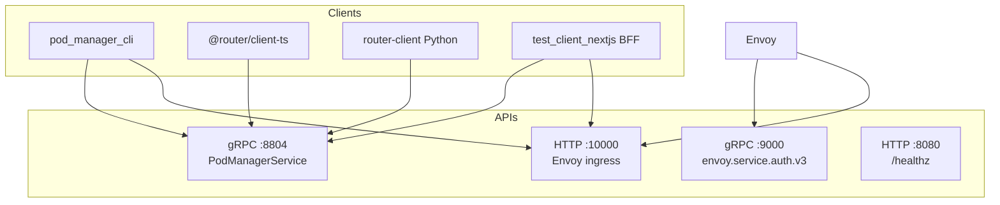

# APIs and clients

Reference for **gRPC control plane**, **HTTP data plane**, and the **client libraries** shipped in this repo.

## API surfaces at a glance



| Surface | Protocol | Port (local) | Consumers |
|---------|----------|--------------|-----------|
| PodManagerService | gRPC | 8804 | CLI, Next lease routes, integrations |
| ext_authz Check | gRPC | 9000 | Envoy only |
| User/API HTTP | HTTP/1.1 | 10000 | Browser BFF, CLI curl, curl smoke tests |
| Health | HTTP | 8080 | Probes, `test-local.sh` |

Proto package: `pod_manager.v1` (file: `router.svc/server/proto/pod_manager/v1/pool.proto`).

---

## gRPC — `PodManagerService`

**Target:** `localhost:8804` (insecure channel locally).

### Pool and lease RPCs

| RPC | Request | Response | Purpose |
|-----|---------|----------|---------|
| `AcquireLease` | `sub` | `pod_id`, `pod_dns`, `assignment_epoch`, `already_leased` | Get or create exclusive backend assignment (idempotent) |
| `GetLease` | `sub` | `pod_id`, `pod_dns`, `assignment_epoch` | Read-only; `NOT_FOUND` if no lease |
| `ReleaseLease` | `sub` | empty | Free backend pod |
| `GetBackendPoolAvailability` | empty | `free_count`, `total_count`, `has_capacity` | Capacity check (UI wait page) |
| `GetPoolStatus` | optional `pool` filter | `pods[]`, counts | Operator view (`backend_pool`, `login_pod_pool`) |
| `Heartbeat` | `sub`, `assignment_epoch` | new epoch | Session idle refresh (prod) |

### Operator / config RPCs

| RPC | Purpose |
|-----|---------|
| `GetRuntimeEnvironment` | Diagnostics |
| `ListServiceConfig` / `GetServiceConfig` / `PutServiceConfig` / `DeleteServiceConfig` | Runtime key/value config |

### gRPC status mapping (typical)

| Condition | Code |
|-----------|------|
| Invalid `sub` / pool filter | `INVALID_ARGUMENT` |
| No free backend | `RESOURCE_EXHAUSTED` |
| No assignment to release | `NOT_FOUND` |
| Store unavailable | `UNAVAILABLE` |

---

## HTTP — through Envoy (`:10000`)

All paths below assume **Envoy** as ingress unless noted.

### Identity (local dev)

| Mechanism | When |
|-----------|------|
| Cookie `pod_manager_user=<email>` | Browser flows via Next BFF **after login** (`/api/backend/*`) |
| Header `x-test-sub: <email>` | CLI, curl, `test-local.sh`, and **BFF first login** (`/api/auth/login` → Envoy) when `POD_MANAGER_AUTH_DEV_MODE=true` |
| `Authorization: Bearer <JWT>` | Production Cognito (JWKS validation in router) |

### login-pod routes (upstream when unleased)

| Method | Path | Status | Body |
|--------|------|--------|------|
| POST | `/login` | 200 | `{success, error_code, message}` + `Set-Cookie` |
| GET/POST/… | `/api/*` | 403 | `{error: "no_backend_lease", ...}` |
| GET | `/healthz` | 200 | `{"status":"ok"}` |

### backend_pool_node routes (upstream when leased)

| Method | Path | Status | Notes |
|--------|------|--------|-------|
| GET | `/api/v1/me` | 200 | Requires `x-user-sub` from Envoy |
| GET | `/api/v1/ping` | 200 | Same |
| GET | `/api/me` | 200 | Alias |
| GET | `/` | 200 | HTML debug page |
| GET | `/healthz` | 200 | Plain text `ok` |

### Direct pod access (bypass Envoy)

Use host ports **18080**, **18081**, **18082** for debugging. You must set `x-user-sub` manually on backends.

---

## ext_authz (Envoy → router)

| | |
|--|--|
| Service | `envoy.service.auth.v3.Authorization` |
| Method | `Check` |
| Config | `envoy/` — `failure_mode_allow: false` |

Not called by application developers directly; documented here for flow understanding. See [architecture-and-flows.md](architecture-and-flows.md).

---

## Client libraries

### Python — `router-client`

| | |
|--|--|
| **Path** | `router.svc/client_py/` |
| **Package** | `router-client` (import `pod_manager_client`) |
| **Transport** | `grpc.aio` |

```python
from pod_manager_client import PodManagerClient

async with PodManagerClient(host="localhost", port=8804) as client:
    lease = await client.acquire_lease("alice@example.com")
    status = await client.get_pool_status()
```

Used by: `pod_manager_cli`, server tests.  
Docs: [router.svc/client_py/README.md](../../router.svc/client_py/README.md).

### TypeScript — `@router/client-ts`

| | |
|--|--|
| **Path** | `router.svc/client_ts/` |
| **Transport** | `@grpc/grpc-js` |

```typescript
import { PodManagerClient } from "@router/client-ts";

const pm = new PodManagerClient({ host: "localhost", port: 8804 });
const lease = await pm.acquireLease("alice@example.com");
pm.close();
```

Used by: `test_client_nextjs` (`src/lib/pod-manager.ts`).  
Build before Next dev: `cd router.svc/client_ts && npm run build`.

Docs: [router.svc/client_ts/README.md](../../router.svc/client_ts/README.md).

### Operator CLI — `pod-manager`

| | |
|--|--|
| **Path** | `pod_manager_cli/` |
| **Entry** | `uv run pod-manager` |

Wraps Python client + optional `httpx` to Envoy.  
Docs: [cli-operator.md](cli-operator.md).

---

## Next.js BFF routes (test client only)

Server-side routes in `test_client_nextjs` — not part of production routing tier.

| Route | Method | Backend |
|-------|--------|---------|
| `/api/auth/login` | POST | Envoy `POST /login` + **`x-test-sub`** (email) + sets cookie on `:3000` |
| `/api/auth/logout` | GET | Clears session cookie |
| `/api/session` | GET | Reads session email |
| `/api/lease/acquire` | POST | gRPC `AcquireLease` + `alreadyLeased` |
| `/api/lease/status` | GET | gRPC `GetLease` (read-only) |
| `/api/lease/release` | POST | gRPC `ReleaseLease` |
| `/api/lease/availability` | GET | gRPC `GetBackendPoolAvailability` |
| `/api/backend/[...path]` | `*` | Proxy to `{ENVOY_URL}/{path}` with session cookie |

Why BFF exists: browsers do not send `localhost:3000` cookies to `localhost:10000` (different origins). The BFF forwards identity server-side.

---

## Postgres access (operators)

Local routing state lives in the `postgres` compose service (db `midas`, user `postgres`) on `localhost:5432`. The `pm_*` tables live in the dedicated `pod_manager` schema (isolated from the backend's `public` schema), so schema-qualify them in an interactive session:

```bash
docker compose -f infra/docker/docker-compose.local.yml -p pod-manager-local \
  exec -T postgres psql -U postgres -d midas -c "SELECT * FROM pod_manager.pm_backend_pool;"
```

Application code uses repositories in `router.svc/server` — not raw SQL in handlers.

---

## Regenerating stubs after proto changes

```bash
# Server
cd router.svc/server && bash tools/generate_protos.sh

# Clients
cd router.svc/client_py && bash tools/generate_protos.sh
cd router.svc/client_ts && npm run proto:gen
```
