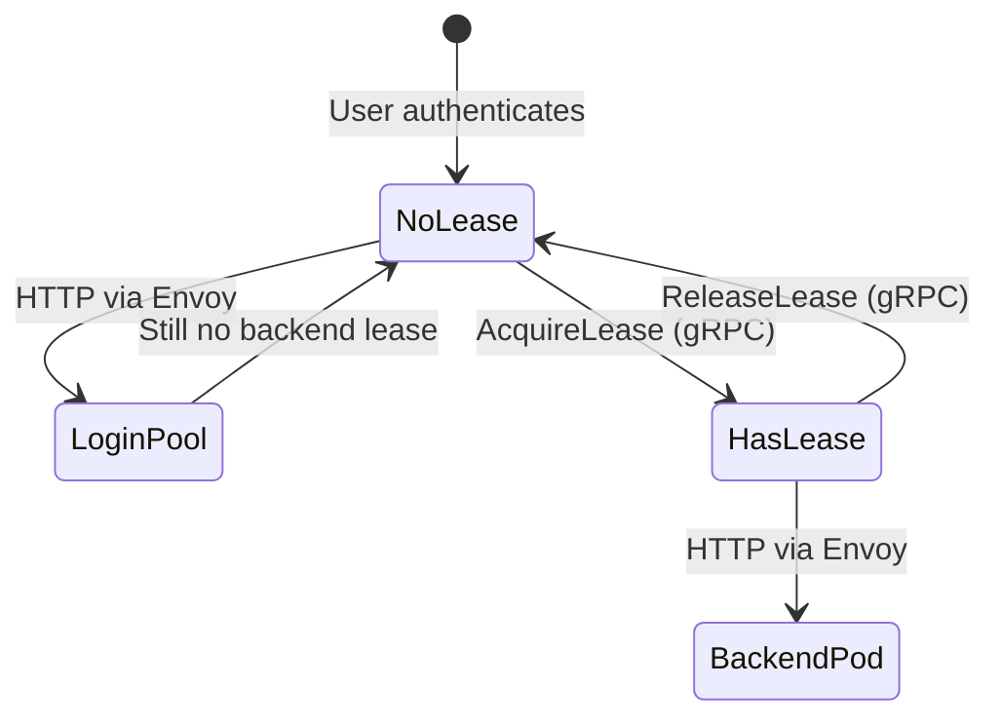
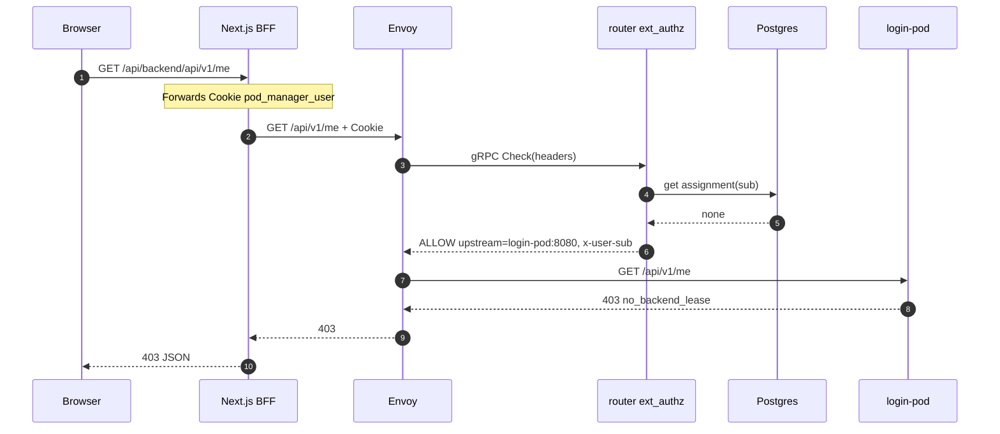
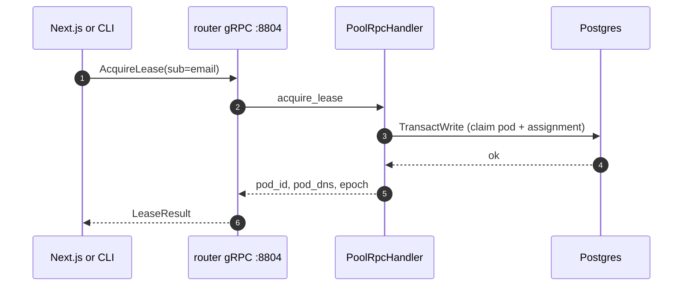
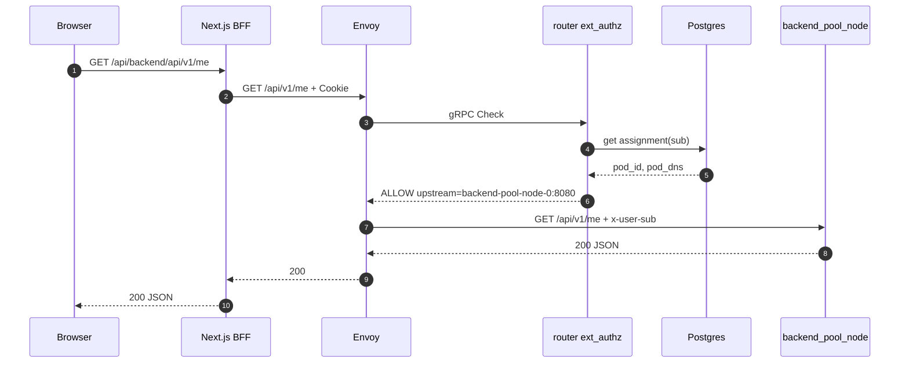
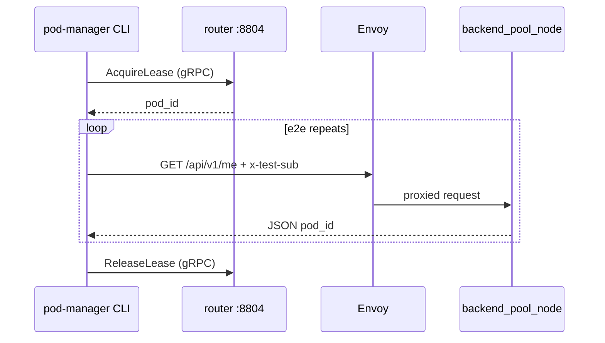
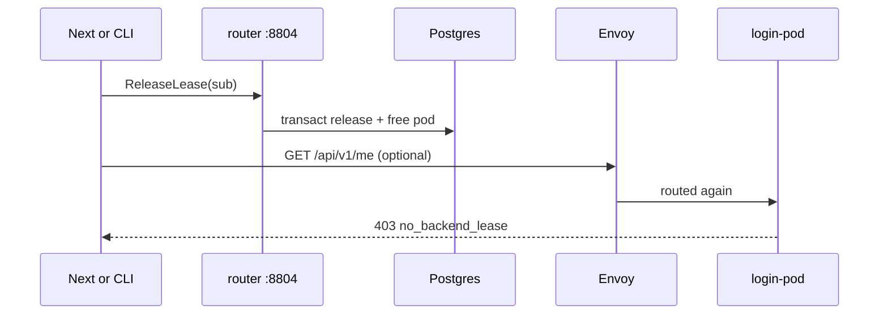
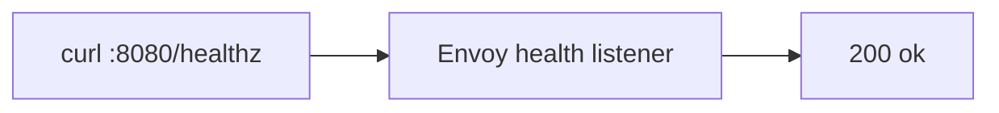
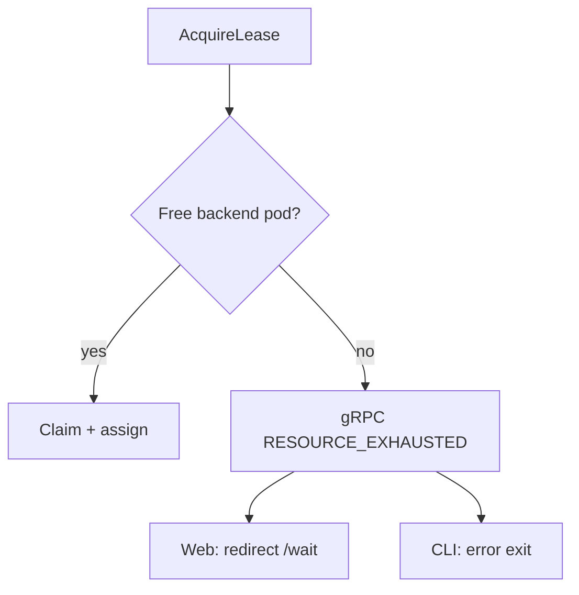

# Architecture and call flows

How the routing tier fits together locally: **decision plane** (router.svc) vs **data plane** (Envoy), and the two pool types (**login** vs **backend lease**).

## Design principles (local)

| Principle | Local manifestation |
|-----------|---------------------|
| Routing is security | `sub` from cookie / `x-test-sub` / JWT — never `Host` from client |
| ALB does not pick pods | Envoy + ext_authz + DFP pick upstream inside the cluster |
| Decision ≠ data plane | gRPC assignment and Check on router; HTTP body flows Envoy → pod |
| Fail closed | Authz error or missing lease → deny or login-pod `403` on `/api/*` |

## Pool model



| State | Postgres | Envoy upstream |
|-------|----------|----------------|
| **No backend lease** | No row in `pm_user_assignments` for `sub` | `login-pod:8080` |
| **Leased** | Assignment + claimed backend pod | `backend-pool-node-N:8080` |

Login pool does **not** consume a backend slot. Only `AcquireLease` marks a backend `claimed`.

---

## Flow 1 — HTTP API without backend lease

Typical: user logged in (cookie) but has not called `AcquireLease`.



**Expected body (login-pod):**

```json
{
  "error": "no_backend_lease",
  "message": "Acquire a backend lease before calling the backend API."
}
```

---

## Flow 2 — Acquire backend lease (control plane)

Lease operations **never** go through Envoy in the test client; they use gRPC directly.



After this, ext_authz finds an assignment and returns the backend pod DNS.

---

## Flow 3 — HTTP API with backend lease



**Example success JSON:**

```json
{
  "service": "backend_pool_node",
  "pod_id": "backend-pool-node-0",
  "backend_pool_node": "backend-pool-node-0",
  "sub": "alice@example.com",
  "message": "Exclusive backend lease is active for this identity."
}
```

---

## Flow 4 — Login through Envoy (browser)

```mermaid
sequenceDiagram
  autonumber
  participant Browser
  participant Next as Next.js
  participant Envoy
  participant Authz as router ext_authz
  participant Login as login-pod

  Browser->>Next: POST /api/auth/login {user_name, password}
  Note over Next: Server-side; sets cookie on :3000
  Next->>Envoy: POST /login JSON
  Note over Next,Envoy: First login may need identity;<br/>BFF does not send x-test-sub today
  Envoy->>Authz: Check
  Authz-->>Envoy: ALLOW (login upstream) or DENY
  Envoy->>Login: POST /login
  Login-->>Envoy: 200 + Set-Cookie
  Envoy-->>Next: 200
  Next-->>Browser: 200 + pod_manager_user cookie
```

For **CLI/curl** through Envoy, send `x-test-sub: <email>` on `POST /login` in dev mode. Direct login without Envoy: `http://localhost:18082/login`.

---

## Flow 5 — CLI HTTP smoke (`route` / `e2e`)



CLI bypasses Next.js BFF; uses **dev header** instead of cookie.

---

## Flow 6 — Release lease



---

## ext_authz response headers (internal)

Envoy uses metadata from a successful Check:

| Header | Set by | Purpose |
|--------|--------|---------|
| `x-route-upstream` | router.svc | Host for dynamic forward proxy |
| `x-user-sub` | router.svc | Trusted identity for backend pods |

Backend apps must treat `x-user-sub` as authoritative only when the request came through Envoy (production: NetworkPolicy restricts ingress).

---

## Health check path (no authz)



Does not call router.svc or pods — used by compose/Kubernetes probes.

---

## Capacity and “pool full”



Local seed has **2** backends → at most **2** simultaneous leases.

---

## Related reading

- Component reference: [components.md](components.md)  
- API listing: [apis-and-clients.md](apis-and-clients.md)  
- Web journeys: [web-test-client.md](web-test-client.md)
