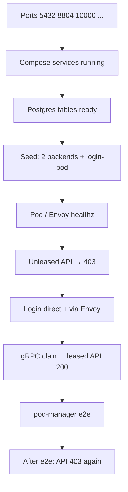

# Automated local smoke tests

Non-interactive validation of the Compose stack: ports, Postgres seed, health checks, routing rules, and CLI `e2e`.

## Quick run

**Stack must already be running** (or use combined start):

```bash
# Start + test
./infra/docker/start-local.sh -r -s -d -t

# Tests only
./infra/docker/test-local.sh
```

Custom identity for lease tests:

```bash
./infra/docker/test-local.sh --sub alice@example.com
```

---

## What `test-local.sh` checks



| Phase | Checks |
|-------|--------|
| **Connectivity** | TCP ports; `docker compose ps` for each service |
| **Data** | `pm_*` tables; no stale `no-pod-available-*` pods |
| **Health** | `18080/healthz`, `18082/healthz`, `8080/healthz` |
| **Routing** | Unleased `GET /api/v1/me` → `no_backend_lease` |
| **Login** | `POST :18082/login`; `POST :10000/login` with `x-test-sub` |
| **Lease** | `pod-manager claim` → 200 JSON on `/api/v1/me` → HTML `/` → `e2e` → 403 after release |

Pass/fail summary at end; exit **1** on any failure.

---

## `start-local.sh` flags

| Flag | Meaning |
|------|---------|
| `-s` / `--start` | Required action: bring stack up |
| `-d` / `--detach` | `compose up -d` |
| `-r` / `--restart` | `compose down` first (resets the Postgres database) |
| `-t` / `--test` | Run `test-local.sh` after detached start (**requires `-d`**) |

Examples:

```bash
./infra/docker/start-local.sh -s -d
./infra/docker/start-local.sh -r -s -d -t
```

---

## CI alignment

GitHub Actions workflow `.github/workflows/routing-tier-ci.yml` runs:

- Envoy image validate  
- `router.svc/server` — ruff + pytest  
- `router.svc/client_ts` — build + tests  
- `pod_manager_cli` — import smoke  

It does **not** start full Compose E2E today; local `test-local.sh` is the integration gate on your machine.

---

## Extending tests

| Need | Suggestion |
|------|------------|
| Web UI | Playwright against `localhost:3000` (not in repo yet) |
| Load | Separate k6/Locust job against `:10000` |
| Cognito | Point `router` at real JWKS; drop `dev_mode` in config |

Keep `test-local.sh` fast (&lt; 2 min) — suitable after every stack start.

---

## Related

- [troubleshooting.md](troubleshooting.md) — when smoke tests fail  
- [three-terminal-setup.md](three-terminal-setup.md) — manual terminals
