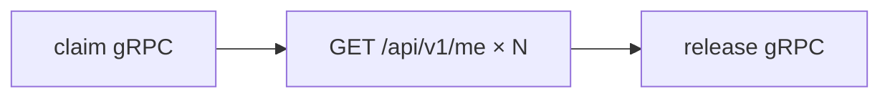

# Operator CLI (`pod_manager_cli`)

Terminal **2** in the [three-terminal setup](three-terminal-setup.md): gRPC control plane on **8804**, optional HTTP checks through **Envoy on 10000**.

## Install

```bash
cd pod_manager_cli
uv sync
```

## Environment

```bash
export POD_MANAGER_HOST=localhost
export POD_MANAGER_PORT=8804
export ENVOY_URL=http://localhost:10000
```

| Variable | Default | Purpose |
|----------|---------|---------|
| `POD_MANAGER_HOST` | `localhost` | router.svc gRPC host |
| `POD_MANAGER_PORT` | `8804` | router.svc gRPC port |
| `ENVOY_URL` | `http://localhost:10000` | HTTP smoke tests |

---

## Commands

### `pool` — registry snapshot

```bash
uv run pod-manager pool
uv run pod-manager pool --verbose
```

Lists pods from **both** `backend_pool` and `login_pod_pool` with state and `assigned_sub`.

**Healthy local output (abbreviated):**

```
free=3 claimed=0
backend-pool-node-0    backend_pool      free    -    backend-pool-node-0:8080
backend-pool-node-1    backend_pool      free    -    backend-pool-node-1:8080
login-pod              login_pod_pool    available -  login-pod:8080
```

---

### `claim` — acquire or resume backend lease

```bash
uv run pod-manager claim --sub alice@example.com
```

**New lease:**

```
acquired new lease
pod_id=backend-pool-node-0
...
```

**Existing lease (reconnect / idempotent):**

```
resumed existing lease
pod_id=backend-pool-node-0
...
```

Uses `AcquireLease` (idempotent). `already_leased` from the server drives the first line.

---

### `lease` — read current lease (no mutation)

```bash
uv run pod-manager lease --sub alice@example.com
```

Returns pod details or `no lease` if the subject has no backend assignment. Uses read-only `GetLease`.

---

### `release` — free backend lease

```bash
uv run pod-manager release --sub alice@example.com
```

Uses `ReleaseLease`. After release, HTTP API routes to login-pod again.

---

### `route` — single HTTP check

```bash
uv run pod-manager route --sub alice@example.com
```

Sends `GET {ENVOY_URL}/` with `x-test-sub`. Parses HTML or JSON for node name.

Requires an active lease for backend routing on `/`; prefer leased checks on `/api/v1/me` via `e2e`.

---

### `e2e` — sticky routing test

```bash
uv run pod-manager e2e --sub alice@example.com --repeats 3
```



1. `AcquireLease`  
2. `GET /api/v1/me` with `x-test-sub` — must parse same `backend_pool_node` each time  
3. `ReleaseLease`  

Exit **1** if responses are not sticky; **2** if gRPC unavailable.

---

### `heartbeat` — session refresh

```bash
uv run pod-manager heartbeat --sub alice@example.com --epoch 1780134520
```

Production idle-timeout path; reaper disabled locally.

---

### `config` — operator config RPCs

```bash
uv run pod-manager config env
```

Subcommands under `config` use service config RPCs (see `uv run pod-manager --help`).

---

## CLI test flows

### Flow 1 — Operator smoke (2 minutes)

```bash
uv run pod-manager pool
uv run pod-manager claim --sub alice@example.com
uv run pod-manager e2e --sub alice@example.com
uv run pod-manager pool   # one claimed, one free backend
```

### Flow 2 — Two tenants

```bash
uv run pod-manager claim --sub alice@example.com
uv run pod-manager claim --sub bob@example.com
uv run pod-manager claim --sub carol@example.com   # expect failure
```

### Flow 3 — HTTP without lease

```bash
curl -s -H 'x-test-sub: dave@example.com' http://localhost:10000/api/v1/me | jq .
# Expect no_backend_lease (403) — no claim step
```

### Flow 4 — Compare with web

| Step | CLI | Web |
|------|-----|-----|
| Identity | `--sub email` | Login form email |
| Lease | `claim` | `/lease` → Acquire |
| API | `e2e` or curl + header | `/home` auto fetch |
| Release | `release` | Release button on `/home` |

---

## Dev identity vs browser

| | CLI | Web |
|--|-----|-----|
| Identity to Envoy | Header `x-test-sub` | Cookie via BFF |
| Identity to router gRPC | `--sub` argument | Email from session in `/api/lease/*` |
| Login pod | Not used for gRPC | `POST /api/auth/login` |

Use the **same email string** for the same logical user (e.g. `alice@example.com`, not `alice`).

---

## Exit codes

| Code | Meaning |
|------|---------|
| 0 | Success |
| 1 | Application error (e.g. pool full, not sticky) |
| 2 | gRPC `UNAVAILABLE` (stack not running) |

---

## Related

- [apis-and-clients.md](apis-and-clients.md) — RPC reference  
- [automated-tests.md](automated-tests.md) — `test-local.sh` uses same tools  
- [pod_manager_cli/README.md](../../pod_manager_cli/README.md)
