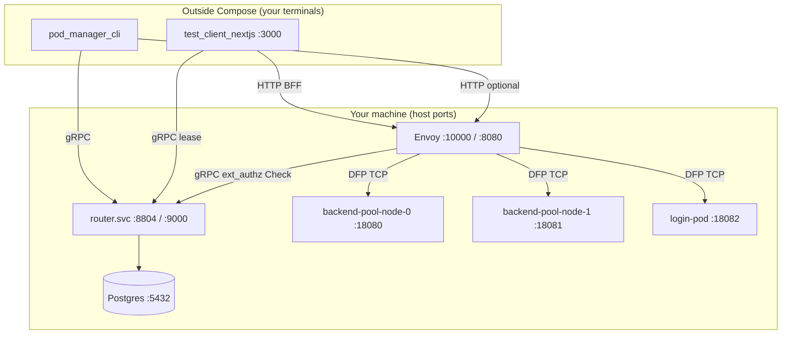

# Components (local stack)

Each service in `infra/docker/docker-compose.local.yml`: what it does **alone**, what it talks to, and how it appears in tests.

## Stack diagram

---

## Postgres

| | |
|--|--|
| **Image** | `postgres:16` (local container; shares the backend's DB in real deploys) |
| **Port** | 5432 |
| **Role** | Source of truth for `sub → pod`, pool registry, audit events |

### Tables (prefix `pm_`, created at startup via `CREATE TABLE IF NOT EXISTS`)

| Table | Purpose |
|-------|---------|
| `pm_backend_pool` | Leasable backend pods (`free` / `claimed`) |
| `pm_login_pod_pool` | Login pod registry (no per-user lease) |
| `pm_user_assignments` | Active backend lease per `sub` |
| `pm_assignment_events` | Audit trail |
| `pm_service_config` | Operator config key/value |
| `pm_solution_documents` | Template domain (not routing-critical locally) |

**Alone:** A plain Postgres container reachable on `localhost:5432`.  
**Together:** router.svc bootstraps the schema, reads/writes assignments; the seed script populates pool rows.

Scripts: `router.svc/server/tools/seed_local_pool.sh` (schema is auto-created — no table-creation step needed).

---

## router.svc (`router` service)

| | |
|--|--|
| **Build** | `router.svc/Dockerfile` |
| **Ports** | **8804** gRPC (`PodManagerService`), **9000** gRPC ext_authz |
| **Config** | `router.svc/server/app_config.toml` (mounted read-only) |

### Responsibilities

| Function | Detail |
|----------|--------|
| **Assignment** | `AcquireLease` / `ReleaseLease` with a single Postgres transaction (guarded `UPDATE ... WHERE state='free'`) |
| **ext_authz** | Envoy `Check`: validate identity → resolve upstream host |
| **Pool status** | `GetPoolStatus`, `GetBackendPoolAvailability` |
| **Heartbeat / reaper** | Disabled locally (`POD_MANAGER_REAPER_ENABLED=false`) |
| **Reconciliation** | Disabled locally (`POD_MANAGER_RECONCILIATION_ENABLED=false`) |

**Alone:** You can run the server on the host against Postgres — see [three-terminal-setup.md](three-terminal-setup.md) (prerequisites and stack).  
**Together:** Envoy calls ext_authz on every API request; CLI/Next call gRPC on 8804.

Local dev identity (`app_config.toml`):

- `dev_mode = true` → accept `x-test-sub` email header  
- Session cookie name `pod_manager_user` (from login pod)

---

## Envoy (`envoy` service)

| | |
|--|--|
| **Build** | `envoy/` |
| **Ports** | **10000** main HTTP listener, **8080** health (bypasses authz) |
| **Upstream config** | Static bootstrap + **dynamic forward proxy** |

### Responsibilities

| Function | Detail |
|----------|--------|
| **Ingress** | Single HTTP entry for API and login |
| **ext_authz filter** | gRPC to `router:9000`; `failure_mode_allow: false` |
| **Routing** | Upstream host from authz metadata (`x-route-upstream` → DFP cluster) |
| **Header hygiene** | Strips untrusted routing headers before authz (SR-5) |

**Alone:** `docker build ./envoy` runs `envoy --mode validate` in CI.  
**Together:** Only component browsers/ALB hit for **data-plane** HTTP; does not implement assignment logic.

---

## login-pod (`login-pod` service)

| | |
|--|--|
| **Source** | `pods/login_pod/` (FastAPI) |
| **Port** | 18082 → container 8080 |
| **Pool** | `login_pod_pool` in Postgres (state `available`) |

### HTTP API (direct)

| Method | Path | Response |
|--------|------|----------|
| GET | `/healthz` | `{"status":"ok"}` |
| POST | `/login` | JSON success + `Set-Cookie: pod_manager_user=<email>` |
| `*` | `/api/*` | **403** `no_backend_lease` |

**Alone:** `curl -X POST http://localhost:18082/login -H 'Content-Type: application/json' -d '{"user_name":"a@b.com","user_password":""}'`  
**Together:** Unleased users routed here **through Envoy** after ext_authz selects `login-pod:8080` upstream.

---

## backend_pool_node (×2)

| | |
|--|--|
| **Source** | `pods/backend_pool_node/` (aiohttp) |
| **Ports** | 18080 (`backend-pool-node-0`), 18081 (`backend-pool-node-1`) |
| **Pool** | `backend_pool` — one user per pod when `claimed` |

### HTTP API (direct)

| Method | Path | Notes |
|--------|------|-------|
| GET | `/healthz` | Plain `ok` |
| GET | `/` | HTML with `BACKEND_POOL_NODE_NAME` |
| GET | `/api/v1/me` | JSON identity; requires `x-user-sub` (set by Envoy after authz) |
| GET | `/api/v1/ping` | JSON ping |
| GET | `/api/me` | Alias of `/api/v1/me` |

**Alone:** Direct curl without `x-user-sub` returns **401**.  
**Together:** ext_authz adds `x-user-sub`; DFP connects to `backend-pool-node-N:8080` inside the compose network.

---

## test_client_nextjs (not in Compose)

| | |
|--|--|
| **Port** | 3000 (`npm run dev`) |
| **Role** | Human-friendly test UI + **BFF** routes |

Talks to **router.svc gRPC** for lease operations and **Envoy HTTP** (server-side) for backend API calls. See [web-test-client.md](web-test-client.md).

---

## pod_manager_cli (not in Compose)

| | |
|--|--|
| **Role** | Operator / automation against **8804** and optional **10000** |

See [cli-operator.md](cli-operator.md).

---

## Scripts (infra)

| Script | Role |
|--------|------|
| `infra/docker/start-local.sh` | Orchestrates Postgres → compose → seed |
| `infra/docker/test-local.sh` | Post-start smoke tests |
| `router.svc/server/tools/seed_local_pool.sh` | Seeds 2 backends + 1 login pod (`pm_*` tables) |

---

## Seed data (after fresh `-r`)

| pod_id | pool | DNS (compose network) |
|--------|------|------------------------|
| `backend-pool-node-0` | backend_pool | `backend-pool-node-0:8080` |
| `backend-pool-node-1` | backend_pool | `backend-pool-node-1:8080` |
| `login-pod` | login_pod_pool | `login-pod:8080` |

If you see `no-pod-available-pool-node` in `pod-manager pool`, your Postgres volume is stale — run `./infra/docker/start-local.sh -r -s -d`.
