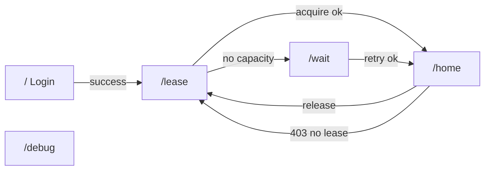
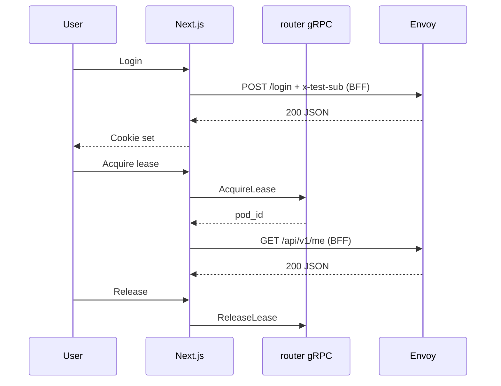
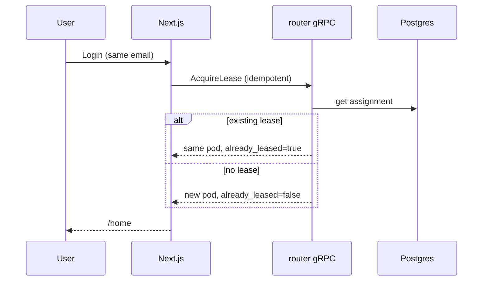
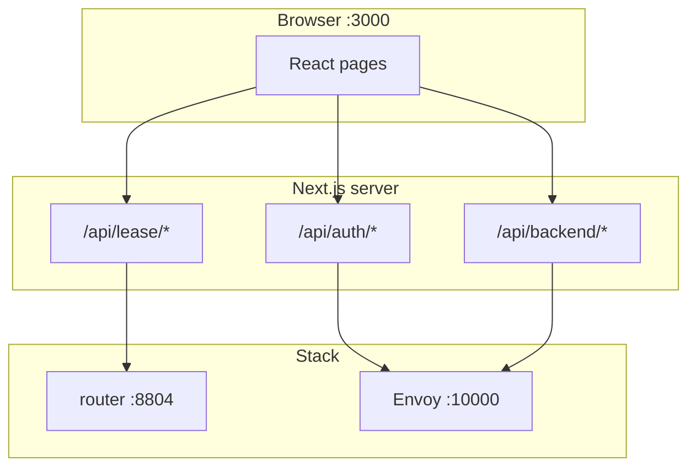

# Web test client (Next.js)

`test_client_nextjs/` is a **developer UI** for manual E2E validation — not the production SPA. It exercises login pool routing, backend lease acquisition, and backend API calls through the same patterns as a real app (cookie session + BFF → Envoy).

## Run (terminal 3)

Prerequisites: [three-terminal-setup.md](three-terminal-setup.md) terminal 1 up; client built once.

```bash
cd router.svc/client_ts && npm ci && npm run build
cd ../../test_client_nextjs && npm install
export NEXT_PUBLIC_ENVOY_URL=http://localhost:10000
export POD_MANAGER_GRPC_HOST=localhost
export POD_MANAGER_GRPC_PORT=8804
npm run dev
```

Open **http://localhost:3000**.

## UI map



| Page | Route | Purpose |
|------|-------|---------|
| Login | `/` | Email/password form → session cookie |
| Acquire lease | `/lease` | `AcquireLease` + “try API without lease” |
| Waiting | `/wait` | Pool full — countdown + auto-retry |
| Leased home | `/home` | `GET /api/v1/me` on your backend |
| Debug | `/debug` | Manual buttons for login/lease/API |

Sidebar also links **Log out** (`/api/auth/logout`).

---

## User test flows

### Flow A — Happy path (login → lease → backend API)

**Goal:** Confirm exclusive backend routing after lease.

| Step | Action | Expected |
|------|--------|----------|
| 1 | Open `/` | Login form |
| 2 | Enter email `alice@example.com`, any password | Redirect to `/lease` |
| 3 | Click **Acquire lease** | Redirect to `/home` |
| 4 | Wait for auto `GET /api/v1/me` | JSON with `backend_pool_node` (e.g. `backend-pool-node-0`) |
| 5 | Click **Release lease** | Back to `/lease` |
| 6 | Open `/home` without re-leasing | Redirect to `/lease` (no lease) |



---

### Flow B — API before lease (`no_backend_lease`)

**Goal:** Prove backend API is blocked until lease exists.

| Step | Action | Expected |
|------|--------|----------|
| 1 | Login as `bob@example.com` | On `/lease` |
| 2 | Click **Try backend API** | Preview shows **403** and `no_backend_lease` |
| 3 | Do **not** acquire lease | — |
| 4 | Navigate to `/home` | Redirect to `/lease` or error (no assignment) |

This mirrors production: login pool serves auth UI; business API requires a backend lease.

---

### Flow C — Pool exhausted (two users already leased)

**Goal:** Observe capacity handling with **2** seeded backends.

| Step | Action | Expected |
|------|--------|----------|
| 1 | Terminal 2: lease `alice@example.com` and `bob@example.com` | Both succeed |
| 2 | Browser: login as `carol@example.com` | `/lease` |
| 3 | Click **Acquire lease** | Redirect to `/wait` |
| 4 | Wait for countdown / auto-retry | Stays on wait until a pod is freed |
| 5 | Terminal 2: `uv run pod-manager release --sub alice@example.com` | Frees one pod |
| 6 | Browser wait page retries | Eventually reaches `/home` |

---

### Flow D — Multi-tab same user

| Step | Action | Expected |
|------|--------|----------|
| 1 | Login and acquire lease in tab 1 | `/home` shows pod A |
| 2 | Open tab 2 same browser | Same cookie → same `sub` → same backend |
| 3 | Release in tab 1 | Tab 2 API calls get `no_backend_lease` after refresh |

One assignment per `sub` (email) in Postgres.

---

### Flow F — Reconnect same user (new browser / machine)

**Goal:** Existing lease survives logout and browser close; same email resumes the same backend pod.

| Step | Action | Expected |
|------|--------|----------|
| 1 | Login and acquire lease as `keith@example.com` | `/home` shows pod A |
| 2 | **Release lease** or leave lease active; clear cookies / close browser | — |
| 3 | Log in again as `keith@example.com` on same or different browser | Auto-resume → `/home` on **same** `pod_id` |
| 4 | `uv run pod-manager lease --sub keith@example.com` | Same pod while lease active |

**Not in scope for this test client:** release on browser close, web heartbeat (production reaper idle TTL applies in prod only).



---

### Flow E — Debug page (power users)

Route: **`/debug`**

| Button | What it tests |
|--------|----------------|
| Session | `GET /api/session` |
| Availability | gRPC pool capacity |
| Acquire / Release | Lease RPCs |
| Login via BFF | `POST /api/auth/login` |
| backend `/api/v1/me` | Full BFF → Envoy → pod chain |

Use when a flow page fails and you need isolated calls.

---

## How the web app talks to the stack



| Concern | Path | Why |
|---------|------|-----|
| Session cookie on app origin | `/api/auth/login` | `pod_manager_user` on `:3000` |
| Lease mutations | `/api/lease/acquire` | Direct gRPC — not exposed to browser |
| Backend REST | `/api/backend/...` | Forwards session cookie to Envoy |

Client helper: `src/lib/backend-api.ts` → `fetch("/api/backend/api/v1/me")`.

---

## BFF login requirement (local dev)

Every request through Envoy on **:10000** is authorized by **ext_authz** (`failure_mode_allow: false`). The router must resolve a **`sub`** (email) before it can route to the login pool or a backend pod.

| Phase | Identity on the Envoy request | Mechanism |
|-------|------------------------------|-----------|
| **First login** | No session cookie yet | BFF **`POST /api/auth/login`** must send header **`x-test-sub: <email>`** (same value as JSON `user_name`, normalized lowercase) when proxying to **`POST {ENVOY_URL}/login`** |
| **After login** | Session established | BFF **`/api/backend/*`** forwards cookie **`pod_manager_user=<email>`**; ext_authz reads the cookie |
| **CLI / curl** | N/A | Send **`x-test-sub: <email>`** yourself (see [apis-and-clients.md](apis-and-clients.md)) |

**Why this is required:** On the first login the browser has no `pod_manager_user` cookie. Without **`x-test-sub`**, ext_authz denies the request (**403**, often with an **empty body**). A BFF that calls `res.json()` on that response will fail with **`Unexpected end of JSON input`** and return **500** to the browser.

**Local stack:** `POD_MANAGER_AUTH_DEV_MODE=true` (set in `infra/docker/docker-compose.local.yml`) enables **`x-test-sub`** as a dev identity source. Production uses Cognito JWT on **`Authorization`** instead; the test client BFF is not the production login path.

**Implementation:** `test_client_nextjs/src/app/api/auth/login/route.ts` — must set **`x-test-sub`** from the login email before `fetch` to Envoy. Do not remove this when changing the BFF.

**Verify manually:**

```bash
# Fails closed (403, empty body) — expected without identity
curl -s -o /dev/null -w "%{http_code}\n" -X POST http://localhost:10000/login \
  -H 'Content-Type: application/json' \
  -d '{"user_name":"alice@example.com","user_password":"x"}'

# Succeeds when dev identity is present
curl -s -X POST http://localhost:10000/login \
  -H 'Content-Type: application/json' \
  -H 'x-test-sub: alice@example.com' \
  -d '{"user_name":"alice@example.com","user_password":"x"}'
```

---

## Environment variables

| Variable | Default | Purpose |
|----------|---------|---------|
| `NEXT_PUBLIC_ENVOY_URL` | `http://localhost:10000` | BFF upstream base URL |
| `POD_MANAGER_GRPC_HOST` | `localhost` | Lease RPCs |
| `POD_MANAGER_GRPC_PORT` | `8804` | Lease RPCs |

---

## Parallel testing with CLI (terminal 2)

| Scenario | Web | CLI |
|----------|-----|-----|
| Same user | Login `alice@…` | `claim --sub alice@…` (idempotent) |
| Different users | alice + bob in browser/CLI | Max 2 leases |
| Observe pool | `/debug` availability | `pod-manager pool` |

CLI uses `x-test-sub`; web uses cookie — same `sub` string must match for the same assignment.

---

## Related

- Call flows: [architecture-and-flows.md](architecture-and-flows.md)  
- APIs: [apis-and-clients.md](apis-and-clients.md)  
- Package README: [test_client_nextjs/README.md](../../test_client_nextjs/README.md)
