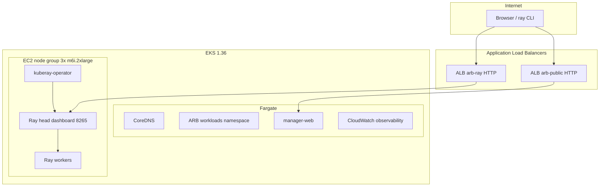

# ARB container images, EKS, and local compose

Docker build definitions, local orchestration, and pointers to AWS ECR/EKS Terraform under [`infra/aws/aws_tf/`](../aws_tf/).

The AWS stack uses a **hybrid EKS cluster**:

- **Fargate** — `kube-system`, ARB microservice workloads (IAM, frontend, …), CloudWatch observability.
- **EC2 managed node group** — KubeRay (Ray head + workers) on `ray.io/node-pool=ray`, 3 × `m6i.2xlarge`.

Control plane version: **Kubernetes 1.36** (`modules/eks_platform`).

---

## Layout

| Path | Purpose |
|------|---------|
| `../../iam.svc/server/Dockerfile` (and siblings) | **Canonical** Python gRPC image per service |
| `../../manager-web/Dockerfile` | **Canonical** manager-web (Next.js) image |
| `images/python-grpc-service/Dockerfile` | Deprecated shared template |
| `images/frontend/Dockerfile` | Deprecated copy of frontend Dockerfile |
| `compose/docker-compose.yml` | Local six-service stack |
| `scripts/rebuild_all.py` | Build all images (and optionally `compose up` / `down`) |
| `scripts/deploy_to_aws.py` | Thin wrapper → `make/build.py dev` |
| `../../make/build.py` | Unified entry: `local` / `dev` / `test` / `prod` (see repo `Makefile`) |
| `scripts/deploy_lib.py` | Shared phases (Terraform var-files, ECR, Helm/EKS, validation) |
| `scripts/post_deploy.py` | Post-Terraform only (build → ECR → Helm → curl) |
| [`../aws/aws_tf/`](../aws_tf/) | **Terraform root** — EKS, ECR, IRSA, KubeRay |
| [`../aws/aws_tf/modules/workloads_infra/`](../aws_tf/modules/workloads_infra/) | VPC, EKS platform, ALB controller, node group, KubeRay |
| [`../aws/aws_tf/modules/containers_stack/`](../aws_tf/modules/containers_stack/) | ECR repos + shared workload IRSA |
| [`../deployed/aws/017868795096/us-east-1/helm/workload/`](../deployed/aws/017868795096/us-east-1/helm/workload/) | Shared Helm chart for ARB microservices |
| [`../../doc/examples/ray_hello_world.py`](../../doc/examples/ray_hello_world.py) | Distributed Ray hello-world sample |

Ownership markers for AWS primitives live under
`infra/deployed/aws/<account>/<region>/services/<service>/terraform/aws/{ecr,eks}/`
(including `ray.platform` and `manager-web`).

---

## EKS architecture (hybrid)



| Surface | Ingress group | Backend | URL |
|---------|---------------|---------|-----|
| Ray Dashboard + Jobs API | `arb-ray` | `ray-cluster-head-svc:8265` | `terraform output -raw ray_dashboard_url` |
| Ray Prometheus metrics | `arb-ray` | `/metrics` → head metrics `:8080` | `terraform output -raw ray_metrics_url` |
| manager-web (public UI) | `arb-public` | `manager-web:8811` | `kubectl get ingress manager-web -o jsonpath='{.status.loadBalancer.ingress[0].hostname}'` |
| Other ARB microservices | `arb-public` | per-service Helm release (ClusterIP) | In-cluster only unless `exposeLoadBalancer` is set |

Both ALBs are **HTTP-only** on the AWS-assigned DNS name (no ACM cert on the raw ALB hostname). The Ray Dashboard has **no built-in authentication** — restrict with network controls or add HTTPS/auth for production.

---

## Deploy to AWS (step-by-step)

End-to-end deployment of EKS, KubeRay, manager-web on the shared `arb-public` ALB, and supporting AWS resources.

### Prerequisites

| Requirement | Check |
|-------------|--------|
| AWS CLI profile `kt-acc` | `aws sts get-caller-identity --profile kt-acc --region us-east-1` → account `017868795096` |
| Terraform ≥ 1.5 | `terraform version` |
| kubectl + helm | `kubectl version --client` / `helm version` |
| Optional (ARB app images) | Docker, service `.env.local` files — see [REDEPLOY.md](../aws_tf/REDEPLOY.md) |

Set the profile for every shell session used for deploy and kubectl:

```bash
export AWS_PROFILE=kt-acc
export AWS_REGION=us-east-1
```

### 1. One-time: bootstrap remote state (new account only)

If `terraform init` fails with **S3 bucket does not exist**, create the state bucket once:

```bash
export AWS_PROFILE=kt-acc
export AWS_REGION=us-east-1

aws s3api create-bucket \
  --bucket arb-ai-assistant-terraform-state \
  --region us-east-1

aws s3api put-bucket-versioning \
  --bucket arb-ai-assistant-terraform-state \
  --versioning-configuration Status=Enabled

aws s3api put-bucket-encryption \
  --bucket arb-ai-assistant-terraform-state \
  --server-side-encryption-configuration \
  '{"Rules":[{"ApplyServerSideEncryptionByDefault":{"SSEAlgorithm":"AES256"}}]}'

aws s3api put-public-access-block \
  --bucket arb-ai-assistant-terraform-state \
  --public-access-block-configuration \
  BlockPublicAcls=true,IgnorePublicAcls=true,BlockPublicPolicy=true,RestrictPublicBuckets=true
```

### 2. Configure environment tfvars

Edit [`infra/aws/envs/dev/terraform.tfvars`](../envs/dev/terraform.tfvars) (committed dev overrides). Minimum flags:

```hcl
containers_eks_enabled = true
kuberay_enabled        = true
```

Root defaults live in [`infra/aws/aws_tf/terraform.tfvars`](../aws_tf/terraform.tfvars). Apply merges **both** (dev file overrides VPC and env-specific values):

```bash
cd infra/aws/aws_tf
terraform plan  -var-file=../envs/dev/terraform.tfvars
terraform apply -var-file=../envs/dev/terraform.tfvars
```

Leave `containers_existing_vpc_id` unset to **create a new VPC**. Set it only when reusing an existing VPC and subnets in the same account.

### 3. Plan and apply

```bash
cd infra/aws/aws_tf
terraform init -input=false
terraform plan -input=false -var-file=../envs/dev/terraform.tfvars -out=tfplan
terraform apply -input=false tfplan
```

First apply typically takes **30–60 minutes** (VPC, EKS 1.36, three `m6i.2xlarge` nodes, Helm releases for ALB controller, KubeRay, RayCluster).

If apply **stops partway**, fix the reported error and re-run plan + apply — Terraform is resumable; already-created resources are skipped.

**Phased apply** if Helm/kubernetes steps time out or the EKS API is not ready yet:

```bash
terraform apply -input=false -var-file=../envs/dev/terraform.tfvars \
  -target=module.workloads_infra -auto-approve

terraform apply -input=false -var-file=../envs/dev/terraform.tfvars -auto-approve
```

**Automated pipeline** (Terraform + Docker build + ECR + Helm for ARB services):

```bash
python3 make/scaffold_secrets.py dev   # once, if using app secrets
python3 make/build.py dev --yes        # if make/build.py exists in your checkout
```

See also [`infra/aws/aws_tf/REDEPLOY.md`](../aws_tf/REDEPLOY.md).

### 4. Configure kubectl

```bash
cd infra/aws/aws_tf
aws eks update-kubeconfig \
  --profile kt-acc \
  --region us-east-1 \
  --name "$(terraform output -raw containers_eks_cluster_name)"
```

### 5. Verify KubeRay and manager-web ALB

```bash
kubectl get nodes -l ray.io/node-pool=ray
kubectl -n kuberay get pods,rayclusters,ingress
kubectl -n "$(terraform output -raw containers_k8s_namespace)" get ingress manager-web
kubectl -n kube-system get pods -l app.kubernetes.io/name=aws-load-balancer-controller
```

Expected: **3 Ready** EC2 nodes; KubeRay operator + Ray head/workers **Running**; manager-web Ingress with ALB hostname when deployed; ALB controller **Running**.

### 6. Get public URLs (wait 2–5 minutes after apply)

```bash
cd infra/aws/aws_tf
terraform output -raw ray_dashboard_url
terraform output -raw ray_metrics_url
kubectl -n "$(terraform output -raw containers_k8s_namespace)" get ingress manager-web \
  -o jsonpath='{.status.loadBalancer.ingress[0].hostname}'
```

If outputs are empty, read Ingress hostnames (ALB still provisioning):

```bash
kubectl -n kuberay get ingress ray-cluster-dashboard \
  -o jsonpath='{.status.loadBalancer.ingress[0].hostname}{"\n"}'
kubectl -n "$(cd infra/aws/aws_tf && terraform output -raw containers_k8s_namespace)" get ingress manager-web \
  -o jsonpath='{.status.loadBalancer.ingress[0].hostname}{"\n"}'
```

Quick checks:

```bash
curl -sI "http://$(kubectl -n "$(cd infra/aws/aws_tf && terraform output -raw containers_k8s_namespace)" get ingress manager-web -o jsonpath='{.status.loadBalancer.ingress[0].hostname}')/"
curl -sI "$(terraform output -raw ray_dashboard_url)"
```

### 7. Run a distributed Ray job

```bash
pip install "ray[default]==2.55.1"
export RAY_ADDRESS="$(cd infra/aws/aws_tf && terraform output -raw ray_dashboard_url)"
ray job submit --address "$RAY_ADDRESS" -- python doc/examples/ray_hello_world.py
ray job list --address "$RAY_ADDRESS"
```

### 8. Tear down (optional)

```bash
cd infra/aws/aws_tf
terraform destroy -var-file=../envs/dev/terraform.tfvars
```

Remote state in `arb-ai-assistant-terraform-state` is retained. EC2 node group and ALBs are destroyed with the stack.

---

## Terraform flags (`infra/aws/aws_tf/terraform.tfvars`)

| Variable | Default (this repo) | Effect |
|----------|---------------------|--------|
| `containers_eks_enabled` | `true` | EKS Fargate cluster, ECR, IRSA, ALB controller |
| `kuberay_enabled` | `true` | EC2 node group + KubeRay operator + RayCluster + Ray ALB |
| `ray_node_count` | `3` | Fixed EC2 nodes (min = desired = max) |
| `ray_node_instance_type` | `m6i.2xlarge` | 8 vCPU / 32 GiB per node |
| `ray_image_tag` | `2.55.1` | Ray container image |
| `ray_alb_ingress_group_name` | `arb-ray` | Dedicated ALB for Ray |

**EKS version upgrades:** only one minor version per step. An existing 1.31 cluster must go 1.32 → … → 1.36; a new cluster starts at 1.36.

---

## KubeRay — getting started

### 1. Enable and apply

Already enabled in `terraform.tfvars` when `kuberay_enabled = true`. See [Terraform flags](#terraform-flags-infraawsaws_tfterraformtfvars) above.

### 2. Configure kubectl

```bash
aws eks update-kubeconfig \
  --profile kt-acc \
  --region us-east-1 \
  --name "$(cd infra/aws/aws_tf && terraform output -raw containers_eks_cluster_name)"
```

### 3. Verify cluster state

```bash
kubectl get nodes -l ray.io/node-pool=ray
kubectl -n kuberay get pods,rayclusters,ingress
```

Expected: **3 Ready nodes**, KubeRay operator Running, Ray head + workers Running.

### 4. Get ALB URLs

ALB DNS names appear **2–5 minutes** after apply:

```bash
cd infra/aws/aws_tf
terraform output ray_dashboard_url
terraform output ray_metrics_url
kubectl -n "$(terraform output -raw containers_k8s_namespace)" get ingress manager-web \
  -o jsonpath='{.status.loadBalancer.ingress[0].hostname}'
```

If Ray outputs are empty, read hostnames from Ingress status:

```bash
kubectl -n kuberay get ingress ray-cluster-dashboard -o jsonpath='{.status.loadBalancer.ingress[0].hostname}'
```

Open in a browser:

- Ray Dashboard: `http://<ray-alb-host>/`
- manager-web: `http://<arb-public-alb-host>/`

---

## Web interface, API, and monitoring

| What | How to access | Notes |
|------|---------------|-------|
| **Ray Dashboard** | `ray_dashboard_url` | Jobs, Actors, Cluster, Logs |
| **Ray Jobs API** | same URL as dashboard | REST on port 8265 via ALB port 80 |
| **Submit Ray jobs** | `ray job submit --address http://<ray-alb>/` | Requires Ray CLI |
| **Prometheus metrics** | `ray_metrics_url` | Ray head `/metrics` |
| **CloudWatch (cluster)** | output `eks_cloudwatch_dashboard_name` | Container Insights + control plane |
| **manager-web** | `arb-public` ALB ingress | Primary public UI on port 8811 |

Cluster-internal fallback (no ALB):

```bash
kubectl -n kuberay port-forward svc/ray-cluster-head-svc 8265:8265
# open http://localhost:8265
```

---

## CLI tools

### Ray CLI

```bash
pip install "ray[default]==2.55.1"
ray --version
```

Common commands after setting `RAY_ADDRESS` to the dashboard URL:

```bash
export RAY_ADDRESS="$(cd infra/aws/aws_tf && terraform output -raw ray_dashboard_url)"
ray status
ray job list --address "$RAY_ADDRESS"
```

### kubectl-ray plugin

```bash
kubectl krew install ray
# or: download kubectl-ray v1.6.1 from KubeRay GitHub releases

kubectl ray get cluster -n kuberay
kubectl ray get pod -n kuberay
kubectl ray logs -n kuberay
```

---

## Hello-world Ray job (distributed)

From the repository root, with the dashboard ALB reachable:

```bash
export RAY_ADDRESS="$(cd infra/aws/aws_tf && terraform output -raw ray_dashboard_url)"

ray job submit --address "$RAY_ADDRESS" -- python doc/examples/ray_hello_world.py
ray job list --address "$RAY_ADDRESS"
# ray job logs --address "$RAY_ADDRESS" <job_id>
```

The script in [`doc/examples/ray_hello_world.py`](../../doc/examples/ray_hello_world.py) runs eight `@ray.remote` tasks and prints which worker node executed each one.

---

## EKS CloudWatch observability

When `containers_eks_enabled = true`, Terraform also provisions:

| Component | Purpose |
|-----------|---------|
| **`amazon-cloudwatch-observability` EKS addon** | Container Insights (Fargate + EC2 nodes) via IRSA |
| **Control plane logs** | `/aws/eks/<cluster>/cluster` |
| **Fargate container logs** | `/arb/<solution>/eks/<cluster>/containers` + per-service routing |
| **Container Insights logs** | `/aws/containerinsights/<cluster>/application` (and performance/dataplane) |
| **CloudWatch dashboard** | metrics + Logs Insights widgets — output `eks_cloudwatch_dashboard_name` |

Application structured logs (OpenTelemetry / SDK) use per-service log groups from `cloudwatch_application_logs`.

---

## Services and ports

| Service | Compose name | Port | AWS ECR repo (when EKS enabled) |
|---------|--------------|------|----------------------------------|
| IAM | `iam` | 8803 | `arb-ai-assistant-iam-svc` |
| Solutions | `solutions` | 8804 | `arb-ai-assistant-solutions-svc` |
| Storage | `storage` | 8805 | `arb-ai-assistant-storage-svc` |
| General AI agent | `general-ai-agent` | 8806 | `arb-ai-assistant-general-ai-agent-svc` |
| Notification | `notification` | 8807 | `arb-ai-assistant-notification-svc` |
| Frontend | `frontend` | 8802 | `arb-ai-assistant-frontend` |
| Manager web | `manager-web` | 8811 | `arb-ai-assistant-manager-web` (ALB via `arb-public`) |

---

## Local prerequisites

1. Docker Engine with Compose v2.
2. Per-service AWS credentials in `*/server/.env.local` (copy from `*/server/.env.example`).
3. Optional: `infra/containers/compose/.env.local` from `compose/.env.local.example` for `AUTH_SECRET` and IAM bootstrap values.

---

## Fast local dev (bare metal, no Docker)

From the **repository root**:

```bash
make start-local  # IAM, solutions, storage, general AI agent, notification, frontend (8802)
make stop-local
```

Requires Python venvs per `*/server/README.md` and `npm install` in `frontend/`. Uses `infra/envs/dev/local.env` for loopback gRPC hosts.

---

## Build images

```bash
make build-dockers
python3 make/build_docker.py --skip-compile
python3 infra/containers/scripts/rebuild_all.py
```

---

## Build and run (Compose)

```bash
python3 infra/containers/scripts/rebuild_all.py --up
python3 infra/containers/scripts/rebuild_all.py --down
python3 infra/containers/scripts/rebuild_all.py --service iam --up
```

Open the UI at http://127.0.0.1:8802.

---

## Frontend configuration (`APP_ENV` + `APP_TARGET`)

| Target | `APP_TARGET` | gRPC hosts (default) |
|--------|--------------|----------------------|
| bare metal (`make start-local`) | `local` | `127.0.0.1` (see `infra/envs/dev/local.env`) |
| Docker Compose | `local` + `compose.env` | Compose service names |
| EKS Fargate | `aws` | `<service>.<namespace>.svc.cluster.local` (in `infra/envs/<env>/k8s.tfvars`) |

---

## AWS: ECR + EKS (automated deploy)

From the **repository root**:

```bash
make build-dev          # or: python3 make/build.py dev --yes
make start-aws ARGS="--yes"
```

Per-environment config: `infra/envs/{dev,test,prod}/terraform.tfvars`, `k8s.tfvars`.
Secrets: `python3 make/scaffold_secrets.py dev` → `infra/envs/<env>/secrets.auto.tfvars`.

### Key Terraform outputs

| Output | Description |
|--------|-------------|
| `containers_eks_cluster_name` | EKS cluster name |
| `containers_k8s_service_dns_names` | In-cluster gRPC hostnames |
| `ray_dashboard_url` | Ray Dashboard + Jobs API (ALB) |
| `ray_metrics_url` | Ray head Prometheus metrics (ALB) |
| `ray_node_group_name` | EC2 managed node group |
| `kuberay_namespace` | `kuberay` |
| `eks_cloudwatch_dashboard_name` | CloudWatch dashboard |

ECR repositories use lifecycle policies (expire untagged after 1 day, keep last 10 tagged images).

---

## Configuration reference (KubeRay)

| Setting | Location |
|---------|----------|
| Enable KubeRay | `kuberay_enabled` in `terraform.tfvars` |
| manager-web ALB | `expose_load_balancer` on `manager_web` in `containers_stack` (`arb-public` group) |
| Node count / instance type | `ray_node_count`, `ray_node_instance_type` |
| Ray image | `ray_image_repository`, `ray_image_tag` |
| Worker replicas | `ray_worker_min_replicas`, `ray_worker_max_replicas` |
| KubeRay chart versions | `kuberay_operator_chart_version`, `kuberay_ray_cluster_chart_version` |
| Ray ALB group | `ray_alb_ingress_group_name` |
| Shared Lustre / S3 on Ray | `fsx_lustre_enabled`, `s3_shared_files_enabled` — mounts `/mnt/lustre`, `/mnt/s3-files` on head + workers |
| Ray mount health | `ray_cluster` module — init wait, watchdog sidecar, exec probes; pod restart on sustained failure |
| Shared mount security | FSx SG allows cluster + workload SGs; Ray nodes attach both; FSx CSI IRSA; pod `fsGroup`/`runAsUser` 1000 |
| Lustre client on nodes | When `fsx_lustre_enabled`, Ray nodes install `lustre-client` via AL2023 nodeadm user_data (required for CSI mounts) |
| Lustre AZ alignment | FSx and Ray node group use the same private subnet (`eks_private_subnet_ids[0]`) when Lustre is enabled |
| S3 shared files | `s3_shared_files_enabled` — bucket + Mountpoint S3 CSI EKS add-on; PVC `shared-s3-files` at `/mnt/s3-files` |
| S3 mount options | `region <region>`, `prefix shared/`, `allow-other`, `allow-delete`, `allow-overwrite` (space-separated Mountpoint flags) |
| S3 IAM | IRSA on `s3-csi-driver-sa`; scoped `ListBucket` + object CRUD under `shared/` prefix |
| Terraform modules | `infra/aws/aws_tf/modules/{eks_node_group,kuberay_operator,ray_cluster,lustre_shared_mount,s3_shared_mount}/` |

---

## Troubleshooting

| Symptom | Likely cause | Action |
|---------|--------------|--------|
| No EC2 nodes | Node group still creating or failed IAM/subnet | `kubectl get nodes`; check EC2 Auto Scaling in AWS console |
| Ray pods Pending | Node group not ready or insufficient CPU/memory | `kubectl describe pod -n kuberay` |
| ALB hostname empty | Controller still provisioning | Wait 2–5 min; `kubectl -n kube-system get pods -l app.kubernetes.io/name=aws-load-balancer-controller` |
| ALB DNS not resolving yet | New load balancer still propagating | Wait 2–5 min after Ingress shows a hostname; retry `curl` |
| Ray and manager-web share one ALB | `IngressClassParams` had a default `group.name` | Fixed in `eks_alb_controller` — each Ingress sets its own `alb.ingress.kubernetes.io/group.name` |
| `ray job submit` fails | Dashboard URL wrong or head not Ready | Verify `kubectl -n kuberay get pods`; test `curl -I "$RAY_ADDRESS"` |
| manager-web 502 | Targets not healthy | `kubectl get pods -l app.kubernetes.io/instance=manager-web`; check ALB target group health |
| OpenSearch collection fails | Encryption policy not ready | Re-run apply; `docstore_search` waits for encryption + network policies |
| ALB controller Helm 404 | Stale chart repo URL | Controller uses `https://aws.github.io/eks-charts` |
| `kubernetes Unauthorized` mid-apply | EKS auth token expired on long apply | Re-run `terraform apply`; use phased apply for workloads |
| Helm apply timeout | Large Ray image pull | Re-run `terraform apply`; chart timeout is 900s |
| Ray lustre/S3 I/O errors | Stale CSI mount after node or network blip | Watchdog restarts pod; check `shared-mount-watchdog` sidecar logs |
| S3 mount empty or wrong prefix | Incorrect mountOptions format or IAM prefix scope | Verify PV mountOptions use `region us-east-1` not `region=us-east-1`; check `kubectl describe pv shared-s3-files-*` |
| EKS upgrade rejected | Multi-minor jump | Upgrade one version at a time |

---

## Dependencies (summary)

| Service | AWS / data dependencies |
|---------|---------------------------|
| **iam.svc** | DynamoDB (IAM tables) |
| **solutions.svc** | DynamoDB (solutions + history) |
| **storage.svc** | SQLite volume (Compose) / ephemeral path (EKS), S3 `exlservice-arb-general` |
| **notification.svc** | SNS notifications topic |
| **collaboration.svc** | DynamoDB (aliases + discussions) |
| **document-storage.svc** | DynamoDB, S3, OpenSearch Serverless, Bedrock embeddings (IRSA) |
| **general.ai.agent.svc** | Amazon Bedrock (IRSA) |
| **arch.diagram.agent.svc** | Bedrock + DynamoDB; gRPC to document-storage and storage |
| **frontend** | gRPC to backends (ClusterIP; no public ALB) |
| **manager-web** | Public UI via `arb-public` ALB (`expose_load_balancer = true`) |
| **KubeRay / Ray** | EC2 node group, Docker Hub `rayproject/ray` image, dedicated ALB |

**arch.diagram.agent.svc** is the only Python microservice that calls other gRPC services outbound; **manager-web** is the primary public UI on the shared app ALB.
