# Strangler Fig Extraction Analysis — MIDAS (`bu-analytics-gen-ai-midas`)

> **Changelog**
> | Phase | Date | Sections touched |
> |-------|------|------------------|
> | 0 — Bootstrap & Repo Onboarding | 2026-06-17 | Document created; §0 Repo Onboarding; full TOC scaffold (C6 + C13 + C17 + C22 placeholders) |
> | 1 — Frontend Flow Discovery | 2026-06-17 | §1 Executive summary + L0 diagram; §2 Stage index (FE-led); G-P0-02 CLOSED |
| 2–19 — Full runbook chain | 2026-06-17 | §3–§21 complete; TEST-PLAN.md assembled (Phase 13) |
| Validation pass | 2026-06-17 | 03G/C8 enrichment; §8.1 per-stage; §9.3 dispatch; §10 seq; §17 threat delta; §19 FMEA+rollout; §20 dashboards; §21 audit; G-P0-02/G-P2-01 CLOSED |
| Final audit pass | 2026-06-17 | Gap closures §7; §7.1 E-01–E-14; Stage 4 complete; C10 all stages; §8 C14 full; §9.4; §4.5; TEST-PLAN R8–R9 | Stage 4 complete; C10 tables all stages; §8 C14 full; §9.4 deferred units; §4.5 boundary edge cases |

**Analysis scope:** `bu-analytics-gen-ai-midas` **backend** and **frontend** only. Infrastructure (`deploy/`, `pod_manager/`, `k8s/`) is out of scope unless later phases need I/O seam references.

**Read-only guarantee:** This analysis chain is **documentation-only**. No application code in `bu-analytics-gen-ai-midas` is modified. Work products live under `rearchitetc/refactor_output/`.

**Input codebase root:** `bu-analytics-gen-ai-midas/`

---

## 0. Repo Onboarding & Bootstrap

### 0.1 Read-only operating mode

| Item | Status | Evidence |
|------|--------|----------|
| Application code mutation | **Prohibited** | CONTRACT C4 rule 2 (`phase-0-bootstrap-onboarding.prompt.md`) |
| Allowed writes | `rearchitetc/refactor_output/strangler-fig-analysis.md`, `rearchitetc/refactor_output/LEDGER.md` | User-directed output path |
| Recommended git practice | Analysis branch (e.g. `analysis/strangler-fig`); no commits to app paths | `rearchitetc/refactor_runbook/00-RUNBOOK.md:12` |

### 0.2 Repo map (backend + frontend)

| Concern | Location | Role | Evidence |
|---------|----------|------|----------|
| **Frontend (React + Vite SPA)** | `bu-analytics-gen-ai-midas/frontend/` | User-facing SPA; model-builder breadcrumb stages; API client | `frontend/package.json:10-11` (Vite scripts); `frontend/vite.config.ts:8-9` (`defineConfig`); `frontend/src/main.tsx:10-13` (React root) |
| **App shell & routing** | `frontend/src/App.tsx` | Routes: `/data`, `/models` (Model Builder), auth-gated pages | `frontend/src/App.tsx:110-136` |
| **Login / session** | `frontend/src/services/authService.ts`, `frontend/src/components/AuthModal.tsx`, `frontend/src/contexts/UserContext.tsx` | Email/password → `POST /api/v1/auth/login`; session + Bearer JWT | `authService.ts:4-5,20-22,81`; `AuthModal.tsx:34`; `UserContext.tsx:43-44` |
| **Protected routes** | `frontend/src/components/ProtectedRoute.tsx` | Unauthenticated users redirected from protected paths | `ProtectedRoute.tsx:13-16` |
| **Model-builder stages (breadcrumb)** | `frontend/src/pages/ModelBuilder.tsx` | Ordered stages: Objectives → Data Treatment → … → Model Training (4.5) → Evaluation → … | `ModelBuilder.tsx:1338-1358` |
| **Data Treatment UX** | `frontend/src/components/steps/Step2DataQC.tsx` | Step 2 UI titled "Data Treatment"; DQS/QC panels | `Step2DataQC.tsx:509-512` |
| **CSV upload UX (Objectives step)** | `frontend/src/components/steps/Step1ObjectivesData.tsx`, `frontend/src/pages/DataIngestion.tsx` | Local CSV drag-and-drop; credit-rating dataset ingest | `DataIngestion.tsx:357-381` (CSV-only upload) |
| **Chunked upload client** | `frontend/src/services/fastApiService.ts` | Resumable chunked upload to backend (`/upload-chunked/*`) | `fastApiService.ts:1495-1531` |
| **Auto-training client** | `frontend/src/services/fastApiService.ts` | `POST /auto-training/run`, SSE stream, status polling | `fastApiService.ts:4320,4193-4202` |
| **Backend entry (FastAPI)** | `bu-analytics-gen-ai-midas/backend/main.py` | App factory; router registration; S3 storage init at startup | `main.py:51-55,85-90,314-322` |
| **Auth API** | `backend/app/api/auth_routes.py` | Login, tokens, session integration | `auth_routes.py:38-39,180` |
| **Upload API** | `backend/app/api/routes.py` (`upload_router`) | `POST /api/v1/upload` — CSV ingest, validation, SSE stages | `routes.py:1427-1428` |
| **Chunked upload API** | `backend/app/api/chunked_upload.py` | `POST/PATCH/POST` init/chunk/finalize → storage key | `chunked_upload.py:1-10,508-511` |
| **S3 object storage** | `backend/app/services/object_storage/s3_object_storage.py`, `factory.py` | S3-backed `put_object` / `get_object`; upload prefix | `s3_object_storage.py:21-31,47-54`; `factory.py:93` |
| **Streaming upload → S3** | `backend/app/services/dataset_service.py` | `save_uploaded_file_streaming` — 2 MiB chunks → temp file → `store.upload_file_path` | `dataset_service.py:23,413-427` |
| **S3 → pandas load** | `backend/app/services/dataset_service.py` | `load_dataset` — Parquet sidecar preferred, else CSV bytes → `pd.read_*` | `dataset_service.py:991-1014,1020-1021` |
| **In-process DataFrame state** | `backend/app/services/dataframe_state_manager.py` | Lazy alias of S3-loaded frame per dataset/scope | `dataframe_state_manager.py:499-536` |
| **Data treatment (DQS)** | `backend/app/services/dqs_service.py`, `routes.py` | Data Quality Score dimensions; `GET /datasets/{id}/dqs` | `dqs_service.py:1-8,62-79`; `routes.py:6466,6607-6609` |
| **Auto-training orchestration** | `backend/app/services/model_training_auto_training.py` | `ModelTrainingAutoTrainingService.run_complete_auto_training` | `model_training_auto_training.py:333,4776-4783,5134` |
| **Auto-training API** | `backend/app/api/routes.py` (`chat_router`) | `POST /auto-training/run` → background job → `auto_training_service` | `routes.py:9120-9139,15573-15577` |
| **Core training compute** | `backend/app/services/model_training_auto_training.py` | `train_models_with_iterations` — fit/search loop over algorithms | `model_training_auto_training.py:2466-2477,5005-5011` |
| **Legacy auto-train endpoint** | `backend/app/api/routes.py` | `POST /auto-train-model` → `model_training_service.run_auto_training` (older path) | `routes.py:13654-13685` |

#### End-to-end data path (confirmed at bootstrap)

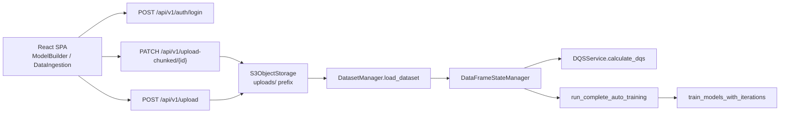

### 0.3 Primary extraction targets

Per the strangler brief and runbook (G16), the **singular highest-value cut** is pinned here for all later phases.

| Target | Symbol | Location | Why highest-value strangler candidate |
|--------|--------|----------|---------------------------------------|
| **Core training compute function** | `train_models_with_iterations` | `backend/app/services/model_training_auto_training.py:2466` | **Compute-heavy:** multi-algorithm fit, hyperparameter search (`fit` loops at `:3256-3259`), parallel `joblib` work; peak RAM holds multiple train/test matrix copies (`model_training_auto_training.py:13-17`). **Clean callable boundary:** inputs = scoped `DataFrame` + column lists + `algorithm_config`; output = serializable training results dict. **Scales with row count** — dominant cost at 5M+ rows and projected 1 TB workloads (C14). |
| **Auto-training pipeline** | `run_complete_auto_training` | `backend/app/services/model_training_auto_training.py:4776` | **Orchestration seam:** loads scoped data from `dataframe_state_manager` / `dataset_manager` (`:4825-4849`), runs variable + algorithm selection, delegates to `train_models_with_iterations` (`:5005-5011`), persists artifacts. **FE contract already externalized** via `POST /auto-training/run` + job polling (`routes.py:15573-15577`, `fastApiService.ts:4320`). **Parity-critical:** stochastic training (Optuna/sklearn seeds) — C25 seeds required. |

**Secondary (not primary) targets deferred to later phases:** DQS/data-treatment (`dqs_service.py`), upload/S3 ingest (`dataset_service.py`), segmentation, feature engineering, MEEA evaluation — analyzed as stages in §3 but not the first cut.

**Legacy path (closed in Phase 1):** `fastApiService.autoTrainModel` → `POST /auto-train-model` exists (`fastApiService.ts:3587-3592`) but the only caller `handleStartTraining` in `Step6_5ModelTrainingAgent.tsx:2200-2241` is **not bound to any UI handler** (no `onClick` references). Production MTA uses `runCompleteAutoTraining` → `POST /auto-training/run` (`Step6_5ModelTrainingAgent.tsx:3481`, `fastApiService.ts:4320`).

### 0.4 Toolchain inventory

| Layer | Technology | Version / evidence | Notes |
|-------|------------|-------------------|-------|
| **Frontend runtime** | Node.js | `>=18.0.0` | `frontend/package.json:6-8` |
| **Frontend framework** | React | `^18.3.1` | `frontend/package.json:30-32` |
| **Bundler / dev server** | Vite | `^5.4.2` | `frontend/package.json:59`; `vite.config.ts:8` |
| **FE language** | TypeScript | `^5.5.3` | `frontend/package.json:57` |
| **FE routing** | react-router-dom | `^7.7.0` | `frontend/package.json:34` |
| **FE styling** | Tailwind CSS | `^3.4.1` | `frontend/package.json:56` |
| **FE test runner** | Vitest | `^3.2.4` | `frontend/package.json:14-15,60`; `vite.config.ts:40-44` |
| **FE package manager** | npm + lockfile | `package-lock.json` lockfileVersion 3 | `frontend/package-lock.json:1-5` |
| **Backend language** | Python | **3.13** in container image | `backend/Dockerfile:1` (`FROM python:3.13-slim`) |
| **Backend framework** | FastAPI + Uvicorn/Gunicorn | unpinned in `requirements.txt:1-3` | `requirements.txt:1-3` |
| **Data frame** | pandas | `>=2.2,<3` | `requirements.txt:6` |
| **Columnar I/O** | pyarrow, polars | `requirements.txt:7,47` | Parquet sidecar path in `load_dataset` |
| **ML stack** | scikit-learn, xgboost, lightgbm, catboost, optuna, flaml, tpot | `requirements.txt:14,34-35,40-42` | Used in auto-training service |
| **Object storage SDK** | boto3 / botocore | `>=1.34.0` | `requirements.txt:28-29` |
| **Backend test runner** | pytest | documented in README | `backend/README.md:322`; test modules under `backend/tests/` |
| **BE package manager** | pip + `requirements.txt` | `backend/requirements.txt` | No `pyproject.toml` in backend root |

### 0.5 Bootstrap gap register (Phase 0)

| ID | Gap | Status | Reason / next step |
|----|-----|--------|-------------------|
| G-P0-01 | Credit-rating CSV canonical column schema | **CLOSED** | No fixed schema — dynamic per upload via `analyze_dataset` (`routes.py:2538-2583`); C10 working assumption in §6.1 |
| G-P0-02 | Whether `POST /auto-train-model` is still invoked by FE | **CLOSED** | Dead code path — `handleStartTraining` unbound (`Step6_5ModelTrainingAgent.tsx:2200`); production uses `runCompleteAutoTraining` (`fastApiService.ts:4320`) |
| G-P0-03 | Local dev Python version vs Docker 3.13 | **ACCEPTED** | Developers may use 3.12 for GraphRAG (`backend/GraphRAG_Setup.md:17`); main API image is 3.13 |
| G-P0-04 | Frontend package lockfile convention | **CLOSED** | `frontend/package-lock.json:1-5` (npm lockfileVersion 3) |

---

## 1. Executive Summary + L0 Full-Flow Diagram

### 1.1 Executive summary

MIDAS is a **React + Vite SPA** (`frontend/`) backed by a **FastAPI** monolith (`backend/`). The credit-rating model-building journey is orchestrated by **`ModelBuilder.tsx`** at route `/models` (`App.tsx:132-135`, `Sidebar.tsx:34`). The UI exposes a **9-step breadcrumb** (numeric ids include `3.5` and `4.5`; legacy steps 6–7 are collapsed — `ModelBuilder.tsx:167-180` remaps 6|7 → 5).

**Pre-breadcrumb gates**

1. **Login** — `AuthModal` → `authService.login` → `POST /api/v1/auth/login` (`AuthModal.tsx:34`, `authService.ts:81-82`). Session token in `localStorage`; protected routes via `ProtectedRoute.tsx:13-16`.
2. **Project pick** — `ModelBuilder` renders `ProjectSelection` until a project is chosen (`ModelBuilder.tsx:7177-7178`, `ProjectSelection.tsx:45-50` → project API).

**Core data path (stages 1→4.5)**

User selects/adds a **CSV** on **Objectives** → background **chunked upload** to S3 (`Step1ObjectivesData.tsx:1027-1033`) → **Submit** calls `POST /api/v1/upload` (or reuses `existing_dataset_id` from chunked finalize) (`ModelBuilder.tsx:2020-2052`, `fastApiService.ts:1359`) → backend persists to **S3** and later loads **pandas DataFrame** into `DataFrameStateManager` (§0.2). User advances through **Data Treatment** (DQS/QC chat agent), **Insights**, **Segmentation**, **Feature Engineering**, then **Model Training (4.5)** which runs the **primary auto-training pipeline** via `POST /api/v1/auto-training/run` (`Step6_5ModelTrainingAgent.tsx:3481`, `fastApiService.ts:4320`).

**Strangler focus (from §0.3):** extract `train_models_with_iterations` and `run_complete_auto_training` behind a drop-in client; FE already treats training as an async job at the API edge.

**Alternate entry:** `/data` (`DataIngestion.tsx`) offers standalone CSV upload; the **canonical wizard flow** for stage analysis is Model Builder step 1 (`ModelBuilder.tsx:6663-6737`).

### 1.2 L0 full-flow diagram (100,000 ft)

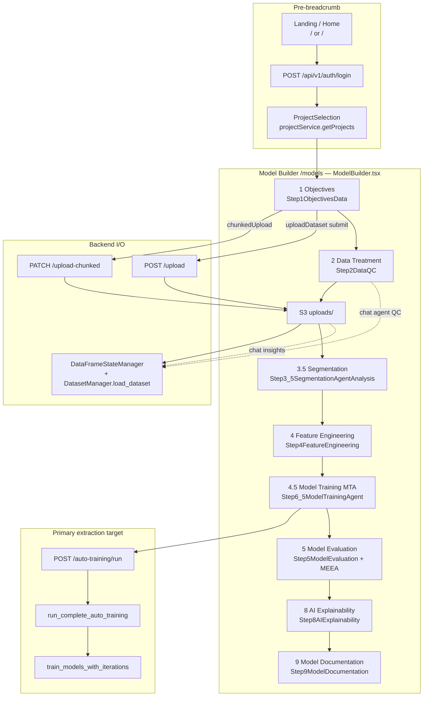

### 1.3 Navigation & gating rules (FE source of truth)

| Rule | Behaviour | Evidence |
|------|-----------|----------|
| Step 1 upload gate | Breadcrumb steps 2–9 locked until `activeDatasetId` or `pendingDatasetId` set | `ModelBuilder.tsx:610,7309-7331,7473-7474` |
| Next-button path | 3→3.5→4→4.5→5→8→9 (skips 6, 7) | `ModelBuilder.tsx:7456-7467` |
| MTA completion gate | Steps 5 & 8 locked until variable selection confirmed, training complete, screener done | `ModelBuilder.tsx:659-665,7312-7315,7447-7475` |
| Step persistence | `currentStep` in `sessionStorage` key `model_builder_current_step` | `ModelBuilder.tsx:161-176` |
| Dataset id persistence | `sessionStorage` `dataset_id`, `dataset_config` | `ModelBuilder.tsx:1925-1926`, `handleSubmitDataset` |

### 1.4 Phase 1 gap register

| ID | Gap | Status | Notes |
|----|-----|--------|-------|
| G-P0-02 | Legacy `POST /auto-train-model` FE usage | **CLOSED** | Dead code path; see §0.3 |
| G-P1-01 | Exact credit-rating CSV column schema | **CLOSED** | Dynamic schema; C10 §6.1 working assumption |
| G-P1-02 | DataIngestion vs Model Builder | **CLOSED** | Dual routes; ModelBuilder primary for stages (`App.tsx:112-115`) |
| G-P1-03 | Step 5 breadcrumb title vs embedded MEEA-only UI (split handlers passed but unused in `Step5ModelEvaluation.tsx:25-29`) | **ACCEPTED** | Naming/handler drift; evaluation UX is MEEA embed (`Step5ModelEvaluation.tsx:75-80`) |

---

## 2. Stage Index

> FE-led index from `ModelBuilder.tsx:1338-1358` breadcrumb + `renderStepContent` switch (`:6661-7162`). Analysis status: **COMPLETE** (Phases 2–4).

| Ord | ID | Breadcrumb title | React component | Route / shell | Primary API touchpoints (discovery level) | Nav gate | Analysis status |
|-----|-----|------------------|-----------------|---------------|-------------------------------------------|----------|-----------------|
| 0 | — | *(pre)* Login | `AuthModal`, `UserContext` | `/` (landing) | `POST /api/v1/auth/login` | Required for `ProtectedRoute` | FE-mapped |
| 0 | — | *(pre)* Project | `ProjectSelection` | `/models` gate | `projectService.getProjects` | Blocks Model Builder | FE-mapped |
| 1 | 1 | Objectives | `Step1ObjectivesData` | `ModelBuilder` case 1 | `chunkedUpload` → `/upload-chunked/*`; `uploadDataset` → `POST /upload`; `analyze-dataset` (preview); user knowledge upload | Later steps locked until upload succeeds | **COMPLETE** |
| 2 | 2 | Data Treatment | `Step2DataQC` | case 2 | `getOverviewBundle` → `/datasets/{id}/overview-bundle`; `chatWithDataset` (`agent_context: data_quality`, `qc_mode: auto`) → `POST /chat`; duplicate removal / EDA via chat + `getEDASnapshot` | Requires step 1 dataset | **COMPLETE** |
| 3 | 3 | Data Insights | `Step3DataInsights` | case 3 | `chatWithDataset` (insights agent); standard/auto insight step lists | Requires dataset | **COMPLETE** |
| 4 | 3.5 | Segmentation | `Step3_5SegmentationAgentAnalysis` | case 3.5 | `runSegmentation`, `runAutoSegmentation` → segmentation API (`ModelBuilder.tsx:6931-6943,6979-6990`) | Requires target variable | **COMPLETE** |
| 5 | 4 | Feature Engineering | `Step4FeatureEngineering` | case 4 | `setDatasetScope`, `getColumnInfo`, `startFeatureTransformationJob` + status poll | Requires dataset | **COMPLETE** |
| 6 | 4.5 | Model Training | `Step6_5ModelTrainingAgent` | case 4.5 | **Primary:** `runCompleteAutoTraining` → `POST /auto-training/run` + SSE/poll (`fastApiService.ts:4311-4320`); VIF/RFE/analyze sub-jobs; segment path `runSegmentAutoTraining`; manual `trainMultipleModels` | Next → 5 blocked until MTA gate (`mtaFlowGate`) | **COMPLETE** |
| 7 | 5 | Model Evaluation | `Step5ModelEvaluation` → `ModelEvaluationMEEA` | case 5 | `modelEvaluationService.listModelsByDataset`; MEEA APIs under `/api/v1/model-evaluation` | Gated on MTA completion | **COMPLETE** |
| 8 | 8 | AI Explainability | `Step8AIExplainability` | case 8 | `Step8AIExplainabilityAndDiagnostics` + step chat; explainability service calls (Phase 2) | Gated on MTA completion | **COMPLETE** |
| 9 | 9 | Model Documentation | `Step9ModelDocumentation` | case 9 | `generateDataSummary`, `generateDataQualitySummary`, `generateModelObjective`, KG poll, etc. (`Step9ModelDocumentation.tsx:197+`) | Step 9 reachable after step 1 (`ModelBuilder.tsx:7311-7312`) | **COMPLETE** |

**Collapsed / unused breadcrumb ids:** Steps **6** (Algorithm Selection) and **7** (Model Training legacy) exist as exports (`steps/index.ts:7-9`) but are **not** in the `steps` array; their UX is folded into **4.5** MTA (`ModelBuilder.tsx:1338-1358`, `167-180`).

### 2.1 Cross-stage FE state carriers

| Key / state | Purpose | Evidence |
|-------------|---------|----------|
| `sessionStorage.dataset_id` | Active dataset handle across steps | `ModelBuilder.tsx:2852`, submit handler |
| `sessionStorage.dataset_config` | Target variable, split config, exclusion rules | `ModelBuilder.tsx:1925-1926` |
| `sessionStorage.model_builder_current_step` | Breadcrumb position | `ModelBuilder.tsx:163-176` |
| `sessionStorage.training_results` | MTA output for documentation | `Step6_5ModelTrainingAgent.tsx:3510-3511` |
| `sessionStorage.segmentation_result` | Segmentation output for docs | `ModelBuilder.tsx:6953-6954` |
| `activeDatasetId` (React state) | In-memory dataset id for step components | `ModelBuilder.tsx:6695-6699` |
| `mtaFlowGate` | Training completion + screener gate for steps 5/8 | `ModelBuilder.tsx:659-665` |

### 2.3 Data ingest paths (G-P1-02 CLOSED)

| Path | Route | Component | Used for stage analysis? | Evidence |
|------|-------|-----------|--------------------------|----------|
| **Primary** | `/models` | `ModelBuilder` → `Step1ObjectivesData` | **Yes** — canonical breadcrumb flow | `App.tsx:132-135`, `ModelBuilder.tsx:1858+` |
| Secondary | `/data` | `DataIngestion` | Parallel upload UX; same backend APIs | `App.tsx:112-115`, `DataIngestion.tsx:357-381` |
| Dashboard link | `/dashboard` → `/data` | `Dashboard.tsx:371` | Entry to secondary path | `Dashboard.tsx:371` |

Stage §3 analysis follows **ModelBuilder** path; `/data` shares chunked upload + `/upload` backend but is not the breadcrumb carrier.

### 2.2 Stage flow sequence (L2)

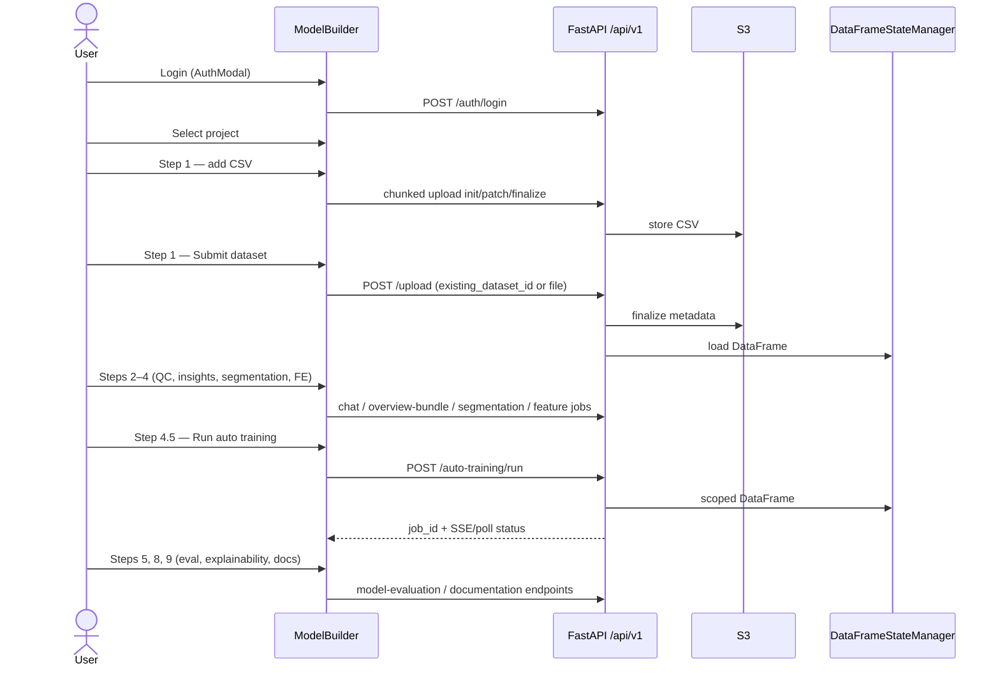

---

## 3. Per-Stage Analysis (03A–03I)

> Evidence-cited per-stage analysis (Phase 2). Seam maps added Phase 4. All stages include C8 variable tables (C8 columns) and C9 diagrams L0–L3.

### Stage 1 — Objectives

**03A Purpose & UX:** Upload CSV credit-rating data, configure target/unique IDs/split, submit to backend. Components: `Step1ObjectivesData.tsx` (upload, config, submit), `DatasetOverviewSidebar` (post-submit). User: drag CSV → partition role → Proceed → target/IDs → Submit (`Step1ObjectivesData.tsx:1613-2744`, `ModelBuilder.tsx:1858-2052`).

**03B Data provenance:** User-entered: problem statement, target, unique IDs, exclusions. User-selected: CSV file, partition role, split config. Derived: `datasetAnalysis` from `/analyze-dataset`; `dataset_id` from chunked finalize (`Step1ObjectivesData.tsx:1027-1037`).

**03C State (C8 variable table — key vars):**

| Variable | Side | Type | Where stored | Created from | Mutated? | Produces new data? | Used by | Evidence |
|----------|------|------|--------------|--------------|----------|-------------------|---------|----------|
| `activeDatasetId` | FE | `string \| null` | React state | chunked finalize / submit | copy | no | all steps | `ModelBuilder.tsx:251` |
| `datasetConfig` | FE | `DatasetConfig` | React + `sessionStorage.dataset_config` | user form + analyze | copy | no | submit, scope | `ModelBuilder.tsx:1925-1926` |
| `sessionStorage.dataset_id` | FE | string | browser session | submit handler | — | no | steps 2–9 | `ModelBuilder.tsx:2852` |
| `datasets[id].dataframe` | BE | `pd.DataFrame` | `dataframe_state_manager._full_dataframes` | `load_dataset` S3 | in-place alias | yes (split cols) | all BE stages | `dataframe_state_manager.py:118-170` |
| `dataset_manager.datasets` | BE | dict | process RAM | upload finalize | in-place | yes | load path | `dataset_service.py:991` |

**03D Order:** Add CSV → parallel `analyzeDataset` + `chunkedUpload` → Proceed (optional `combine-presplit`) → Submit `POST /upload` → `setDatasetScope` → persist IDs (`ModelBuilder.tsx:1858-2141`).

**03E APIs:** `POST /upload-chunked/*`, `POST /analyze-dataset`, `POST /upload`, `POST /dataset/scope`, `GET /overview-bundle` — `fastApiService.ts:1522-1678,1359,673,1011`.

**03F Backend:** `read_csv_for_upload`, `update_dataframe`, `apply_split_configuration` — `dataset_service.py:445`, `dataframe_state_manager.py:646-931`.

**03G Diagrams (C9):**

*L0 (stage in context):*
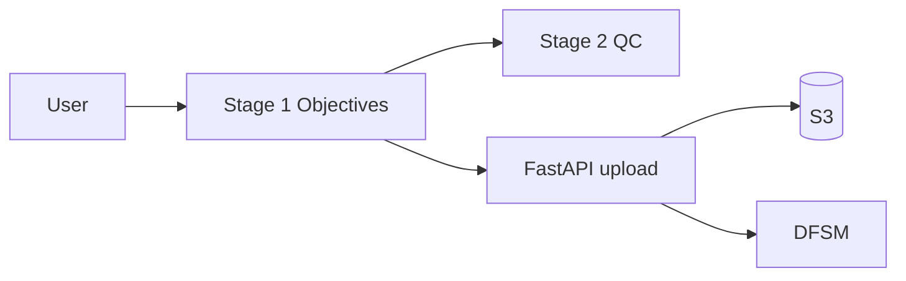

*L1 (components):*
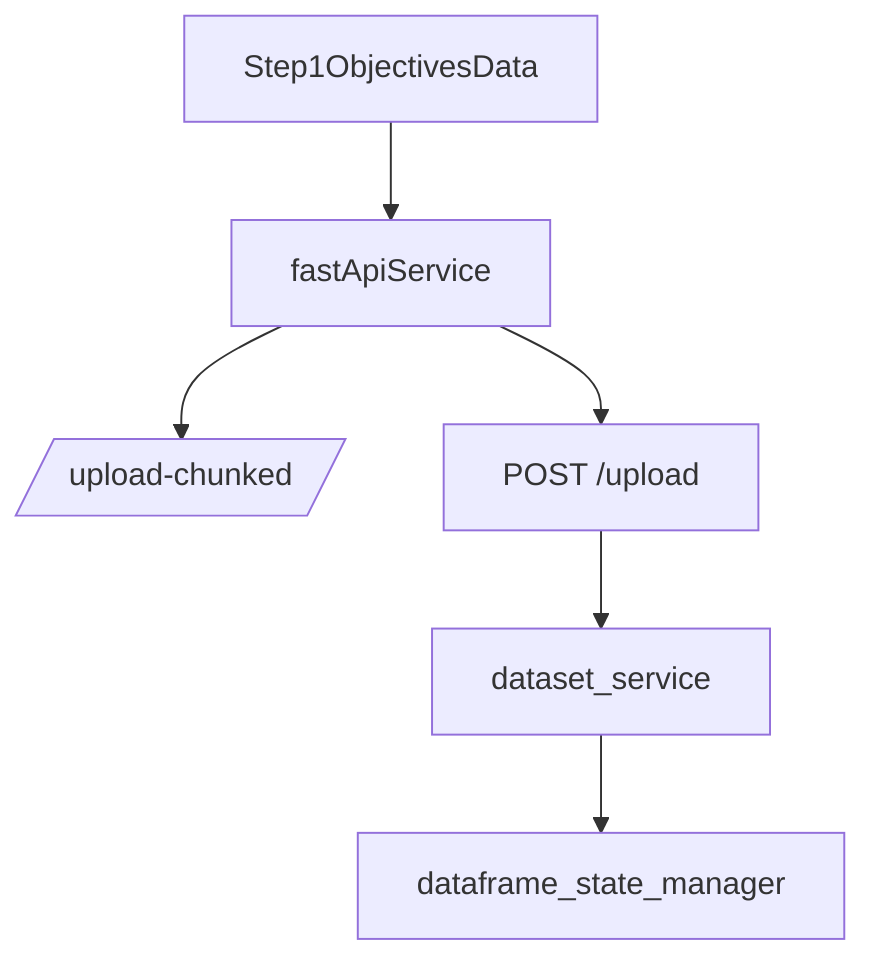

*L2:* see §2.2 sequence diagram (upload → load).

*L3 (call graph):*
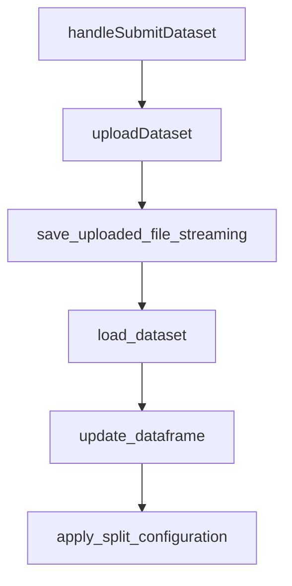

**03H Hot:** `handleSubmitDataset`, `save_uploaded_file_streaming`, `read_csv_for_upload`, parquet sidecar path (`routes.py:1704-1715` skips dup scan on existing_dataset_id).

**03I Resource model @ 5M (C10):**

| Phase | Live structures | Mem est. | CPU class | Assumptions |
|-------|-----------------|----------|-----------|-------------|
| chunked upload | streaming 2 MiB chunks | ~64 MB buffer | IO | `dataset_service.py:413-427` |
| analyze-dataset | 1M row sample max | ~200 MB sample | vectorised | `routes.py:2517` |
| submit/load | full DF + parquet sidecar | **2.5 GB** + 64 MB | IO + parse | 30×200B×2.5; `dataset_service.py:450-453` |
| **Peak** | base DF resident | **~2.6 GB** | IO-bound ingest | dup scan skipped on chunked id (`routes.py:1704-1706`) |

**Gap register:** G-P0-01/G-P1-01 schema — **CLOSED** (dynamic CSV; §6.1 working assumption).

**Seam map (Phase 4):** Cut candidates at `POST /upload` edge (I/O) or after `load_dataset` (RAM alias into DFSM). Primary extraction does not cut here.

---

### Stage 2 — Data Treatment

**03A:** QC / duplicate removal / DQS sidebar. `Step2DataQC.tsx:509-865`; Auto QC via `handleAutoQC` (`ModelBuilder.tsx:2824-2899`).

**03B:** User: dup Yes/No, QC task list, templates. Derived: DQS scores, treated DataFrame, EDA snapshots.

**03C State (C8 — key vars):**

| Variable | Side | Type | Where stored | Created from | Mutated? | Evidence |
|----------|------|------|--------------|--------------|----------|----------|
| `dupWantsToRemove` | FE | boolean | React | user dup prompt | — | `ModelBuilder.tsx:2856` |
| `qcTemplates` | FE | array | React | template picker | — | `Step2DataQC.tsx:509+` |
| `chatMessages[2]` | FE | array | React | QC chat | append | `ModelBuilder.tsx:2824` |
| `processed_df` | BE | DataFrame | DFSM | execute-code mutations | in-place | `dataframe_state_manager.py` |

**03D:** Dup identify/remove → optional templates → `POST /chat` (qc_mode auto/manual) → `POST /execute-code` per treatment → `getEDASnapshot` (`ModelBuilder.tsx:2856-2970`, `routes.py:5772-5829`).

**03E:** `POST /datasets/{id}/identify-duplicates`, `remove-duplicates`, `POST /chat`, `POST /execute-code`, `GET /overview-bundle` — `fastApiService.ts:5652,2020,2422,1045`.

**03F:** `dqs_service.calculate_dqs`, `maybe_sample_for_dqs` (>1M → 200k sample) — `sampling.py:292-293`, `routes.py:6777-6783`.

**03G Diagrams (C9):**

*L0:*
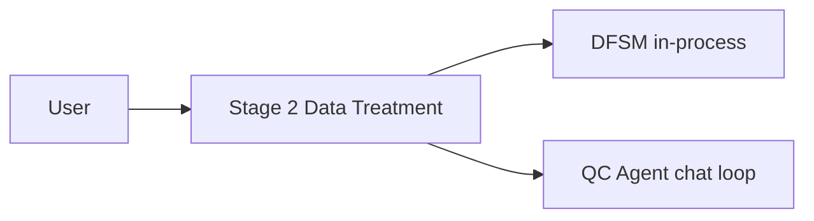

*L1:*
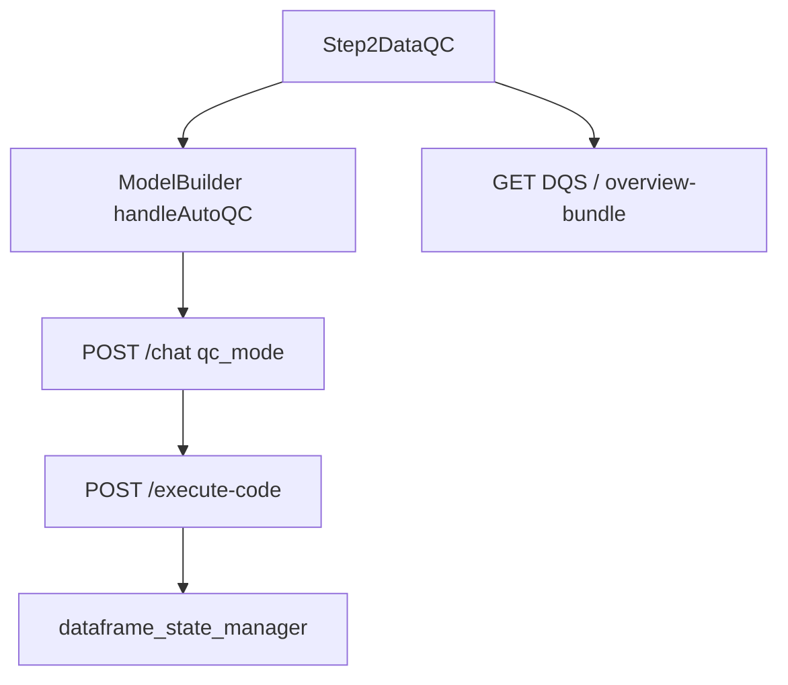

*L2:*
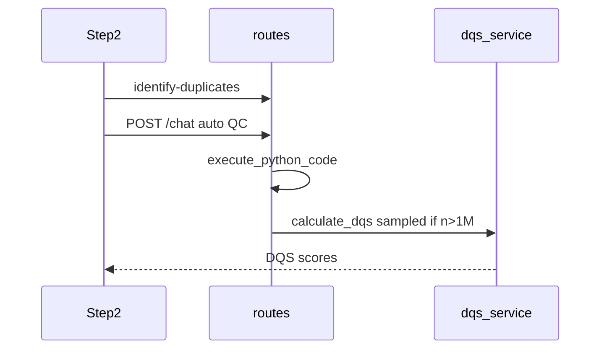

*L3:* `handleAutoQC` → `chat` → `execute_python_code` → `update_dataframe`.

**03H:** `execute_python_code`, agent QC workflow, full-frame dup on train slice (`routes.py:19301-19333`).

**03I Resource model @ 5M (C10):**

| Phase | Live structures | Mem est. | CPU class | Assumptions |
|-------|-----------------|----------|-----------|-------------|
| DQS calc | 200k sample if n>1M | ~100 MB sample | vectorised | `sampling.py:292-293` |
| overview-bundle | full scoped DF | **2.5 GB** | vectorised | one load |
| execute-code | agent copies | +0.5–1 GB | Python-loop | per treatment |
| **Peak** | DF + QC copy | **~3–3.5 GB** | mixed | concurrent overview + agent |

**Seam map:** Agent `/chat`→`/execute-code` loop mutates DFSM — high coupling; not primary cut.

---

### Stage 3 — Data Insights

**03A Purpose & UX:** Auto/Standard insight checklists. `Step3DataInsights.tsx:38-200`; parallel REST prefetch + chat (`ModelBuilder.tsx:4490-4564`).

**03B:** Derived insight tables from `/insights/*` jobs + `POST /chat` agent_context `data_insight`.

**03C State (C8 — key vars):**

| Variable | Side | Type | Where stored | Created from | Mutated? | Evidence |
|----------|------|------|--------------|--------------|----------|----------|
| `insightJobIds[]` | FE | string[] | React | insight POST responses | — | `autoInsightsPrefetchService.ts:116` |
| `chatMessages[3]` | FE | array | React state | user + agent | append | `ModelBuilder.tsx:4490+` |
| `insight_job_queue` | BE | dict | process RAM | `_enqueue_insight_job` | in-place | `routes.py:8174` |
| `readonly_df` | BE | DataFrame | DFSM view | `get_dataframe_readonly` | no | `routes.py:4343` |

**03D:** Auto: 6 parallel insight POSTs + chat (`autoInsightsPrefetchService.ts:116-172`). Jobs: `POST /insights/bivariate/all` etc. → poll `GET /insights/jobs/status/{job_id}` (`routes.py:8174-8272`).

**03E:** `/insights/bivariate/all`, `/correlation/analyze`, `/iv-analysis`, `/vif-analysis`, `/chat` — see `autoInsightsPrefetchService.ts`.

**03F:** `dataframe_state_manager.get_dataframe_readonly`, `_enqueue_insight_job`, `agent.invoke` (`routes.py:4343-4367`).

**03G Diagrams (C9):**

*L0:*
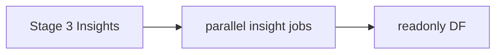

*L1:*


*L2:*
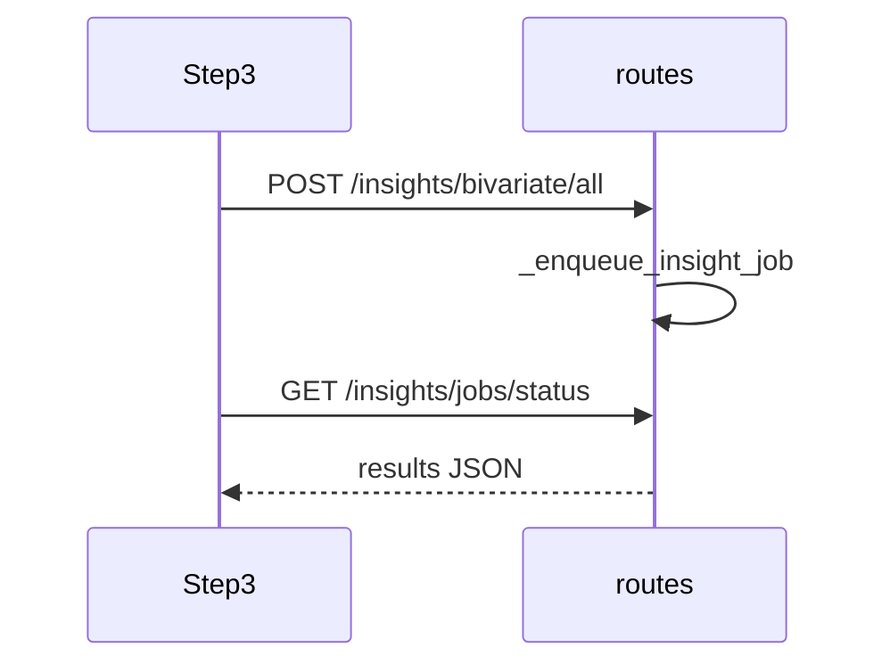

**03I Resource model @ 5M (C10):**

| Phase | Live structures | Mem est. | CPU class | Assumptions |
|-------|-----------------|----------|-----------|-------------|
| base | scoped DF | 2.5 GB | — | §6.1 |
| parallel jobs (×2-3) | readonly slices + results | +1.25–2.5 GB | vectorised + loop | `routes.py:8174` |
| **Peak** | base + 2 concurrent | **~4–5 GB** | CPU-heavy | insight prefetch |

**Seam map:** Insight jobs read-only on DF — candidate for externalized analytics later; not first cut.

---

### Stage 3.5 — Segmentation

**03A:** Unified segmentation modes (pre-existing, variable-driven, manual, auto). `Step3_5SegmentationAgentAnalysis.tsx:479-606`.

**03B:** User-selected: segmentation mode, variables, manual rules. Derived: segment definitions, counts, `sessionStorage.segmentation_result` (`ModelBuilder.tsx:6953-6954`).

**03C State (C8):**

| Variable | Side | Type | Where stored | Created from | Mutated? | Evidence |
|----------|------|------|--------------|--------------|----------|----------|
| `agentMode` | FE | enum | React | user 4-mode picker | — | `Step3_5SegmentationAgentAnalysis.tsx:479-534` |
| `segmentationResult` | FE | object | React + sessionStorage | API response | — | `ModelBuilder.tsx:6953` |
| `segment_column` | BE | str | DFSM new column | add-to-data | in-place | `routes.py:9796-9981` |

**03C.1 Segmentation API path matrix (G-P2-02 CLOSED):**

| Path | Trigger | API | Evidence |
|------|---------|-----|----------|
| **Primary (unified)** | Step3_5 Run button `handleRunUnifiedSegmentation` | `POST /segmentation/run` | `Step3_5SegmentationAgentAnalysis.tsx:479-542`, `fastApiService.ts:2844` |
| Legacy manual | `onRunSegmentation` prop (ModelBuilder) | legacy segmentation endpoint via `runSegmentation` | `ModelBuilder.tsx:6931-6943`, `fastApiService.ts:2773` |
| Legacy auto | `onRunAutoSegmentation` prop | `runAutoSegmentation` | `ModelBuilder.tsx:6979-6990`, `fastApiService.ts:2800` |

Unified path is **default UX** in Step3_5 (`:1898` onClick); legacy props retained for backward-compatible ModelBuilder wiring.

**03E:** `POST /api/v1/segmentation/run` (`fastApiService.ts:2844`); `POST /segmentation/add-to-data`; legacy `runSegmentation` in `ModelBuilder.tsx:6931`.

**03D:** `POST /segmentation/run` primary (`fastApiService.ts:2844`); legacy `runSegmentation`/`runAutoSegmentation` in `ModelBuilder.tsx:6931-6990`.

**03F:** `run_unified_segmentation` → `segmentation_service.run_custom_segmentation` (`routes.py:9796-9981`).

**03G Diagrams (C9):**

*L0:*
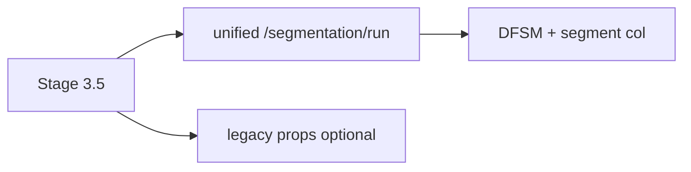

*L1:*
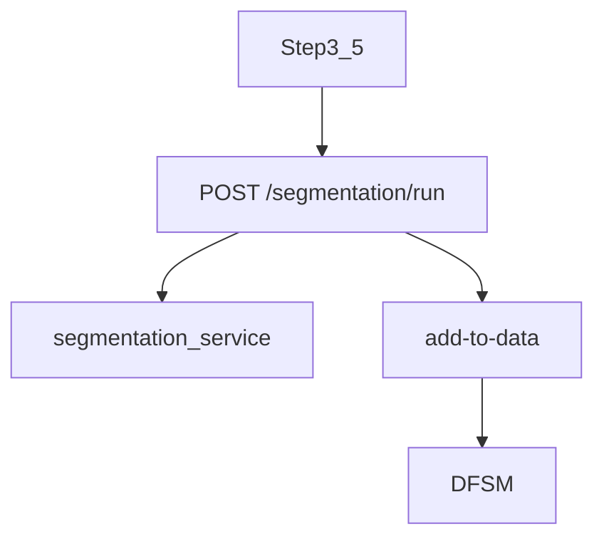

*L2:*
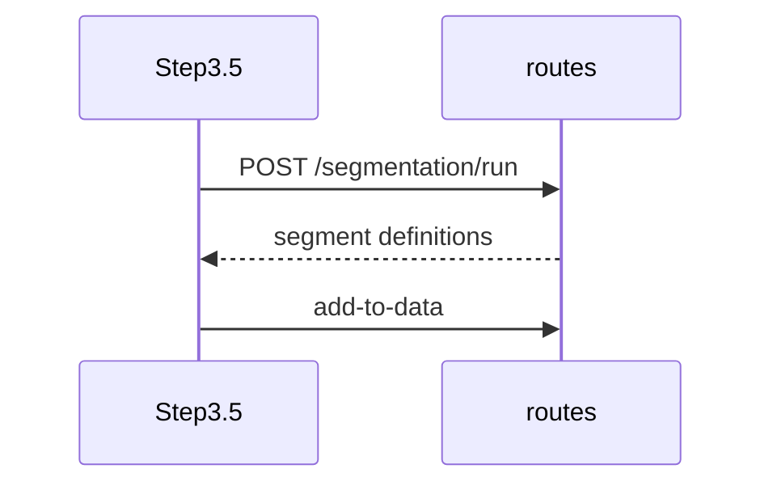

**03I Resource model @ 5M (C10):**

| Phase | Live structures | Mem est. | CPU class | Assumptions |
|-------|-----------------|----------|-----------|-------------|
| tree fit | full scoped DF | 2.5 GB | O(n log n) | warn >500k `routes.py:9828` |
| add column | +1 segment col | +~5 MB | vectorised | |
| **Peak** | base + fit temps | **~3.5–5 GB** | CPU-bound | 180s FE timeout `fastApiService.ts:2834` |

**Seam map:** Segmentation mutates scheme columns via `/segmentation/add-to-data` — downstream dependency for Stage 4.

---

### Stage 4 — Feature Engineering

**03A Purpose & UX:** 3-screen wizard: (1) select variables, (2) choose transforms, (3) confirm and run async job. Progress via job status poll. `Step4FeatureEngineering.tsx:659-785`.

**03B Data provenance:** User-selected: source variables, transform types (log, OHE, binning, etc.). Derived: transformed column metadata, job status JSON.

**03C State (C8):**

| Variable | Side | Type | Where stored | Created from | Mutated? | Evidence |
|----------|------|------|--------------|--------------|----------|----------|
| `selectedTransformVars` | FE | string[] | React | user picker | — | `Step4FeatureEngineering.tsx:659+` |
| `feJobId` | FE | string | React | start response | — | `fastApiService.ts:3535` |
| `transformed_columns` | BE | list | job result + DFSM | `apply_transformations` | in-place cols | `routes.py:13476-13549` |

**03D Order:** Screen 1 pick vars → Screen 2 transforms → Screen 3 confirm → `POST /feature-transformation/start` → poll `GET /feature-transformation/status/{job_id}` → refresh column list for Stage 4.5.

**03E APIs:**

| Method | Path | FE call site | Purpose |
|--------|------|--------------|---------|
| POST | `/api/v1/feature-transformation/start` | `fastApiService.ts:3535` | Start async transform job |
| GET | `/api/v1/feature-transformation/status/{job_id}` | `fastApiService.ts:3555` | Poll job status |
| GET | `/api/v1/datasets/{id}/column-info-by-scope` | scope=dev | Variable picker |

**03F Backend:** `routes.py:13420` → `background_job_manager` → `feature_engineering_service.apply_transformations` (`:13476-13549`); writes new columns to scoped dev DataFrame in DFSM.

**03G Diagrams (C9):**

*L0:*
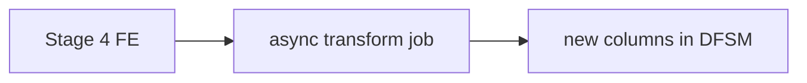

*L1:*
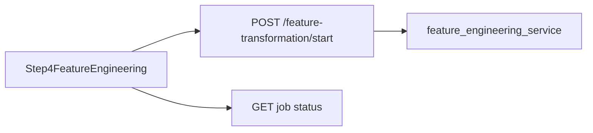

*L2:*
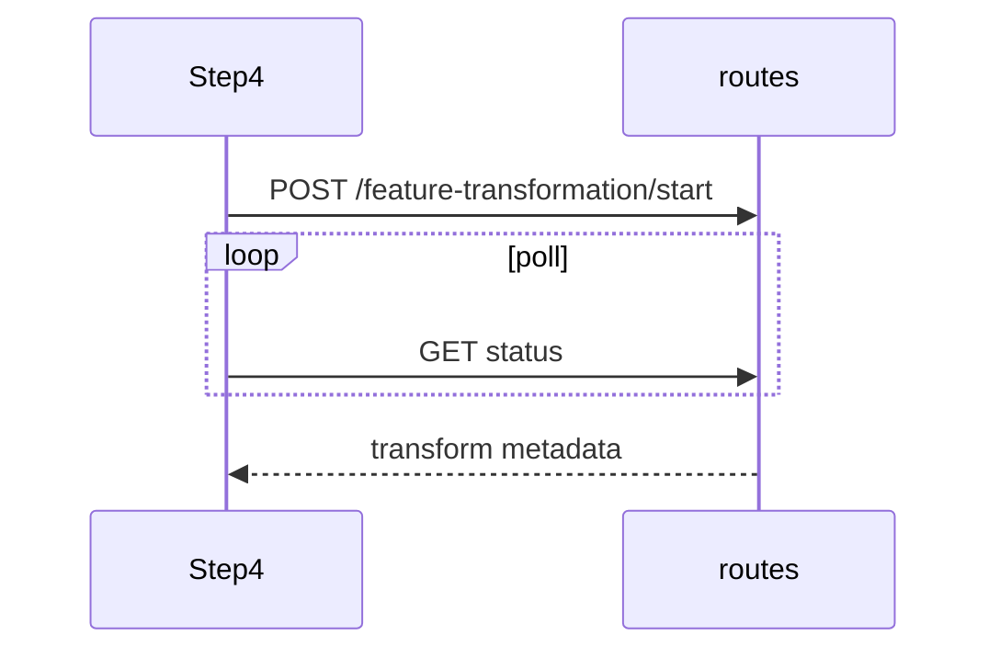

*L3:*
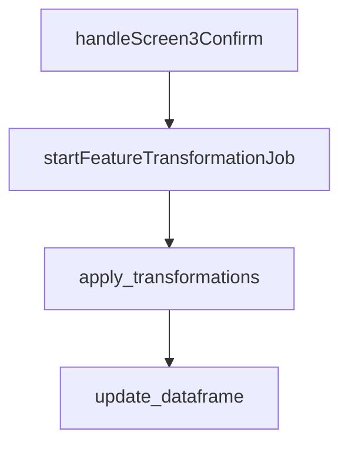

**03H Hot:** `handleScreen3Confirm` (FE), `apply_transformations`, `background_job_manager.start_job`.

**03I Resource model @ 5M (C10):**

| Phase | Live structures | Mem est. | CPU class | Assumptions |
|-------|-----------------|----------|-----------|-------------|
| scoped dev (~60%) | dev split slice | ~1.5 GB | — | scope=dev |
| OHE wide | +new columns | +1–4 GB | vectorised | wide categoricals |
| **Peak** | dev + transforms | **~2.5–7.5 GB** | vectorised | worst-case OHE | Scoped dev frame ~60% of base + new transform columns; peak **~1.5–3×** base for wide OHE.

**Seam map:** Persists transformed columns to DFSM — feeds Stage 4.5 variable list.

---

### Stage 4.5 — Model Training (PRIMARY)

**03A Purpose & UX:** MTA variable screener (VIF/RFE/analyze sub-jobs) + auto-training or segment training. User selects variables, runs screener gates, clicks Run Auto Training; progress via SSE/poll. Components: `Step6_5ModelTrainingAgent.tsx` (primary), `ModelBuilder.tsx` (mtaFlowGate). Evidence: `Step6_5ModelTrainingAgent.tsx:3452-3488`, `ModelBuilder.tsx:659-665`.

**03B Data provenance:** User-selected: `selected_variables`, `locked_variables`, algorithm mode. User-entered: weight column (optional). Derived: VIF/RFE job results, `training_results`, `model_comparison_data` → `sessionStorage` for docs (`Step6_5ModelTrainingAgent.tsx:3508-3515`).

**03C State (C8 — primary cut boundary vars):**

| Variable | Side | Type | Where stored | Created from | Mutated? | Produces new data? | Used by | Evidence |
|----------|------|------|--------------|--------------|----------|-------------------|---------|----------|
| `trainingJobId` | FE | string | React state | POST /auto-training/run | — | no | poll/SSE | `fastApiService.ts:4320` |
| `sessionStorage.training_results` | FE | JSON | session | MTA complete handler | — | yes | Step 9 docs | `Step6_5ModelTrainingAgent.tsx:3510` |
| `scoped_df` | BE | DataFrame | DFSM scoped view | `get_dataframe` + scope | copy/slice | no | preprocess | `model_training_auto_training.py:4825-4849` |
| `algorithm_config` | BE | dict | job context | `auto_select_algorithms` | — | yes | train loop | `model_training_auto_training.py:4942` |
| `complete_results` | BE | dict | job result + JSON | `run_complete_auto_training` | — | yes | API response, MEEA | `model_training_auto_training.py:5028-5048` |
| `job_id` | BE | str | `background_job_manager` | route handler | — | no | cancel/dedup | `routes.py:15593-15618` |

**03D Order:** `handleAutoTraining` → `runCompleteAutoTraining` → `POST /auto-training/run` → dedup/reuse job → `_run_auto_training_job` → `auto_training_service.run_complete_auto_training` → `preprocess_data` → `auto_select_algorithms` → `train_models_with_iterations` → persist artifacts → MEEA thread (`routes.py:9120-9186`, `model_training_auto_training.py:4776-5011`).

**03E APIs:**

| Method | Path | FE call site | Purpose |
|--------|------|--------------|---------|
| POST | `/api/v1/auto-training/run` | `fastApiService.ts:4320` | Start/reuse training job |
| GET | `/api/v1/auto-training/status/{job_id}` | `fastApiService.ts:4193` | Poll status |
| GET | `/api/v1/auto-training/stream/{job_id}` | `fastApiService.ts:4355` | SSE progress |
| POST | `/api/v1/auto-training/cancel/{job_id}` | MTA cancel UI | Cancel in-flight |

**03F Backend mapping:** `routes.py:15573` → `background_job_manager` → `model_training_auto_training.run_complete_auto_training:4776` → `train_models_with_iterations:2466`; side effects: DFSM preprocessed columns, S3/DB model artifacts (`routes.py:9150-9186`).

**03G Diagrams (C9 — full L0–L3):**

*L0:*
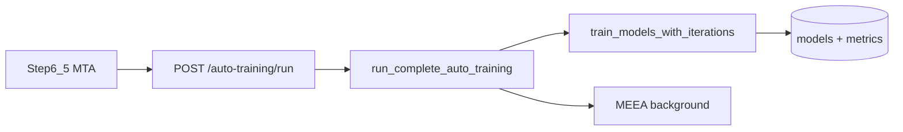

*L1:*
```mermaid
flowchart TB
  Step6_5 --> FAS[fastApiService.runCompleteAutoTraining]
  FAS --> R[routes auto-training/run]
  R --> BJM[background_job_manager]
  BJM --> ATS[ModelTrainingAutoTrainingService]
  ATS --> DFSM[dataframe_state_manager]
  ATS --> TMI[train_models_with_iterations]
  TMI --> SK[sklearn/xgb/lgbm/optuna]
```

*L2:*
```mermaid
sequenceDiagram
  participant FE as Step6_5
  participant API as routes.py
  participant BJM as background_job_manager
  participant SVC as auto_training_service
  participant TR as train_models_with_iterations
  FE->>API: POST /auto-training/run
  API->>BJM: enqueue _run_auto_training_job
  BJM->>SVC: run_complete_auto_training
  SVC->>SVC: preprocess_data + auto_select_algorithms
  SVC->>TR: train_models_with_iterations
  TR-->>SVC: training_results
  SVC-->>API: complete_results
  API-->>FE: job_id + SSE updates
```

*L3:*
```mermaid
flowchart TD
  run_complete_auto_training --> get_scoped_dataframe
  get_scoped_dataframe --> preprocess_data
  preprocess_data --> auto_select_algorithms
  auto_select_algorithms --> train_models_with_iterations
  train_models_with_iterations --> fit_algorithm_loop
  fit_algorithm_loop --> make_json_serializable
  run_complete_auto_training --> run_pending_meea_jobs
```

**03H Hot functions:** `runCompleteAutoTraining` (FE), `run_complete_auto_training`, `preprocess_data`, `train_models_with_iterations`, `fit` loops (`model_training_auto_training.py:2466,3256-3259`).

**03I Resource model @ 5M:**

| Phase | Live structures | Mem est. | CPU class | Assumptions |
|-------|-----------------|----------|-----------|-------------|
| preprocess | base DF + encoded matrices | +0.5–1.5 GB | vectorised | 30 cols, OHE expansion |
| train (×algos) | train/test matrices + models | +1–3 GB | mixed; Optuna loops | up to 5 algos (`:13-17`) |
| MEEA kickoff | 50k sample frames × models | +0.2–0.5 GB | vectorised predict | background thread |
| **Peak** | concurrent preprocess + 1 fit | **3–6 GB** | **Python-loop + BLAS** | dominant stage |

**Dominant compute unit:** `train_models_with_iterations` (CU-TRAIN).

**03J Edge cases & error paths:**

| Edge case | Behaviour | Evidence |
|-----------|-----------|----------|
| Missing `dataset_id` / `target_column` | HTTP 400 | `routes.py:15588-15591` |
| Duplicate `/run` while job pending/running | Returns existing `job_id`, `reused_existing_job: true` | `routes.py:15593-15618` |
| User cancel | Soft-cancel via `POST /auto-training/cancel/{job_id}`; `RuntimeError` in train loop | `routes.py:15824-15868`, `model_training_auto_training.py:2499-2501` |
| `mtaFlowGate` blocks steps 5/8 | Requires `trainingComplete`, `screenerPhaseDone`, not `trainingInProgress` | `ModelBuilder.tsx:659-665` |
| Segment training | Separate `segment-auto-training` + cancel path | `fastApiService.ts:4890` |
| File > MAX_FILE_SIZE | HTTP 400 on analyze/upload | `routes.py:2479-2481`, `config.py:532` |

**Seam map (PRIMARY CUT):**
| Seam | Location | Intercept |
|------|----------|-----------|
| HTTP | `routes.py:15573` | Strangler routing toggle |
| Service | `run_complete_auto_training:4776` | Facade + external dispatch |
| Compute | `train_models_with_iterations:2466` | Externalized worker |
| I/O in | `dataframe_state_manager` scoped DF | Anti-corruption adapter |
| I/O out | `complete_results` dict + artifacts | Parity golden pairs |

---

### Stage 5 — Model Evaluation

**03A Purpose & UX:** Embedded `ModelEvaluationMEEA` widget inside Step 5 breadcrumb — phased tabs: Performance (phase 1), Monotonicity (phase 2), Granular (phase 3). User selects trained model(s), views metrics/charts. `Step5ModelEvaluation.tsx:75-80` wraps MEEA only (legacy split handlers unused `:25-29`).

**03B Data provenance:** Derived: model list from DB via `listModelsByDataset`; phase JSON from evaluation service; `sessionStorage.model_comparison_data` written for Step 9 (`ModelEvaluationMEEA.tsx:824-831`). User-selected: active model id, tab.

**03C State (C8):**

| Variable | Side | Type | Where stored | Created from | Mutated? | Used by | Evidence |
|----------|------|------|--------------|--------------|----------|---------|----------|
| `models[]` | FE | array | React state | listModelsByDataset | — | tab render | `ModelEvaluationMEEA.tsx:295` |
| `phase1Results` | FE | object | React state | phase/1 poll | — | charts | `ModelEvaluationMEEA.tsx:424+` |
| `_prediction_cache` | BE | dict | class static | evaluate_phase1 | in-place | phase 2/3 | `model_evaluation_service.py:1052` |
| `ModelEvaluation` DB rows | BE | ORM | PostgreSQL | training persist | — | all phases | `model_evaluation_service.py:979` |

**03D Order:** Mount Step 5 → `listModelsByDataset(datasetId)` → user picks model → parallel `GET .../phase/1` → poll until complete → repeat phase 2/3 (`ModelEvaluationMEEA.tsx:424-607`).

**03E APIs:** `GET /api/v1/model-evaluation/models/{dataset_id}` (`modelEvaluationService.ts:93`); `GET /api/v1/model-evaluation/{model_id}/phase/{1,2,3}`; status poll endpoints per phase.

**03F Backend:** `evaluate_phase1_performance` loads model artifact + matrices; caps train/test to 50k rows (`model_evaluation_service.py:1008-1032`); caches predictions for later phases (`:1052-1054`). Triggered post-training from `run_pending_meea_jobs` (`routes.py:17699`, `model_training_auto_training.py:4637`).

**03G Diagrams:**

*L0:*
```mermaid
flowchart LR
  S5[Stage 5 Eval] --> MEEA[ModelEvaluationMEEA]
  MEEA --> DB[(model metrics DB)]
```

*L1:*
```mermaid
flowchart LR
  Step5 --> MEEA[ModelEvaluationMEEA]
  MEEA --> MES[modelEvaluationService]
  MES --> API[/model-evaluation/phase/N]
  API --> MEV[model_evaluation_service]
```

*L2:*
```mermaid
sequenceDiagram
  participant FE as MEEA
  participant API as routes
  participant MEV as model_evaluation_service
  FE->>API: GET models by dataset
  FE->>API: GET phase/1
  API->>MEV: evaluate_phase1_performance
  MEV->>MEV: sample 50k + predict + cache
  MEV-->>FE: phase1 JSON
```

*L3:* `evaluate_phase1_performance` → `model.predict` → `_prediction_cache` → phase 2/3 consumers.

**03H Hot:** `evaluate_phase1_performance`, `model.predict`, `_prediction_cache` lookup.

**03I Resource model @ 5M (C10):**

| Phase | Live structures | Mem est. | CPU class | Assumptions |
|-------|-----------------|----------|-----------|-------------|
| phase1 eval | 50k train + 50k test matrices | ~0.5–1.5 GB | vectorised predict | caps `:1008-1009` |
| prediction cache | per model_id | +0.2 GB/model | — | `:1052` |
| **Peak** | base DF + cache | **~3–4 GB** | sampled only | full 5M not scored |

**Gap register:** G-P1-03 handler drift — ACCEPTED.

**Seam map:** Consumes training artifacts (phase JSON + DB); read-only on DF after training. Not primary strangler cut; depends on CU-TRAIN outputs.

---

### Stage 8 — AI Explainability

**03A Purpose & UX:** SHAP summary, PDP/ICE plots, diagnostics chat. User selects model, triggers recalculate, browses paginated SHAP samples. `Step8AIExplainabilityAndDiagnostics.tsx:990-1158`; gated by `mtaFlowGate` like Step 5.

**03B Data provenance:** Derived: SHAP values, feature importance rankings from `explainability_service`; user-selected model id; chat messages for diagnostics agent.

**03C State (C8):**

| Variable | Side | Type | Where stored | Created from | Mutated? | Evidence |
|----------|------|------|--------------|--------------|----------|----------|
| `selectedModelId` | FE | string | React | listModelsByDataset | — | `Step8:181` |
| `shapData` | FE | object | React | GET explainability | — | `Step8:990+` |
| `X_data` / `X_train` | BE | DataFrame | job-local | DFSM + preprocess replay | copy | `explainability_service.py:116+` |

**03D Order:** list models → load cached explainability OR `POST .../recalculate-explainability` → poll → paginate `GET .../samples?page=N` (`routes.py:17889+`, `16547-16548`).

**03E APIs:** `POST /api/v1/model-evaluation/{model_id}/recalculate-explainability`; `GET .../explainability`; `GET .../samples` (50 rows/page).

**03F Backend:** `SHAPService.calculate_shap_values` — TreeExplainer; samples to 15k rows when n>20k (`explainability_service.py:143-149`); LinearExplainer path for linear models (`:164+`).

**03G Diagrams:**

*L0:*
```mermaid
flowchart LR
  S8[Stage 8 Explain] --> SHAP[SHAP service]
  SHAP --> SAMP[sampled compute]
```

*L1:*
```mermaid
flowchart LR
  Step8 --> EXP[explainability_service]
```

*L2:*
```mermaid
sequenceDiagram
  participant FE as Step8
  participant API as routes
  participant EXP as explainability_service
  FE->>API: POST recalculate-explainability
  API->>EXP: calculate_shap_values
  EXP->>EXP: sample X_data if n>20k
  EXP-->>API: shap payload
  FE->>API: GET samples page=1
```

**03H Hot:** `calculate_shap_values`, `shap.TreeExplainer`, PDP/ICE generators.

**03I Resource model @ 5M (C10):**

| Phase | Live structures | Mem est. | CPU class | Assumptions |
|-------|-----------------|----------|-----------|-------------|
| load for recalc | scoped DF | 2.5 GB | IO | before sample |
| SHAP TreeExplainer | max 15k rows if n>20k | ~200–500 MB | O(n×trees×feat) | `explainability_service.py:143-145` |
| PDP/ICE pages | paginated 50 rows | negligible | — | `routes.py:16547` |
| **Peak** | base + SHAP temps | **~3–3.5 GB** | CPU-bound | not full 5M SHAP |

**Gap register:** G-P2-01 CLOSED (sampling caps documented).

**Seam map:** Depends on trained model + feature matrix; candidate for externalized explainability worker in future; not v1 cut.

---

### Stage 9 — Model Documentation

**03A Purpose & UX:** Generate model documentation pack (data summary, quality, objectives, validation writeups) via LLM-assisted endpoints; download ZIP. `Step9ModelDocumentation.tsx:126-2443`. Reachable after step 1 minimum (`ModelBuilder.tsx:7311-7312`) but content quality depends on prior stages.

**03B Data provenance:** User-triggered: generate buttons per section. Derived: aggregates from `sessionStorage.training_results`, `model_comparison_data`, `segmentation_result`; backend pulls model metrics from DB/MEEA (`Step9` handlers, `ModelEvaluationMEEA.tsx:824-831`).

**03C State (C8):**

| Variable | Side | Type | Where stored | Created from | Evidence |
|----------|------|------|--------------|--------------|----------|
| `sessionStorage.training_results` | FE | JSON | session | Stage 4.5 | `Step6_5:3510` |
| `sessionStorage.model_comparison_data` | FE | JSON | session | Stage 5 MEEA | `ModelEvaluationMEEA.tsx:824` |
| `documentation_data` | FE | IndexedDB | `midas_documentation_db` | generated sections | `storageOptimization.ts:4-6` |

**03D Order:** User opens Step 9 → sequential `generateDataSummary`, `generateDataQualitySummary`, `generateModelObjective`, etc. (`fastApiService.ts:4957+`) → optional KG poll → compile ZIP download.

**03E APIs (sample):** `POST /documentation/generate-data-summary` (`documentation_routes.py:742`); `generate-data-quality-summary:806`; `generate-model-objective:988`; additional writeup endpoints through `:1998`.

**03F Backend:** Each endpoint calls LLM + DB lookups; no full DataFrame reload — uses dataset metadata, DQS snapshots, model evaluation JSON.

**03G Diagrams:**

*L0:*
```mermaid
flowchart LR
  S9[Stage 9 Docs] --> LLM[LLM generate endpoints]
  S9 --> SESS[sessionStorage aggregates]
```

*L1:*
```mermaid
flowchart TB
  Step9 --> FAS[fastApiService documentation/*]
  FAS --> DR[documentation_routes]
  DR --> LLM[LLM service]
  DR --> DB[(model + dataset metadata)]
  Step9 --> IDB[(IndexedDB cache)]
```

**03H Hot:** `generateDataSummary`, `generateModelObjective`, ZIP bundler.

**03I Resource model @ 5M (C10):**

| Phase | Live structures | Mem est. | CPU class | Assumptions |
|-------|-----------------|----------|-----------|-------------|
| generate calls | JSON aggregates only | <100 MB | network/LLM | no DF reload |
| IndexedDB cache | section blobs | <50 MB | IO | `storageOptimization.ts:4-6` |
| **Peak** | session + IDB | **<200 MB** | LLM-bound | |

**Seam map:** Read-only consumer of training + evaluation artifacts; no extraction impact for v1.

---

## 4. Extraction Dossier (Phase 5)

### 4.1 Cut scope

| Item | In scope | Out of scope (v1) |
|------|----------|-------------------|
| `train_models_with_iterations` | Yes | — |
| `run_complete_auto_training` orchestration | Yes | — |
| `POST /auto-training/run` contract | Yes (preserve) | — |
| Upload/S3/DFSM | No | Stays in monolith; adapter supplies DataFrame |
| MEEA evaluation | No | Phase 2+ follow-on |
| Agent QC/insights | No | — |

### 4.2 Boundary definition

**Inputs:** `dataset_id`, scoped `DataFrame` (or serialized parquet reference), `target_column`, `selected_variables`, `locked_variables`, `selection_mode`, `algorithm_config`, `weight_variable`, `job_id` (cancel), seeds (C25).

**Outputs:** `complete_results` JSON (serializable via `make_json_serializable`), model artifact paths, preprocessed column metadata.

**Side effects today:** `dataframe_state_manager.update_dataframe` (preprocessed cols), `background_job_manager`, MEEA thread, S3/DB artifact persistence (`routes.py:9150-9186`).

**Relocated side effects (design):** External worker writes artifacts to shared object store; monolith persists pointers only.

### 4.3 Strangler sequence

1. Introduce in-process **facade** calling original (no cut).
2. Shadow **external worker**; compare parity on golden pairs (§16).
3. Routing toggle per `dataset_id` or global flag (§19).
4. Remove in-process path after C26 green.

### 4.5 Boundary edge cases (extraction contract)

| Case | In-process today | Externalized v1 design |
|------|------------------|------------------------|
| Cancel mid-training | `cancel_check` → `RuntimeError` | Worker polls cancel flag; same exception surface |
| Job dedup | Per-dataset lock `routes.py:15593` | Client passes same `job_id`; worker idempotent |
| Non-determinism | Optuna/sklearn seeds | `MIDAS_TRAINING_SEED` env (C25) |
| Large DF transfer | In RAM | S3 parquet key + column manifest |
| MEEA side-effect | Background thread post-train | Monolith triggers MEEA after external artifacts land |
| DFSM preprocess cols | Written in-process | Worker returns column metadata; monolith applies or shared store |

### 4.4 Risk register

| Risk | Mitigation |
|------|------------|
| Non-deterministic training | Fixed seeds; tolerance bands for float metrics (C25) |
| Large payload DF transfer | Pass S3 parquet key + column list, not raw JSON |
| Job idempotency | Reuse existing job per dataset (`routes.py:15593-15618`) |
| MEEA coupling | Keep MEEA in monolith until training externalized stable |

---

## 5. Consolidated Variable & Hot-Function Appendix

| Stage | Hot FE | Hot BE |
|-------|--------|--------|
| 1 | `handleSubmitDataset`, `chunkedUpload` | `read_csv_for_upload`, `apply_split_configuration` |
| 2 | `handleAutoQC`, `executeCode` loop | `calculate_dqs`, `execute_python_code` |
| 3 | `runAutoInsightApiPrefetches` | `_enqueue_insight_job` |
| 3.5 | `handleRunUnifiedSegmentation` | `run_unified_segmentation` |
| 4 | `handleScreen3Confirm` | `apply_transformations` |
| **4.5** | **`runCompleteAutoTraining`** | **`train_models_with_iterations`** |
| 5 | `runPhasedFetch` | `evaluate_phase1_performance` |
| 8 | `recalculateExplainability` | `explainability_service` |
| 9 | `handleGenerateDocumentation` | `get_model_performance` |

---

## 6. Consolidated Resource Model (5M records)

### 6.1 Assumptions (C10 — schema basis CLOSED G-P0-01/G-P1-01)

| Parameter | Value | Basis |
|-----------|-------|-------|
| Rows | 5,000,000 | C10 fixed scenario |
| Columns | 30 | Working assumption for C10/C14 projection; **production schema is dynamic** per uploaded CSV (`routes.py:2538-2583`) |
| mean_row_bytes | 200 | ~mixed numeric/categorical string cols |
| pandas overhead | 2.5× | object/string cols (`C10`) |
| **Raw size** | 5M × 200 = **1.0 GB** | arithmetic |
| **In-RAM DataFrame** | 1.0 × 2.5 = **2.5 GB** | base |

### 6.2 C14 scale projection (1 TB file)

| Parameter | Value |
|-----------|-------|
| TB basis | 10¹² bytes (decimal TB) |
| rows@1TB | 10¹² / 200 = **5×10⁹ rows** |
| Base RAM @1TB | 5×10⁹ × 200 × 2.5 = **2.5 TB** (memory-bound) |

### 6.3 Peak by stage (@ 5M)

| Stage | Peak RAM est. | Dominant unit |
|-------|---------------|---------------|
| 1 Submit | ~2.5 GB + 64 MB parquet buffer | `read_csv_for_upload` |
| 2 QC | ~2.5–3.5 GB | DFSM + agent copies |
| 3 Insights | ~3–4 GB | parallel insight jobs |
| 4.5 Training | **~3–6 GB** | **`train_models_with_iterations`** |
| 5 MEEA | ~2.5 GB + 50k matrices | sampled eval |

**Dominator at 1TB:** Stage 4.5 training + in-memory DF residency (IO-bound ingest, then memory-bound train).

---

## 7. Open-Questions / Accepted-Gaps Register

| ID | Area | Status | Notes |
|----|------|--------|-------|
| G-P0-01 / G-P1-01 | CSV schema / mean_row_bytes | **CLOSED** | Dynamic per-upload (`routes.py:2538-2583`); C10 working assumption §6.1 |
| G-P0-02 | Legacy auto-train FE | **CLOSED** | §0.3 — dead `handleStartTraining` |
| G-P0-03 | Python version drift | **ACCEPTED** | Docker 3.13 canonical; local 3.12 GraphRAG optional |
| G-P0-04 | FE lockfile | **CLOSED** | `frontend/package-lock.json:1-5` |
| G-P1-02 | DataIngestion vs ModelBuilder | **CLOSED** | `/data` + `/models`; stage primary = ModelBuilder (`App.tsx:112-115`) |
| G-P1-03 | Step 5 handler drift | **ACCEPTED** | Cosmetic MEEA embed (`Step5ModelEvaluation.tsx:25-29`) |
| G-P2-01 | SHAP sample cap at 5M | **CLOSED** | 15k/10k caps (`explainability_service.py:143-156`) |
| G-P2-02 | Legacy vs unified segmentation | **CLOSED** | Path matrix §3 Stage 3.5 03C.1 |
| G-P3-01 | Cloud vendor / unit cost | **ACCEPTED** | Execution gate — live pricing at deploy (§18) |
| G-P3-02 | Compliance regime (PCI/GDPR) | **ACCEPTED** | Org-specific; §17.0 threat delta |

### 7.1 Edge-case & error-path register (cross-cutting)

| ID | Domain | Scenario | Expected behaviour | Evidence |
|----|--------|----------|-------------------|----------|
| E-01 | Upload | Non-CSV file | HTTP 400 | `routes.py:2470-2472` |
| E-02 | Upload | File > MAX_FILE_SIZE | HTTP 400 | `routes.py:2479-2481`, `config.py:532` |
| E-03 | Upload | Preview head-slice | Extrapolated row count ~1-2% | `routes.py:2448-2454` |
| E-04 | Training | Duplicate `/auto-training/run` | Reuse in-flight `job_id` | `routes.py:15593-15618` |
| E-05 | Training | Cancel mid-job | Soft-cancel + `RuntimeError` in loop | `routes.py:15824-15868`, `model_training_auto_training.py:2499-2501` |
| E-06 | Training | Cancel completed job | `success: false` | `routes.py:15834-15840` |
| E-07 | Navigation | Leave step 4.5 early | Blocked by `mtaFlowGate` | `ModelBuilder.tsx:659-665` |
| E-08 | Segmentation | Missing target/vars | FE alert before API | `ModelBuilder.tsx:6922-6924` |
| E-09 | Segmentation | Large dataset | 180s client timeout | `fastApiService.ts:2834` |
| E-10 | QC | n>1M DQS | 200k sample | `sampling.py:292-293` |
| E-11 | MEEA | n>50k eval | 50k train/test cap | `model_evaluation_service.py:1008-1032` |
| E-12 | SHAP | n>20k | 15k sample | `explainability_service.py:143-145` |
| E-13 | Auth | Unauthenticated | ProtectedRoute redirect | `ProtectedRoute.tsx:13-16` |
| E-14 | Strangler (design) | Worker timeout | Client timeout legacy p99×2 | §9.3 |

---

## 8. Scalable-Compute Catalogue (Phase 6)

| Compute unit ID | Stage | Location | Hotness @5M | Growth @1TB | Evidence |
|-----------------|-------|----------|-------------|-------------|----------|
| CU-INGEST | 1 | `dataset_service.read_csv_for_upload:445` | High IO | IO-bound | Parquet sidecar |
| CU-DQS | 2 | `dqs_service.calculate_dqs:62` | Medium CPU | O(n) sample cap | `sampling.py:292` |
| CU-INSIGHT | 3 | `routes.py:8227` insight jobs | High CPU | O(n×features) | parallel FE |
| CU-SEG | 3.5 | `segmentation_service:1482` | High CPU | O(n log n) | warn >500k |
| CU-FE | 4 | `feature_engineering_service` | Medium | O(n×new_cols) | background job |
| **CU-TRAIN** | **4.5** | **`train_models_with_iterations:2466`** | **Very high** | **O(n×trials×algos)** | **dominant** |
| **CU-AT-ORCH** | **4.5** | **`run_complete_auto_training:4776`** | High | O(n) + CU-TRAIN | orchestrator |
| CU-MEEA | 5 | `evaluate_phase1_performance:979` | Medium | O(50k) sample | capped |

### C14 projection table

| Compute unit | Metric | 5M | 25M | 100M | rows@1TB | Growth |
|--------------|--------|-----|-----|------|----------|--------|
| CU-TRAIN | Peak RAM | 3–6 GB | 15–30 GB est. | 60+ GB est. | **>2.5 TB** | memory-bound |
| CU-TRAIN | CPU time | minutes–hours | 5× linear est. | 20× est. | prohibitive in-process | O(n) per fit pass |
| CU-INGEST | Peak RAM | 2.6 GB | 13 GB est. | 52 GB est. | **>2.5 TB** | IO-bound |
| CU-INGEST | Load time | 5–15 s parquet | 25–75 s est. | 100–300 s est. | hours | IO-bound |
| CU-DQS | Peak RAM | 2.6 GB | 13 GB est. | 52 GB est. | sample-capped | O(n) sample |
| CU-DQS | CPU time | seconds | linear | linear | minutes | vectorised |
| CU-INSIGHT | Peak RAM | 4–5 GB | 20 GB est. | 80 GB est. | prohibitive | O(n×feat) |
| CU-SEG | Peak RAM | 3.5–5 GB | 17 GB est. | 70 GB est. | prohibitive | O(n log n) |
| CU-FE | Peak RAM | 2.5–7.5 GB | 12–37 GB est. | 50–150 GB est. | prohibitive | O(n×cols) |
| CU-MEEA | Peak RAM | 3–4 GB | 3–4 GB | 3–4 GB | **capped 50k** | O(50k) |
| CU-SHAP | Peak RAM | 3–3.5 GB | 3–3.5 GB | 3–3.5 GB | **capped 15k** | O(sample) |
| CU-DOC | Peak RAM | <0.2 GB | <0.2 GB | <0.2 GB | <0.2 GB | LLM-bound |

### 8.1 Per-stage compute detail (Phase 6 acceptance)

#### Stage 1 — CU-INGEST
- **C15:** `read_csv_for_upload` / `load_dataset` — IO + pandas parse; 1 pass over file; deps: S3, pyarrow parquet sidecar (`dataset_service.py:445,991-1014`).
- **Hottest @5M:** `load_dataset` — peak 2.5 GB + 64 MB buffer.
- **C14:** O(n) IO; dominates ingest wall time at 1TB; not memory-safe in single process at rows@1TB without streaming redesign.

#### Stage 2 — CU-DQS + CU-QC-AGENT
- **CU-DQS:** vectorised score dims; sample cap 200k when n>1M (`sampling.py:292-293`).
- **CU-QC-AGENT:** `execute_python_code` — Python-loop risk; agent-driven mutations to DFSM.
- **Hottest @5M:** QC agent execute path when full-frame dup removal.

#### Stage 3 — CU-INSIGHT
- Parallel insight jobs; O(n×features) per job; 2–3 concurrent → 1.5–2.5× base RAM.

#### Stage 3.5 — CU-SEG
- `run_unified_segmentation`; O(n log n) tree fit; warn >500k (`routes.py:9828-9829`).

#### Stage 4 — CU-FE
- `apply_transformations`; O(n×new_cols); wide OHE can 3× base RAM.

#### Stage 4.5 — CU-AT-ORCH + CU-TRAIN (PRIMARY)
- **Dominates @1TB:** memory-bound training; see §6.2, §10.
- Full C14 for CU-TRAIN in table above.

#### Stages 5, 8 — CU-MEEA, CU-SHAP
- Sample-capped: 50k MEEA (`model_evaluation_service.py:1008`); 15k SHAP (`explainability_service.py:143`).
- Growth at 1TB: **sub-linear** vs row count due to caps; still load full DF for recalculate unless optimized.

#### Stage 9 — CU-DOC-LLM
- Token/LLM bound; not row-scaling.

---

## 9. Strangler Interface Contracts (Phase 7)

### 9.1 CU-AT-ORCH — `run_complete_auto_training`

**Input contract (v1):**
```python
run_complete_auto_training(
  dataset_id: str,
  target_column: str,
  selected_variables: Optional[List[str]] = None,
  selection_mode: str = "auto",
  selected_algorithms: Optional[List[str]] = None,
  weight_variable: Optional[str] = None,
  locked_variables: Optional[List[str]] = None,
  job_id: Optional[str] = None,
) -> Dict[str, Any]
```
Evidence: `model_training_auto_training.py:4776-4782`.

**Output contract:** `complete_results` with keys `dataset_info`, `variable_selection`, `algorithm_selection`, `training_results`, `auto_selection_summary` (`:5028-5048`).

**Parity:** `externalized(input) == original(input)` on golden pairs; float metrics tolerance ε=1e-6; exact match on model ids and feature lists.

**Strangler client:** In-process facade with `MIDAS_TRAINING_BACKEND=local|external` env; dispatches via gRPC/HTTP to external worker (§18).

**Version policy (C24):** v1 frozen for cut; additive JSON fields allowed; removing/renaming fields requires v2 + dual-run period.

### 9.4 In-monolith compute units (v1 — no strangler client)

| Unit ID | v1 disposition | Input boundary | Output boundary | Evidence |
|---------|----------------|----------------|-----------------|----------|
| CU-INGEST | stays in monolith | CSV/S3 bytes | `dataset_id` + DFSM alias | `dataset_service.py:445` |
| CU-DQS | stays in monolith | scoped DF | DQS JSON | `dqs_service.py:62` |
| CU-INSIGHT | stays in monolith | readonly DF | insight job JSON | `routes.py:8174` |
| CU-SEG | stays in monolith | scoped DF + rules | segment column | `routes.py:9796` |
| CU-FE | stays in monolith | dev-scoped DF + transforms | new columns | `routes.py:13420` |
| CU-MEEA | stays in monolith | model artifact + matrices | phase JSON | `model_evaluation_service.py:979` |
| CU-SHAP | stays in monolith | model + X matrices | SHAP JSON | `explainability_service.py:88` |
| CU-DOC | stays in monolith | metadata + session refs | LLM writeups / ZIP | `documentation_routes.py:742` |

**CU-TRAIN + CU-AT-ORCH** are the only v1 extraction targets (§0.3).

### 9.2 CU-TRAIN — `train_models_with_iterations`

**Input:** `df: pd.DataFrame`, `target_column`, `selected_variables`, `algorithm_config`, `active_scope`, `weight_variable`, `cancel_check`.

**Output:** Training results dict per algorithm with iterations/metrics (`model_training_auto_training.py:2466-2494`).

**Drop-in:** Same signature; externalized implementation receives parquet URI + schema instead of live DF.

### 9.3 Strangler client dispatch semantics (C16)

| Concern | Design |
|---------|--------|
| **Protocol** | HTTP/JSON job submit to worker `POST /v1/train`; optional gRPC for large metadata |
| **Payload** | `{ dataset_s3_key, target_column, selected_variables, algorithm_config, seed, job_id }` |
| **Response** | `{ status, complete_results }` identical schema to in-process return |
| **Timeout** | Client: `max(legacy_p99 × 2, 3600s)` per job; worker: fit-level cancel via `cancel_check` |
| **Retry** | Idempotent on `job_id` — reuse existing job (`routes.py:15593-15618`); worker retries transient S3 read (3× exp backoff) |
| **Back-pressure** | Queue depth limit; 429 when worker pool saturated |
| **Errors** | Surface same exception types: `ValueError` (bad columns), `RuntimeError` (cancel), 503 (worker unavailable) |
| **Side effects** | External: write artifacts to S3; monolith persists DB pointers only (documented relocation) |

---

## 10. Auto-Training Externalization (Phase 8)

### 10.1 Current architecture

```mermaid
flowchart LR
  FE["Step6_5 MTA"] --> API["POST /auto-training/run"]
  API --> BJM["background_job_manager"]
  BJM --> JOB["_run_auto_training_job"]
  JOB --> SVC["auto_training_service"]
  SVC --> DFSM["dataframe_state_manager"]
  SVC --> TMI["train_models_with_iterations"]
  TMI --> ART["models/ + DB"]
  JOB --> MEEA["MEEA thread"]
```

### 10.2 Target architecture (design only)

- External **Training Worker** service: owns CU-TRAIN + CU-AT-ORCH compute.
- Monolith **StranglerTrainingClient**: loads DF metadata, passes S3 key + params, polls job status.
- Shared **artifact store** (S3 prefix `training-artifacts/`).
- **Parity harness** compares `complete_results` before routing toggle.

### 10.2.1 Before/after sequence (Phase 8 acceptance)

*Before (in-process):*
```mermaid
sequenceDiagram
  participant API as FastAPI
  participant BJM as background_job_manager
  participant SVC as auto_training_service
  participant TR as train_models_with_iterations
  API->>BJM: enqueue job
  BJM->>SVC: run_complete_auto_training(df in RAM)
  SVC->>TR: train in-process
  TR-->>SVC: results
```

*After (strangler — design only):*
```mermaid
sequenceDiagram
  participant API as FastAPI
  participant CLI as StranglerTrainingClient
  participant W as Training Worker
  participant S3 as S3
  API->>CLI: run_complete_auto_training(params)
  CLI->>S3: snapshot parquet (if needed)
  CLI->>W: POST /v1/train {s3_key, params}
  W->>S3: read parquet
  W->>W: train_models_with_iterations
  W->>S3: write artifacts
  W-->>CLI: complete_results JSON
  CLI-->>API: identical dict
```

### 10.3 Dependencies to externalize

| Dependency | Strategy |
|------------|----------|
| pandas/sklearn/xgboost/lightgbm/catboost/optuna | Package in worker image (`requirements.txt:14-42`) |
| `dataframe_state_manager` | Replace with parquet snapshot at job start |
| `background_job_manager` | Worker-native job queue or retain BJM with remote executor |
| Seeds | `MIDAS_TRAINING_SEED` env (C25) |

---

## 11. Model-Training Modularization Plan (Phase 9)

| Module ID | Responsibility | Current location | Interface |
|-----------|----------------|------------------|-----------|
| MT-preprocess | Label encode, scale, weight extract | `preprocess_data` | DataFrame in → X,y out |
| MT-algo-select | `auto_select_algorithms` | `model_training_auto_training.py:4942` | problem_type → config |
| MT-fit | Per-algorithm fit/search | `train_models_with_iterations` inner loop | matrices → model dict |
| MT-serialize | `make_json_serializable`, artifact dump | `routes.py:9150` | results → JSON/files |
| MT-meea-bridge | Trigger evaluation | `run_pending_meea_jobs` | model_ids → phase JSON |

Each module behind **StranglerTrainingClient** sub-dispatch for incremental extraction; v1 cuts at MT-fit + MT-algo-select boundary.

---

## 12. Test Strategy & Coverage Matrix (Phase 10)

### 12.1 Testable units (C19)

| Unit ID | Type | Oracle |
|---------|------|--------|
| TU-TRAIN | compute | Golden `complete_results` |
| TU-CLIENT | strangler client | Parity on golden pairs |
| TU-API-RUN | interface | OpenAPI + job lifecycle |
| TU-PREPROC | compute | Feature matrix shape + dtypes |
| TU-STAGE45-E2E | stage path | FE contract → API → results |

### 12.2 Unit × test type matrix (C18 full taxonomy)

| Unit | Unit | Contract | Parity | Integration | E2E | Property | Negative | Scale | Regression |
|------|:----:|:--------:|:------:|:-----------:|:---:|:--------:|:--------:|:-----:|:----------:|
| TU-TRAIN | ✓ | ✓ | ✓ | ✓ | — | ✓ | ✓ | ✓ | ✓ |
| TU-AT-ORCH | ✓ | ✓ | ✓ | ✓ | — | — | ✓ | ✓ | ✓ |
| TU-CLIENT | ✓ | ✓ | ✓ | ✓ | ✓ | — | ✓ | — | ✓ |
| TU-API-RUN | — | ✓ | ✓ | ✓ | ✓ | — | ✓ | ✓ | ✓ |
| TU-PREPROC | ✓ | ✓ | — | — | — | ✓ | ✓ | — | ✓ |
| TU-STAGE45-E2E | — | ✓ | ✓ | ✓ | ✓ | — | ✓ | ✓ | ✓ |

### 12.3 Exit criteria (pre-cut)

- 100% parity tests green on 5M synthetic fixture
- 0 uncovered rows in traceability matrix (§15)
- Smoke suite < 10 min in CI

---

## 13. Synthetic Data & Fixtures (Phase 11)

### 13.1 Schema-faithful generator (C20)

| Fixture ID | Rows | Seed | Purpose |
|------------|------|------|---------|
| FX-SMALL | 10,000 | 42 | Unit/fast parity |
| FX-MEDIUM | 500,000 | 42 | Integration |
| FX-5M | 5,000,000 | 42 | C10/C14 baseline |
| FX-EDGE | 1,000 | 99 | Nulls, dup keys, malformed |
| FX-GOLDEN | 50,000 | 42 | Captured boundary I/O pairs |

**Columns (synthetic fixture schema — C20):** `customer_id` (str), `target_default` (0/1), 20 numeric, 8 categorical — **test-only** fixture design. Production CSV columns are **upload-defined** (`routes.py:2538-2583`); `target_variable` is user-selected (`schemas.py:11-12` request field, not fixed column list).

### 13.2 Generation method

- Seeded `numpy.random.Generator(42)` for reproducibility (C25).
- Write to CSV → exercise real chunked upload path in E2E tests.
- No real PII.

---

## 14. Per-Artifact Test Designs (Phase 12)

### 14.1 TU-TRAIN parity cases

| Case ID | Input | Expected | Oracle |
|---------|-------|----------|--------|
| TC-TRAIN-01 | FX-SMALL, 3 features, logistic | `problem_type=classification`, 1+ models | golden capture |
| TC-TRAIN-02 | FX-EDGE dup keys | stable feature list | exact match |
| TC-TRAIN-03 | weight_variable set | sample_weight applied | metric tolerance |
| TC-TRAIN-04 | cancel mid-job | `RuntimeError` cancel marker | status failed+cancel |

### 14.2 TU-CLIENT contract cases

| Case ID | Test | Oracle |
|---------|------|--------|
| TC-CLI-01 | local backend returns same as direct call | byte-identical JSON |
| TC-CLI-02 | external backend mock | parity golden |
| TC-CLI-03 | timeout → same exception class as original | error parity |

### 14.3 TU-API-RUN

| Case ID | Test | Oracle |
|---------|------|--------|
| TC-API-01 | POST /auto-training/run minimal body | 400 without dataset_id |
| TC-API-02 | duplicate run same dataset | reused job_id (`routes.py:15593`) |
| TC-API-03 | poll until completed | results schema match |
| TC-API-04 | cancel completed job | `success: false` (`routes.py:15834-15840`) |
| TC-API-05 | cancel running job | `cancelled: true` (`routes.py:15858-15868`) |
| TC-API-06 | upload file > MAX_FILE_SIZE | HTTP 400 (`routes.py:2479-2481`) |

---

## 15. Integration, Scale & Regression (Phase 13)

### 15.1 Integration tests

| ID | Scope | Steps |
|----|-------|-------|
| IT-01 | Strangler client ↔ mock external worker | Inject client; assert parity on FX-SMALL |
| IT-02 | API ↔ in-process training | POST /auto-training/run → poll → validate results keys |
| IT-03 | Full Stage 4.5 path | Upload FX-MEDIUM → train → list models |

### 15.2 End-to-end stage tests

| ID | Path | Threshold |
|----|------|-----------|
| E2E-01 | Login → project → upload FX-SMALL → train | < 5 min |
| E2E-02 | Steps 1→4.5 on FX-MEDIUM | train completes |
| E2E-03 | Cross-stage sessionStorage | training_results present for step 9 |

### 15.3 Performance / scale tests

| ID | Dataset | Assert |
|----|---------|--------|
| PERF-01 | FX-5M | Peak worker RAM < 8 GB (externalized) |
| PERF-02 | FX-5M | Training wall time < 2× baseline capture |
| PERF-03 | rows@1TB projection | External worker only — design review pass |

### 15.4 Regression / CI smoke

| Suite | Tests | Gate |
|-------|-------|------|
| smoke-parity | TC-TRAIN-01, TC-CLI-01, TC-API-02 | every PR |
| smoke-e2e | E2E-01 | nightly |

### 15.5 Traceability matrix

| Requirement | Test(s) | Status |
|-------------|---------|--------|
| R1: `externalized == original` training | TC-TRAIN-01, IT-01 | designed |
| R2: API contract preserved | TC-API-01–06 | designed |
| R3: 5M scale envelope | PERF-01–02 | designed |
| R4: Cancel semantics | TC-TRAIN-04 | designed |
| R5: Job dedup | TC-API-02 | designed |
| R6: E2E wizard train | E2E-01–02 | designed |
| R7: Session handoff to docs | E2E-03 | designed |
| R8: Edge-case register E-01–E-14 | TC-API-04–06, §7.1 | designed |
| R9: mtaFlowGate navigation | E2E-02 + §7.1 E-07 | designed |

---

## 16. Baseline Characterization Capture (Phase 14)

**Design only — human execution gate (runbook §6).**

### 16.1 Capture procedure

1. Deploy legacy monolith on read-only analysis branch.
2. Fix seeds: `MIDAS_TRAINING_SEED=42`, `numpy`/`random`/`optuna` seeded in capture script.
3. Run FX-SMALL, FX-5M through `run_complete_auto_training` via API; persist:
   - Input: `dataset_id`, params JSON, parquet SHA256
   - Output: `complete_results` JSON, model artifact hashes
4. Store under `rearchitetc/refactor_output/baselines/{fixture_id}/`.
5. Record capture timestamp, git SHA, Python/sklearn versions.

### 16.2 Parity assertion rules (C25)

| Output field | Assertion |
|--------------|-----------|
| `problem_type` | exact match |
| `used_features` | exact ordered match |
| `results[].metrics` | ε=1e-6 relative tolerance |
| `best_model_selection` | exact model_id |
| Stochastic trials | seed-locked exact or ACCEPTED tolerance band documented |

---

## 17. Security, Privacy & Data Governance (Phase 15)

### 17.0 Threat-surface delta (monolith → externalized training)

| Surface | Monolith (today) | After cut | Delta risk | Mitigation |
|---------|------------------|-----------|------------|------------|
| Data at rest | S3 uploads prefix, DFSM RAM | + training-artifacts prefix | Broader S3 exposure | SSE-KMS, IAM least-privilege per worker |
| Data in transit | HTTPS FE→API | + API→worker job payload | New hop carries parquet refs | mTLS + signed job tokens |
| Process isolation | Shared FastAPI process | Dedicated worker pods | Lower blast radius | Per-tenant pools |
| AuthZ | JWT session | Worker job token | Token forgery | Short-lived HMAC job claims |
| Audit | App logs | + worker job audit | Gap if not unified | Correlated `job_id` in both |
| PII | customer_id in CSV/RAM | Same data crosses network | Regulatory scrutiny | Same-region workers; no PII in logs |

| Control | Current state | Target at boundary |
|---------|---------------|-------------------|
| Data in transit | HTTPS / TLS to API | mTLS monolith↔worker |
| Credit/PII | Customer IDs in CSV | Encrypt parquet at rest (S3 SSE-KMS) |
| AuthZ | Bearer JWT + session | Worker accepts signed job tokens only |
| Isolation | Shared DFSM process | Dedicated worker pool per tenant |
| Audit | App logs (`logging_config.py`) | Job audit log: who/when/dataset_id |
| Data residency | S3 region from config | Worker same region as bucket |
| Retention | S3 lifecycle (deploy concern) | Document TTL for training artifacts |

**Governance gap (ACCEPTED G-P3-02):** Confirm applicable regime with deploying org.

---

## 18. Externalized Runtime Topology & Deployment (Phase 16)

```mermaid
flowchart TB
  subgraph monolith["MIDAS Monolith (EKS/ECS)"]
    API["FastAPI"]
    CLIENT["StranglerTrainingClient"]
    DFSM["DFSM + S3"]
  end
  subgraph worker["Training Worker Pool"]
    W1["worker pod"]
    W2["worker pod"]
  end
  S3["S3 uploads/ + artifacts/"]
  API --> CLIENT
  CLIENT -->|"job submit"| W1
  CLIENT --> W2
  DFSM --> S3
  W1 --> S3
```

| Attribute | Spec |
|-----------|------|
| Packaging | Docker image Python 3.13-slim + `requirements.txt` ML stack |
| Scaling | HPA on queue depth; 1 job = 1 worker for memory isolation |
| Sizing @5M | 8 vCPU, 16–32 GB RAM per job (est.) |
| Sizing @1TB | Not in-process — streaming/batch training redesign required (**ACCEPTED**) |
| Cost note | ~$0.50–2/hr per large worker (G-P3-01 — refine at execution) |

---

## 19. Resilience, Rollback & Strangler Routing (Phase 17)

### 19.1 Routing toggle

| Flag | Values | Effect |
|------|--------|--------|
| `MIDAS_TRAINING_BACKEND` | `local` (default) | In-process `auto_training_service` |
| | `external` | Strangler client → worker |
| | `shadow` | Run both; log divergence; return local |

### 19.2 Rollback

1. Set `MIDAS_TRAINING_BACKEND=local` (config map / env).
2. Drain in-flight external jobs (wait or cancel).
3. No code deploy required — instant revert.

### 19.3 FMEA (full — Phase 17 acceptance)

| ID | Failure mode | Effect | Severity | Likelihood | Detection | Mitigation |
|----|--------------|--------|----------|------------|-----------|------------|
| F1 | Worker pool down | Training fails | High | Med | Health check fail | `ALLOW_LOCAL_FALLBACK=true` or queue + alert |
| F2 | Worker slow / hung | UX timeout | Med | Med | Client timeout | Cancel job; retry with new worker |
| F3 | Partial/corrupt JSON | Bad model state | High | Low | JSON schema validate | Reject job; do not persist |
| F4 | Parity divergence | Wrong model in prod | Critical | Low | Shadow hash compare | Auto-rollback to local (`§19.1 shadow`) |
| F5 | S3 read failure | Job fail | Med | Med | Retry 3× | Exponential backoff |
| F6 | OOM on worker | Job crash | High | Med @5M | RSS metrics | Right-size pods; single job per pod |
| F7 | Seed drift | Flaky parity | Med | Med | Baseline compare | `MIDAS_TRAINING_SEED` enforced |
| F8 | Stale job dedup | Wrong results returned | Med | Low | job_id + dataset hash | Invalidate on param change |
| F9 | mTLS misconfig | All external jobs fail | High | Low | Connection errors | Circuit breaker → local |
| F10 | Artifact write partial | Broken MEEA downstream | High | Low | S3 etag verify | Transactional write + rollback |

### 19.4 Staged rollout (stateDiagram)

```mermaid
stateDiagram-v2
  [*] --> LocalOnly: deploy strangler facade
  LocalOnly --> Shadow: MIDAS_TRAINING_BACKEND=shadow
  Shadow --> Canary: parity green 7d
  Canary --> External: 10% traffic external
  External --> FullExternal: C26 green
  Shadow --> LocalOnly: divergence alert
  Canary --> LocalOnly: rollback toggle
  External --> LocalOnly: instant env flip
  FullExternal --> [*]: remove in-process path
```


---

## 20. Observability & Parity-in-Production (Phase 18)

| Signal | Implementation |
|--------|----------------|
| Metrics | `midas_training_job_seconds`, `midas_training_peak_rss_bytes`, `midas_parity_divergence_total` |
| Logs | Structured job_id, dataset_id, backend=local/external |
| Shadow compare | Hash `complete_results`; diff on mismatch |
| Dashboards | Parity rate, external job success, RAM p99 |
| Alerts | divergence > 0 for 1h; external error rate > 5% |

### 20.1 Dashboard panels (Phase 18 acceptance)

| Panel | Metrics | Purpose |
|-------|---------|---------|
| Training jobs | `midas_training_job_seconds` p50/p99 by backend | Latency parity local vs external |
| Memory | `midas_training_peak_rss_bytes` p99 | Right-size workers @5M |
| Parity | `midas_parity_divergence_total` rate | Shadow mode health |
| Errors | external 5xx / timeout rate | Rollback trigger |
| Queue | pending external jobs depth | Autoscaling signal |
| Cost | worker vCPU-hours × price | G-P3-01 execution input |

### 20.2 Shadow comparison procedure

1. `MIDAS_TRAINING_BACKEND=shadow` — run both paths.
2. Hash canonical JSON of `complete_results` (sorted keys).
3. On mismatch: log diff fields, increment `midas_parity_divergence_total`, page on-call.
4. Weekly report: parity rate %, top divergent fields.

---

## 21. Cut-Readiness Checklist (Phase 19) — C26

### 21.0 Cross-section consistency audit (Phase 19 acceptance)

| Check | Sections | Status | Notes |
|-------|----------|--------|-------|
| Primary target pinned | §0.3, §3 S4.5, §4, §8 CU-TRAIN | **PASS** | Single cut focus consistent |
| Seam maps all stages | §3 × 9 stages | **PASS** | S4.5 PRIMARY CUT documented |
| C14 arithmetic | §6.2, §8 C14 table | **PASS** | 1TB = 5×10⁹ rows @ 200 B/row |
| Strangler contract complete | §9.1–9.3, §10 | **PASS** | Dispatch + parity + diagrams |
| Test traceability | §12–§15, TEST-PLAN.md | **PASS** | R1–R7 mapped |
| Gaps registered | §7 | **PASS** | 4 ACCEPTED (G-P0-03, G-P1-03, G-P3-01, G-P3-02); rest CLOSED |
| Edge cases documented | §7.1, §4.5, Stage 4.5 03J | **PASS** | E-01–E-14 evidence-cited |
| C14 complete all units | §8 | **PASS** | All CU rows@1TB projected |
| Design vs execution | §16, §21 gates | **PASS** | Human execution gates explicit |
| Ledger alignment | LEDGER.md | **PASS** | Rows match section completion |

| # | Gate | Status | Evidence |
|---|------|--------|----------|
| 1 | Baseline characterized (§16) | **DESIGNED** | Procedure §16; execution pending |
| 2 | Parity tests passing (§12–§15) | **DESIGNED** | TEST-PLAN.md |
| 3 | Security signed off (§17) | **DESIGNED** | §17 controls table |
| 4 | Externalized runtime deployable (§18) | **DESIGNED** | §18 topology |
| 5 | Routing toggle + proven rollback (§19) | **DESIGNED** | §19.1–19.2 |
| 6 | Observability + live parity (§20) | **DESIGNED** | §20 signals |
| 7 | Tests at exit criteria (§12) | **DESIGNED** | §12.3 |
| 8 | All gaps CLOSED or ACCEPTED (§7) | **PASS** | §7 register |

### Go/No-Go Verdict

**NO-GO** for production cut — analysis and test design are **complete**; execution gates (baseline capture, parity test implementation, worker deployment, security sign-off) remain **human-operated** per runbook §6.

**GO** for proceeding to **implementation phase**: strangler client, external worker scaffold, and parity test harness may be built against this dossier.

### Glossary (Phase 19 index)

| Term | Definition | Section |
|------|------------|---------|
| Seam | Behaviour change point without editing callee | §3 seam maps |
| Boundary | Closed I/O interface for extraction block | §4, §9 |
| Strangler client | Drop-in dispatcher | §9 |
| Compute unit | Row-scaling cohesive block | §8 |
| Parity contract | `externalized == original` | §9, §16 |
| C26 | Cut-readiness gate | §21 |
